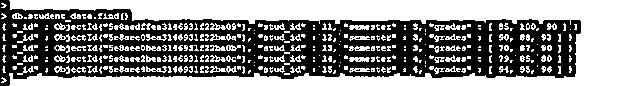
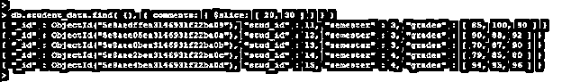

# MongoDB 投影

> 原文：<https://www.educba.com/mongodb-projection/>

## MongoDB 投影简介

MongoDB 投影用于选择特定的数据(这是必要的)，而不是从文档中选择所有数据。如果我们的文档包含 10 个字段，而我们当时只需要显示 5 个字段，那么我们已经使用了 MongoDB 投影操作符。投影对于从整个文档中选择必要的数据是最重要的，主要是在 MongoDB $中，使用了$elemMatch、$slice 和$Meta 投影操作符。通过使用投影可以提高数据库服务器的性能，使用投影后数据库的性能得到了提高。

### MongoDB 投影中的算子

下面是 MongoDB 投影中的运算符:

<small>Hadoop、数据科学、统计学&其他</small>

**1。**我们可以使用投影运算符从文档中选择特定的数据。下面是 MongoDB 中可用的投影操作符。

*   美元
*   $elemMatch
*   $切片
*   $Meta

**2。** MongoDB projection operator 将提高数据库服务器的性能。我们可以从文档中获取特定的数据，因此使用投影操作符可以减少数据库服务器的开销。

**3。**我们已经使用 student_data 表描述了投影运算符的示例。下面是 student_data 表的数据如下。

`db.student_data.find ()`

上面的示例显示了 student_data 表，以描述 MongoDB 中的投影操作符示例。

#### 1\. $

*   $ projection 操作符用于限制数组的内容，从该数组中查询的结果将只匹配文档的第一个元素。
*   我们可以在 find()方法和 findone()中使用$ projection 操作符。当我们需要数组中的一个元素时，我们使用了$ projection 操作符。

下面是$ projection 运算符的语法。

**语法:**

`collection_name.find (Find method used with projection operator)({<array> :<value> ...}, {"<array>.$" ($ operator is used with array) : 1})`

`collection_name.find (Find method used with projection operator) ({<array.feildname> : <value> ...}, {"<array>.$" ($ operator is used with array) : 1})`

以下是上述语法的参数描述:

*   **Find ():** Find 方法与$ projection 运算符一起使用。
*   **$:**$ projection 操作符用于限制 MongoDB 中数组的内容。
*   **集合名称:**集合名称用于显示 MongoDB 中使用$ projection 操作符的结果。
*   **数组:**使用投影运算符的字段名数组。
*   **字段:**这是 MongoDB 的字段名记录的状态。

**示例 1:** 下面的示例显示了使用$ projection 操作符的项目数组值。

**代码:**

`db.student_data.find( { semester: 3, grades: { $gte: 75 } },{ "grades.$": 1 } )`

**输出:**

上面的例子将返回一个大于 75 的学生的分数。

**示例 2:** 下面的示例显示了一个低于 75 的学生成绩。

**代码:**

`db.student_data.find( { semester: 3, grades: { $lte: 75 } },{ "grades.$": 1 } )`

**输出:**

#### 2.$elemMatch

*   $elemMatch 投影操作符用于限制数组的内容，从该数组中查询的结果将只匹配文档的第一个元素。
*   $和$elemMatch 运算符根据条件匹配数组中的第一个匹配元素。

**语法:**

`collection_name.find (Find method used with projection operator) ({field_name : <value> ...}, {"Field_name.$elemMatch{}" ($elemMatch operator) })`

下面是上述语法的参数描述:

*   **Find ():** Find 方法与$elemMatch 投影运算符一起使用。
*   **集合名称:**集合名称，用于显示使用 elemMatch 投影操作符的结果。
*   **字段:**这是 MongoDB 的字段名记录的状态。
*   **$elemMatch:** 用于限制查询中数组的内容。

**示例:**示例显示了$elemMatch 投影运算符。

**代码:**

`db.student_data.find( { semester: 3 },{ stud_id: { $elemMatch: { semester: 3 } } } )`

**输出:**

#### 3.$Meta

*   MongoDB 中的元数据投影操作符用于返回与查询相关联的每个匹配文档。
*   元投影运算符与“textscore”关键字一起使用。“textscore”关键字的排序顺序是降序。
*   TextScore 关键字为每个文档返回相应的$text 降序查询。

**语法:**

`collection_name.aggregate (Aggregate method used with projection operator) (<query> (Query used to process the operation) , { Score : { meta:  “textscore” (textscore keyword used with meta projection operator)) } )`

`{ $meta: <metadataKeyword> (textscore keyword used) }`

下面是上述语法的参数描述:

*   **Aggregate ():** Aggregate 方法与 MongoDB 中的$Meta projection 操作符一起使用。
*   **集合名称**:集合名称用于显示 MongoDB 中使用$Meta 投影操作符的结果。
*   **查询:**查询用于处理使用$Meta 投影操作符的操作。
*   **$Meta:** 元数据投影操作符用于返回每个匹配的文档。
*   **Textscore:** 文本分数关键字与$Meta 投影运算符一起使用。

**示例:**MongoDB 中$Meta 投影运算符的示例。

**代码:**

`db.student_data.aggregate([{ $group: { _id: { $meta: "textScore" }, count: { $sum: 3 } } } ])
db.student_data.aggregate([{ $group: { _id: { $meta: "textScore" }, count: { $sum: 5 } } } ])`

**输出:**

#### 4.$切片

*   $Slice 运算符用于控制查询返回的数组的数量。MongoDB 视图不支持切片操作。
*   $Slice 对于投影操作人员来说很方便也很重要。

**语法:**

`collection.find (Find method used with projection operator) ( { field (Field name of collection): value }, { array: {$slice: count } } );`

**示例:**下面是$slice 投影运算符的示例。

**代码:**

`db.student_data.find ( {}, { comments: { $slice: [ 20, 30 ] } } )`

**输出:**

### 结论

MongoDB 投影用于选择特定的数据(这是必要的)，而不是从文档中选择所有数据。在 MongoDB $中，$elemMatch，$slice 和$Meta 投影操作符是可用的。在 MongoDB 中，投影操作符对于从所有数据中找到特定于用户的数据非常方便和重要。

### 推荐文章

这是 MongoDB 投影的指南。在这里，我们将讨论 MongoDB 投影的介绍及其不同的操作符和示例。您也可以浏览我们推荐的其他文章，了解更多信息——

1.  [MongoDB 中的](https://www.educba.com/mongodb-collection/) [集合](https://www.educba.com/mongodb-collection/) [方法是如何工作的？](https://www.educba.com/mongodb-collection/)
2.  [MongoDB 备选方案|前 8 名](https://www.educba.com/mongodb-alternatives/)
3.  [在 MongoDB 中查找特征](https://www.educba.com/lookup-in-mongodb/)
4.  [MongoDB Limit() |如何运作？](https://www.educba.com/mongodb-limit/)
5.  [MongoDB Unique | Examples](https://www.educba.com/mongodb-unique/)

