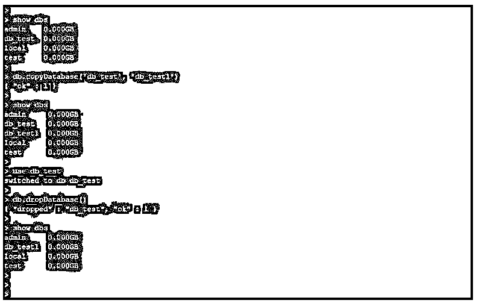

# MongoDB 数据库

> 原文：<https://www.educba.com/mongodb-database/>

## MongoDB 数据库简介

MongoDB 数据库的定义是为数据库操作创建数据库，使用 MongoDB 数据库我们正在创建集合到其中。MongoDB 不是结构化数据库，所以我们没有使用 create database 语句，我们在 MySQL 和 PostgreSQL 等其他数据库中使用过该语句。我们可以在 MongoDB 中通过使用 database，use 关键字来创建数据库，它用于在 MongoDB 中创建新的数据库，在使用数据库之后，我们正在创建相同的集合。我们可以在一个 MongoDB 服务器上创建多个数据库，我们在 MongoDB 中使用的默认数据库是 DB。

### 如何在 MongoDB 中创建数据库？

*   基本上，我们已经使用 use 命令在 MongoDB 中创建新数据库。

下面是语法:

<small>Hadoop、数据科学、统计学&其他</small>

**语法:**

`Use name_of_database`

*   在上面的语法中使用关键字指定创建新的数据库。我们可以通过使用关键字创建任何新的数据库。
*   数据库名称显示了我们在 MongoDB 中创建的数据库名称。我们可以通过指定数据库参数的名称来创建数据库。
*   如果服务器上存在使用数据库，它将使用现有的数据库，而不是创建新的数据库。

下面的例子说明创建新的数据库:

**代码:**

`use db_test
db`

**输出:**

*   在上面的例子中，我们已经创建了数据库名称 db_test。创建后，我们可以使用 db 命令查看连接的数据库名称。
*   我们可以使用 show dbs 命令显示所有创建的数据库和系统数据库。

以下示例显示了如下列表:

**代码:**

`show dbs`

**输出:**

*   使用数据库后，它不会在 show dbs 命令中显示，在创建数据库的集合或对象后，它将使用 show dbs 命令显示。

下面的例子显示了同样的情况:

**代码:**

`use db_test1
show dbs
db.test.insert({"name":"ABC"})
show dbs`

**输出:**

*   在上面的第一个例子中，我们已经创建了数据库名称 db_test1，它将显示使用 db 命令连接的数据库，但不会显示在数据库列表中，因为我们没有在 db_test1 数据库中创建任何集合或对象。
*   在第二个示例中，我们在数据插入时创建了一个集合。在将集合创建到 db_test1 数据库后，使用 show dbs 命令显示了数据库的名称。
*   下次在使用 use db_test1 命令后，我们已经自动连接到 db_test1 数据库。
*   管理和本地数据库是 MongoDB 服务器中使用的系统数据库。
*   Show dbs 命令将显示所有数据库的名称和大小。

### 如何在 MongoDB 中修改数据库？

下面的语法和示例说明了如何更改数据库:

*   我们正在使用 copyDatabase 命令来重命名数据库。

**语法:**

`db.copyDatabase ('name_of_old_database', 'new_database_name')
use name_of_old_database
db.dropDatabase();`

*   在上面的语法中，copyDatabase 被定义为用于将一个数据库复制到另一个不同名称的数据库的命令。
*   旧数据库的名称被定义为旧数据库的名称，我们已经使用它将数据库复制到新的名称。
*   新数据库的名称被定义为我们使用 copyDatabase 命令重命名的新数据库名称。
*   我们不能直接重命名数据库，要重命名数据库我们使用 copyDatabase 命令。
*   复制到数据库后，我们将连接到旧数据库，并删除旧数据库。

以下示例显示了使用新名称重命名数据库的 alter database 命令:

**代码:**

`show dbs
db.copyDatabase('db_test', 'db_test1')
show dbs
use db_test
db.dropDatabase()
show dbs`

**输出:**

*   在上面的例子中，我们首先将数据库从 db_test 复制到 db_test1 数据库。在成功地从 db_test 复制到 db_test1 之后，我们已经连接到 db_test 数据库。
*   连接后，我们使用 dropDatabase 命令删除了旧数据库。
*   基本上，MongoDB 中没有重命名数据库命令，所以我们使用 copyDatabase 来代替重命名数据库命令。

### 如何在 MongoDB 中删除数据库？

下面的语法和例子说明了如何删除数据库:

*   我们已经使用 dropDatabase 命令删除了 MongoDB 中的数据库。

下面的语法显示了要删除数据库，首先我们需要连接要删除的指定数据库。

**语法:**

`use name_of_database
db.dropDatabase ()`

*   在上面的语法中，数据库的名称被定义为我们从服务器中删除的数据库名称。
*   Drop database 命令用于删除现有数据库。

下面给出的例子显示了删除数据库:

**代码:**

`show dbs
use db_test1
db.dropDatabase ()
show dbs`

**输出:**

*   在上面的例子中，我们已经删除了名为 db_test1 的数据库。
*   要删除数据库，我们需要连接到我们在 MongoDB 中删除的指定数据库。
*   连接的数据库将从数据库服务器中删除，因此在使用此命令后，我们需要检查我们已经连接的数据库名称。

下面的例子显示了同样的情况:

**代码:**

`show dbs
use db_test1
db.dropDatabase ()
show dbs`

**输出:**

*   在上面的例子中，我们首先连接到 db_test 数据库，在连接之后，我们从数据库服务器中删除了它。

### 结论

我们正在使用 use db 命令创建数据库，如果数据库中已经存在该数据库，那么我们将连接到现有的数据库。我们使用 copyDatabase 命令重命名数据库，也可以使用 dropDatabase 命令删除数据库。

### 推荐文章

这是一个 MongoDB 数据库的指南。这里我们讨论如何在 MongoDB 中创建、修改和删除数据库，并给出相应的查询示例。您也可以看看以下文章，了解更多信息–

1.  [MongoDB 时间戳](https://www.educba.com/mongodb-timestamp/)
2.  [MongoDB 关系](https://www.educba.com/mongodb-relationships/)
3.  [MongoDB Skip()](https://www.educba.com/mongodb-skip/)
4.  [MongoDB 特性](https://www.educba.com/mongodb-features/)

