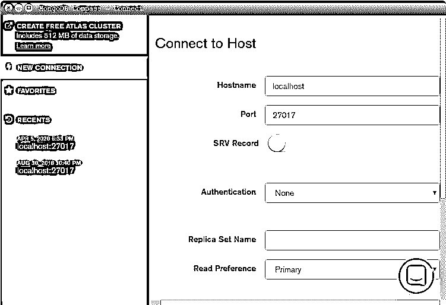
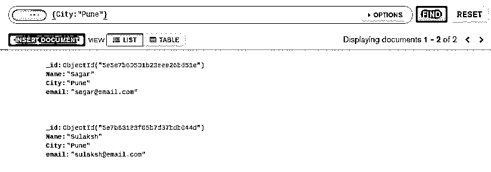
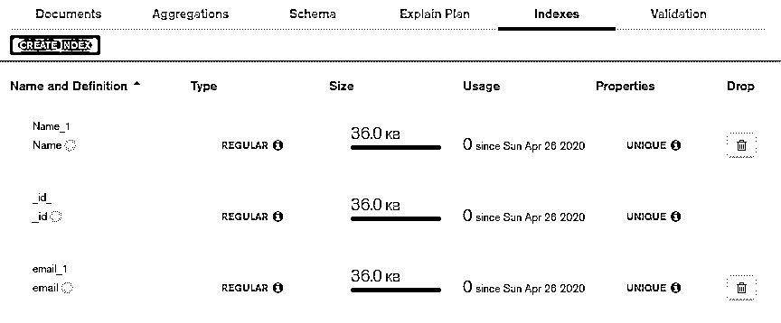
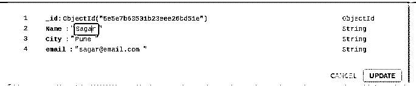
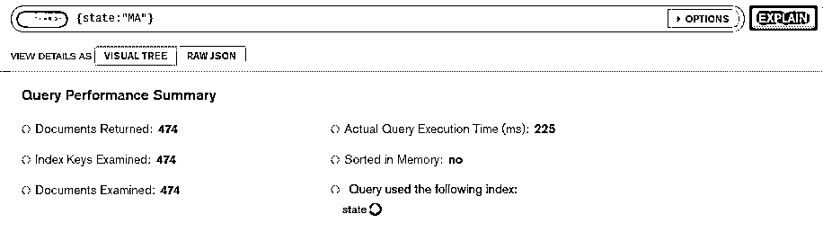
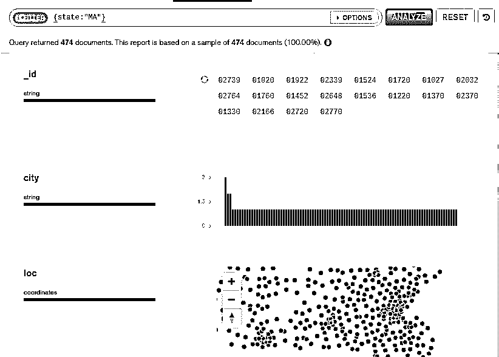

# MongoDB 罗盘

> 原文：<https://www.educba.com/mongodb-compass/>

## MongoDB 指南针介绍

使用最广泛的 NoSQL 数据库之一 MongoDB 提供了一个 GUI(图形用户界面)，MongoDB Compass。MongoDB Compass 允许您主动交互并理解存储在 MongoDB 数据库中的数据，不需要任何先决条件来了解任何编码或 Shell 查询知识。

**MongoDB Compass 的连接页面:**

<small>Hadoop、数据科学、统计学&其他</small>

下面是 Compass 的 Connect 页面截图。

要将 MongoDB Compass 连接到活动的 MongoDB 实例，我们必须填写上图的细节，然后进行连接。它会将当前运行 MongoDB 的活动实例连接到 compass，数据可以可视化。

除了能够读取数据之外，Compass 还允许您可视化地呈现数据。Compass 还可以有效地管理索引和实现文档验证。

### 为什么我们需要 MongoDB 指南针？

MongoDB 提供的灵活模式和类似 JSON 的文档存储是开发人员在数据库上构建应用程序的非常好的工具，也是理解数据库结构的一种障碍。您当然可以执行查询并理解其结构，但这只有具备 MongoDB 知识的开发人员才能做到。但是有了 MongoDB 的 Compass，我们现在有多种方法来理解数据和操作数据，而无需了解任何 shell 命令。

在 MongoDB 3.2 中引入的 Compass 是一个图形化工具，可以轻松地理解数据，并且无需查询就可以与数据库交互。

### MongoDB 指南针是如何工作的？

基本上，Compass 是 MongoDB 数据库中的一个 GUI。每个集合和文档都可以被反映和操纵。每次我们在 compass 上构建和执行查询时，它都会将查询解释为命令行查询并执行它。在执行时，无论结果是什么，它都反映了图形可视化的结果。

### MongoDB 指南针的特点

基本上，Compass 本身就是一个优势，也是使用 MongoDB 的理由。也就是说，Compass 包含了令人惊叹的特性，这使得它更有可能被实现用于生产用途。现在让我们来定义和理解 compass 提供的每一项功能:

#### 1.询问

查询的创建和执行可以通过 Compass 界面来完成。聚合管道可以像任何普通查询一样轻松地在 compass 上创建和执行。

**示例:**在下图中，我们创建了一个简单的查询来查找记录或文档，其中包含城市 Pune，结果我们有 2 条记录。

这相当于 shell 上的 db.educba.find()查询。

#### 2.指数

就像可以使用 compass 创建和执行查询和聚合管道一样，使用 Compass 可以轻松地创建和删除 MongoDB 集合的索引。在下面的截图中，我们有三个已经存在的索引。

这里我们有一个“创建索引”按钮，用于创建索引。然后，我们有一个索引列表，用于名称、_id 和电子邮件。这里重要的一点是，除了 _id 之外，所有其他索引都可以删除，因为 _id 索引是默认的，并且是在我们插入单个记录时自动创建的。休息，我们有所有其他细节围绕指数。

#### 3.规则

除了文档，我们还有文档验证规则，可以从 compass 中创建、编辑和删除。

#### 4.互动

如果没有 Compass，与数据库、文档和集合进行交互的唯一方式就是使用 MongoDB Shell 和命令。但是随着 Compass 在市场上的使用，非技术人员与数据库交互变得非常容易。可以执行 CRUD 功能，即创建、读取、更新和删除，可以轻松操作数据。在下面的截图中，我们试图编辑其中一个键的值。Name 键将在这里更新，而不是执行 db，update 查询。

#### 5.报告

对任何异常事件或错误或 bug 进行报告和分析，是任何数据库或系统的重要组成部分，以便改进。在 Compass 中可以有效地完成崩溃报告，同时收集错误日志和随机应变的步骤。

#### 6.解释

我们有一个带有 MongoDB Compass 的解释计划选项卡，它反映了查询的执行计划。为了更好地理解，请参考下图。

只需填写查询并点击解释。然后，它将获取与该查询相关的每个细节，比如返回的文档、执行时间、检查的文档和检查的几个索引键。

#### 7\. (计划或理论的)纲要

Compass 为您提供了一种更好的方式来可视化您的模式，帮助您分析文档。它支持探索模式以了解数据集的类型和频率。这是一个重要的特性，因为我们知道 MongoDB 有一个不同的灵活模式。首先输入一个查询，必要时进行修改，然后应用，这将深入到数据库或相应的集合，并获取匹配的文档。在成功的获取操作后，它将以可视格式呈现数据。请参考下面的屏幕截图以获得正确的输出。

在执行时，它返回查询的每个方面，即获取的文档数，然后我们有了键，意思是“id，city，loc”，它定义了文档。关于文档、数据和查询的大多数分析见解都可以从模式分析中获得。

#### 8.表演

Compass 是分析数据库数据和性能的最佳方法之一。借助可视化计划，还可以查看和优化查询的性能。

### 优点和缺点

以下是使用 MongoDB Compass 的优点和缺点:

#### 优势

*   易于使用，简单的图形用户界面。
*   查询构建和执行。
*   报道。
*   性能分析。
*   监控索引。

这些优点使得 MongoDB Compass 在与 MongoDB 数据交互时更适合使用。

#### 不足之处

基本上，指南针是一个很棒的工具。随着稳定的更新，指南针正在定期改进。免费使用，但功能有限。

### 结论

总结一下，MongoDB Compass 易于使用，GUI 是一个分析存储在集合中的数据的简单工具。诸如索引、性能、查询和聚合管道构建等功能以及许多其他优势，使得该工具易于使用。Compass 是一个很好的工具，可以帮助任何不了解命令行查询的人理解和操作数据。

### 推荐文章

这是一个指南 MongoDB 指南针。在这里，我们也讨论了介绍和 MongoDB 指南针如何工作？以及特性、优点和缺点。您也可以看看以下文章，了解更多信息–

1.  [MongoDB 中的索引](https://www.educba.com/indexes-in-mongodb/)
2.  [MongoDB Limit()](https://www.educba.com/mongodb-limit/)
3.  [MongoDB 收藏](https://www.educba.com/mongodb-collection/)
4.  [在 MongoDB 中查找](https://www.educba.com/lookup-in-mongodb/)
5.  [MongoDB Unique |如何工作？](https://www.educba.com/mongodb-unique/)
6.  [蒙戈布 vs 弹性搜索|信息图形](https://www.educba.com/mongodb-vs-elasticsearch/)
7.  [MongoDB insert |如何工作？](https://www.educba.com/mongodb-insert/)
8.  [MongoDB 更新指南](https://www.educba.com/mongodb-update/)

