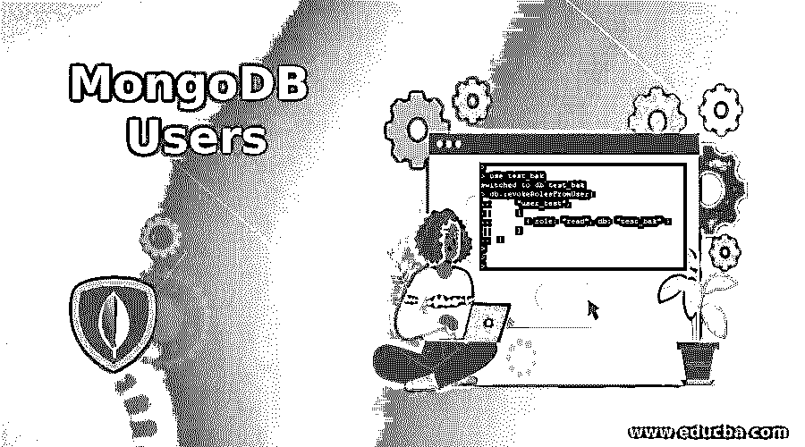
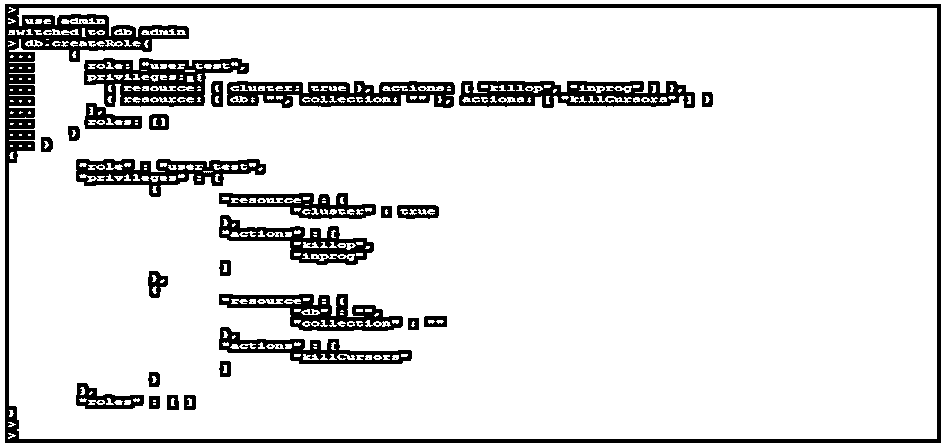
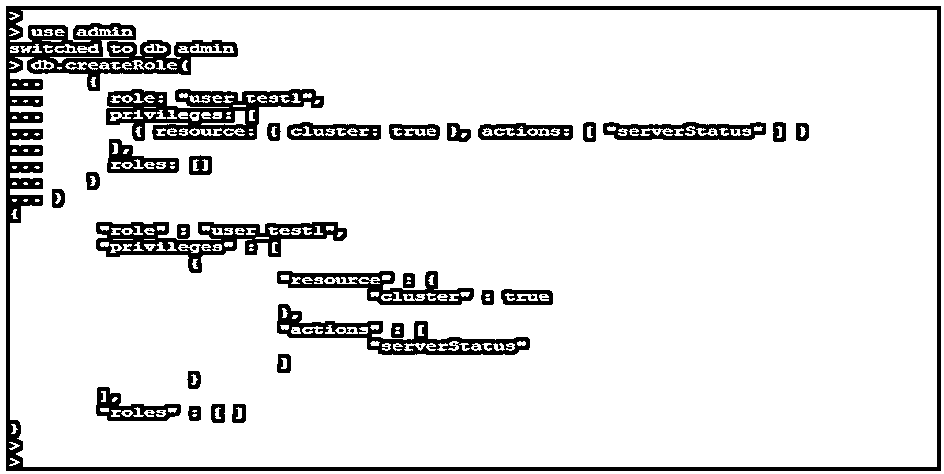
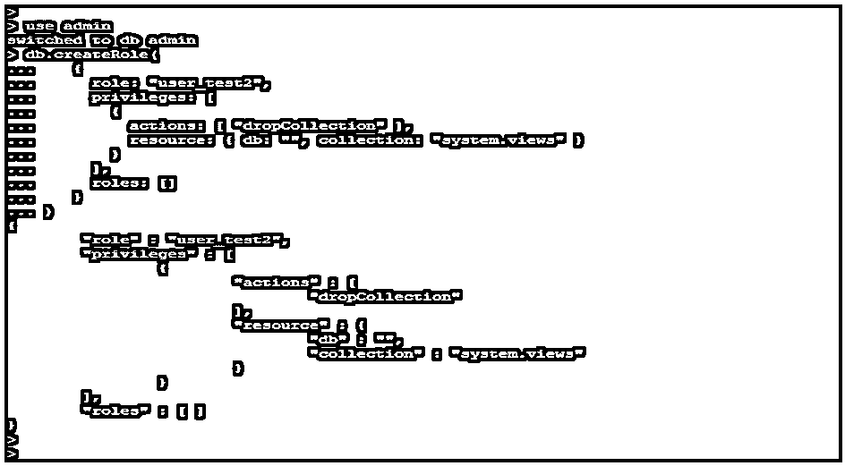
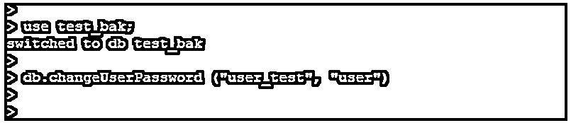
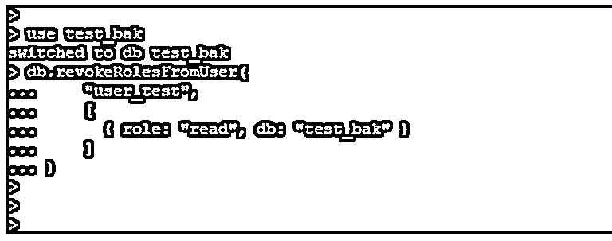
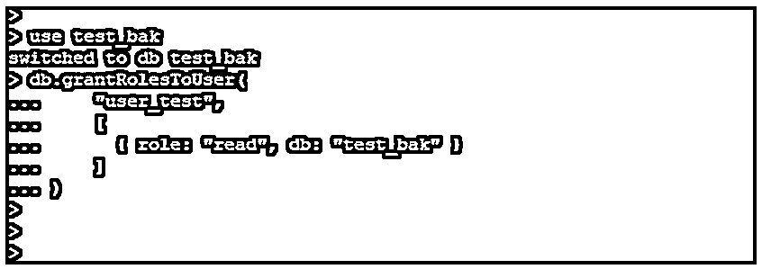
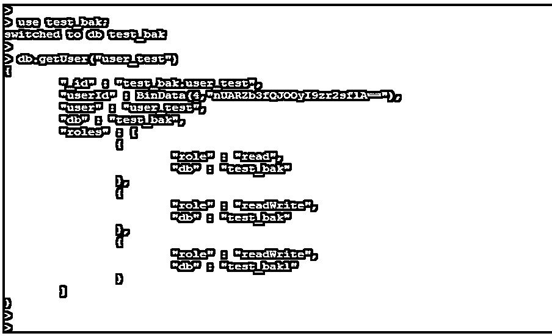
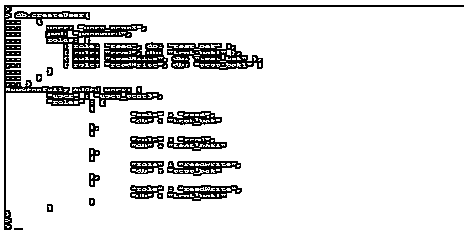

# MongoDB 用户

> 原文：<https://www.educba.com/mongodb-users/>

## MongoDB 用户的定义

MongoDB 用户习惯于按照用户定义的特定权限访问数据库。在每个数据库中，用户通过客户端访问数据库更为重要和有用。在 MongoDB 中，我们要使用 db.createUser 方法来创建一个新用户；当向 MongoDB 数据库中添加任何用户时，我们可以为该用户分配一个角色的特权。我们还可以在创建后更新用户，我们可以更改用户名、密码，以及授予、撤销用户的权限。将用户添加到数据库后，我们可以创建特定于用户的数据库。

### MongoDB 用户操作和角色

*   当我们在 MongoDB 中处理用户和角色时，对数据库的访问控制更为重要。
*   默认情况下，禁用对数据库的授权；我们需要通过在配置文件中添加授权来实现这一点。
*   下面的例子展示了 MongoDB 中安全选项的使用。

#安全性

<small>Hadoop、数据科学、统计学&其他</small>

授权:已启用

`cat /etc/mongod.conf`

Output

*   MongoDB 中的授权设置将启用和禁用基于角色的访问控制。
*   下面的语法说明了在 MongoDB 中创建一个用户，db.createUser 方法用于在 MongoDB 中创建新用户。

**语法:**

`db.createUser (user_info, Writeconcern)`

**参数:**

下面是在 MongoDB 中创建用户的参数描述语法。

*   **创建用户:**创建用户是在 MongoDB 中创建新用户的方法。使用 create user 方法，我们必须按照 MongoDB 中指定的操作创建新用户。
*   **用户或 user_info:** 用户参数的类型是创建用户方法中的文档。该参数将包含用户的文档和身份验证。用户信息包含用户名和权限，这是我们为用户定义的。
*   **写关注:**这是在 MongoDB 中创建用户方法的可选参数。Get last error 命令与 MongoDB 中的 write concern 使用相同的字段。

#### MongoDB 用户和角色操作

*   要在 MongoDB 中创建一个具有身份验证限制的角色，我们必须在我们使用的数据库上设置身份验证限制。

##### 1.在 MongoDB 中创建角色来管理当前操作

*   在下面的示例中，我们创建了一个名为 user_test 的角色，用于运行唯一的 db.currentOp()和 db.killOp()命令。
*   为了在 mongodb 中创建任何用户，我们需要连接 MongoDB 实例。

**举例:**

`use admin
db.createRole (
{
role: "user_test",
privileges: [
{ resource: { cluster: true }, actions: [ "killop", "inprog" ] },
{ resource: { db: "", collection: "" }, actions: [ "killCursors" ] }
],
roles: [] })`

*   要在 MongoDB 中创建一个用户，我们需要首先使用 admin 数据库，然后创建一个用户名 user_test。

##### 2.创建运行 Mongostat 命令的用户

*   在下面的例子中，我们必须创建一个名为 user_test1 的角色，它用于提供只运行名为 mongostat 的命令的特权。

**举例:**

`use admin
db.createRole(
{
role: "user_test1",
privileges: [
{ resource: { cluster: true }, actions: [ "serverStatus" ] }
],
roles: [] }
)`

##### 3.创建用户并提供跨数据库删除集合中的系统视图的权限

*   在下面的示例中，我们创建了一个用户名 user_test2，并提供了删除系统视图集合的权限。

**举例:**

`use admin
db.createRole(
{
role: "user_test2",
privileges: [
{
actions: [ "dropCollection" ],
resource: { db: "", collection: "system.views" }
}
],
roles: [] }
)`

##### 4.在 MongoDB 中更改用户密码

*   我们可以使用 MongoDB 中的更改用户密码方法来更改现有用户的密码。
*   我们必须将 user_test 用户密码更改为“user”。我们需要传递用户当前的用户名和密码来更改用户在 MongoDB 中的密码。
*   当我们想在 MongoDB 中更改用户密码时，我们需要指定用户名。

`use test_bak;
db.changeUserPassword ("user_test", "user")`

*   要修改任何或现有用户的密码，我们需要使用 MongoDB 中的 change user password 方法。

##### 5.修改 MongoDB 中的用户访问权限

*   我们可以在 MongoDB 中修改现有用户或任何用户的访问权限。我们可以授予访问权限和撤销现有用户的特权。
*   下面是 MongoDB 中可用的访问。
    *   撤销角色的授权。
    *   向角色授予权限。

**1。撤销角色**的授权

*   我们可以使用 db.revokeRolesFromUser()方法撤销现有用户的角色。
*   在下面的例子中，我们撤销了 user_test 用户的授权。我们已经撤销了 user_test 用户的读取权限。

**举例:**

`use test_bak
db.revokeRolesFromUser("user_test",
[ { role: "read", db: "test_bak" }
])`

**2\. Grant Privileges to Role**

*   我们可以通过使用 db.grantRolesToUser()方法向角色或现有用户提供授权。
*   在下面的示例中，我们将 grantprivileges 授予 user_test 用户。我们已经在 test_bak 数据库上向 user_test 用户提供了 readrole。

**举例:**

`use test_bak
db.grantRolesToUser(
"user_test",
[
{ role: "read", db: "test_bak" }
] )`

##### 6.查看用户角色

*   我们可以通过使用 MongoDB 中的 db.getUser 方法来检查用户角色。我们必须检查 user_test 用户的所有细节。
*   在 MongoDB 中使用 db.getUser 的方法之前，我们必须使用数据库名称。

**举例:**

`use test_bak;
db.getUser("user_test")`

##### 7.创建用户并向用户提供读写权限

*   在下面的例子中，我们已经创建了一个用户名 user_test3，并且可以读写数据库。
*   我们在 test_bak 和 test_bak1 数据库上提供了读写角色。

**举例:**

`db.createUser(
{
user: "uset_test3",
pwd: "password",
roles: [
{ role: "read", db: "test_bak" },
{ role: "read", db: "test_bak1" },
{ role: "readWrite", db: "test_bak" },
{ role: "readWrite", db: "test_bak1" }
] }
)`

### 推荐文章

这是 MongoDB 用户指南。在这里，我们还讨论了定义和 MongoDB 用户操作和角色，以及不同的例子和代码实现。您也可以看看以下文章，了解更多信息–

1.  [MongoDB 计数](https://www.educba.com/mongodb-count/)
2.  [MongoDB 地理空间](https://www.educba.com/mongodb-geospatial/)
3.  [MongoDB 删除](https://www.educba.com/mongodb-delete/)
4.  [MongoDB 数组](https://www.educba.com/mongodb-array/)

