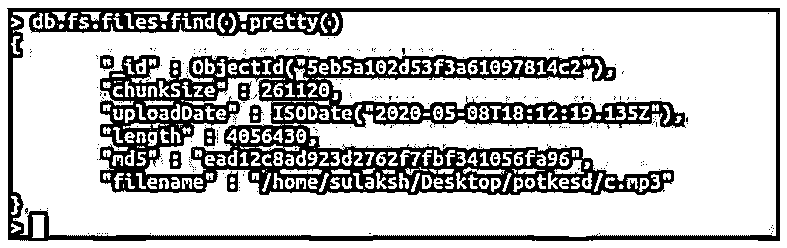
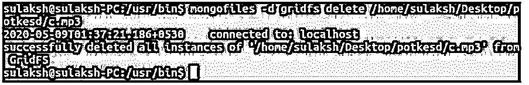

# MongoDB GridFS

> 原文：<https://www.educba.com/mongodb-gridfs/>

## MongoDB GridFS 简介

使用 MongoDB，我们经常需要处理存储大文件的需求；这些文件可以是图像、视频和音频文件等。这就是 MongoDB 的 GridFS(也称为网格文件系统)可以使用的地方。基本上，将如此大的文件分成小块，并将每个小块存储在单独的文档中是 GridFS 的主要目的。这种网格文件系统主要用于存储不能存储在集合中的文件，同时保持限制。MongoDB 的 GridFS 也有局限性，比如存储在 GridFS 中的文件会影响保存在集合中的工作文件。由于存储大型文件，性能可能会受到影响。

**语法:**

<small>Hadoop、数据科学、统计学&其他</small>

语法是任何可执行命令的一个重要方面。这里我们必须看到一件值得注意的事情:将文件插入 gridfs 的查询不是通过 mongodb shell 执行的，而是从 Linux、Windows 或 Mac 命令提示符执行的。

下面给出了在 GridFS 中插入简单文件的标准语法。

`mongofiles -d database-name put filename`

上述语法将文件插入到数据库中。“put”完成插入工作，而数据库名和文件名是目的地和源。除了 put，还有多个选项可以删除、以列表形式查看和移除文件。

### GridFS 在 MongoDB 中是如何工作的？

MongoDB 对可以存储的每个文档大小都有限制；现在，由于文件大小的原因，大文件不能单独存储；这就是 GridFS 的用武之地。MongoDB 的 GridFS 通过保存单个大文件的多个块来工作。这样，大文件可以在需要时方便地存储和检索。通常每个独立块的推荐大小是 256kb。

每个超过 16 MB 限制(BSON 文档大小限制)的文件都将使用 GridFS 进行存储和检索。知道 GridFS 不支持原子更新也很重要。所以，简单来说。GridFS 是一个文件系统，它存储更大的数据，但是以 mongodb 集合和块的形式存储。

### MongoDB GridFS 示例

下面是提到的例子:

#### 示例#1

我们将用一个简单的音频文件来试验我们的第一个例子。目前，我们还没有针对 gridfs 文件的任何特定集合，但是正如我们所知，MongoDB 有一个惊人的特性，当我们将文档插入到不存在的集合中时，它会创建新的集合。

下面是将文件插入 gridfs 的查询，与其他通过 Mongo Shell 插入文件的插入操作不同，这里我们将插入到机器终端。

**代码:**

`/usr/bin$ mongofiles -d gridfs put /home/sulaksh/Desktop/potkesd/c.mp3`

上面的查询是将文件插入 gridfs 的标准格式。我们已经将终端导航到保存 mongofiles(一个可执行文件)的位置。我们的查询以关键字 mongofiles 开始，后面是存储选项代码，“-d”。这个-d 指定存储文件的数据库。这个-d 选项后面是数据库名称，这里我们的数据库命名为 gridfs。目前，我们还没有这样一个名称的数据库，但它会被创建。

**输出:**

现在，如何检索我们使用 mongofiles 保存的数据只需执行 find 查询。

**代码:**

`db.fs.files.find().pretty()`

上面的查询将返回存储在 fs.files 集合中的所有文档，添加 pretty()使其以 JSON 格式表示数据。

**输出:**

正如你在上面的截图中看到的，我们有自己的文件名、块大小和其他插入操作细节。

#### 实施例 2

插入之后，我们了解了在 GridFS 中插入文件的操作是如何工作的，现在让我们删除同一个文件，看看删除是如何工作的。

**代码:**

`/usr/bin$ mongofiles -d gridfs delete /home/sulaksh/Desktop/potkesd/c.mp3`

put 和 delete 查询之间的主要区别在于 delete 关键字本身。

**输出:**

#### 实施例 3

插入和删除是重要的操作，就像搜索一样。对于我们的下一个例子，我们将实现一个搜索选项和 mongofiles 来搜索 gridfs 中的文件。

**代码:**

`/usr/bin$ mongofiles -d gridfs search Poster`

以上查询将搜索任何和所有存储包含海报单词的文件的文档。

**输出:**

如您所见，它返回了记录，其中有一个文件名为 Poster 的文件。

#### 实施例 4

我们将执行一个列表选项，它将返回存储在数据库中的每个文件，这里它不会以块或部分的形式返回文件，而是作为一个整体。

**代码:**

`mongofiles -d gridfs list`

**输出:**

像其他查询一样，-d 表示数据库，gridfs 是数据库和命令列表的名称。在执行时，检索以块的形式存储在 gridfs 数据库中的所有当前文件。

使用这些 put、list、search 选项，我们可以很容易地在实时应用中使用和实现网格文件系统。

### 结论

总之，MongoDB 的惊人特性 GridFS 允许您存储超过单个文档大小限制的文件。在这里，文件存储在小块和两个不同的集合中。一个集合存储实际数据，即文件，而另一个集合存储文件的元数据。放，搜索，列表等。是用来处理网格文件系统的选项。GridFS 具有存储大文件的优势，但可能会导致性能下降，并影响工作数据集。

### 推荐文章

这是 MongoDB GridFS 的指南。这里我们讨论 MongoDB 中 GridFS 的介绍，它是如何工作的，并给出了相应的例子。您也可以看看以下文章，了解更多信息–

1.  [MongoDB 管理](https://www.educba.com/mongodb-administration/)
2.  [MongoDB 中的索引](https://www.educba.com/indexes-in-mongodb/)
3.  [MongoDB 中的 order by](https://www.educba.com/order-by-in-mongodb/)
4.  [在 MongoDB 中查找](https://www.educba.com/lookup-in-mongodb/)

