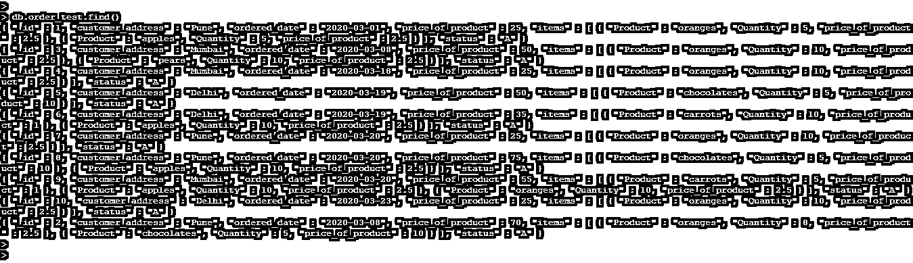
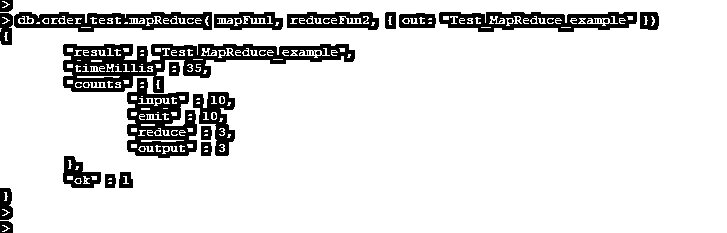
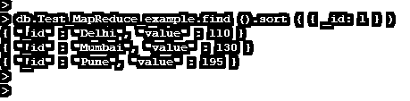
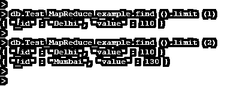

# MongoDB MapReduce

> 原文：<https://www.educba.com/mongodb-mapreduce/>

## MongoDB MapReduce 的定义

MongoDB MapReduce 是一种用于大数据的数据处理技术，是 MongoDB 中大数据的有用聚合结果。我们需要使用这个命令来处理大量收集的数据或 MapReduce 操作，MapReduce 在 MongoDB 中基本上用于大量数据集的处理。在 MongoDB 中，这个命令对于处理大量数据集非常方便和重要。MongoDB 中的这个命令用于处理大量数据，map 函数和 reduce 函数是 MongoDB 中的两个主要输入。

### 语法和参数

下面是 MapReduce 命令的语法。

<small>Hadoop、数据科学、统计学&其他</small>

**语法:**

`collection_name.mapReduce (function (Map function), function (Reduce function))`

`collection.mapReduce (
function () {emit(key(Key value of map function), value);},
function (key, values) {return reduceFunction (Reduce function for MapReduce command)}, {
out: <collection>,
query: <document>,
sort: <document>,
limit: <number>,
finalize: <function>,
scope: < document>,
jsMode: <boolean>,
verbose: <boolean>,
bypassDocumentValidation: <boolean>
})`

**参数:**

下面是参数说明:

*   **集合名称:**集合名称定义为使用 MapReduce 命令从集合中检索的文档。我们可以在 MongoDB 中使用 MapReduce 方法处理大量数据。
*   **Map Reduce:** 是 MongoDB 中用于大数据的数据处理技术，是大数据的有用聚合结果。MapReduce 命令在 MongoDB 中非常方便和重要。
*   **Options:** Options 是指定与这个 MapReduce 命令一起使用的附加参数。
*   **Out:** Out 指定了 MapReduce 操作在 MongoDB 中结果位置。我们可以将输出设置为主要成员，而在次要成员上，我们只能设置内联输出。
*   **查询:**查询定义为 MongoDB 中某个文档的选择条件。使用查询，我们必须在 MongoDB 中定义 MapReduce 的选择标准。
*   **排序:**用于对集合中的文档进行排序。该选项主要用于在 MongoDB 中使用 MapReduce 方法进行优化。
*   **Limit:** Limit 是使用 MapReduce 方法限制输入文档数量的指定方法。
*   **Finalize:** 是 MongoDB 中可选的参数方法。它将修改输出并遵循 reduce 方法。
*   **Scope:** Scope 用于指定可以使用 MapReduce 方法从映射中访问全局变量。
*   **JsMode:** 指定在执行函数时，数据是否会转换成 BSON 格式。
*   **Verbose:**MapReduce 命令中 Verbose 的默认值为 false。它将指定定时信息。
*   **Collation:**Collation 是 MongoDB 中 MapReduce 方法的可选参数。它将指定用于 MapReduce 操作的排序规则。

### MapReduce 命令在 MongoDB 中是如何工作的？

下面是 MongoDB 中 MapReduce 命令的工作方式。

*   它陈述了用于大量数据的数据处理技术。
*   它包含的两个 javascript 函数如下。

*   Reduce 函数和 map 函数是 MongoDB 中 MapReduce 命令的两个主要输入。
*   范围是一个重要的参数，它用于指定使用 MapReduce 方法从地图中可以访问的全局变量。
*   我们可以使用 limit 方法来限制集合中文档的数量。
*   我们在 MongoDB 中使用了带有 MapReduce 方法的排序规则。

### MongoDB MapReduce 示例

以下是一些例子:

我们以 order_test 表为例来描述 MongoDB 中的 MapReduce 方法如下。下面是 order_test 表的数据描述如下。

`db.order_test.find ()`

对于定义示例，我们需要遵循如下步骤。

*   定义映射函数。
*   定义 reduce 函数。
*   执行 MapReduce 操作。
*   验证 MapReduce 命令的结果。

#### 1.定义地图功能

*   我们定义了映射函数来处理集合中的每个语句。下面的例子显示了映射函数如下。
*   在下面的例子中，我们必须定义一个名为 mapFun1 的地图函数。

`var mapFun1 = function() {emit(this.customer_address, this.price_of_product);};`

#### 2.定义归约函数

*   我们已经定义了 reduce 函数来减少所有 MongoDB MapReduce 方法值中的单个对象。以下示例显示了 reduce 函数，如下所示。

`var reduceFun2 = function(keyCustomer_address, valuesprice_of_product) {return Array. Sum(valuesprice_of_product);};`

#### 3.执行 MapReduce 操作

*   在创建了 map 和 reduce 函数之后，我们对 order_test 表执行了如下 MapReduce 操作。
*   在上面的例子中，我们已经通过使用 map 和 reduce 函数执行了操作。
*   我们将 map 函数用作 mapFun1，将 reduce 函数用作 reduceFun2，如下所示。

`db.order_test.mapReduce(mapFun1, reduceFun2, {out: "Test_MapReduce_example" })`

#### 4.使用排序验证结果

*   我们已经通过使用 sort 验证了 MapReduce 命令的结果如下。下面的例子展示了如何在 MongoDB 中使用排序来验证结果。

`db.Test_MapReduce_example.find().sort( { _id: 1 } )`

#### 5.使用 MapReduce 命令限制

*   在下面的例子中，我们在 MongoDB 中使用 MapReduce 命令定义了一个限制。

`db.Test_MapReduce_example.find().limit (1)
db.Test_MapReduce_example.find().limit (2)`

### 结论

它是一种用于大数据的数据处理技术，是 MongoDB 中大数据的有用聚合结果。Reduce 函数和 map 函数是 MongoDB 中 MapReduce 命令的两个主要输入。MapReduce 命令在 MongoDB 中非常方便和重要。

### 推荐文章

这是一个 MongoDB MapReduce 的指南。在这里，我们还将讨论 MapReduce 命令在 MongoDB 中的定义和工作方式。以及不同的示例和代码实现。您也可以看看以下文章，了解更多信息–

1.  [MongoDB 中的索引](https://www.educba.com/indexes-in-mongodb/)
2.  [MongoDB Limit()](https://www.educba.com/mongodb-limit/)
3.  [MongoDB 收藏](https://www.educba.com/mongodb-collection/)
4.  [MongoDB 创建索引](https://www.educba.com/mongodb-create-index/)
5.  [MongoDB 数据类型|示例](https://www.educba.com/mongodb-data-types/)
6.  [MongoDB 地理空间指南](https://www.educba.com/mongodb-geospatial/)
7.  [MongoDB count | How to Works？](https://www.educba.com/mongodb-count/)

