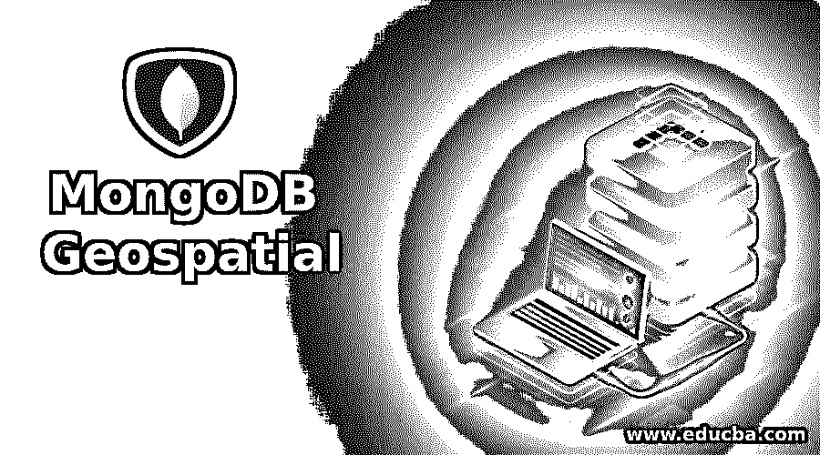
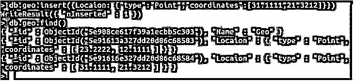
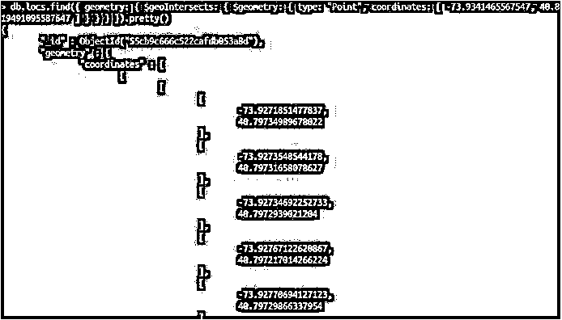
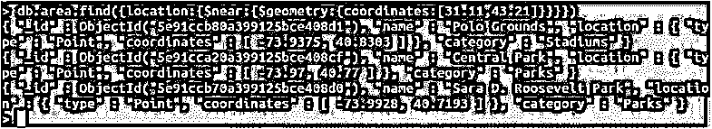
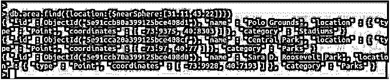
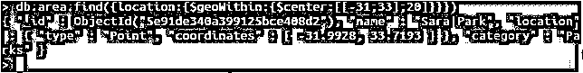
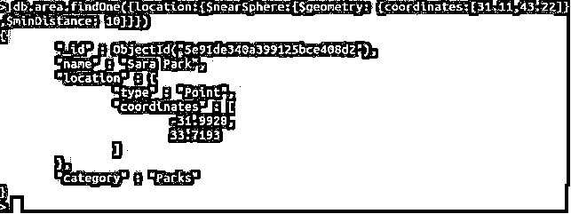

# MongoDB 地理空间

> 原文：<https://www.educba.com/mongodb-geospatial/>

## MongoDB 地理空间简介

MongoDB 是一个 NoSQL 数据库，允许以多种 GeoJSON 类型的形式存储地理空间数据。MongoDB 的地理空间特性使得将地理数据存储到数据库中变得很容易。因此，基本上，您可以将地理空间类型数据以 GeoJSON 对象的形式存储在 MongoDB 中。GeoJSON 是地理要素的简单表示，也分别支持非空间属性。GeoJSON 基于 JavaScript 对象符号，是一种开放的标准格式。

### 句法

`"<field> : { type : <GeoJSON type> , coordinates : <coordinates> }"`

<small>Hadoop、数据科学、统计学&其他</small>

**解释:** <字段>代表字段的名称，ex。位置:类型是值可能不同的关键，例如常用的“点”类型。最后，坐标是保存经度和纬度或位置的其他数字细节的关键。现在，让我们通过一个例子来理解这个简单的语法。

**代码:**

`use geo
db.geo.insert( { "Name":  "Geo" } )
db.geo.insert( { Location : {"type":"Point","coordinates": [ 23.2222, 12.1111 ] } } )
db.geo.insert( { Location : {"type":"Point","coordinates": [ 31.1111, 21.3212 ] } } )
db.geo.find()`

**输出:**

**解释:**这里，我们试图在 geo collection 中插入一条记录，它是一个位置，GeoJSON 类型为 Point，后跟坐标。检查以下屏幕截图以确保正确执行:

现在我们已经了解了 MongoDB 中的地理空间是什么，让我们来看看地理空间操作可用的操作符并理解它们。

### MongoDB 地理空间运算符

MongoDB 中的地理空间操作符可以分为两部分，即查询选择器和几何说明符。我们现在将了解每一种类型，以及查询和示例。几何说明符与查询选择器一起使用，因此我们将一起学习它们。当我们尝试任何查询选择器时，我们必须指定一个几何说明符。

**Note:** We will be using important keywords like coordinates, Point, minDistance, maxDistance, geometry, etc., which are important when executing a query as these are the data point which stores the geospatial data.

### MongoDB 地理空间查询选择器

MongoDB 提供了四个查询选择器。这些是当我们需要搜索或指定一些数据时使用的操作符。例如，$near 运算符用于返回点周围的地理对象。以下是找到的查询选择器:

#### $ geoIntersects

使用$geometry 运算符，geoIntersects 运算符指定 GeoJSON 对象。2dsphere 和 2d 索引支持这些 geoIntersect 查询。在以下示例中，我们将实现一个简单的 geoIntersect 运算符:

**代码:**

`db.locs.find({ geometry: { $geoIntersects: { $geometry: { type: "Point", coordinates: [ -73.9341465567547, 40.819491095587647 ] } } } })`

**输出:**

**解释:**我们拥有包含 195 个文档的 locs 集合。我们已经指定了坐标，并将尝试查找用户的邻居。这些返回值在终端上可能没有意义，但是当作为原始数据传递给图形表示时，它提供了有用的数据。

### 用于地理空间的几何说明符

此处使用的几何说明符是$geometry。对于$geoWithin、$geoIntersects、$near 和$nearSphere 等地理空间查询运算符，使用$geometry。“EPSG:4326”被用作默认的 CRS 坐标参考系统。

#### $地理范围内

此查询选择 GeoJSON 几何图形内的几何图形。2dsphere 和 2d 索引支持 geoWithin。

**代码:**

`{
<location field>: {  $geoWithin: {
$geometry: { type: <"Polygon" or "MultiPolygon"> , coordinates: [ <coordinates> ] } }  }
}`

现在让我们通过一个适当的示例来理解 geoWithin:

**代码:**

`db.geo.find({ location: { $geoWithin: { $centerSphere: [ [ -73.934147654, 40.82302903 ], 2 / 1163.2 ] } } }).limit(2)`

**输出:**

**解释:**我们将尝试查找文档，使用$geoWithin，它将返回分别提到的坐标之间的文档。参考截图。

#### 附近的美元

这两种索引都支持，并用于返回特定点附近的地理空间对象。这将按照离某点最近到最远的顺序返回存储的文档。

**代码:**

`{
<location field>: {  $near: {
$geometry: { type: "Point" , coordinates: [ <longitude> , <latitude> ] },
$maxDistance: <distance in meters>, $minDistance: <distance in meters> }   }
}`

我们现在将通过一个例子来实现$near，并看看它是如何工作的。

**代码:**

`db.area.find({location :{$near :{$geometry :{coordinates :[31.11,43.21]}}}})`

**输出:**

**解释:**这个查询将返回几个坐标与提到的文档相近的文档。

#### $nearSphere

这个查询从一个集合中返回文档，这个集合从最近到最远。MongoDB 使用球面几何来计算距离。$nearSphere 需要地理空间索引。

**代码:**

`{
$nearSphere: { $geometry: { type : "Point", coordinates : [ <longitude>, <latitude> ] },
$minDistance: <distance in meters>,  $maxDistance: <distance in meters> }
}`

**代码:**

`db.area.find({location :{$nearSphere :[31.11,43.22]}})`

**输出:**

**解释:**这个查询将返回几个与提供的坐标相匹配的文档。请参考下面附加的截图，以获得正确的输出。现在让我们来理解几何说明符。我们已经学习了$geometry，剩下的是$center，$maxDistance，$minDistance，$polygon 和$box。

#### $center

对于$geoWithin 查询，$center 指定一个圆。此运算符不返回 GeoJSON 对象。

**代码:**

`db.area.find({location:{$geoWithin:{$center:[[-31,33],20]}}})`

**输出:**

**解释:**在这里，我们使用了带有 geoWithin 的 center 查询。参考截图。

#### $ m 距离

下面我们有一个简单的$minDistance 的例子。

**代码:**

`db.area.findOne({location :{$nearSphere :{$geometry : {coordinates :[31.11,43.22]},$minDistance: 10}}})`

**输出:**

#### $多边形

与$geoWithin 一起使用，返回落在多边形边界之间的文档。不查询 GeoJSON。如果没有地理空间索引，可以使用$polygon，但是使用地理空间索引比不使用索引可以更快地执行查询。仅二维地理空间索引支持。

#### $box

它试图为$geoWithin 指定一个矩形，当在查询中使用时，它会查找坐标落在矩形之间的文档。仅二维地理空间索引支持$box。此查询使用平面几何图形计算距离。

### 结论

MongoDB 地理空间用于存储地理数据，如位置坐标。支持多种 GeoJSON 类型。有两种类型的查询，即查询选择器和几何说明符。MongoDB 支持 7 种类型的 GeoJSON 对象，Point 是最常见的一种。我们分别学习并理解了每个操作符以及示例和代码。

### 推荐文章

这是 MongoDB 地理空间指南。这里我们讨论 MongoDB 地理空间的介绍、适当的语法、操作符和例子。您也可以浏览我们的其他相关文章，了解更多信息——

1.  [什么是 MongoDB？](https://www.educba.com/what-is-mongodb/)
2.  [MongoDB 工具](https://www.educba.com/mongodb-tools/)
3.  [MongoDB 替代品](https://www.educba.com/mongodb-alternatives/)
4.  [MongoDB 数据类型指南](https://www.educba.com/mongodb-data-types/)
5.  [MongoDB count | How to Works？](https://www.educba.com/mongodb-count/)
6.  [MongoDB 删除|如何工作？](https://www.educba.com/mongodb-delete/)
7.  [MongoDB 数组指南](https://www.educba.com/mongodb-array/)

