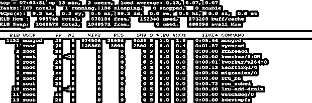
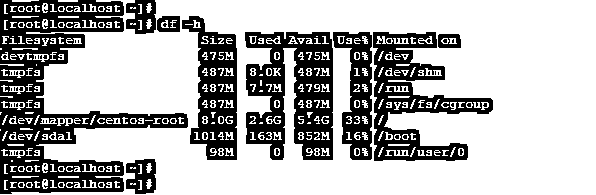
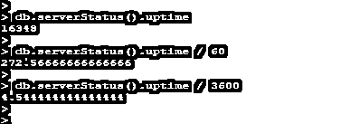
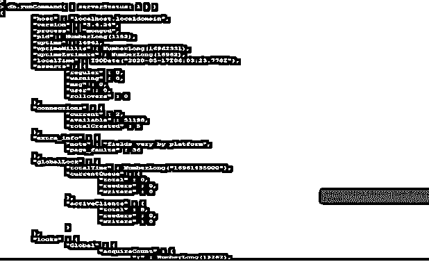
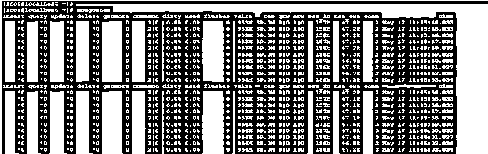
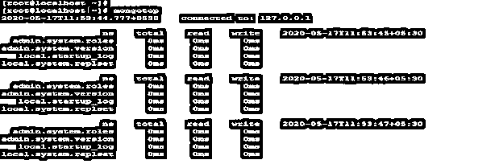
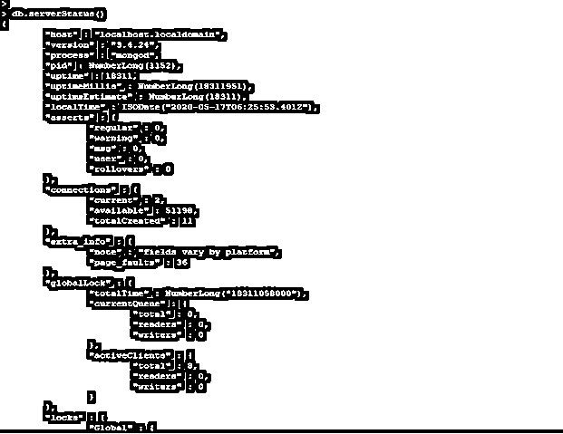
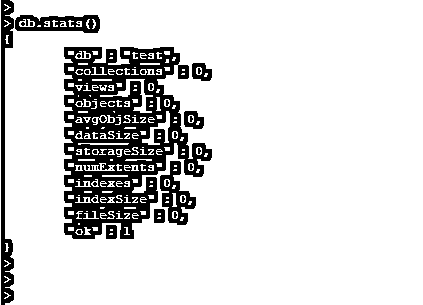
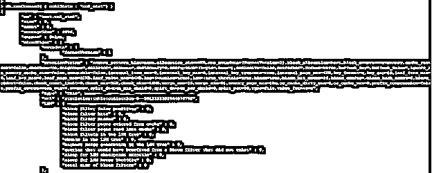

# MongoDB 监控

> 原文：<https://www.educba.com/mongodb-monitoring/>

## MongoDB 监控简介

MongoDB monitoring 被定义为一个监视器，或者确定数据库的当前状态并检查其性能。监控对于每个数据库来说都是必不可少的，以监控数据库的健康、性能和关键问题。它还用于定期和可测量地监控 MongoDB 数据库，以确保发现数据库的任何问题，数据库的异常行为会影响数据库性能。我们基本上可以监控 MongoDB 服务器的内存利用率、CPU 利用率、复制延迟、副本状态、锁定状态、磁盘利用率、DB 连接数。

### 如何在 MongoDB 中执行监控？

我们可以对 MongoDB 服务器执行如下监控。有许多方法和命令可以用来监控 MongoDB 服务器。我们可以通过检查数据库服务器的状态来监视 MongoDB 服务器。

<small>Hadoop、数据科学、统计学&其他</small>

*   检查内存利用率
*   检查 CPU 利用率
*   检查磁盘利用率
*   检查多个连接
*   检查数据库服务器上的锁定

#### 1.检查内存利用率

我们可以使用 free–m 命令检查 MongoDB 数据库服务器的内存利用率。该命令将显示总内存、已用内存、可用内存、高速缓存和共享内存。下面的例子显示了在 MongoDB 中检查内存利用率。

**代码:**

`free -m`

**输出:**

#### 2.检查 CPU 利用率

我们可以使用 top 命令来监控数据库服务器的 CPU 性能。top is OS 命令使用 top 命令，我们可以检查整个数据库服务器的性能。在 top command 中，我们可以检查平均负载、CPU 和内存利用率。以下示例显示了 MongoDB 服务器 CPU 利用率检查。

**代码:**

`top`

**输出:**

#### 3.检查磁盘利用率

我们可以使用 df–h 命令监视服务器的磁盘利用率。该命令将显示装载点的总大小、已用大小、可用大小和已用百分比。下面的例子显示了 MongoDB 服务器的磁盘利用率。

**代码:**

`df -h`

**输出:**

#### 4.检查连接数

在对 MongoDB 数据库进行监控的同时，我们需要监控数据库连接。数据库连接将显示数据库服务器上运行的连接总数。以下示例显示了检查数据库服务器上的连接数。

**代码:**

`db.serverStatus ().connections`

**输出:**

#### 5.检查数据库服务器上的锁定

在 MongoDB 数据库上执行监控时，我们需要监控数据库服务器的锁定。

**代码:**

`db.serverStatus()`

**输出:**

### 监控策略

*   在 MongoDB 中，我们基本上使用三种方法来收集运行 MongoDB 实例的数据。
*   首先，我们使用了一组 MongoDB 实用程序，它们提供了数据库服务器的实时监控和报告。
*   MongoDB 实用程序对于提供数据库服务器的实时报告非常重要和有用。
*   其次，我们使用数据库命令，这些命令将返回数据库服务器的当前统计数据。
*   database 命令将提供更高的保真度和 MongoDB 的当前数据库状态。
*   监控 MongoDB 服务器的第三种监控策略是使用 MongoDB 云管理器、ops manager、托管服务和 MongoDB 的企业工具来监控数据库。
*   第三种策略用于提供监控，从正在运行的 MongoDB 部署中收集数据。
*   它还提供数据库服务器当前健康状况的可视化和数据库服务器的警报。

### 实现 MongoDB 监控的示例

下面是提到的例子:

#### 示例 1–检查 MongoDB 服务器进程

我们需要在服务器监控中检查 MongoDB 的服务器进程。我们正在使用操作系统命令检查服务器的进程。下面的例子显示了检查 MongoDB 服务器的过程。

**代码:**

`ps -ef | grep -i mongo`

**输出:**

上面的例子显示 mongod 服务进程正在运行，它使用的配置文件名是 mongod.conf。

#### 示例 2–检查 MongoDB 服务器的正常运行时间

我们还检查了 MongoDB 服务器的正常运行时间。我们可以用秒、分、小时和天来检查 MongoDB 的正常运行时间。以下示例显示了如何检查服务器的正常运行时间。

**代码:**

`db.serverStatus().uptime
db.serverStatus().uptime / 60
db.serverStatus().uptime / 3600`

**输出:**

#### 示例 3–检查服务器状态

我们需要检查 MongoDB 中数据库服务器的状态。服务器状态将提供数据库的概述。下面是检查 MongoDB 服务器状态的示例状态。

**代码:**

`db.runCommand( { serverStatus: 1 } )`

**输出:**

### MongoDB 监控工具

下面是 MongoDB 中可用的监控工具。

*   蒙古统计局
*   蒙古顶
*   服务器状态命令
*   dbStats 命令
*   collStats command

#### 1.蒙古统计局

*   Mongostat 是 MongoDB 性能监控工具，用于监控数据库的统计数据。Mongostat 是一个类似于 vmstat 的工具，用于 Linux 系统。下面是 mongostat 命令的例子。

**代码:**

`mongostat`

**输出:**

#### 2.蒙古顶

Mongotop 将提供监控 MongoDB 数据库的动态实时视图。它将显示 MongoDB 实例将花费多少时间来读取和写入数据。MongoDB 将返回每秒的值。下面的例子展示了 Mongotop 命令的使用。

**代码:**

`mongotop`

**输出:**

#### 3.服务器状态命令

我们可以通过发出 server-status 命令来检查服务器状态。服务器状态将提供 MongoDB 数据库服务器的服务器状态。它将收集数据库的统计数据。

**代码:**

`db.serverStatus()`

**输出:**

#### 4.dbStats 命令

我们可以使用 DB stats 命令检查数据库状态。它将返回特定数据库的统计数据。下面的例子展示了如何在 MongoDB 中使用 dbStats 工具。

**代码:**

`db.stats ()`

**输出:**

#### 5\. collStats command

我们可以使用 collStats 命令来检查收集状态。它将返回特定集合的统计数据。下面的例子展示了在 MongoDB 中使用 collStats 工具。

**代码:**

`db.runCommand( { collStats : "col_stat"} )`

**输出:**

### 结论

我们可以使用不同的工具来监控 MongoDB 数据库，比如 mongostat、mongotop、dbStats、cool stats 和 server status 命令。MongoDB 中的监控对于监控错误和数据库性能至关重要。我们可以使用服务器状态命令来检查数据库连接数。

### 推荐文章

这是 MongoDB 监控指南。这里我们讨论 MongoDB 监控的介绍，包括语法、工作、要实现的示例和工具。您也可以浏览我们的其他相关文章，了解更多信息——

1.  [MongoDB 管理](https://www.educba.com/mongodb-administration/)
2.  [MongoDB 中的复制](https://www.educba.com/replication-in-mongodb/)
3.  [MongoDB 列表收藏](https://www.educba.com/mongodb-list-collections/)
4.  [MongoDB 创建索引](https://www.educba.com/mongodb-create-index/)

