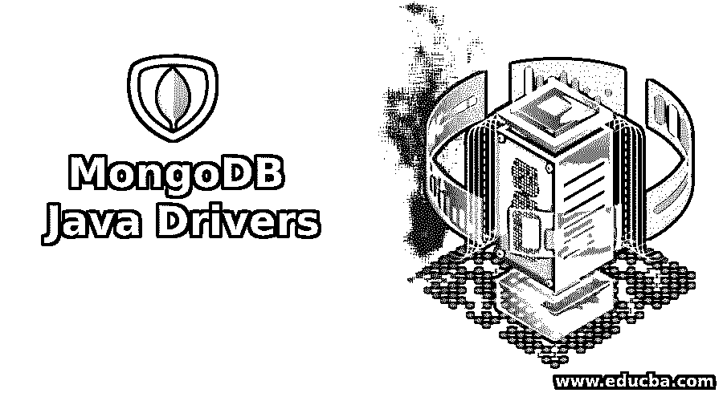

# MongoDB Java 驱动程序

> 原文：<https://www.educba.com/mongodb-java-drivers/>

## MongoDB Java 驱动程序简介

MongoDB 是一个 NoSQL 数据库，它将数据存储在 JSON 类型的文档中，为了使用 Java API 访问这些数据，使用了 MongoDB Java 驱动程序。这些驱动程序用于对集合中的数据执行 CRUD(创建、读取、更新和删除)操作，当前版本的 MongoDB Java 驱动程序是 4.0，在 3.12 之后于 2020 年 4 月发布。在 3.12 中有一些变化，在 4.0 中有所延续，没有增加任何新的东西。MongoDB Enterprise Advanced 用户在安全性、自动加密和解密方面的改进。它支持在 MongoClientSettings 上使用新的 UuidRepresentation 标记来设置 java.util.UUID 实例的 BSON 表示。

### MongoDB Java 驱动程序的特性

所以基本上，Java 驱动程序是允许 Java 开发人员与 MongoDB 数据库交互的包。它提供了一种与数据库建立同步和异步连接的方法。

<small>Hadoop、数据科学、统计学&其他</small>

*   使用编程语言 API 建立与数据库的连接。
*   向 MongoDB 获取和发送语句和文档。
*   从数据库中插入和检索文档。

在继续之前，我们需要确保我们有 MongoDB、MongoDB 的 Java 驱动程序和 Java。

### MongoDB Java 驱动程序

既然我们已经理解了什么是 MongoDB 的 Java 驱动程序和基本特性，那么让我们从理解这些驱动程序以及适当的示例和输出开始:

**建立连接 MongoClient():** 现在我们已经了解了什么是 Java 驱动，让我们开始用 Java 驱动与 MongoDB 建立连接。为了连接 MongoDB 实例，我们将创建一个新的 MongoClient()对象。

`MongoClient mongoClient = new MongoClient();`

或者

`MongoClient mongoClient = new MongoClient( "localhost" , 27017 );`

#### 1.证明

如果 MongoDB 使用密码保护，我们可以建立与实例的安全连接。在尝试建立连接时，我们必须将凭证作为参数传递。

为了连接数据库，我们使用:

`MongoDatabase database = mongo.getDatabase("test");`

**解释:**这些参数和方法用于连接和保护与 MongoDB 实例的连接。一旦我们用这几行代码编写了一个 java 程序，用。java 扩展，然后编译 java 文件并执行生成的类文件。

#### 2.列出收藏

为了检查和列出 mongodb 数据库中所有可用的集合，我们使用 getCollectionNames()。以下是 getCollectionNames()的语法:

`Set<String> collection = db.getCollectionNames();`

还可以用 listCollectionNames()列出所有集合。此 listCollectionNames()方法是 com . MongoDB . client . mongodatabase 类的一部分。listCollectionNames()的语法:

`for (String colname : database.listCollectionNames()) {
System.out.println(colname);
}`

#### 3.获取收藏

既然我们已经列出了数据库中存在的每个集合，使用 getCollection()我们可以专门选择集合并对其进行操作。以下是语法:

`DBCollection collection = db.getCollection("collection");`

#### 4.创建收藏

现在我们已经建立了一个连接，让我们继续创建一个 createCollection()方法。这个方法 createCollecton()是 com 的一部分。MongoDB.client.MongoDatabase 类。

`"database.createCollection("test");"`

#### 5.删除收藏

与创建集合一样，理解如何正确地删除集合是非常重要的。这里我们将使用 drop()方法，它也属于 com . MongoDB . client . mongocollection 类。

`MongoCollection<Document> collection = database.getCollection("test");
collection.drop();`

**解释:**上面的代码将删除名为 test 的集合。

#### 6.插入文档

我们现在已经建立了一个安全的连接，列出了数据库中存在的所有集合，并选择了一个集合，所以让我们插入一个文档。

`document.put(“Name”,”Sulaksh”);
document.put(“City”,”Pune”);
collectionname.insertOne(document);`

**解释:**在上面的语法中，insertOne 传递一个简单的参数，该参数保存所有要作为新文档插入到集合中的细节。和 insertOne 一样，insertMany 也可以用于批量文档。

#### 7.删除文件

上面的方法解释了如何删除单个集合，现在让我们从集合中删除一个文档。我们将使用 deleteOne()方法，它与 drop 方法属于同一个类。基本上，我们有两种删除方法，要么使用 deleteOn 方法，要么使用 deleteMany 方法，这取决于需要。让我们学习两者，deleteOne()的语法:

`collectionname.deleteOne(Filters.eq("city", "Pune"));`

**解释:**该语法将搜索与过滤器匹配的文档，并删除第一个文档。

**deleteMany():** 删除集合中与给定过滤器匹配的所有文档。如果没有匹配的文档，将不会删除。语法如下:

`collectionname.deleteMany(Filters.eq("city", "Pune"));`

**解释:**上面是一个合适的语法，它将搜索并删除集合中每一条含有 Pune 的记录。

#### 8.更新文档

在 CRUD 操作之外，我们学习了创建、删除、读取文档，所以现在让我们理解 Java 驱动程序中 update 方法的工作原理。像 delete 一样，我们有两种方法来处理更新:updateOne()和 updateMany()。这里，我们将使用 collectionname.update()方法。语法如下所示:

`collectionname.updateOne(searchQuery, updateQuery );`

**解释:**在上面的语法中，searchQuery 是 find 命令，它将允许我们定位我们想要更新的文档，稍后 updateQuery 将允许我们更新定位的查询，以便根据我们的需要进行修改。这只适用于单个文档。

**updateMany():** 现在让我们了解 updateMany()，它用于对多个文档的集合进行所需的更改。语法如下:

`collectionname.updateMany(searchQuery, updateQuery );`

**说明:**与 updateOne 相同，searchQuery 是选择要更新的文档的标准。同时，updateQuery 保存要用修改的值。在执行时，这些查询将返回操作的结果。根据使用的方法和传递的参数，结果将被修改。

### 结论

总之，MongoDB Java 驱动程序允许 Java 程序员在 API 级别上与数据库进行交互。我们理解执行 CRUD 操作所需的定义和语法。要运行和执行 MongoDB Java 驱动程序代码，我们需要 MongoDB 的实时运行实例，安装和配置 MongoDB 驱动程序。Java 驱动程序使得 Java 开发人员能够轻松地使用 MongoDB。

### 推荐文章

这是一个 MongoDB Java 驱动的指南。这里我们讨论一个 MongoDB Java 驱动程序的介绍和特性，驱动程序，解释和例子。您也可以浏览我们的其他相关文章，了解更多信息——

1.  [什么是 MongoDB？](https://www.educba.com/what-is-mongodb/)
2.  [MongoDB vs SQL server](https://www.educba.com/mongodb-vs-sql-server/)
3.  [MongoDB 收藏](https://www.educba.com/mongodb-collection/)
4.  [在 MongoDB 中查找](https://www.educba.com/lookup-in-mongodb/)

