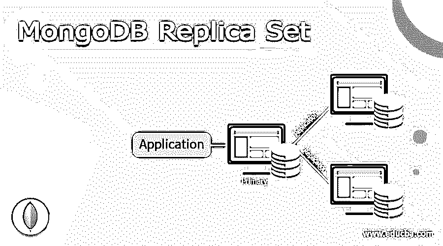
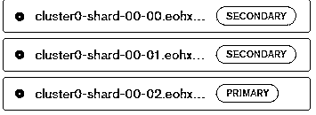

# MongoDB 副本集

> 原文：<https://www.educba.com/mongodb-replica-set/>

## MongoDB 副本集的定义

MongoDB 为用户提供了不同种类的功能，其中副本是 MongoDB 提供的功能之一。基本上，replica 设置了实例 MongoDB 进程，该进程对于维护同类数据集很有用。换句话说，我们可以说副本集提供了数据冗余和数据的高可用性，并且它将副本集存储在多个服务器上。MongoDB 副本集的主要优点是，如果系统在那个时候出现故障或崩溃，我们可以很容易地从另一个服务器恢复数据。它还为我们的数据提供了安全性。

**语法:**

<small>Hadoop、数据科学、统计学&其他</small>

`mongod –port specified port number – dbpath “specified path of our db” – “specified replica instance name”`

**解释**

上述语法我们可以分为如下三个部分。

首先，我们需要指定端口，这意味着我们需要启动具有指定端口号的 MongoDB 实例。

DB 的指定路径意味着我们数据库的路径。

在第三部分中，我们需要为副本集分配与指定的副本实例名称相同的名称，如下所示。

### 如何在 MongoDB 中设置副本？

现在让我们看看副本集在 MongoDB 中是如何工作的，如下所示。

我们需要遵循不同的步骤来设置 MongoDB 中可用的副本集，如下所示。

#### 1.我们可以使用 rs 添加第一个成员。启动():

这是 MongoDB 中的第一个副本集。首先，在这个副本集中，我们需要创建 MongoDB 实例。假设我们有 4 台服务器，我们称之为服务器 1、服务器 2、服务器 3 和服务器 4。在本例中，我们的主服务器是服务器 1，其余所有服务器(服务器 2、服务器 3 和服务器 4)都是辅助服务器。现在，我们可以通过以下步骤创建副本集，如下所示。

**步骤 1:** 我们必须确保我们已经添加到副本集中的所有 MongoDB 实例，我们必须需要在不同的服务器上安装副本集。这个过程的主要优点是，如果任何一台服务器宕机，我们可以使用另一台服务器，该服务器上有一个 MongoDB 实例可用。

**第二步:**在第二步中，我们需要将所有的 MongoDB 实例相互连接起来。

第三步:在第三步中，我们需要用 replSet 选项启动 MongoDB 实例。此选项对于组合所有服务器很有用，并且是副本集的一部分。

第四步:在第四步中，第一个服务器成功添加了副本集，之后我们需要使用 rs 初始化副本集。initiate()命令。

步骤 5: 现在我们需要使用 rs 来验证副本集。conf()命令。

#### 2.现在我们需要使用 rs 在辅助服务器上添加一个副本集。添加():

现在我们需要使用 rs 在辅助服务器上添加副本集。添加命令。这个命令的执行非常简单；它只是获取服务器的名称，并将其添加到副本集。

#### 3.我们可以按如下方式删除副本集:

添加服务器后，我们还可以使用 rs 删除服务器。删除命令，但我们需要遵循以下特定步骤。

首先，我们需要关闭所有需要删除的 MongoDB 实例。要关闭服务器，我们可以使用 db.shutdownServer 命令。

**第二步:**之后，我们需要连接主服务器。

第三步:最后我们需要使用 rs。remove 命令从副本集中删除服务器。

#### 4.副本集的故障排除如下。

如果遇到任何问题，我们需要遵循以下步骤。

**第一步:**我们必须确保 MongoDB 的所有实例都相互连接，这取决于服务器的数量。

第二步:在第二步中，我们需要运行 rs。状态命令。该命令给出副本集的情况或实际状态。自然地，每台服务器会互相发送消息，称为“心跳”消息，这只是表明工作人员还活着，正在工作。“status”命令获取这些消息的情况，并显示副本集中的任何个体是否有任何问题。

**步骤 3:** 在这一步中，我们需要检查操作日志的大小——操作日志是 MongoDB 中的一个分类，它存储了在 MongoDB 信息库中完成的作曲的历史背景。然后，MongoDB 在这一点上利用这个操作日志来复制与模仿集中不同个体的联系。要检查操作日志，请关联必要的零件场合并运行 rs.printReplicationInfo 订单。这个命令将显示日志的大小，以及在日志文件变满之前，它可以在日志文件中保存多长时间的交换。

### 例子

现在让我们看看 MongoDB 中副本集的例子，以便更好地理解。

首先，我们需要使用 mkdir 命令创建一个目录。之后，我们使用下面的命令创建了三个不同的实例。

`create_replica_set.sh`

**解释**

通过使用上面的命令，我们创建了三个不同的副本集。我们使用下面的屏幕截图展示了上述语句的最终输出。

现在，使用如下语句创建端口号为的实例。

`mongod –port 27117 –dbpath”D:\set up\mogodb\data” – replSet sample`

**解释**

在上面的示例中，我们为副本集使用了 27117 端口号，这里我们还指定了 DB 的路径，如下所示。之后，我们提供了副本集的指定名称作为示例，如上面的语句所示。
之后，我们需要通过命令行启动 mongodb 实例。我们还可以使用 rs 检查副本集的状态。status()命令。

### 结论

我们希望通过这篇文章，您可以了解 MongoDB 副本集。从上面的文章中，我们已经了解了副本集的基本语法，我们还看到了副本集匹配的不同示例。从本文中，我们了解了如何以及何时使用 MongoDB 副本集。

### 推荐文章

这是 MongoDB 副本集的指南。这里我们讨论一下定义，如何在 MongoDB 中设置副本？分别举例说明。您也可以看看以下文章，了解更多信息–

1.  [MongoDB 日期查询](https://www.educba.com/mongodb-date-query/)
2.  [MongoDB 分片](https://www.educba.com/mongodb-sharding/)
3.  [MongoDB 用户](https://www.educba.com/mongodb-users/)
4.  [MongoDB 关系](https://www.educba.com/mongodb-relationships/)

