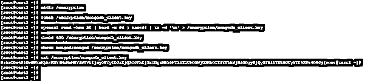
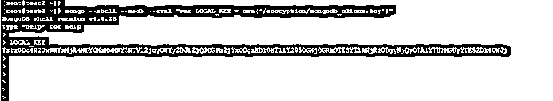
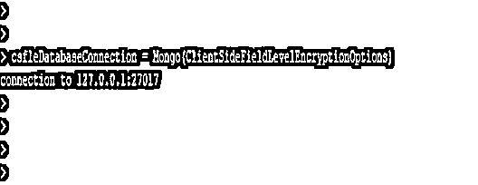

# MongoDB 加密

> 原文：<https://www.educba.com/mongodb-encryption/>

## MongoDB 加密的定义

Mongodb 加密过程包括生成整个数据库的主密钥，生成主密钥后，我们为每个数据库创建唯一的密钥。然后我们用我们创建的数据库加密我们的数据，我们也可以用主密钥加密我们的整个数据库。任何数据库都包含两种形式:静态数据或动态数据，静态数据是数据不移动的形式。动态数据将网络中的数据以静态数据的形式移动。

**语法:**

<small>Hadoop、数据科学、统计学&其他</small>

下面是 MongoDB 中加密的语法。

1)使用加密连接 MongoDB 实例–

`# mongo –ssl –host <Instance hostname> --sslCAFile <Name of certificate authority file name>`

2)使用客户端证书和证书颁发机构文件连接 MongoDB 实例

`# mongo –ssl –host <Instance hostname> --sslPEMKeyFile (PEM key file name) --sslCAFile <Name of certificate authority file name>`

3)轮换 KMIP 主加密密钥–

`# mongod –enableEncryption (enable encryption while rotating key) –kmipRotateMasterKey (Rotate KMIP master key) \ --kmipServerName <hostname of KMIP server> \--kmipServerCAFile <Certificate authority filename> --kmipClientCertificateFile <client certificate file name>`

MongoDB 加密的参数描述语法如下。

1)Mongo–该参数用于登录 MongoDB 实例。在 MongoDB 中，我们可以使用 mongo 命令登录数据库实例。

2)SSL——这被定义为使用 SSL 身份验证登录到 MongoDB 数据库实例。

3)Host——主机和主机名被定义为用于登录 MongoDB 中指定数据库实例的 IP 或主机名。当登录到任何 MongoDB 数据库实例时，我们需要使用主机名。

4)sslCAFile–这是用于验证数据库服务器上是否存在证书的证书颁发机构文件。通过加密登录到数据库服务器时使用该文件。

5)sslPEMKeyFile——该文件包含 mongo shell 的证书，该密钥存在于 mongos 或 mongod 实例中。

6)enable encryption–该参数被定义为在旋转主密钥时使用加密。

7)kmipRotateMasterKey-此参数用于旋转 KMIP 服务器的主密钥。使用这个参数，我们可以在 MongoDB 中旋转主密钥。

8)KMIP servername-这只是在轮换主密钥时使用的 KMIP 服务器主机名。

9)kmipServerCAFile-这是 KMIP 服务器的证书颁发机构文件。该文件在旋转主密钥时使用。

10)kmipClientCertificateFile–这是 KMIP 服务器的客户端证书文件。该文件在旋转主密钥时使用。

### MongoDB 中的加密是如何工作的？

MongoDB 涉及两种类型的数据加密形式。

1)静态数据加密
2)动态数据加密

为了使用静态数据加密来加密数据，enterprise MongoDB 将提供基于存储的本机对称密钥。

我们可以说静态数据加密是指不在网络上移动的数据，我们可以说它是静态形式的。静态数据数据库加密也称为透明数据加密，其缩写是 TDE。MongoDB 使用 AES 256 位标准加密算法来加密数据库。MongoDB 使用相同的加密密钥对数据进行加密和解密。

动态数据被定义为数据在网络上移动，我们可以说它形成了数据流。MongoDB 加密过程包括以下步骤。

1)第一步是为整个数据库生成主密钥。第二步是为每个数据库生成唯一的密钥。
3)第三步是使用我们在第一步和第二步中生成的密钥加密数据库数据。
第四步是使用我们在第一步中生成的主密钥加密整个数据库。

在 MongoDB 中，数据在服务器应用程序和数据库之间以两种方式进行处理。

TLS 和 SSL 是从两个系统发送和接收数据的最安全的加密协议。这个协议是用在 MongoDB 加密是一些 PEM 文件是由证书颁发机构。MongoDB 中有多种设置可以用来为客户端证书配置 TLS 和 SSL 协议。

我们还可以使用 sslCAFile 来创建证书。我们可以将这个文件存储在 MongoDB 实例中，以便在登录 MongoDB 实例时使用加密。我们还可以轮换我们的加密密钥。我们可以使用 KMIP 主旋转来旋转我们的密钥。

### 例子

下面的例子展示了 MongoDB 中的加密。下面的步骤展示了如何在 MongoDB 中使用加密。

#### 1)第一步是创建本地管理的密钥文件来管理密钥管理服务。我们可以使用 OpenSSL 来创建。我们将文件名创建为 mongodb_client.key。

**代码:**

`# mkdir /encryption
# touch /encryption/mongodb_client.key
# openssl rand -hex 50 | head -c 96 | base64 | tr -d '\n' > /encryption/mongodb_client.key
# chmod 600 /encryption/mongodb_client.key
# chown mongod:mongod /encryption/mongodb_client.key
# cat /encryption/mongodb_client.key`

图–创建本地管理的密钥文件以管理密钥管理服务的示例。

#### 2)创建密钥文件后，打开 mongo shell 命令，并使用密钥文件、–shell 和–nodb 选项登录。

**代码:**

`# mongo (Command connect to DB) --shell (Parameter) --nodb (Parameter) --eval (Parameter) "var LOCAL_KEY = cat('https://cdn.educba.com/encryption/mongodb_client.key')"
LOCAL_KEY`

图 7-示例打开 mongo shell 命令并使用 keyfile 登录。

#### 3)第三步涉及使用客户端加密配置加载加密文档。

**代码:**

`var ClientSideFieldLevelEncryptionOptions = {
"keyVaultNamespace" : "MongoDB._encryption",
"kmsProviders" : {
"local" : {
"key" : BinData (0, LOCAL_KEY)
}
}
}`

图–使用客户端加密配置加载加密文档的示例。

#### 4)设置配置后，连接到本地主机数据库。

**代码:**

`csfleDatabaseConnection = Mongo(ClientSideFieldLevelEncryptionOptions)`

图–连接本地主机数据库的示例。

#### 5)第五阶段是显示数据库，连接到数据库并显示来自连接的数据库的集合。

**代码:**

`show dbs
use MongoDB
show collections`

图-显示数据库，连接到数据库并显示集合。

### 结论

静态数据加密和动态数据加密有两种形式的 MongoDB 数据加密。在 MongoDB 中，数据加密对于保护数据非常重要。加密包括为数据库生成主密钥。我们可以使用 KMIP 主旋转算法来旋转我们的主密钥。

### 推荐文章

这是 MongoDB 加密指南。这里我们讨论一下定义，加密在 MongoDB 中是如何工作的？示例分别用代码实现。您也可以看看以下文章，了解更多信息–

1.  [MongoDB 加入](https://www.educba.com/mongodb-join/)
2.  [MongoDB findOne()](https://www.educba.com/mongodb-findone/)
3.  [MongoDB 数据库](https://www.educba.com/mongodb-database/)
4.  [MongoDB 分组依据](https://www.educba.com/mongodb-group-by/)

