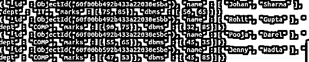

# MongoDB 在数组中查找

> 原文：<https://www.educba.com/mongodb-find-in-array/>

## MongoDB 在数组中查找的定义

MongoDB 为用户提供了不同种类的功能；find 数组是 MongoDB 提供的功能之一。在查找数组功能中，我们可以根据我们的需求找到所需的文档。对于查找数组的实现，我们使用 db.collectName. find()方法。查找数组处理精确匹配。换句话说，我们可以说，在一个查询中，我们需要传递 curly base 内部的所有参数，并且所有参数都取决于用户需求。该数组使用 find 方法，并用于从集合中返回所有匹配的文档。

**语法:**

<small>Hadoop、数据科学、统计学&其他</small>

`db. Specified collectioName. find(specified field name 1: specified value 1, specified value 2,…… specified value N, specified field name 2: specified value 1, specified value 2,…… specified value N )`

**解释**

在上面的语法中，我们使用带有不同参数的 find()方法，如下所示。

*   指定的集合名称:指定的集合名称表示我们已经创建的实际集合名称。
    Find():是实现数组的方法。
*   指定字段名 1:它用于从文档中标识字段名，并显示指定的值。
*   指定的字段名称 2:类似地，这用于集合中具有指定值的第二个字段，如图所示。

### 如何在 MongoDB 中找到数组？

*   现在让我们来看看如何在 MongoDB 中找到数组，如下所示。实现查找数组有不同的方法，如下所示。首先，让我们看看如何在数组中使用条件运算符:
*   MongoDB 为用户提供了不同类型的条件操作符，因此根据我们的要求，我们可以使用带有 find()方法的条件操作符来实现数组。我们有不同类型的条件运算符，如大于、小于和小于等于等。在第二种方法中，我们可以如下实现嵌套数组:
*   MongoDB 还根据我们的需求提供了实现嵌套数组结构的功能。如果您不知道归档在集群中的记录位置，请用 dab(.)和已结算报告中的字段名称。
*   第三种方式，我们可以将数组索引与 find()方法一起使用。利用 dab 文档，您可以在报告中的特定记录或展示位置指示字段的查询条件。该展览采用零基排序。
*   在下一个方法中，我们可以在数组中指定多个条件，如下所示:
    当确定各种记录中多个字段的条件时，您可以将查询指定为某个单独的报告满足这些条件，或者展示中的任何档案组合(包括单独的报告)满足这些条件。
*   在下一个方法中，我们可以实现一个具有多个条件的嵌套数组。使用$elemMatch administrator 来确定各种植入报告的众多标准，最终目标是某个已安装的归档满足所有预定义的标准。元素的混合满足标准。如果 exhibit 字段上的复合查询条件不使用 elemMatch 管理器，那么问题会选择那些其集群包含满足条件的任何组件组合的归档。

### 例子

现在，让我们看看数组中不同的 find 示例，以便更好地理解，如下所示。首先，我们需要创建新的集合，如下所示。首先，我们需要使用一个数据库，然后创建一个集合如下。首先，我们使用如下语句创建了一个示例数据库。

使用样本

**解释**

在上面的语句中，我们使用命令来创建新的数据库，这里我们成功地创建了一个示例数据库并使用它。以上语句的最终结果我们可以用下面的截图来说明，如下。

成功创建数据库后，我们需要使用如下语句创建集合。

`db.createCollection("student")`

**解释**

在上面的语句中，我们使用 createCollection 命令来创建新的集合；这里，我们以学生的身份创建了一个新的集合名称，如图所示。以上语句的最终结果我们可以用下面的截图来说明如下。

现在我们有了一个集合，所以现在我们需要使用下面的语句将同一个文档插入到新创建的学生集合中。

`db.student.insert({ name: ["Johan", "Sharma"], dept: "IT", marks: [75, 85], dbms: [56, 65]})
db.student.insert({ name: ["Rohit", "Gupta"], dept: "COMP", marks: [90, 75], dbms: [32, 85]})
db.student.insert({ name: ["Pooja", "Darel"], dept: "COMP", marks: [55, 65], dbms: [45, 35]})
db.student.insert({ name: ["Sameer", "Kohli"], dept: "MECH", marks: [36, 45], dbms: [66, 85]})
db.student.insert({ name: ["Jenny", "Wadia"], dept: "COMP", marks: [47, 53], dbms: [45, 85]})`

现在我们可以如下执行在数组中查找的方法。

`db.student.find( { name: ["Rohit", "Gupta"] } )`

**解释**

这是一个非常简单的在数组中查找的例子，这里我们需要使用 find()方法来查找一个学生的名字和姓氏。在本例中，我们以如下所示的数组格式插入文档。这里我们需要在学生收藏中找到 Rohit 和 Gupta。以上语句的最终结果我们可以用下面的截图来说明，如下。

现在，让我们看看如何在 find()方法中使用$all 操作符，如下所示。

`db.student.find( { name: { $all: ["Sameer", "Kohli"] } } )`

**解释**

以上语句的最终结果我们可以用下面的截图来说明如下。

现在让我们看看如何使用比较运算符，如下所示。

`db.student.find( { marks: { $gt: 50 } } )`

**解释**

在上面的例子中，我们尝试用 find array 实现大于比较运算符，如下所示。以上语句的最终结果我们可以用下面的截图来说明，如下。

同样，我们可以使用大于和小于比较运算符，如下所示。

`db.student.find( { dbms: { $gt: 30, $lt: 60 } }`

**解释**

以上语句的最终结果我们可以用下面的截图来说明，如下。

同样，我们可以用 find()实现数组的大小，并根据我们的需求实现更多的操作。

### 结论

我们希望通过这篇文章，您可以了解更多关于 MongoDB find in an array 的知识。从上面的文章中，我们学习了在数组中查找的基本语法，我们也看到了在数组中查找的不同例子。从本文中，我们了解了如何以及何时在数组中使用 MongoDB find。

### 推荐文章

这是一个 MongoDB 在数组中查找的指南。这里讨论定义，如何在 MongoDB 中查找 in 数组？示例分别用代码实现。您也可以看看以下文章，了解更多信息–

1.  [MongoDB Skip()](https://www.educba.com/mongodb-skip/)
2.  [MongoDB GridFS](https://www.educba.com/mongodb-gridfs/)
3.  [MongoDB 监控](https://www.educba.com/mongodb-monitoring/)
4.  [MongoDB 分片](https://www.educba.com/mongodb-sharding/)

