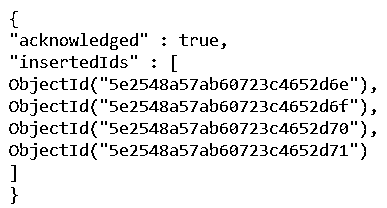
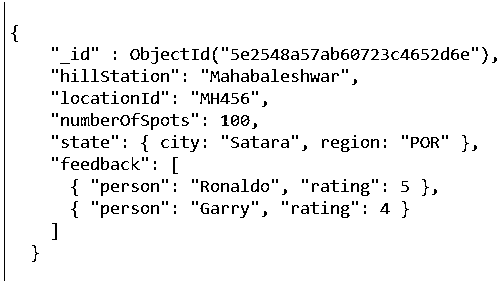
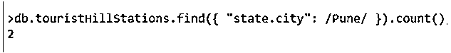

# MongoDB like 查询

> 原文：<https://www.educba.com/mongodb-like-query/>

## MongoDB like 查询简介

与查询类似，Mongo db 实际上是搜索特定模式并将其与 Mongo DB 数据库中的文档记录进行匹配，以便只检索或获取与指定模式或正则表达式匹配的特定字段或文档记录，或者包含指定的特定字符，从而满足最终过滤出结果的条件。Mongo DB 中不存在 SQL like 查询语句，但是我们可以利用替代方法来实现类似于 SQL 中 like 查询所执行的功能。

在本文中，我们将通过尝试 MongoDB 中 SQL 提供的 like query 语句类功能的替代解决方案来回顾这种功能的用法，并通过考虑样本数据库和一个示例来了解其实现。唯一的先决条件是 Mongo DB 应该正确安装并配置在您的机器上。

<small>Hadoop、数据科学、统计学&其他</small>

### 使用 find()函数进行 Mongo DB like 查询

在 Mongo DB 中，我们没有任何类似 SQL 的查询语句或子句，我们可以利用 find()函数来帮助提供类似的功能。我们可以搜索特定的记录，确认这种记录的存在，甚至通过指定适当的字符串或正则表达式或用于单词和短语匹配的正则表达式来执行模式匹配，这有助于只检索那些将包含我们在 find()函数的参数中提到的指定字符串或部分的记录。

**语法:**

findone()和 find()函数在 Mongo DB 中用于实现类似 SQL 的功能。find()语法如下所示。

`db. collection. find (key-value pair(s) for matching)`

在上面的语法中，由于 find()是 db 的 collection 类的方法，我们只能使用这种格式和点符号来调用它。

参数——同样在括号内，我们可以选择指定键-值对，指定在从文档中查找记录时哪个键应该包含什么值或者应该满足什么条件。

*   返回值–find()函数返回一个包含所有匹配文档记录的光标。我们可以进一步遍历这个游标来提取结果集，并在需要时对检索到的记录执行任何进一步的操作。这个 find()函数自动迭代前 20 条记录的结果集，以便在结果集中显示它们。
*   可选参数–还有另外两个可选参数可以传递给 find()函数，它们是 query 和 projection。投影用于指定为匹配记录而检索的字段。未指定时，projection 参数的默认值检索文档的所有字段。查询参数用于过滤 find()函数要扫描的记录的选择。

**注意:**如果您想使用驱动程序访问 find()函数返回的结果集，那么在这种情况下，您将不得不使用特定驱动程序语言的游标处理机制来处理结果集。

### 例子

让我们首先创建一个示例数据库，如下所示:

`db.touristHillStations.insertMany([
{
hillStation: "Mahabaleshwar",
locationId: "MH456",
numberOfSpots: 100,
state: { city: "Satara", region: "POR" },
feedback: [
{ person: "Ronaldo", rating: 5 },
{ person: "Garry", rating: 4 }
] },
{
hillStation: "Lonavala",
locationId: "bts223",
numberOfSpots: 150,
state: { city: "Pune", region: "KHN" },
feedback: [
{ person: "Jenni", rating: 6 },
{ person: "Geeta", rating: 5 }
] },
{
hillStation: "Meghalaya",
locationId: "uhu963",
numberOfSpots: 180,
state: { city: "Himachal", region: "R543" },
feedback: [
{ person: "Rina", rating: 7 },
{ person: "Goerge", rating: 6 }
] },
{
hillStation: "Ooti",
locationId: "bds958",
numberOfSpots: 120,
state: { city: "Bangalore", region: "Res523" },
feedback: [
{ person: "Rahul", rating: 6 },
{ person: "Anju", rating: 6 }
] }
]);`

在 MongoDB 中插入文档记录的上述查询语句的执行结果如下图所示。

现在，我们将在 find()函数的帮助下，通过 MongoDB 中的 like query kind off 功能演示，尝试考虑这个示例数据库进行查询。首先，让我们使用下面的查询语句尝试检索单个记录并确认 MongoDB 数据库的内容

`db.touristHillStations.findOne();`

上述查询语句的输出如下所示

如上所示，find()函数返回一个光标。现在，让我们尝试使用 find()函数来实现由 SQL 中的 LIKE 语句完成的模式匹配功能。我们将通过在上面的查询中执行轻微的修改，并提到匹配记录的单词或短语、正则表达式或正则表达式来做到这一点。这与其他关系数据库(如 SQL)中 LIKE 操作符的行为相同。
我们将尝试执行一个查询，匹配浦那市的 hill stations 数量。为此，我们应该在 city 字段上应用过滤器，并使用 Pune name 指定 regex，以获得城市为 Pune 的匹配 hill stations 的总数。我们的查询语句如下所示

`db.touristHillStations.find({ "state.city": /Pune/ }).count();`

执行上述查询语句的输出如下所示，检索计数为 1，因为根据插入的示例数据库，浦那市只有一个 hill station。

如上面的查询语句所示，我们可以对两个正斜杠之间的字符串进行修改，以指定每次匹配不同的字符串。我们还可以根据需要将上面示例中指定为城市的字段名称更改为任意字段。

### 结论

通过使用格式为–DB . collection . find()的 find()函数，我们可以在 Mongo DB 中实现 like 查询的功能。我们可以指定字符串、正则表达式或正则表达式来匹配 find()函数的参数值。输出是引用过滤后的文档记录的光标。

### 推荐文章

这是一个类似 MongoDB 的查询指南。这里我们讨论一下入门，Mongo DB 类查询使用 find()函数的例子，分别用代码实现。您也可以看看以下文章，了解更多信息–

1.  [MongoDB GridFS](https://www.educba.com/mongodb-gridfs/)
2.  [MongoDB 用户](https://www.educba.com/mongodb-users/)
3.  [MongoDB 关系](https://www.educba.com/mongodb-relationships/)
4.  [蒙戈布进口](https://www.educba.com/mongodb-import/)

