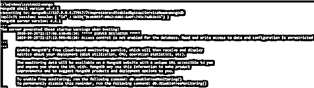
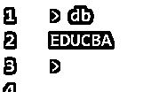
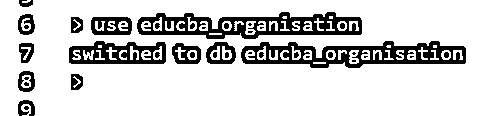
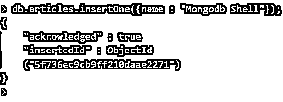

# Mongodb shell

> 原文：<https://www.educba.com/mongodb-shell/>

## Mongodb shell 简介

MongoDB shell 是一个使用 javascript 创建的交互式界面，通过它您可以执行与 MongoDB 实例相关的各种任务和功能。这个 shell 就像一个命令行工具一样与 Mongo 数据库进行交互，当您必须执行某些更改或操作 Mongo 的数据时，或者由管理员用来执行各种任务(如维护数据库的实例、其访问和权限)时，它被证明是更有益的。这是 MongoDB 数据库服务器默认使用的客户机。所有的事情都是基于控制台的，无论是要给出的输入还是要接收的输出，因为它是一个命令行界面，也称为(CLI)。

在本文中，我们将看到一个在处理小数据集时非常有用的工具，叫做 Mongo shell。我们将研究它的特性、安装指南、查询运行、数据操作、管理操作、使用的命令等。

<small>Hadoop、数据科学、统计学&其他</small>

**Mongosh–**这是由 Mongo DB 团队推出的新 mongo shell，它带来了某些增强，包括可嵌入性和可扩展性，这使得它甚至能够在其他一些产品中使用，如 Visual Studio 代码编辑器。

### 装置

每当我们安装 MongoDB 服务器时，Mongo shell 或 MongoDB 客户端会自动安装在内部。如果您想从外部安装 MongoDB shell，那么您可以使用这个链接从中心下载它。在那里，你会发现不同版本和软件包的存档文件。您可以选择您想要的 MongoDB shell 版本及其相应的包，并从上面的链接下载相同的归档文件。此外，您可以将存档文件复制到文件系统中您想要保存它任何位置。

MongoDB shell 是为多个平台提供的。您可以下载 MongoDB shell 的所有支持平台或操作系统如下所列

*   mac 操作系统
*   Linux 操作系统
*   Windows 操作系统

### 连接到 Mongo 数据库

下载并安装 MongoDB shell 后，使用它的下一步是连接 MongoDB 服务器。在这之后，您就可以使用 MongoDB 数据库并操纵数据或在数据库上执行任何您想要的操作了。

在您建立连接之前，要求您的 Mongo DB 服务器已经在运行。要启动服务器，您可以在命令提示符或 shell 上发出以下命令–

`net start mongodb`

执行上述命令会产生以下输出–

要运行 MongoDB shell，您需要启动以下命令

`mongo`

执行此命令后，您可以在命令提示符下看到以下类型的输出

在这个输出之后，您可以看到您将处于 mongo shell 内部。

或者，您也可以不使用命令提示符运行 mongo DB shell。为此，您必须转到您的可执行 mongod 和 mongo 文件所在的位置。在这之后，双击它们使它们运行，然后你会得到类似上面显示的结果。

### Mongodb shell 的端口设置

只有当您的 MongoDB 服务器在其默认端口地址 27017 上运行时，上述所有过程才能正确执行。如果您的 Mongo 服务器运行在除上述端口之外的端口地址上，那么您必须使用命令，该命令将通过使用以下语句明确提到相同的情况

`Mongo –port 28018`

这将给出与上面相同的输出。

### 拥有远程服务器的特殊情况

当您的 Mongo DB 服务器不在本地主机上的同一个设备或同一个本地网络中，并且位于远程某处时，上述命令将不起作用。有一个-host 选项，可以在上述所有命令中使用，以指明服务器所在的主机地址。例如，在下面的语句中，educba.sample.com 是我的服务器所在的主机。因此，我将使用以下命令

`Mongo –host educba.sample.com –port 28010`

这将给出与上面类似的输出，只是地址细节会发生变化。

### Mongodb shell 的基本命令

现在让我们看一下一些最常用的命令，这将帮助您开始使用 MongoDB shell。

为了检查您正在使用的当前数据库，您可以启动以下命令

`db`

在我的例子中，上述命令的执行给出了以下输出

为了使用不同的数据库，您可以使用如下所示的 use 命令

`use educba_organisation`

上述命令的输出如下所示

此外，如果您想在当前使用的数据库中创建集合，并在集合中插入某种数据，那么您可以使用 insertOne()函数。我们需要通过提及 db 来使用这个函数，db 将引用您当前使用的数据库、集合的名称，然后使用 insertOne()方法在集合中添加一个新的文档记录。让我们考虑一个例子，我想向名为 articles 的集合中添加一条新记录。我可以通过使用下面的查询语句来做到这一点

`db.articles.insertOne({name : “Mongodb Shell”});`

上述查询语句的执行给出了下图所示的输出–

为了检索或获取集合中存在的数据，可以使用 find()方法，该方法返回一个包含集合中存在的所有记录或文档的游标。此外，您可以使用 forEach()循环来迭代游标，并将 printjson 作为它的参数来打印游标的所有记录。在我们的例子中，我们可以使用下面的语句来获取和打印文章集合的内容

`db.articles.find().forEach(printjson)`

上述命令的输出如下所示

### 结论

当您安装 MongoDB 服务器时，MongoDB shell 会自动安装。不过，您可以从外部下载并安装它。本文简要介绍了安装、连接到数据库以及 Mongo DB 中使用的基本命令。

### 推荐文章

这是一个 Mongodb shell 的指南。在这里，我们讨论特性、安装指南、查询运行、数据操作、管理操作、使用的命令等。您也可以看看以下文章，了解更多信息–

1.  [MongoDB 中的数据建模](https://www.educba.com/data-modeling-in-mongodb/)
2.  [MongoDB 日期查询](https://www.educba.com/mongodb-date-query/)
3.  [MongoDB 分片](https://www.educba.com/mongodb-sharding/)
4.  [MongoDB Skip()](https://www.educba.com/mongodb-skip/)

