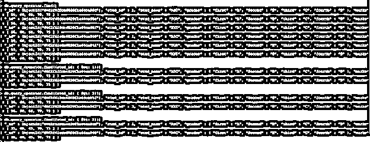
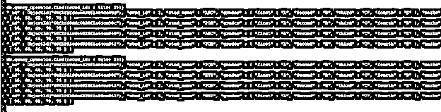
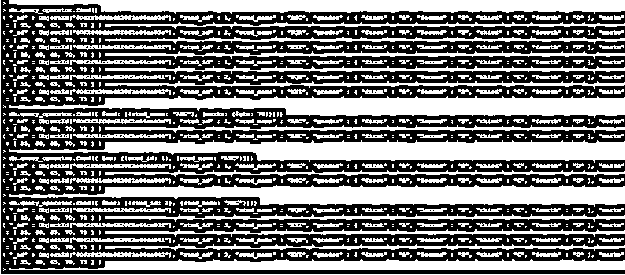
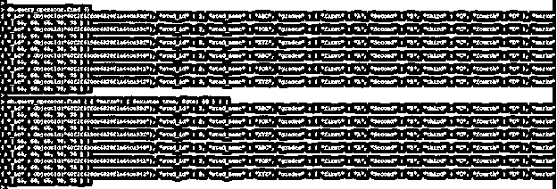
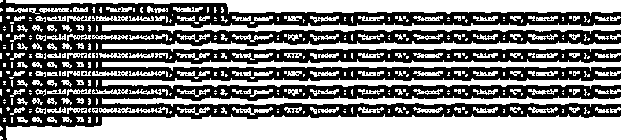
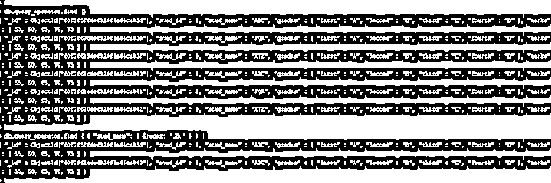
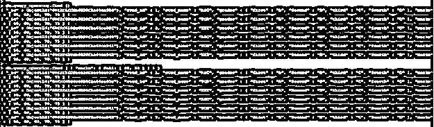

# MongoDB 查询运算符

> 原文：<https://www.educba.com/mongodb-query-operators/>

## MongoDB 查询操作符的定义

MongoDB 查询操作符用于使用查询与数据库进行交互，在 MongoDB 中有不同类型的查询操作符。MongoDB 查询操作符只不过是通知解释器处理逻辑或数学运算的关键字或特殊符号。基本上，查询操作符增强了更多的 MongoDB 功能，允许用户创建更复杂的查询并与数据集交互。我们已经使用 find 命令通过查询操作符从集合中获取数据，我们还需要在查询操作符前使用前缀“$”符号。

**语法:**

<small>Hadoop、数据科学、统计学&其他</small>

下面是 MongoDB 中查询操作符的语法。

`db.name_of_collection.find ( { “Field_name”: { $query_operator_name: “value” } } ) .pretty()`

MongoDB 中查询操作符的参数描述语法。

1)集合的名称——该参数被定义为集合名称，根据我们在查询中使用的查询操作符，我们从该集合中检索文档。2)Find——这个方法用于从集合中检索数据。我们还可以使用带有查询操作符的 find 方法来检索 MongoDB 中的特定文档。
3)字段名——该参数被定义为根据我们在查询中使用的查询参数从中检索数据的字段名。
4)查询操作符名称——我们需要使用指定的查询操作符名称，根据查询操作从集合中检索文档。
5)Value——除了字段值之外的值，我们使用查询运算符对其执行逻辑或数学运算。
6)漂亮——基本上 MongoDB 的输出是一种非结构化的格式。使用这种方法，我们可以以结构化的格式显示我们的输出。

### 查询操作符在 MongoDB 中是如何工作的？

*   我们可以在 MongoDB 支持的任何命令中使用 MongoDB 查询操作符。
*   下面是 MongoDB 中可用的查询操作符的类型。

1)注释
2)按位
3)数组
4)比较
5)逻辑
6)元素
7)求值
8)地理空间

*   MongoDB 比较运算符用于比较来自文档的值。下面是 MongoDB 中可用的比较查询操作符。

1)等于($eq)
2)大于($gt)
3)小于($lt)
4)大于或等于($gte)
5)小于或等于($lte)
6)匹配数组中的值($in)
7)不等于($ne)
8)不匹配数组($nin)中的任何值

*   MongoDB 中的逻辑运算符用于根据给定的条件过滤数据。下面是逻辑查询运算符的类型。

1)逻辑与($and)
2)逻辑或($or)
3)逻辑或非($nor)
4)逻辑非($not)

*   MongoDB 中使用元素查询操作符来根据 documents 字段标识文档。

1)$ exists–根据指定字段匹配文档。2)$ type–使用指定字段匹配文档。

*   MongoDB 评估查询操作符将用于评估文档中的单个字段或整体数据结构。
*   下面是 MongoDB 中可用的评估查询操作符如下。

1)$ JSON schema–该操作符用于根据模式验证文档。2)$ mod——当我们的字段值等于剩余值时，它将匹配文档。
3)$ regex——它将根据我们的正则表达式匹配文档。
4)$ text——它将在给定的字段中执行文本搜索。
5)$ where–它将匹配满足 JavaScript 表达式的文档。

*   MongoDB 中的数组操作符基本上是为带有查询文档的数组设计的。下面是 MongoDB 中的数组查询操作符。

1)$ all–它将匹配数组中满足给定条件的所有元素。$ size–它将匹配数组，因为指定的大小等于数组的大小。
3)$ elemMatch–它将根据指定的 elem match 条件匹配文档。

*   MongoDB 中最后一种查询操作符是注释操作符。这用于为任何表达式或查询提供注释。如果我们向任何查询添加评论，任何人都可以很容易地跟踪或查看日志。

### 例子

下面是 MongoDB 中查询操作符的例子。

#### 1) MongoDB 比较查询运算符

下面的例子显示了 MongoDB 比较查询操作符。在下面的例子中，我们使用了$eq，$gt，$lt，$gte 和$lte 查询运算符。

**代码:**

`db.query_operator.find ()
db.query_operator.find ( { stud_id: { $eq: 1 } } )
db.query_operator.find ( { stud_id: { $gt: 2 } } )
db.query_operator.find ( { stud_id: { $lt: 2 } } )
db.query_operator.find ( {stud_id: { $lte: 2 } } )
db.query_operator.find ( { stud_id: { $gte: 2 } } )`

**图–MongoDB 中比较查询操作符的例子。**

#### 2) MongoDB 逻辑查询运算符

下面的例子展示了 MongoDB 逻辑查询操作符。在以下示例中，我们使用了$and、$or 和$nor 查询运算符。

**代码:**

`db.query_operator.find ()
db.query_operator.find ( { $and: [{stud_name: "ABC" }, { marks: { $gte: 70 } } ] } )
db.query_operator.find ( { $or: [ { stud_id: 1 }, { stud_name: "ABC" } ] } )
db.query_operator.find ( { $nor: [ { stud_id: 1 }, { stud_name: "ABC" } ] } )`

**图–MongoDB 中逻辑查询操作符的例子。**

#### 3) MongoDB 元素查询操作符

下面的例子展示了 MongoDB 元素查询操作符。在下面的例子中，我们使用了$exists 和$type 查询运算符。

**代码:**

`db.query_operator.find ()
db.query_operator.find ( { "marks": { $exists: true, $gte: 50 } } )
db.query_operator.find ( { "marks": { $type: "double" } } )`

**图–MongoDB 中元素查询操作符的例子。**

#### 4) MongoDB 评估查询运算符

下面的例子展示了 MongoDB 评估、查询操作符。在下面的例子中，我们使用了$mod 和$text 查询操作符。

**代码:**

`db.query_operator.find ()
db.query_operator.find ( { "stud_name": { $regex: '.B.' } } )
db.query_operator.createIndex ( { "stud_name": "text" } )`

**图–MongoDB 中评估查询操作符的例子。**

#### 5) MongoDB 数组查询运算符

下面的例子显示了 MongoDB 数组，查询操作符。在下面的示例中，我们使用了$all 和$size 查询运算符。

**代码:**

`db.query_operator.find ()
db.query_operator.find ( { "marks": { $all: [ 60, 65 ] } } )
db.query_operator.find ( { "marks": { $size: 5 } } )`

**图–MongoDB 中数组查询操作符的例子。**

### 结论

查询操作符在 MongoDB 中非常有用和重要。MongoDB 查询操作符只不过是用来通知解释器处理逻辑或数学运算的关键字或特殊符号。在 MongoDB 中，比较、逻辑、元素、求值、地理空间、数组、按位和注释是查询运算符的类型。

### 推荐文章

这是 MongoDB 查询操作符的指南。这里我们讨论一下定义，查询操作符在 MongoDB 中是如何工作的？和示例。您也可以看看以下文章，了解更多信息–

1.  [MongoDB 分组依据](https://www.educba.com/mongodb-group-by/)
2.  [MongoDB 时间戳](https://www.educba.com/mongodb-timestamp/)
3.  [蒙戈布进口](https://www.educba.com/mongodb-import/)
4.  [MongoDB GridFS](https://www.educba.com/mongodb-gridfs/)

