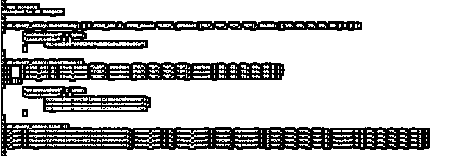
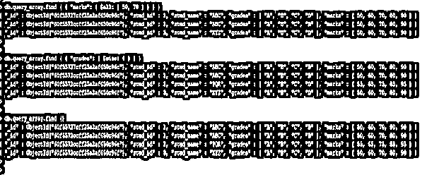
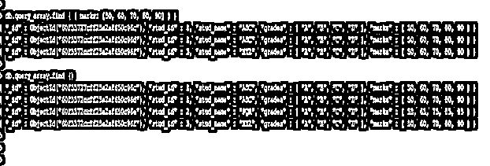
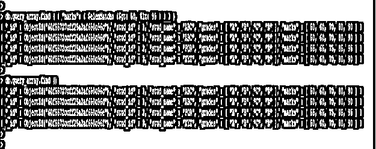

# MongoDB 查询数组

> 原文：<https://www.educba.com/mongodb-query-array/>

## MongoDB 查询数组的定义

MongoDB 查询数组操作符是用来查询带有数组的文档的，在 MongoDB 中使用查询数组操作符可以检索数组元素的数据。MongoDB 中有三种类型的查询数组操作符，我们需要在使用查询数组操作符之前使用前缀$ sign。我们还可以在 MongoDB 中对数组字段执行多个操作，我们可以使用 insert 方法将数组元素字段插入到集合中。此外，我们可以从 MongoDB 的集合中检索所有数组字段或特定字段。

**语法:**

<small>Hadoop、数据科学、统计学&其他</small>

下面的语法显示了 MongoDB 中的查询数组。

1)使用运算符的 MongoDB 查询数组–

`db.name_of_collection.find ( { “array_field_name”: { $array_query_operator_name: [ Array_element_value1, …, Array_element_valueN] } } ) .pretty()`

2) MongoDB 查询数组，将数组文档插入到集合中

`db.name_of_collection.insert ( { array_field_name : [ value1, value2, …., valueN] } )`

3) MongoDB 查询数组，从数组中检索指定的元素

`db.name_of_collection.find ( { array_field_name : [value] } )`

4)使用条件-检索指定元素的 MongoDB 查询数组

`db.name_of_collection.find ( { array_field_name : { operator_name: [“value”], operator_name: [“value”] } } )`

**参数:**

1)集合的名称——该参数被定义为集合名称，根据我们在查询中使用的查询操作符，我们从该集合中检索数组文档。2)Find——这个方法用于从集合中检索数组元素。我们还可以使用带有数组查询操作符的 find 方法来检索 MongoDB 中的特定数组元素。
3)数组字段名——该参数被定义为数组字段名，根据我们在查询中使用的查询参数，我们从数组字段名中检索元素。
4)查询操作符名称——这个参数被定义为我们在查询中使用的数组操作符的名称。
5) Value1 到 valueN——该值除了数组字段元素值之外什么都没有，我们使用数组查询运算符从集合中检索文档
6)Pretty——基本上 MongoDB 输出是一种非结构化格式。使用该方法，我们可以以结构化格式显示数组元素文档输出。

### MongoDB 中查询数组是如何工作的？

*   我们可以使用 insert 方法在 MongoDB 中插入数组元素字段。我们也可以使用 insertMany 方法插入多个数组文件。
*   我们可以通过使用等式条件来精确匹配数组元素字段来查询数组元素。
*   MongoDB 中有三种类型的查询数组操作符。

1)$ all–它将匹配数组中满足给定条件的所有元素。$ size–它将匹配数组，因为指定的大小等于数组的大小。
3)$ elemMatch–它将根据指定的 elem match 条件匹配文档。

*   MongoDB 中的数组操作符基本上是为带有查询文档的数组设计的。
*   使用所有数组查询操作符，我们可以找到我们在查询中指定的所有数组字段元素。
*   使用 size 操作符，我们可以找到与我们指定的数组大小匹配的所有数组文档。
*   为了从数组字段中找到指定的数组元素，我们需要在查询中指定指定的数组元素。
*   我们可以在 MongoDB 支持的任何文档数组中使用 MongoDB 数组查询操作符。
*   我们还可以通过在数组元素上指定复合条件来查询数组，我们可以通过使用满足条件的单个元素或多个元素来指定我们的查询。
*   为了在我们的查询中使用数组查询操作符，我们需要指定$符号作为前缀。在 MongoDB 前缀中使用任何操作符时，$ sign 是查询中使用查询操作符的强制符号。
*   我想我们没有使用$符号，它会显示语法错误。

### 例子

下面的例子展示了 MongoDB 中的查询数组。

#### 1) MongoDB 查询数组以将数组文档插入到集合中

*   下面的例子显示了 MongoDB 查询数组将数组文档插入到 query_array 集合中。
*   我们使用了 insert 和 insert 许多方法将文档插入到集合中。
*   在第一个示例中，我们使用 insert 方法插入了单个文档，在第二个示例中，我们使用 insertMany 方法插入了三个文档。

**代码:**

`use MongoDB
db.query_array.insertMany ( [ { stud_id: 1, stud_name: "ABC", grades: ["A", "B", "C", "D"], marks: [ 50, 60, 70, 80, 90 ] } ] );
db.query_array.insertMany ( [
{ stud_id: 1, stud_name: "ABC", grades: ["A", "B", "C", "D"], marks: [ 50, 60, 70, 80, 90 ] },
{ stud_id: 2, stud_name: "PQR", grades: ["A", "B", "C", "D"], marks: [ 55, 65, 75, 85, 95 ] },
{ stud_id: 3, stud_name: "XYZ", grades: ["A", "B", "C", "D"], marks: [ 50, 60, 70, 80, 90 ] }
]);
db.query_array.find ()`

图 4-将数组文档插入集合的 MongoDB 查询数组示例。

#### 2) MongoDB 使用数组操作符查询数组

*   下面的例子显示了 MongoDB 通过使用数组操作符来查询数组。
*   我们使用了$all 和$size 操作符从 query_array 集合中检索数组元素。
*   在第一个示例中，我们使用了$all 操作符来检索使用 marks 数组字段的数据。在第二个示例中，我们使用了$size 运算符，并将 grades 字段中的 size 定义为 4。

**代码:**

`db.query_array.find ( { "marks": { $all: [ 50, 70 ] } } )
db.query_array.find ( { "grades": { $size: 4 } } )
db.query_array.find ()`

图 7-使用数组操作符的 MongoDB 查询数组示例。

#### 3) MongoDB 使用指定的数组字段查询数组

以下示例通过使用指定的数组字段显示了 MongoDB 查询数组。我们使用数组字段名作为标记，并将元素定义为 50、60、70、80 和 80。

**代码:**

`db.query_array.find ( { marks: [50, 60, 70, 80, 90] } )
db.query_array.find ()`

图 7-使用指定数组字段的 MongoDB 查询数组示例。

#### 4)使用 elemMatch 和比较运算符的 MongoDB 查询数组

*   下面的示例通过使用 elemMatch 和比较运算符展示了 MongoDB 查询数组。
*   我们使用了$gt 和$lt 比较操作符从数组字段中检索文档。

**代码:**

`db.query_array.find ( { "marks": { $elemMatch: {$gt: 50, $lt: 95 } } } )
db.query_array.find ()`

图 7-使用 elemMatch 和比较操作符的 MongoDB 查询数组示例。

### 结论

MongoDB 查询数组被定义为从集合中插入或检索数组文档或元素。我们可以通过在查询中定义数组元素来检索指定的元素或文档。我们可以使用多个查询操作符从 MongoDB 的集合中检索数组元素的数据。

### 推荐文章

这是一个 MongoDB 查询数组的指南。这里我们讨论查询数组的定义，语法，如何在 MongoDB 中工作？代码实现示例。您也可以看看以下文章，了解更多信息–

1.  [MongoDB 删除收藏](https://www.educba.com/mongodb-delete-collection/)
2.  [MongoDB 分组依据](https://www.educba.com/mongodb-group-by/)
3.  [MongoDB 数据库](https://www.educba.com/mongodb-database/)
4.  [蒙戈布进口](https://www.educba.com/mongodb-import/)

