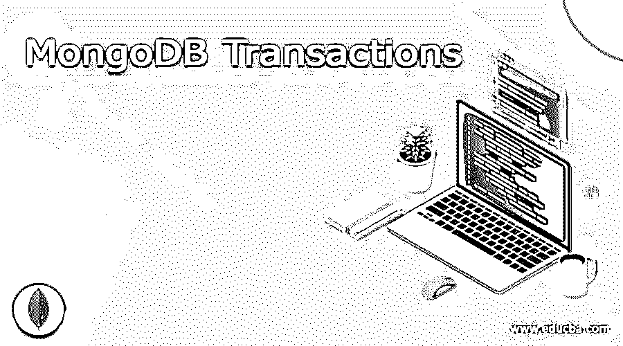

# MongoDB 事务

> 原文：<https://www.educba.com/mongodb-transactions/>

## MongoDB 事务简介

MongoDB 版中提供了 MongoDB 事务，其中甚至在多文档操作中也支持事务来维护 ACID 属性。甚至在分片集群和 Mongo 数据库中的文档副本之间也支持事务。在很多情况下，我们需要一个事务来维护操作的原子性，其中流程由 MongoDB 事务支持的多集合数据或多文档数据组成。

在本文中，我们将了解 Mongo DB 中事务的必要性、事务的 ACID 属性，并通过示例演示 MongoDB 事务在您的应用程序中的使用。

<small>Hadoop、数据科学、统计学&其他</small>

### MongoDB 事务

在 Mongo DB 数据库中有多个读写操作，需要一种行为来完成所有这些操作，否则它们都不会反映在数据库中。一组读写操作的完整性是通过使用事务来维护的。

例如，假设您正在将一定金额从一个帐户转移到另一个帐户。如果金额从一个帐户中扣除，而没有转移到另一个帐户，那么数据是不一致的，最终导致您的应用程序以错误的方式运行。为了使这种金额的转移保持一致，并以全有或全无的格式执行整个过程，我们可以利用事务。这意味着，如果在将金额转移到其他帐户时出现任何问题，则整个执行过程将回滚到该时间点。

这样，在执行多个操作时，可以保持一致性和完整性。在应用程序中使用事务的唯一缺点是在维护事务时需要做一些额外的工作，这会增加开销。此外，锁定事务中涉及的资源会给用户造成等待时间，这可能会影响用户体验。

### 事务的 ACID 属性

Mongo DB 中的所有事务都遵循 ACID 的属性，ACID 代表原子性、一致性、隔离性和持久性。在您的交易中展示所有这四个特征以进行验证是非常重要的。让我们逐一讨论酸的所有这四种特性代表什么

原子性——通过这个属性，我们的意思是，事务中存在的所有操作将一起被视为单个单元，这意味着即使是单个操作的失败也会导致该事务的所有先前执行的操作的回滚，并标记该事务的失败。相反，如果所有操作都成功执行，则事务也成功。

一致性——我们所说的数据库中的一致性是指数据中的任何变化都将导致满足应用于数据库中字段的该列的所有约束。例如，当一个惟一键被分配给集合中的文档时，那么该字段总是保持惟一，同时保持其一致性。

隔离–
隔离是一种属性，当系统中同时运行多个事务时，它有助于解释每个事务的隔离执行。

持久性—持久性意味着数据库中的数据更改会持续存在，并存储在后备存储中，这意味着如果出现任何类型的系统故障，数据都不会受到影响，并将得到正确存储和维护。

事务的 ACID 属性使得开发人员和用户可以可靠地使用 Mongo DB 数据库。在 MongoDB 中，只对单个文档执行所有读写操作的单文档事务已经是 ACID 兼容的了。如果您的数据库结构良好，您甚至不需要多文档事务。

然而，当需要时，也可以维护本质上是多文档的事务，但是这通常会带来涉及维护这种事务的额外开销。在使用多文档 ACID 兼容的 Mongo DB 数据库时，事务跨多个集群工作，并以我们期望的方式工作。您需要考虑在使用这种分布式系统时会产生的性能开销，并记住可用的资源和您在头脑中设定的性能目标。

### 交易的运作

我们必须在驱动程序的帮助下在 MongoDB 中启动一个会话。

此外，您可以利用该进程来执行您希望事务处理执行的所有操作。该操作可能涉及多个文档、集合，也可能跨分片集群，并且所有这些都是 ACID 兼容的。

**在 MongoDB 中使用事务的限制**

使用 MongoDB 中的事务有许多限制，如下所列

*   无法在系统集合上执行读取操作。
*   不能对不存在的集合或上限集合执行写操作。
*   不能在事务中修改或删除索引和集合。

### 例子

考虑以下 Mongo DB 中的事务示例。

在这里，我们将启动一个新的会话，然后执行事务操作

`sampleSession = db.getMongo().startSession()
sampleSession.startTransaction()
sampleSession.getDatabase("EDUCBA").test.insert({today : new Date()})
sampleSession.getDatabase("EDUCBA").test.insert({Articles : "MongoDB transaction Example"})
console.log("The article was added successfully!.");
sampleSession.commitTransaction()`

执行上述代码片段的输出如下图所示

此外，我们可以使用以下语句来决定是提交事务还是中止事务

`sampleSession.commitTransaction()
sampleSession.abortTransaction()`

### 结论

事务可以是单文档、多文档的，或者在分布式系统的情况下甚至涉及多个集群。在 Mongo DB 中，单个文档事务在内部维护。但是，在多文档事务的情况下，管理这些事务会有额外的开销。遵循 ACID 属性的事务使它们的数据库一致、原子、持久和隔离。在 Mongo DB 中，我们可以使用多种方法来启动会话、中止或提交事务。

### 推荐文章

这是 MongoDB 事务指南。在这里，我们讨论事务的定义、工作方式、代码实现示例以及限制。您也可以看看以下文章，了解更多信息–

1.  [MongoDB 监控](https://www.educba.com/mongodb-monitoring/)
2.  [MongoDB 日期查询](https://www.educba.com/mongodb-date-query/)
3.  [MongoDB Skip()](https://www.educba.com/mongodb-skip/)
4.  [MongoDB GridFS](https://www.educba.com/mongodb-gridfs/)

