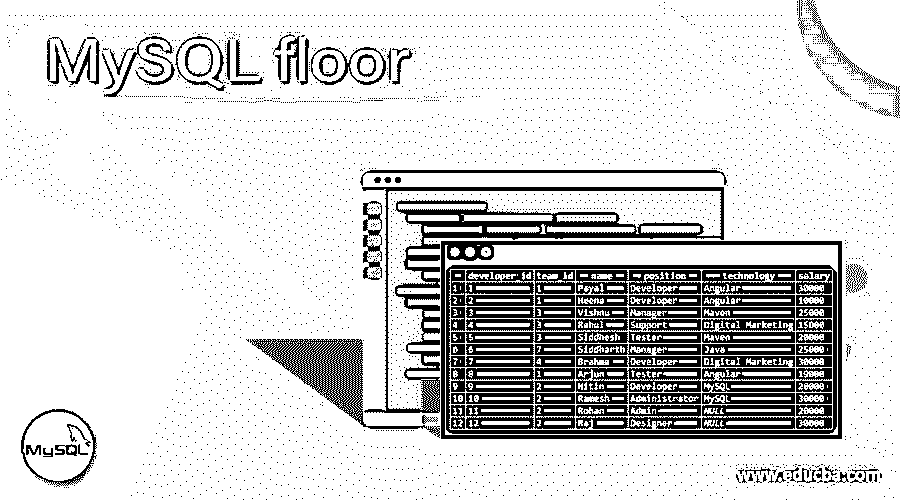
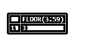
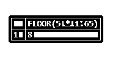
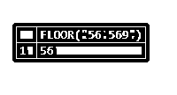
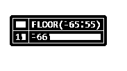
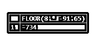
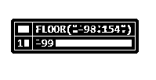
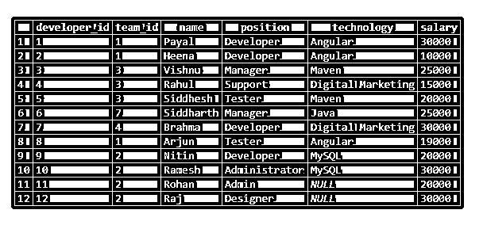
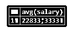
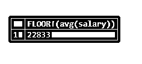

# MySQL 地板

> 原文：<https://www.educba.com/mysql-floor/>

## MySQL floor 介绍

MySQL floor 函数是 MySQL 中可用的数学函数，用于数值类型的值。这些数值可以是整数，也可以是浮点数。如果数值在字符串类型的值内被格式化为参数，则该值也允许用于 floor 函数。简而言之，任何可以推导为数值的值或表达式都可以作为 MySQL 中 floor()数学函数的参数。这个函数帮助我们检索小于或等于传递值的最大整数值。包括 MySQL 5.0、MySQL 5.1、MySQL 5.5、MySQL 5.6、MySQL 5.7、MySQL 3.23、MySQL 4.0 和 MySQL 4.1 在内的所有 MySQL 4.0 及以上版本都支持 FLOOR()数学函数。

**语法**

<small>Hadoop、数据科学、统计学&其他</small>

以下是 MySQL 中数学 FLOOR()函数的语法

`FLOOR(expressionOrNumber);`

**expression or number—**expression or number 可以是任意整数或浮点值，甚至可以是十进制值。如果这个数值被包装成字符串，那么这些字符串值也是可以接受的。除了直接指定数值之外，任何最终将推导出数值的表达式也允许作为 FLOOR()函数的参数。

**返回值–**FLOOR()函数的返回值是小于或等于作为参数传递给该函数的值的最大整数值。返回值的类型取决于作为参数传递给 FLOOR()函数的值的数据类型。如果参数是或整数数据类型，则返回值也是整数类型。而在其他情况下，如果参数值的直接规范的参数推导值是浮点类型，则返回值的数据类型本身就是浮点数据类型。

### 例子

下面举几个例子

#### 1.使用带有正值的 FLOOR()函数

我们将考虑正数值，比如说 3.59，然后使用 FLOOR 函数检索小于或等于 3.59 的最大整数值。让我们执行以下 SQL 查询语句，并观察输出–

`SELECT FLOOR(3.59);`

上述查询语句执行的输出如下

让我们再考虑一个积极价值的例子。但是在这个例子中，我们将使用一个表达式来计算数值类型的值。只需考虑表达式 5 * 1.65，其实际值为 8.25，并在 FLOOR()函数中使用此表达式，使用以下查询语句检索小于传递值的最大整数值

`SELECT FLOOR(5 * 1.65);`

上述查询语句执行的输出如下

现在，我们将考虑一个包装成字符串的正数，并将其用作 FLOOR()函数的参数。例如，考虑以如下方式使用的“56.569”值

`SELECT FLOOR("56.569");`

上述查询语句执行的输出如下

#### 2.使用带有负值的 FLOOR()函数

我们将考虑负数值，比如-65.55，然后使用 FLOOR 函数检索小于或等于-65.55 的最大整数值。让我们执行以下 SQL 查询语句，并观察输出–

`SELECT FLOOR(-65.55);`

上述查询语句执行的输出如下

让我们再考虑一个负值的例子。但是在这个例子中，我们将使用一个表达式来计算数值类型的值。只需考虑表达式 8 * -91.65，其实际值为 733.2，并在 FLOOR()函数中使用此表达式，通过以下查询语句检索小于传递值的最大整数值

`SELECT FLOOR(8 * -91.65);`

上述查询语句执行的输出如下

现在，我们将考虑一个包装成字符串的负数，并将其用作 FLOOR()函数的参数。例如，考虑以下列方式使用的“-98.154”值

`SELECT FLOOR("-98.154");`

上述查询语句执行的输出如下

#### 3.对表中的值使用 FLOOR()函数

现在让我们看看如何在查询语句中对列值使用 FLOOR()函数。我们将使用以下查询语句创建一个名为 workers 的表

`CREATE TABLE `workers` (
`developer_id` int(11) NOT NULL AUTO_INCREMENT,
`team_id` int(11) NOT NULL,
`name` varchar(100) DEFAULT NULL,
`position` varchar(100) DEFAULT NULL,
`technology` varchar(100) DEFAULT NULL,
`salary` int(11) DEFAULT NULL,
PRIMARY KEY (`developer_id`),
UNIQUE KEY `name` (`name`)
) ENGINE=InnoDB AUTO_INCREMENT=28 DEFAULT CHARSET=latin1;`

现在，我们将使用以下查询语句在 worker 的表中插入一些记录

`INSERT INTO `workers` VALUES
(1,1,'Payal','Developer','Angular',30000),
(2,1,'Heena','Developer','Angular',10000),
(3,3,'Vishnu','Manager','Maven',25000),
(4,3,'Rahul','Support','Digital Marketing',15000),
(5,3,'Siddhesh','Tester','Maven',20000),
(6,7,'Siddharth','Manager','Java',25000),
(7,4,'Brahma','Developer','Digital Marketing',30000),
(8,1,'Arjun','Tester','Angular',19000),
(9,2,'Nitin','Developer','MySQL',20000),
(10,2,'Ramesh','Administrator','MySQL',30000),
(11,2,'Rohan','Admin',NULL,20000),
(12,2,'Raj','Designer',NULL,30000);
Select * from `workers`;`

在执行查询后，它会给出以下输出–

现在，我们将使用以下查询语句来计算平均工资

`SELECT avg(salary) from workers;`

上述查询语句的执行给出了以下输出–

如果我们希望使用 FLOOR()函数使用以下查询语句检索整数格式的平均薪金，其中最大值小于或等于平均值

`SELECT FLOOR (avg(salary)) from workers;`

上述查询语句的执行给出了以下输出

### 结论——MySQL 平台

数学函数 FLOOR()在 MySQL 4.0 及以上所有 MySQL 版本中都有使用。我们可以检索小于或等于传递的数字或表达式的整数格式的最大值，其结果可以是整数的浮点值或十进制值。

### 推荐文章

这是一个 MySQL 的楼层指南。这里我们讨论 MySQL floor 的例子以及语句和输出。您也可以看看以下文章，了解更多信息–

1.  [MySQL 存在](https://www.educba.com/mysql-exists/)
2.  [MySQL CEIL](https://www.educba.com/mysql-ceil/)
3.  [SQL 升序排序](https://www.educba.com/sql-order-by-ascending/)
4.  [MySQL 锁表](https://www.educba.com/mysql-lock-table/)

