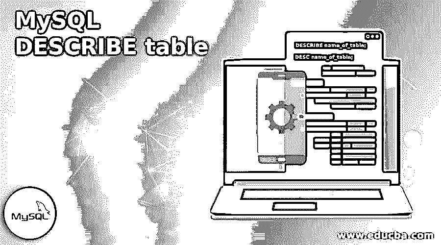
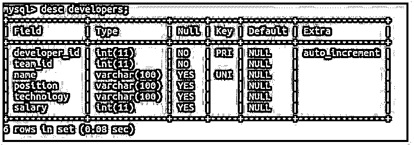
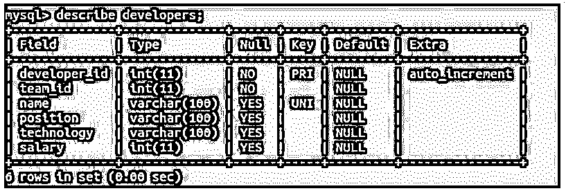
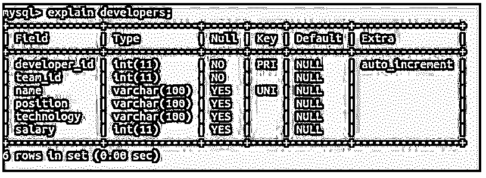
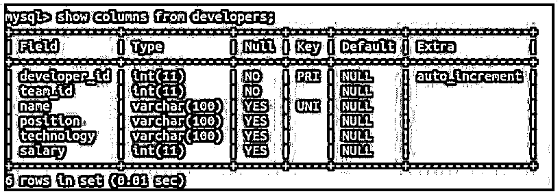
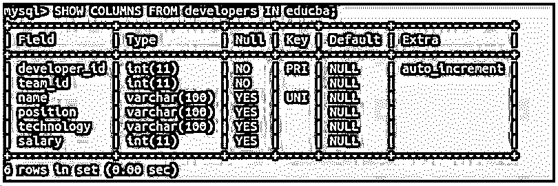
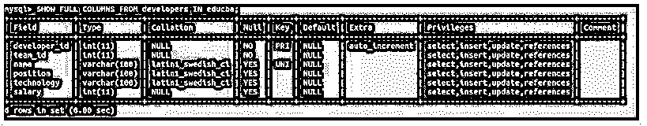
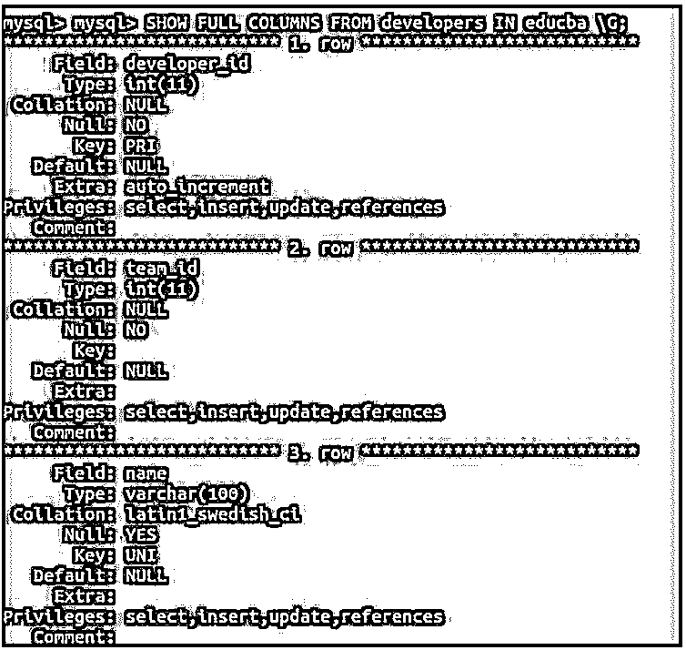
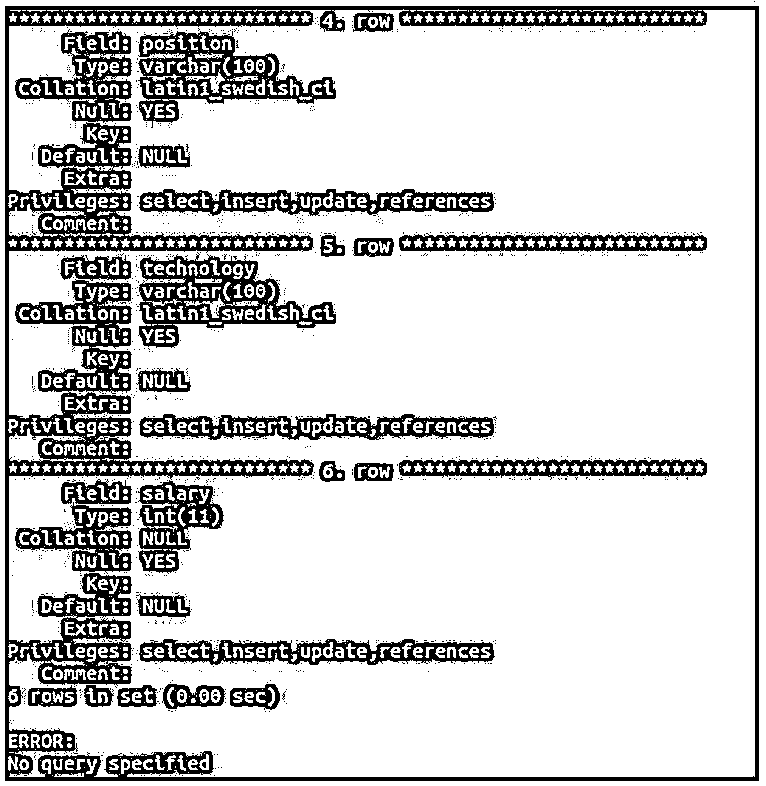
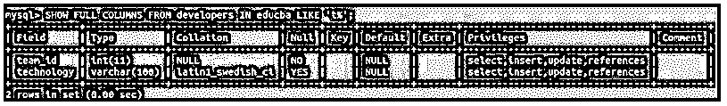

# MySQL 描述表

> 原文：<https://www.educba.com/mysql-describe-table/>

## MySQL 描述表简介

通常，我们会忘记分配给表列的内容、名称和属性。在这种情况下，我们需要获得表结构的细节。MySQL 提供了使用 describe 语句描述表的功能。在 MySQL 中有许多可用于描述表的可选语句，例如 desc(describe 的简称),显示由 describe 查询本身内部使用的列。

**语法:**

<small>Hadoop、数据科学、统计学&其他</small>

describe 语句的语法很简单，如下所示:

`DESCRIBE name_of_table;`

或者

`DESC name_of_table;`

其中，表名是要描述的表名。

### MySQL 描述表示例

让我们考虑一个例子；我们在 educba 命名的数据库中有一个名为 developers 的表。现在，我们想描述一下那张桌子。

**代码:**

`desc developers;`

**输出:**

我们可以在输出中看到，我们得到了表中每一列的不同细节。该字段代表列的名称；该类型是列的数据类型。Null 表示列中是否允许空值。如果空值为 YES，则允许空值，而在 NO 的情况下，空值被限制存储在该列中。该键指示该列正在被索引。这可以是主键索引、外键索引或唯一索引。默认值指定将分配给列的默认值。Extra 告诉我们关于该列的更多描述，如果在创建表时 AUTO_INCREMENTATION 选项被设置为该列，则 extra 被设置为 auto_increment 值而不是空白值。

从上面的输出中，我们可以看到开发人员的表包括六列，并且在输出的 Field 列中提到了列的名称；主键是在 developer_id 列上定义的，auto_increment 选项也应用于 developer_id 列。name 列定义了唯一的索引，这意味着不能在 developer 表的该列中存储重复值。developer_id 和 team_id 列不能包含空值，而所有其他列都允许在其中存储空值。

让我们用下面的语句来替代 DESC 语句来描述开发人员的表。

**代码:**

`describe developers;`

**输出:**

我们可以看到两个查询给出了相同的输出。

### 描述表的解释语句

MySQL 中使用 EXPLAIN 语句来描述复杂的查询以及可能包含多个表的查询中每个表的执行和行检索。该查询还可以用于选择、插入、更新和删除操作。这个语句也可以用来描述那个表结构。

让我们试着用 EXPLAIN 语句来描述同一个表，开发者使用下面的查询语句。

**代码:**

`explain developers;`

**输出:**

我们可以观察到 EXPLAIN 查询给出了与 describe 语句相同的输出。

### DESCRIBE 语句的内部执行

当我们执行 describe 查询时，它在内部执行与来自那个表名语句的 show columns 相同的流程。

让我们看看 SHOW COLUMNS 语句的语法。

**代码:**

`SHOW COLUMNS FROM name_of_table;`

其中 name_of_table 是需要检索其列详细信息的表名。

让我们使用 show columns 语句来描述使用以下查询语句的同一个表开发人员。

**代码:**

`show columns from developers;`

**输出:**

如果我们没有使用表所属的同一个数据库，我们还可以提到表所属的数据库的名称，如下面的查询语句所示。

**代码:**

`SHOW COLUMNS FROM developers IN educba;`

**输出:**

如果我们想要检索关于表中列的更多细节，我们可以在 SHOW COLUMNS 语句中使用 FULL 子句，如下面在 query 语句中使用的那样。

**代码:**

`SHOW FULL COLUMNS FROM developers IN educba;`

**输出:**

我们可以看到附加的列细节，包括与表中的列相关联的排序规则、特权和注释。权限包括该用户可以对列执行的操作。如果我们在将列添加到表中时已经将注释提供给了列，则注释代表注释。如果您想要以列表的垂直格式显示列的描述，那么您可以在查询中使用\G。

让我们在上面的命令中使用\G。

**代码:**

`SHOW FULL COLUMNS FROM developers IN educba \G;`

**输出:**

如果我们只想检索以 t 字符开头的列的详细信息，可以使用下面的查询语句。

**代码:**

`SHOW FULL COLUMNS FROM developers IN educba LIKE 't%';`

**输出:**

输出只给出了 team_id 和 technology 列的详细信息，因为它们都以“t”字符开头。

### 结论

我们可以使用 DESCRIBE 或 DESC 语句来获取表中各列的详细信息。用于描述表列的其他替代方法是 EXPLAIN 语句，它最常用于描述复杂查询的流程。在内部，describe 语句使用 SHOW COLUMNS 语句获取表列的详细信息。我们可以直接使用这个语句来获取表列的详细信息。

### 推荐文章

这是一个 MySQL 描述表的指南。这里我们讨论 DESCRIBE 语句的简介、示例、解释语句和内部执行。您也可以看看以下文章，了解更多信息–

1.  [MySQL today()](https://www.educba.com/mysql-today/)
2.  [MySQL 插入忽略](https://www.educba.com/mysql-insert-ignore/)
3.  [MySQL 存在](https://www.educba.com/mysql-exists/)
4.  [MySQL 锁表](https://www.educba.com/mysql-lock-table/)

