# 如何安装 MySQL

> 原文：<https://www.educba.com/install-mysql/>

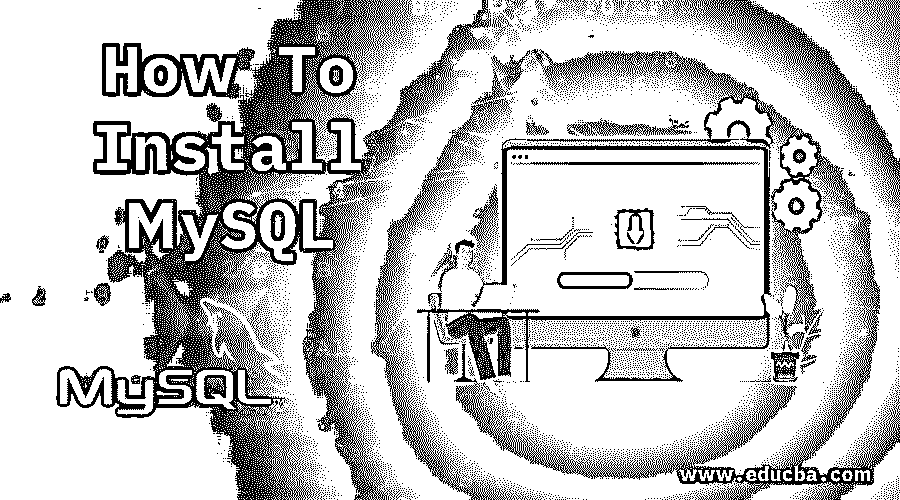

## 如何在 Windows 上安装 MySQL？

以下文章概述了如何安装 MySQL。MySQL 是一个关系数据库系统，最棒的是，它是开源的，而且完全免费。它是由“迈克尔·维德纽斯”和他们的团队开发的。现在由甲骨文公司维护。

### 在 Windows 上安装 MySQL 的步骤

下面给出了在 windows 上安装 MySQL 的步骤:

<small>Hadoop、数据科学、统计学&其他</small>

首先，你需要访问这个网站:https://dev.mysql.com/downloads/，在你的本地系统中下载并安装 MySQL。当你登陆这个页面时，只要找到 MySQL 社区版(GPL)并点击下载按钮。

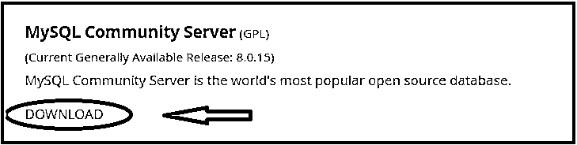

第二步:它把你重定向到另一个页面；只需向下滚动并找到“正式发布”部分，然后单击下拉菜单并选择操作系统。默认情况下，选择 Microsoft Windows，您也可以通过单击下面显示的下拉菜单来选择其他操作系统。

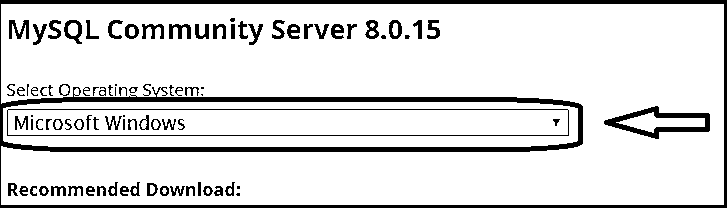

**第三步:**向下滚动并点击“转到下载页面”，它在下面用红色圈出。请不要从“其他下载”部分下载，该部分位于“转到下载页面”选项的正下方。

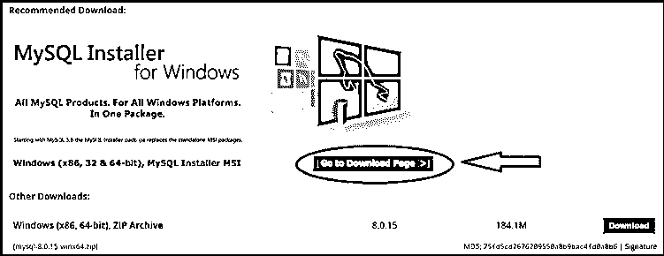

**第四步:**点击“转到下载页面”后，它会将你重定向到另一个页面，在那里你需要点击 2 和选项，Windows (X86，32 位)，MSI 安装程序，它有 324.3 MB 的大小，并在下面用红色圈出。1 st 下载选项，有 16.4 MB 大小，是一个基于网络的安装程序，是安装 MySQL 的启动器文件，所以避免 1 st 选项。

第五步:当你点击下载按钮时，它会将你重定向到另一个页面，在那里有三个选项。如果您已经拥有 Oracle 帐户，请首次登录，否则请使用此帐户，单击注册按钮并填写您的必要详细信息。第三个选项允许你不用登录就可以下载，所以你需要点击“不，谢谢，开始我的下载”，在下面的截图中用红色标出。它将开始下载。

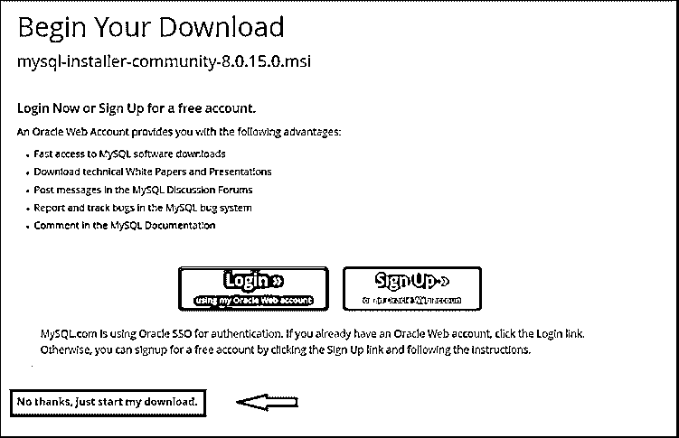

**第六步:**下载完成后，点击下载的文件。它将开始安装，然后你会得到一个窗口。只需按“是”并继续。

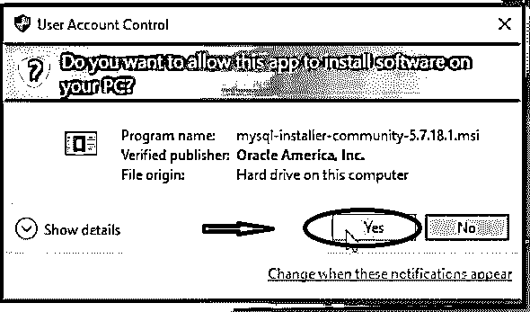

**步骤 7:** 现在，单击红色方块中“我接受许可条款”旁边的复选框，然后单击“下一步”按钮。

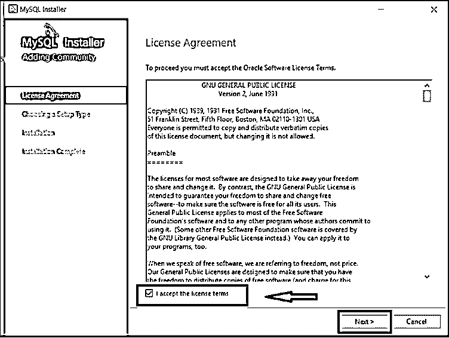

**第 8 步:**选择开发者默认选项，点击下一步按钮，如图所示。

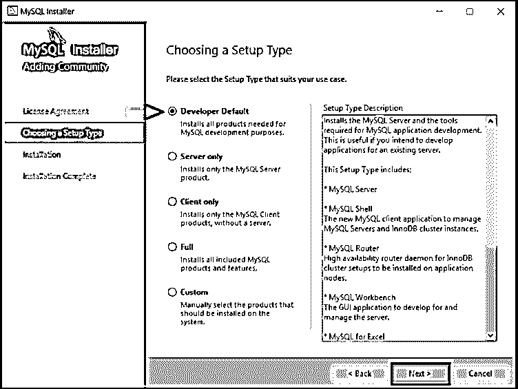

**步骤 9:** 然后再次点击检查需求窗口中的下一步。

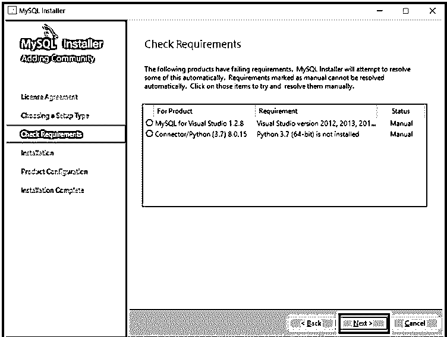

**步骤 10:** 之后，会显示一条警告信息，因此需要点击“是”并继续。

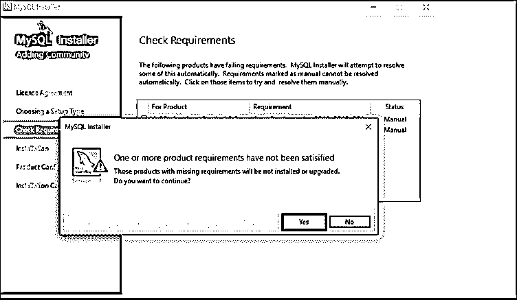

**第 11 步:**然后点击执行按钮。

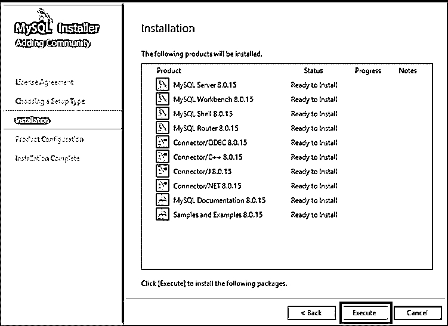

**第 12 步:**首先，执行和安装需要一些时间，当它显示完成时，只需检查所有产品的状态，然后单击下一步按钮。

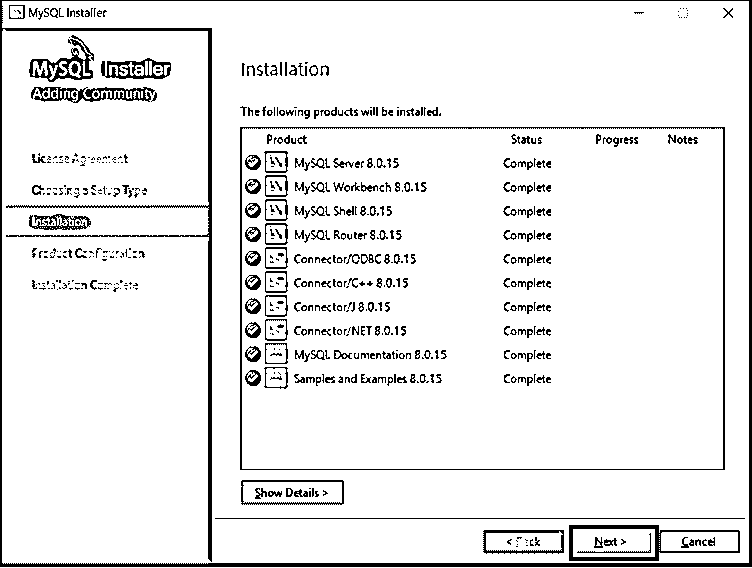

**步骤 13:** 再次点击产品配置窗口中的下一步。

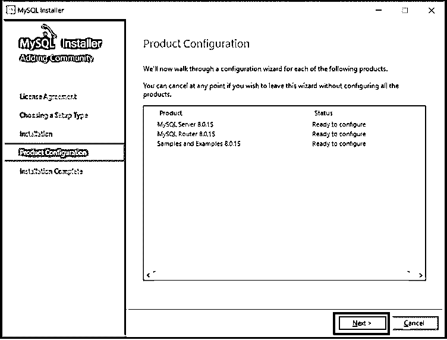

**步骤 14:** 选择独立 MySQL 服务器/经典 MySQL 复制，并在组复制窗口中单击下一步按钮。

**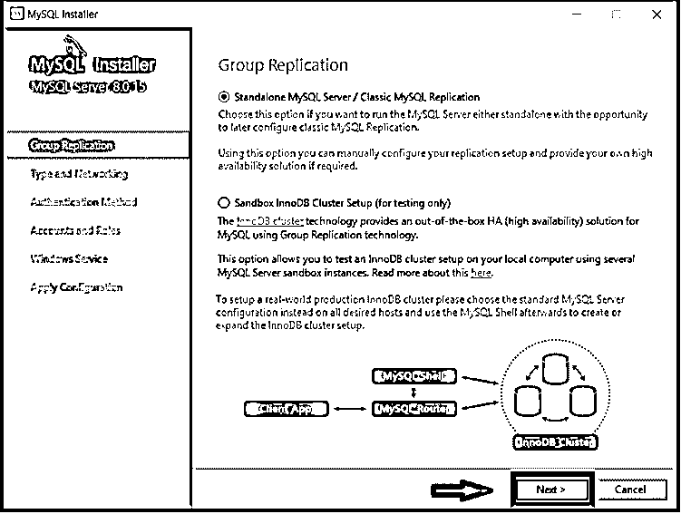

** 

**步骤 15:** 在类型和网络窗口中点击下一步，请不要在那里做任何更改，保持原样。

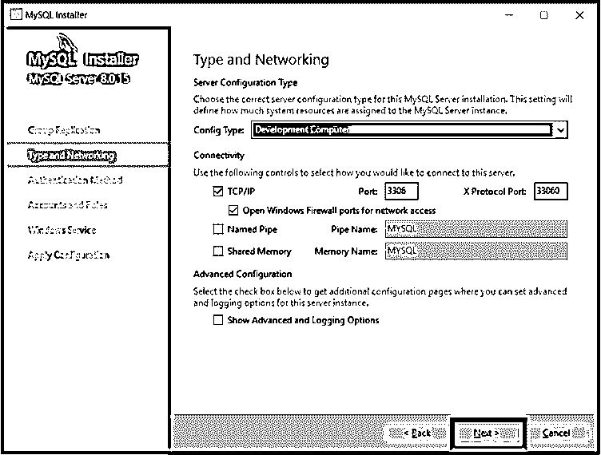

**步骤 16:** 选择“使用强密码加密”作为身份验证选项，然后单击“下一步”按钮。

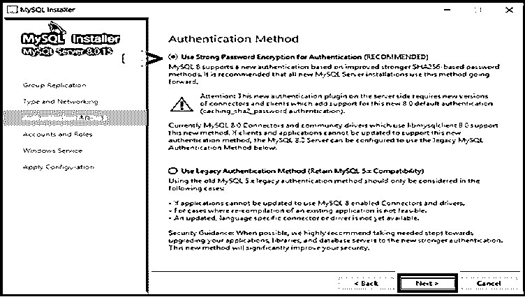

**第 17 步:**输入 MySQL Root 密码，再次输入密码，点击下一步按钮。你需要设置一个密码，当你想打开 MySQL 时，你可以一直使用这个密码。

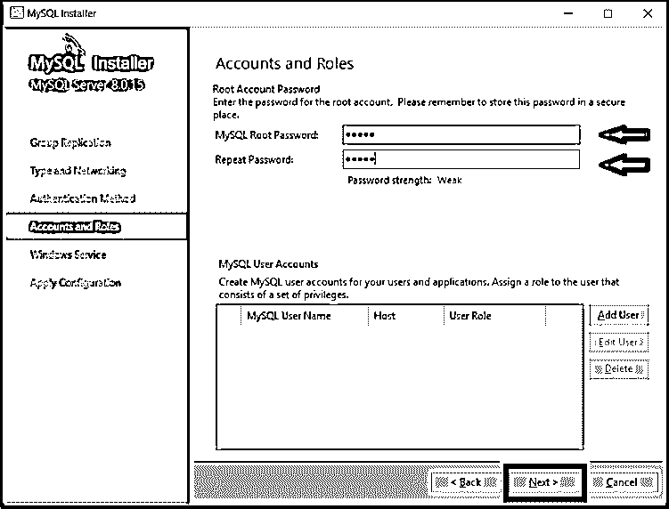

**第 18 步:**点击下一步按钮。

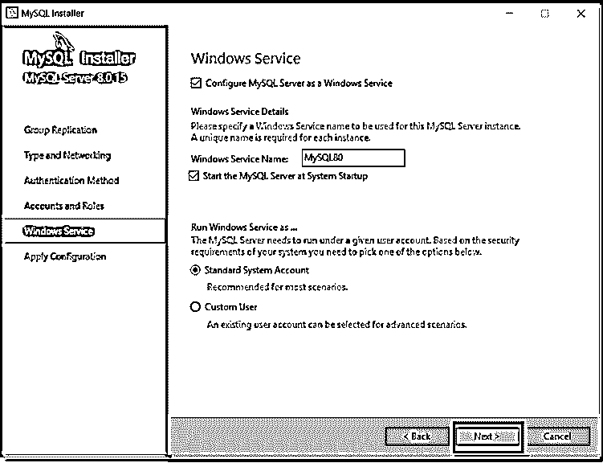

**第 19 步:**点击执行按钮。

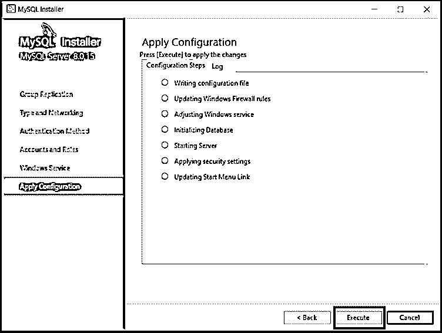

**第 20 步:**点击完成按钮。

**第 21 步:**在产品配置页面点击下一步。

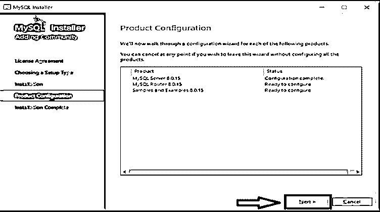

**第 22 步:**在用户名中，默认保持 root 用户身份，并输入您之前设置的密码。点击下一步。它将测试他们是否能够连接到服务器，并检查安装是否已经成功完成。

**步骤 23:** 对于少数系统，需要更多步骤来配置支持 MySQL 的其他安装。在这种情况下，你只需要点击下一步和执行按钮，请避免作出任何改变。很少有系统会自动配置设置，所以不必担心。现在最后点击完成按钮。

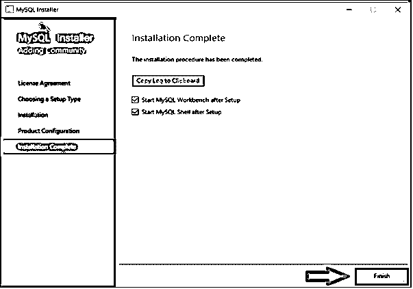

**步骤 24:** 完成 MySQL 的安装，打开 MYSQL shell 和 MySQL Workbench。请关闭两者并重新启动您的系统。

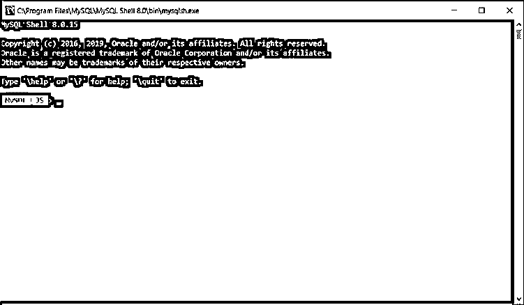

**第 25 步:**首先在 windows 中启动并搜索 MySQL，它会显示多个与 MySQL 相关的文件，但您只需要找到我的 SQL 命令行客户端和 MySQL Workbench。这两个选项都有各自的版本，就像我已经下载了我的 SQL 8.0 命令行客户端一样，所以它向我显示了各自的版本。它可能因用户和版本而异，但步骤是相同的。请点击[我的 SQL 命令](https://www.educba.com/mysql-commands/)行客户端如下图所示。

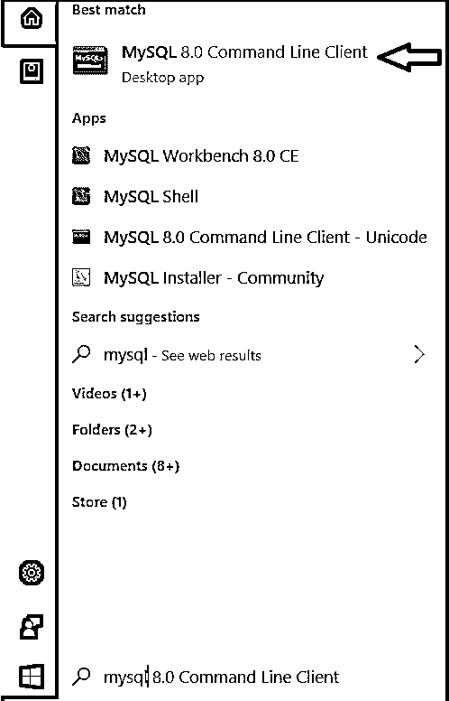

第 26 步:它将打开 MySQL 命令提示符，并要求您给出您在安装 MySQL 时给出的 root 密码。键入密码，然后按 enter 键。认证后，从下图所示的 mysql **>** 开始。

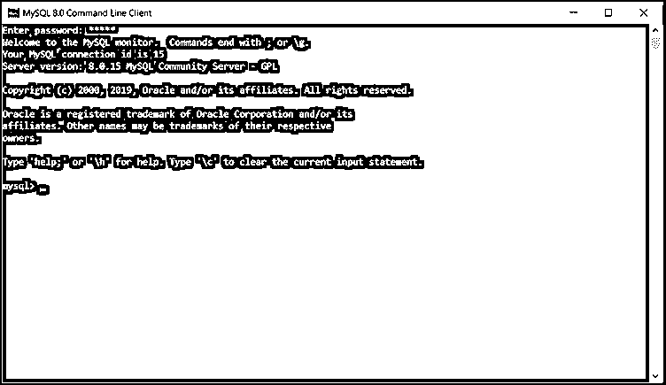

第 27 步:检查 MySQL 是否在工作，所以请检查它有多少个数据库。

显示数据库:

它将显示所有可用的 MySQL 数据库，如下所示。这意味着一切都很好。

它显示这里有 6 个数据库可用。即 information_Schema，mysql。

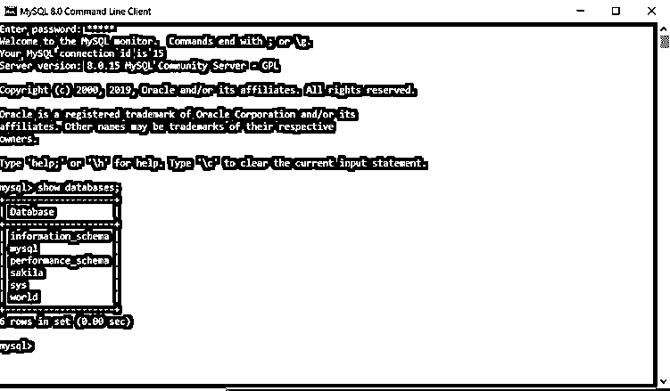

第 28 步:如果你想关闭 MySQL，请输入如下退出命令，它将关闭 MySQL。

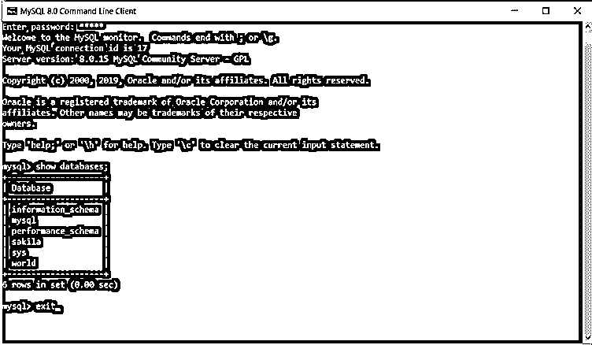

### 推荐文章

这是如何在 windows 上安装 MySQL 的指南。这里我们讨论了安装 MySQL 的说明和步骤。您也可以阅读以下文章，了解更多信息——

1.  [MySQL 数字版](https://www.educba.com/mysql-numeric/)
2.  [MySQL 社区服务器](https://www.educba.com/mysql-community-server/)
3.  [MySQL JSON 数据类型](https://www.educba.com/mysql-json-data-type/)
4.  [MySQL 如果存在](https://www.educba.com/mysql-if-exists/)

