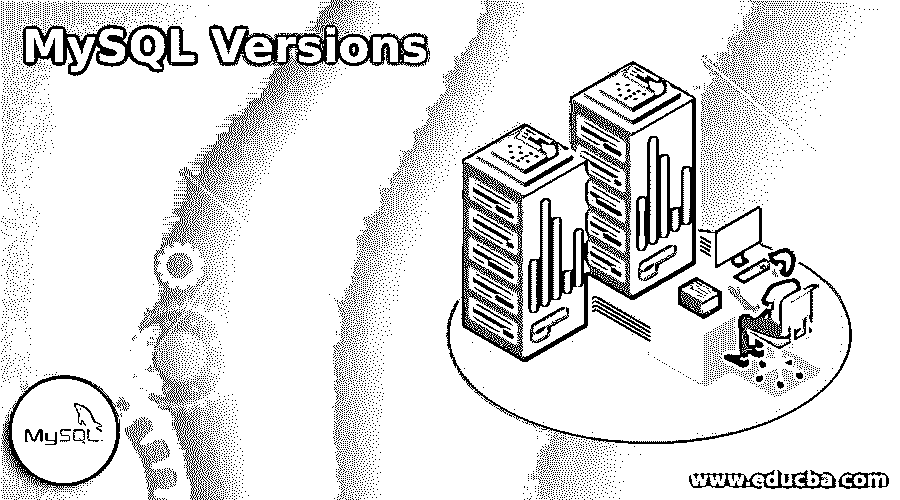

# MySQL 版本

> 原文：<https://www.educba.com/mysql-versions/>

## MySQL 版本介绍

MySQL Versions 是一种技术，它遵循一系列编号来跟踪 MySQL 上用于开发和维护目的的一些信息。这是一种具有挑战性的方式来保持对当前和即将到来的版本的更新，这些版本包含了改进的功能和对以前版本中发现的任何错误的解决方案。

通常，版本化被定义为一个对不同的版本号或名称进行分类的过程，这些版本号或名称是在开发和发布任何软件程序时提供给该软件程序的一个独特集合的。我们使用版本 1.0 这个名称来表示任何程序软件的初始版本。任何行业或公司标准的版本都没有确定的格式规则，因此他们可以自由地使用他们自己计划的方法来分配它。

<small>Hadoop、数据科学、统计学&其他</small>

### 不同的 MySQL 版本

当我们想在我们的系统中安装 MySQL 服务器时，首先我们必须选择要应用的版本和发行格式。您可以找到两种安装 MySQL 服务器的方法，第一种是开发版，它提供了最新的功能，但不建议在生产中使用。第二个是通用版本(GA ),它定义了一个稳定的或生产版本，主要适用于生产。因此，用户必须同意选择最新的 GA 版本。

对于使用 MySQL，最近的支持是版本号 v5.8，它包括几个重要的变化，包含新功能的添加和删除，修复的错误以及安全问题，等等。这个特定版本包括从安歌 MySQL 8.0 到 MySQL 8.0.21 的发布历史。这意味着从 2018 年 4 月到 2026 年 4 月提供支持。

MySQL 版本由四个属性来识别:alpha、beta、gamma，最后是 production。

#### 1.希腊字母的第一个字母

这个 MySQL 版本表示开发过程中的挣扎阶段，在这个阶段，新的高级功能和不兼容的修改都将被完成。在这里，开发人员努力消除某些错误，并尝试 MySQL 服务器的新功能。

#### 2.贝塔

这个属性定义了这个版本基本上已经完成，但是仍然需要进行彻底的测试。主要变化是不可预测的。

#### 3.微克

它说，以前的测试版已经变得或多或少稳定了一点，所以我们可以继续进行目标，进一步找出错误，并解决它们。

#### 4.生产

MySQL 版本中的最后一个属性负责给 MySQL 开发人员留下印象，告诉他们这个版本已经准备好了，足够稳定和成熟，可以用于关键任务。

对于较小的扩展，MySQL 开发人员可能会感到满意，但也可能会出现一些产品版本的兼容性问题。根据 MySQL 文档，一个新的 MySQL 版本应该总是保持 alpha 状态。同样，状态上升到状态 beta、gamma，最后是具有更高版本号的产品。基本上，MySQL 用户和开发者必须使用，其中有状态生产。

2008 年，MySQL AB 由 Sun Microsystems 开发。直到 MySQL 5.0，第一次内部发布是在 1995 年 5 月 23 日，但是作为文档，5.0 版本有一些缺点出现在表格中。同样，在 MySQL 版本 5.1 发布后，人们发现该版本对数据仓库的支持很差，存在错误结果错误和崩溃，并且在处理单个查询时操作不同的 CPU 内核也不稳定。因此，2010 年 1 月 27 日日，太阳微系统公司被甲骨文公司收购。

之后陆续推出后续改进和新增功能。

让我们来看看以前的 MySQL 版本的发布历史，如下所示:

#### 1.MySQL 5.1

它于 2008 年 11 月 27 日发布，支持于 2013 年 12 月结束。它包括 MySQL server 5.0 到 MySQL server 5.1.73 版本，包含事件调度器、插件 API、分区、服务器日志表和基于行的复制。

#### 2.MySQL 5.5

其发布日期为 2010 年 12 月 3 日日，支持结束日期为 2018 年 12 月。它包括从 MySQL server 5.5 到 MySQL server 5.5.62 的版本，默认存储引擎 InnoDB 支持引用完整性约束和事务以及其他改进的特性。

#### 3.MySQL 5.6

该版本于 2013 年 2 月 5 日发布，支持于 2021 年 2 月结束。它包括 MySQL server 5.6 到 MySQL server 5.5.45 版本的发布，增强了查询优化器的性能，全新的 NoSQL 风格的 memcached APIs，InnoDB 中的高级事务输出，TIMSTAMP 列类型，可以完成非常大的表，等等。

#### 4.MySQL 5.7

它于 2015 年 10 月 21 日发布，支持将于 2023 年 10 月结束。它包括从 MySQL server 5.7 到 MySQL server 5.6.27 的版本，包含 RFC 7159 明确定义的原生 JSON 数据类型。

#### 5.MySQL 8.0

这个最新版本于 2018 年 4 月 19 日发布，将于 2026 年 4 月结束支持。它包括 MySQL server 8.0 到 MySQL server 8.0.21 版本。它包括原子和崩溃安全的 DDL 语句、NoSQL 文档存储、JSON 扩展语法，以及一些新功能，如增强排序、JSON 表功能、数据字典、帐户和安全管理、资源和表加密管理、InnoDB 增强、字符集支持、窗口功能、数据类型支持优化器增强和部分更新。

**Note:** The MySQL server version 6 has stopped working after the acquisition of Sun Microsystem and now MySQL Cluster product versions 7 and 8 are being used by it. Due to different new and significant features being introduced, the company decided to begin a renewed fresh series for MySQL version. It announced for MySQL 8.0 as the previous version number series 6 and 7 were used before itself.

### 结论

它定义了稳定版本的生产过程，该过程包含了通常在 MySQL 或任何其他软件应用程序的旧版本上通过适当的计划和修正所做的实质性更改。当版本号增加时，它表示通过在程序软件中实现新功能、修补安全漏洞和共同修复错误而引入的一些改进。

### 推荐文章

这是一个 MySQL 版本的指南。在这里，我们将分别讨论不同 MySQL 版本的介绍。您也可以看看以下文章，了解更多信息–

1.  [MySQL 列表用户](https://www.educba.com/mysql-list-user/)
2.  [MySQL 位](https://www.educba.com/mysql-bit/)
3.  [mysql_real_escape_string](https://www.educba.com/mysql_real_escape_string/)
4.  [MySQL 存储过程](https://www.educba.com/mysql-stored-procedure/)

