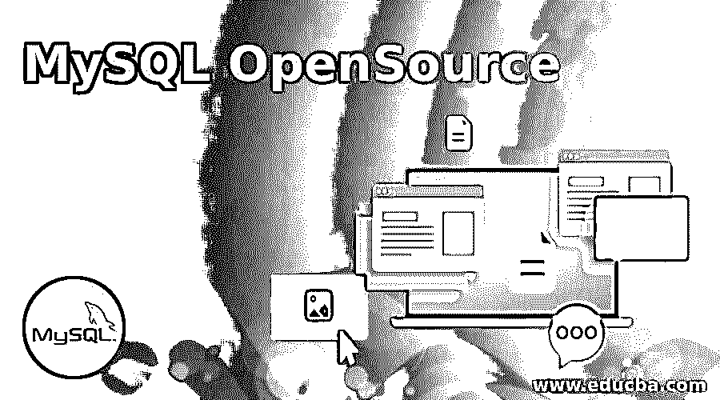
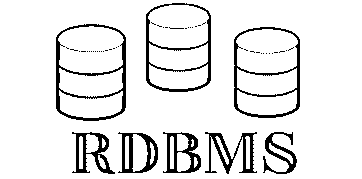
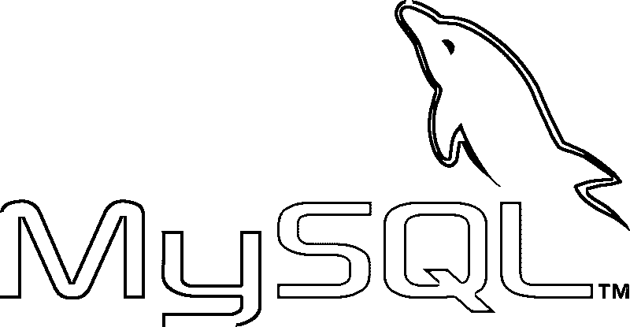
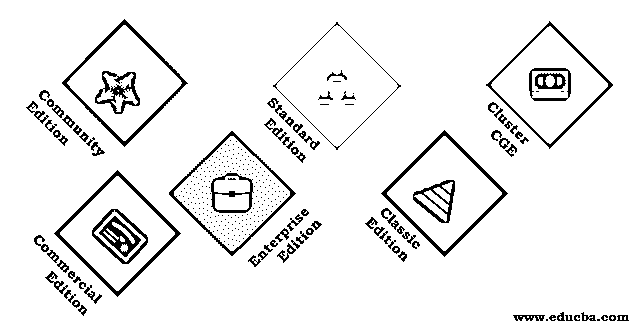
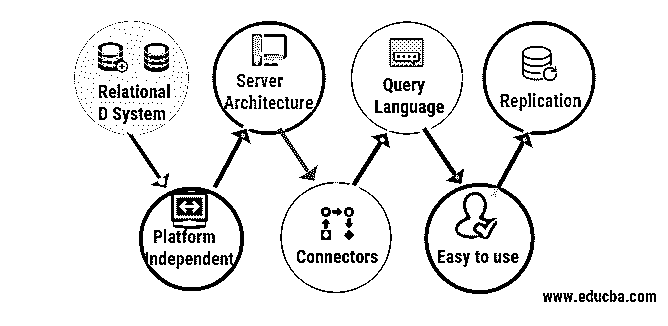

# MySQL 开源

> 原文：<https://www.educba.com/mysql-opensource/>

## MySQL 开源简介

本文旨在提供一种叫做 MySQL 的 RDBMS 软件的信息。所以在进入 MySQL 之前，让我们先了解一下什么是 SQL，什么是 RDBMS。SQL 是结构化查询语言的缩写。SQL 是一种编程语言，用于查询关系数据库中的结构化数据。SQL 用于存储、访问和操作数据库中的数据。SQL 提供了一些语言元素，如子句、表达式、谓词、查询和语句。它还提供了过程化编程功能，有助于在函数或过程中编写整个代码块。

### 什么是 RDBMS？

<small>Hadoop、数据科学、统计学&其他</small>

RDBMS 是关系数据库管理系统的缩写。RDBMS 是允许存储和操作数据的程序的集合。RDBMS 总是存储结构化数据。RDBMS 中的数据以表的形式存储为数据库对象。表格由行和列形式的相关条目的集合组成，并且一组相关的表格存储在数据库中。各种各样的公司，如 Oracle、MySQL、Microsoft SQL Server、Teradata 等等，都为 RDBMS 提供了不同的功能，但所有 RDBMS 的主要目的都是相同的。

### 什么是 MySQL？

MySQL 是一个开源的关系管理数据库系统。MySQL 是一种快速且易于使用的 RDBMS，用于开发各种小型和大型应用程序。它被 Joomla、WordPress、Drupal 等各种应用程序广泛使用。MySQL 之所以受欢迎，是因为它具有各种各样的特性。\

其中一些列举如下:

1.  MySQL 软件是在开源许可下发布的。所以，没什么好赔的。可以自由使用。
2.  MySQL 软件可以在各种操作系统上工作，并且可以与各种编程语言一起使用，如 Java、C、C++、PHP 等等。
3.  MySQL 开源使用标准 SQL 语言查询数据。
4.  该表存储的最大数据大小取决于操作系统对文件大小的限制。

### MySQL 是开源的吗？

MySQL 软件是一个开源的 RDBMS 软件。MySQL OpenSources 的源代码可以根据 GNU 通用公共许可证条款以及各种专有协议获得。对于专有使用，有几个付费版本提供额外的功能。MySQL 最初是由一家名为 MySQL AB 的瑞典公司开发的，该公司现在归甲骨文公司所有。MySQL 服务器软件版有不同的版本，如商业版和社区版等，解释如下:

*   MySQL 社区版:它是 MySQL RDBMS 的一个免费下载版本，由一个活跃的开源开发者社区提供支持。有很多论坛，用户可以张贴他们的查询，并获得 MySQL 上的所有更新。

*   **MySQL 商业版:** MySQL 在这个版本下可以作为付费版本使用。在商业版中，MySQL Opensource 有下面提到的不同版本。

*   **MySQL 企业版:**它拥有最全面的特性、管理工具和技术支持，可实现可扩展性、可靠性和正常运行时间。这降低了部署、开发和管理业务关键型应用程序的成本和复杂性方面的风险。

*   **MySQL 标准版:**该版本使我们能够交付高性能和可扩展的在线事务处理(OLTP)应用。它提供了一个事务安全的 ACID 属性投诉数据库。

*   **MySQL 经典版:**经典版作为嵌入式数据库提供给 ISV(独立软件供应商)、OEM(原始设备制造商)和 VARs(增值经销商)，用于使用 MyISAM 存储引擎开发读取密集型应用程序。它被证明是一个高性能和零管理的数据库。

*   **MySQL Cluster CGE:** 它是一个分布式数据库，提供线性可伸缩性和高可用性。它提供了各种功能，如跨分布式数据集的事务一致性的内存中实时访问。它拥有全球分布式云基础设施。它还为跨地理站点的群集之间的数据提供了复制因子，这有助于防止数据丢失。

### MySQL 开源的特性

*   **关系数据库系统:** MySQL 开源是一个关系数据库系统。
*   **客户端/服务器架构:** MySQL 是一个客户端-服务器系统。在一些系统中安装了数据库服务器，许多客户端试图与服务器通信以查询数据。客户端可以和服务器运行在同一台机器上，也可以运行在不同的机器上。
*   **查询语言:** MySQL 开源使用结构化查询语言是一种数据库编程语言。
*   **复制:**它允许将数据库的内容复制到多台计算机上。提供此功能是为了防止云基础架构中的数据丢失。
*   **平台无关:** MySQL 服务器可以安装在不同的操作系统上。
*   **连接器:** MySQL 开源提供了不同类型的连接器，如 ADO.Net、JDBC 和 ODBC、Node。Js 驱动等，将 MySQL 与 Java、Node 等各种编程语言连接起来。Js，Python.Net 和更多。
*   **好用:** MySQL 好用。它既可以作为编辑器使用，也可以作为命令行界面使用。

### 结论

所以，从以上几点，你一定已经对 MySQL 开源及其可用性有所了解了。因此，在详细了解了 MySQL 开源之后，我们现在可以得出结论，MySQL 是最好的 RDBMS 数据库之一，它提供了许多功能。正如我们现在所知，它有开源版本和商业版本。用户可以根据自己的需求选择 MySQL 版本。开源版最适合学习、开发或探索目的。学生或想学习任何 RDBMS 数据库的人都可以使用。它很容易下载和安装。由于商业版是付费版本，它主要由公司或机构用于开发业务关键型应用程序，因为该版本提供了部署、维护和可用性等技术支持，从而降低了复杂性风险。商业版也可以在云中使用，因此具有很高的可用性。

### 推荐文章

本文是 MySQL 开源的指南。这里我们讨论了 RDBMS、SQL 和 MySQL 开源的特性。您也可以阅读以下文章，了解更多信息——

1.  [MySQL 查询命令](https://www.educba.com/mysql-query-commands/)
2.  [是 MongoDB NoSQL](https://www.educba.com/mongodb-nosql/)
3.  [备忘单 MySQL](https://www.educba.com/cheat-sheet-mysql/)
4.  [MongoDB 开源了吗](https://www.educba.com/mongodb-open-source/)

