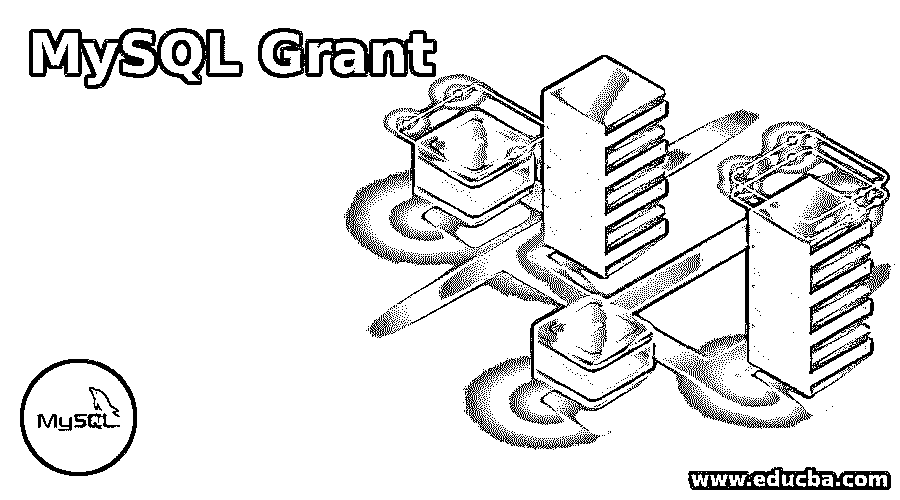
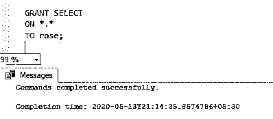
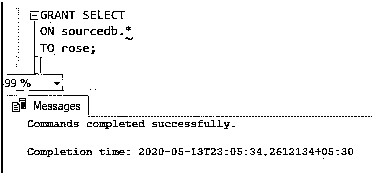
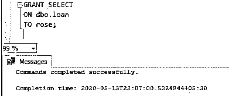
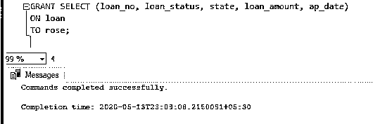
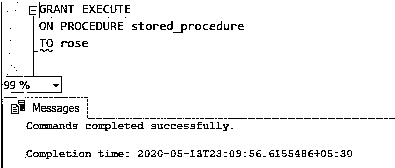
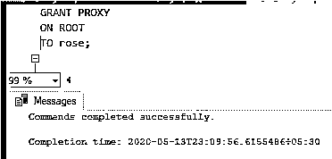

# MySQL 授权

> 原文：<https://www.educba.com/mysql-grant/>

## MySQL Grant 简介

MySQL Grant 用于向用户帐户授予权限。首先，当我们创建一个新用户时，他没有任何特权，比如选择数据库和从表中查询数据。超级用户将授予用户选择、插入、更新等权限。通常，超级用户拥有所有特权。特权等级关闭了

*   全球的
*   数据库ˌ资料库
*   桌子
*   圆柱
*   存储程序
*   代理人

全局级权限适用于 MySQL 服务器中的所有数据库。我们用*。*在提到所有的语法中。数据库级权限用于应用数据库中的所有对象。我们必须在语法中指定数据库名称。表级特权适用于表中的所有列。我们在语法中指定了表名。列级特权是对表中指定的列授予特权。我们必须在语法中指定列名。存储级特权是将特权赋予存储过程和存储函数。代理级权限是允许一个用户代理另一个用户。在本节课中，让我们一起来看看这个例子的细节。

<small>Hadoop、数据科学、统计学&其他</small>

**语法:**

下面是语法:

`GRANT [privilege_1] [,privilege 2],..
ON privilege_item
TO user_name;`

### MySQL Grant 是如何工作的？

现在，让我们通过一个示例来看看每个权限级别:

#### 1.全局级别权限

**代码:**

`GRANT privilege / * - - - - -  global Level privilege - - - - * /
ON *.*
TO user_name;`

**解释:**这里我们为 MySQL 服务器中的所有数据库提供 select 权限。全局权限级别适用于 MySQL 服务器中的所有数据库。我们用*。*在提到所有的语法中。

#### 2.数据库级权限

**代码:**

`GRANT privilege/ * - - - - -  database Level privilege - - - - * /
ON database_name.*
TO user_name;`

**解释:**这里我们为 MySQL 服务器中提到的数据库中的所有表提供 select 权限。数据库级权限用于应用数据库中的所有对象。我们必须在语法中指定数据库名称。

#### 3.表级权限

**代码:**

`GRANT privilege/ * - - - - -  table Level privilege - - - - * /
ON database_name.table_name
TO user_name;`

**解释:**在这里，我们为 MySQL 服务器中提到的数据库中的表提供 select 权限。表级特权适用于表中的所有列。我们在语法中指定了表名。

#### 4.列级权限

**代码:**

`GRANT privilege_1 (col1, col2, . . , coln)/ * - - - - -  column Level privilege - - - - * /
ON table_name
TO user_name;`

**解释:**这里我们为 MySQL 服务器中提到的表中的所有列提供 select 权限。列级特权是对表中指定的列授予特权。我们必须在语法中指定列名。

#### 5.存储级特权

**代码:**

`GRANT privilege/ * - - - - -  stored Level privilege - - - - * /
ON PROCEDURE procedure_name
TO user_name;`

**解释:**这里我们为 MySQL 服务器中提到的存储过程或存储函数提供执行特权。存储级特权是将特权赋予存储过程和存储函数。

#### 6.代理级别权限

**代码:**

`GRANT PROXY / * - - - - -  Proxy Level privilege - - - - * /
ON ROOT
TO user_name;`

**解释:**这里我们为提到的用户提供 MySQL 服务器中提到的 ROOT 的代理权限。代理级权限允许一个用户代理另一个用户

### 实现 MySQL 授权的示例

如上面会话中提到的特权语法。现在，让我们通过一个示例来看看每个权限级别:

#### 1.全局级别权限

**代码:**

`GRANT SELECT/ * - - - - -  global Level privilege - - - - * /
ON *.*
TO rose;`

**输出:**

**解释:**这里我们为用户“rose”提供了访问所有数据库的“Select”权限。

#### 2.数据库级权限

**代码:**

`GRANT SELECT/ * - - - - -  database Level privilege - - - - * /
ON sourcedb.*
TO rose;`

**输出:**

**解释:**这里的“sourcedb”是数据库，我们为用户“rose”提供对上述数据库的“select”权限。

#### 3.表级权限

**代码:**

`GRANT SELECT/ * - - - - -  table Level privilege - - - - * /
ON dbo.loan
TO rose;`

**输出:**

**解释:**这里的“dbo”在数据库中，我们为用户“rose”提供了对上述数据库中“loan”表的“select”权限。

#### 4.列级权限

**代码:**

`GRANT SELECT (loan_no, loan_status, state, loan_amount, ap_date)/ * - - - - -  column Level privilege - - - - * /
ON loan
TO rose;`

**输出:**

**说明:**这里的 loan_no、loan_status、state、loan_amount、ap_date 是我们为用户“rose”提供“select”权限的表 loan 的列名。

#### 5.存储级特权

**代码:**

`GRANT EXECUTE/ * - - - - -  stored Level privilege - - - - * /
ON PROCEDURE stored_procedure
TOrose;`

**输出:**

**说明:**这里我们为用户 rose 提供存储过程名“stored_procedure”的执行权限。

#### 6.代理级别权限

**代码:**

`GRANT PROXY/ * - - - - -  Proxy Level privilege - - - - * /
ON ROOT
TO rose;`

**输出:**

**解释:**这里我们为提到的用户提供 MySQL 服务器中提到的 ROOT 的代理权限。

### 推荐文章

这是一个 MySQL 格兰特指南。这里我们讨论 MySQL Grant 的介绍，语法，它是如何工作的，以及代码和输出的例子。您也可以浏览我们的其他相关文章，了解更多信息——

1.  [MySQL 触发器](https://www.educba.com/mysql-trigger/)
2.  [什么是 MySQL？](https://www.educba.com/what-is-mysql/)
3.  [备忘单 MySQL](https://www.educba.com/cheat-sheet-mysql/)
4.  [SQL 的使用](https://www.educba.com/uses-of-sql/)

