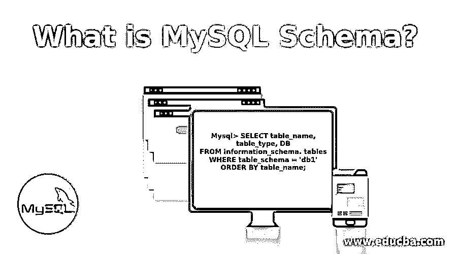

# 什么是 MySQL 模式？

> 原文：<https://www.educba.com/what-is-a-mysql-schema/>

## MySQL 模式介绍

MySQL 是一个开源数据库，目前由 Oracle 拥有。MySQL 将所有内容存储在表结构中，并使用结构查询语言从表中访问数据。在这里，我们将探索 MySQL 模式及其工作概念。它是数据库存储数据的逻辑结构。模式是包含行和列的表的集合，可以像数据库一样为模式编写单独的查询。实际上，schema 在 MySQL 中意味着一个模板。它们定义了信息的大小、类型和分组。模式有数据库对象，如视图、表和特权。模式包括数据类型、函数和运算符。它们用于业务分析，确定特性以及如何使用关系数据库和信息模式在新的数据集合中实现。

### 了解 MySQL 模式

MySQL 通过集成同一表中的行和值以及适当的数据类型，利用模式来定义数据库结构。它们利用索引在整个表中查找相关的行。有必要为特定的查询设计模式，因为良好的逻辑和物理设计是运行高性能查询的基础。模式对象在包括触发器、检查约束和外键的模式中扮演着重要的角色。模式迁移主要包括以下方面，如数据库、表、模式对象所有者、将 MySQL 映射到其他数据库。通过模式同步，您将能够创建项目文件并部署模式和脚本。

<small>Hadoop、数据科学、统计学&其他</small>

### MySQL 模式的解释

他们有多个主人。MySQL 检查默认模式，即信息模式、性能模式和系统模式。信息模式提供对元数据的访问，存储关于其他数据库的信息。这里的表存储在内存存储引擎中。您有一个性能 MySQL 模式，它充当存储引擎，对模式数据库下的一个表进行操作。性能模式在 MySQL 数据库服务器中收集准确的数据。配置由三个主要角色完成，即参与者、工具和允许收集统计数据。Sys 是一个帮助收集性能模式数据的对象。我们有一个 MySQL 模式设计，可以帮助分析和调整查询优化。模式中的适当设计需要实体、关系和可伸缩性。

### 它是如何工作的？

要使用 MySQL 数据库，第一步是创建一个模式。下面的命令显示了它的创建。

**创作:**

创建模式非常简单，就像创建数据库一样。

`Create a schema name;`

**要显示可用模式列表，下面的命令是:**

`my SQL Show schemas;`

**MySQL 数据库表:**

`MySQL desc table name;`

查看数据库中表的模式的另一个查询:

`mysql use database name; (to work in the database)`

`MySQL uses schema table name;`
(显示 MySQL 表的模式)这些表是读取模式。

**在模式中创建一个表:**

`MySQL CREATE table ‘inventory’. ‘users’ (field values and datatypes);`

**删除元数据:**

`mysql information_schema.TablenameNOTIN (‘Information_schema’,’MySQL’,’performance_schema’);`

**搜索模式:**

在 MySQL 中查找包含特定[表的数据库。](https://www.educba.com/table-in-mysql/)

`Select table schema as the database name
from information_schema. tables
where table_type=’base table’
and table name=’ library’
order by table_schema;`

**模式统计:**

`select table_schema as ‘database’,
count (*) as ‘tables’
from information_schema. tables where table_type =’Base Table’ group by Table_schema;`

**查找姓名中的数字:**

包括 r，如['0-9']

**按名称长度列出列:**

`include in table_schema the keyword order by char_length (col. column_name).`

如果两个数据库中的一个表具有相同的模式:请包含 Union 关键字来连接它们:

选择 db1…

联盟

选择 db2…

**访问权限:**

`Select grant, privilege_type from information_schema. schema_privileges where table_schema=’ library’;`

**备份–副本:**

为了创建模式或数据库的备份副本，使用了 MySQL dump。转储所有的表结构。

`MySQL dump -d-u username -p database name
where -d says no data, -u says username, -p says the password is applied.
Extracting specific table with only schemas:
MySQL dump -u username -h server -p <database name> <tablename> schema.sql`

### MySQL Schema 的需求是什么？

数据库拥有这些模式来存储对象。它们是数据库中的独立实体。对模式的需求是它们用适当的安全权限保护数据库。由数据库创建的适当对象可以在创建的模式之间移动。它们提供了控制良好访问的特权。使用模式的另一个好处是多个用户和数据库用户共享同一个模式。由于数据库对象配备了逻辑组，表的完整性得到了很好的维护。由于这些作为对象投影工具的有效模式，用户权限处于适当的级别。

### 不同类型

我们来看看下面给出的各种类型。

#### 1.MySQL 工作台

这是一个用于可视化设计模式的工作编辑工具。他们用图形方式创建了一个数据库模型。我的数据库模式是默认创建的。它是一个开源的 RDBMS 平台。您可以浏览服务器状态、数据导入和导出。您将看到数据库中实现所需的各种模式对象。它们提供数据建模、服务器管理、SQL 开发等功能。

#### 2.MySQL 中的信息模式

也称为数据字典，可以用作数据库中所有表、视图、函数和过程的信息源。它们只有视图，没有表，所以不需要与它们相关联的文件。要从信息模式中检索，所需的查询是:

`Mysql> SELECT table_name, table_type, DB
FROM information_schema. tables
WHERE table_schema = 'db1'
ORDER BY table_name;`

### 结论

上面的文章详细讨论了 MySQL 模式过程。它还陈述了它们所处理的模式的基础和类型。使用 MySQL 数据库的第一步是创建一个定义良好的模式。根据最近的观察，我们知道 SQL 数据库在市场上处于主要领先地位，因为它拥有 60%的不断增长的需求。流行趋势是对他们的数据库引擎。它的最新版本在 web 应用程序中成为一个流行的数据库。

### 推荐文章

这是什么是 MySQL 模式的指南？.这里我们讨论了 MySQL 模式的概念、类型、需求、理解和使用。您也可以浏览我们推荐的其他文章，了解更多信息——

1.  [MySQL 关系数据库](https://www.educba.com/mysql-relational-database/)
2.  [MySQL 面试问题](https://www.educba.com/mysql-interview-questions/)
3.  [什么是微软 Power BI？](https://www.educba.com/what-is-power-bi/)
4.  [层次数据库模型](https://www.educba.com/hierarchical-database-model/)

