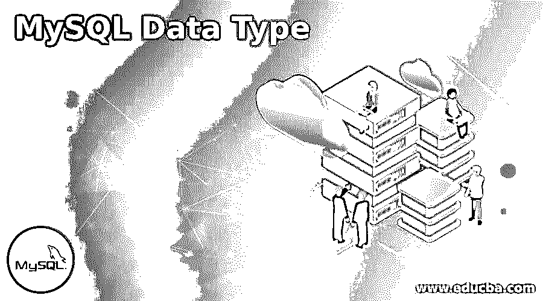
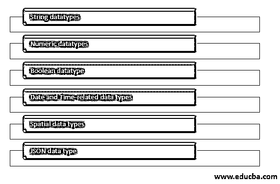

# MySQL 数据类型

> 原文：<https://www.educba.com/mysql-data-type/>

## MySQL 数据类型介绍

在处理任何关系数据库时，都需要使用表来存储数据。这些表可以包含多列来存储每条记录的字段数。一行对应于该表的一条记录。当您在创建表时定义要存储在表中的字段时，您需要指定列的名称和相应的数据类型以及其他约束和属性(如果有的话)。在设计表及其列时，数据类型起着至关重要的作用。您需要考虑列的用途、将在其中存储什么类型的值、将存储的值的范围以及每列数据需要存储的格式。所有这些都是由表中每一列使用的数据类型定义的。在本文中，我们将了解 MySQL 中可用的数据类型、它们的范围和其他细节，并讨论它们的用法和用途。

### MySQL 中数据类型的特征

MySQL 提供了除数字和字符串类型之外的许多数据类型来存储列中的值。这些数据类型可用于指定列的行为以及允许存储在其中的值的类型。MySQL 中的数据类型与多个特征相关联，定义如下:

<small>Hadoop、数据科学、统计学&其他</small>

将在声明的列中存储和表示的值的类型。

该数据类型对存储的内存空间要求，并定义该列中的值是可变长度还是固定长度。

该数据类型的列值是否可用于索引。

将该数据类型值与 MySQL 中的其他值进行比较。

### MySQL 数据类型

Mysql 提供了各种数据类型，这些数据类型根据存储在该数据类型列中的值的种类进一步分组。数据类型可以大致分为以下几组:

我们将以列表方式讨论和查看每个组下的数据类型，该列表方式将包含所有数据类型的名称。在此之前，让我们先简单了解一下一些最常用的数据类型，以及它们的取值范围和存储内容的种类。

| **数据类型名称** | **范围** | **存储的数据种类** |
| 可变长字符串 | (0 – 255) | 线 |
| 茶 | (0 – 255) | 线 |
| （同 Internationalorganizations）国际组织 | (-2147483648 转 214748- 3647) | 整数 |
| TINYINT | (-128 到 127) | 整数 |
| 中位 | (-8388608 转 8388607) | 整数 |
| 比吉斯本 | (-9223372036854775808 转 9223372036854775807) | 整数 |
| 斯莫列特 | (-32768 到 32767) | 整数 |
| 文本 | 0 – 65535 | 线 |
| 两倍 | (24 至 53 位数) | 小数 |
| 一滴 | (0 – 65535) | 线 |
| 小数 | (24 至 53 位数) | 双精度值，但以字符串格式存储 |
| 布尔型 | One | TINYINT |
| 日期时间 |  | YYYY-MM-DD HH:MM: SS |
| 时间 |  | 时:分:秒 |
| 日期 |  | 年-月-日 |
| 枚举 |  | 可以存储一个已定义的选项值 |
| 设置 |  | 可以存储已定义的值选项的选定值 |

#### 1.字符串数据类型

我们可以像存储其他媒体文件的图像一样存储二进制数据，甚至可以在 MySQL 中存储字符串数据类型值。此外，MySQL 为使用正则表达式搜索字符串值提供了不同的功能，比如帮助使用和操作字符串值的运算符或全文搜索。

以下列表包含所有有助于存储字符串值的可用数据类型:

*   文本
*   长文本
*   中文字
*   TINYTEXT
*   一滴
*   中庸之道
*   TINYBLOB
*   肺部出血
*   茶
*   可变长字符串
*   枚举
*   设置
*   二进制的
*   VARBINARY

#### 2.数字数据类型

我们可以在 MySQL 中存储不同范围和格式的数值。可以使用 MySQL 数字数据类型存储精确和近似的数值。除此之外，MySQL 还提供了使用 bit 数据类型存储位值的功能。

下面的列表包含了 MySQL 中所有可用的数字数据类型。

*   （同 Internationalorganizations）国际组织
*   斯莫列特
*   比吉斯本
*   中位
*   TINYINT
*   漂浮物
*   小数
*   两倍
*   少量

#### 3.布尔数据类型

Mysql 不提供存储布尔值的专用数据类型。然而，每当在 MySQL 中创建一个名为 BOOLEAN 或 BOOL 的数据类型时，它都被 MySQL 内部解释为 TINYINT(1)数据类型。

#### 4.日期和时间数据类型

我们可以在 MySQL 中单独存储日期和时间，也可以一起存储。时间戳还可以用来存储和跟踪对表中各行的更改。除此之外，如果您只想存储一年，那么您可以使用 year 数据类型。

下面的列表包含了 MySQL 中所有与日期和时间相关的数据类型。

*   日期时间
*   日期
*   时间
*   年
*   时间戳

#### 5.空间数据类型

MySQL 为我们提供了以各种数据类型存储几何和地理值的工具。

以下列表包含了 MySQL 中所有可用的空间数据类型。

*   几何学
*   多点
*   要点
*   多重多边形
*   LINESTRING
*   几何图形集合
*   多重字符串
*   多边形

#### 6.JSON 数据类型

Mysql 版本 5.7.8 进一步支持存储 JSON 数据类型，以便轻松有效地存储和操作 JSON 文档。当在 MySQL 中将列声明为 JSON 数据类型时，会自动对 JSON 文档进行验证。这种数据类型提供了 JJSON 文档的最佳存储，可以有效地处理和存储。

### 结论

MySQL 附带了多种数据类型，可用于声明值的类型、格式、性质、所需的存储空间和比较基础。在 MySQL 中，不同的数据类型根据存储在这些列中的值的种类进行分组。应该使用哪种数据类型来存储表中各列的值取决于上述所有因素。在确定要分配给列的数据类型时，应该考虑值的类型以及值可以扩展的范围。

### 推荐文章

这是 MySQL 数据类型的指南。在这里我们详细讨论一下 MySQL 的数据类型、特征和 6 种不同类型的介绍。您也可以浏览我们的其他相关文章，了解更多信息——

1.  [MySQL BIN()](https://www.educba.com/mysql-bin/)
2.  [SQL 中的元数据](https://www.educba.com/metadata-in-sql/)
3.  [MySQL INSTR()](https://www.educba.com/mysql-instr/)
4.  [MySQL WHILE 循环](https://www.educba.com/mysql-while-loop/)

