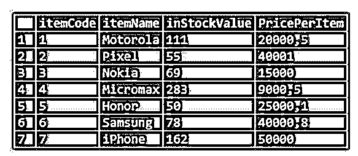
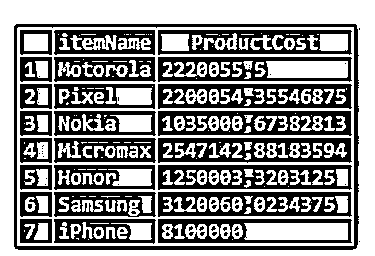
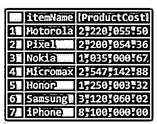
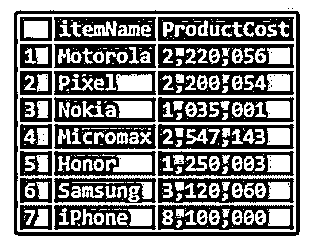
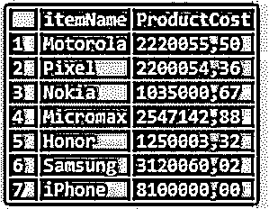
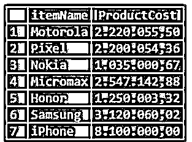

# MySQL 格式

> 原文：<https://www.educba.com/mysql-format/>

## MySQL 格式介绍

下面的文章提供了 MySQL 格式的概要。FORMAT 函数用于将表格中的数值格式化为任意所需的小数点。假设表格列具有不同的小数点，一列四舍五入到 2 位，另一列四舍五入到 4 位。在结果输出中，我们必须得到这两列的乘积。在这种情况下，输出可以有不同的小数位数。每一行都有不同的小数点，这可能会造成很大的歧义。因此，在结果选择查询中，我们可以直接使用 FORMAT 函数并指定输出应该四舍五入到多少个小数点。这在输出变量不是预定义变量的情况下是有效的。

### MySQL 格式的语法

FORMAT 函数用于格式化输出中的任何数值。

<small>Hadoop、数据科学、统计学&其他</small>

该函数语法如下:

`FORMAT (column_name, decimal_points)`

这里，column_name 是要舍入的字段，decimal_points 是要舍入到多少位的值。

更详细地说，语法可以包括一个可选字段。

`FORMAT (column_name, decimal_points, locale)`

这里，字段 locale 指的是分隔符和分组。这是一个可选字段，没有明确定义，默认情况下使用 en_US 区域设置。MySQL 中定义了 100 多个地区。

### MySQL 中的 FORMAT 函数是如何工作的？

下面给出了 MySQL 中 FORMAT 函数的工作原理:

#### 示例#1

让我们将多位数的值格式化为两位。

**代码:**

`SELECT FORMAT(1500.26543,2) value;`

该查询要求将值 1500.26543 四舍五入到 2 位，而不是 5 位小数。希望您熟悉四舍五入的原则，以便考虑大于 5 和小于 5 的值。所以在这里，期望输出是 1500.27(因为小数点后第三位是 5)。

**输出:**

#### 实施例 2

让我们看看下面的另一个例子。

**代码:**

`SELECT FORMAT(1500.26111,2) value;`

所以在这里，小数点后的第三位数字小于 5，因此预期的输出是 1500.26。

**输出:**

#### 实施例 3

FORMAT 函数还会添加额外的零来扩展小数位数。

**代码:**

`SELECT FORMAT(1500.2,2) value;`

该值为 1500.2，只有一位小数。但结果是有 2 个小数位。因此，这个查询会附加一个额外的零。

**输出:**

#### 实施例 4

现在让我们考虑一个库存表，它的数据是库存商品的数量和每件商品的单价。这种情况下的结果输出是总库存值，它是库存中每件商品的单位数量和单位价格的乘积。

让我们考虑下表:

**代码:**

`select * from inventory;`

**输出:**

我们将首先看到不使用 FORMAT 函数的结果。

**代码:**

`SELECT itemName, instockValue * PricePerItem ProductCost FROM inventory;`

结果输出将显示 itemName 和 ProductCost 列，其中 ProductCost 列是 inStockValue 和 PricePerItem 的乘积。

**输出:**

所以，输出会像这样。这看起来很笨拙，也很不合适。

我们现在可以使用 FORMAT 函数来检索更好看的输出。

**代码:**

`SELECT itemName, FORMAT (instockValue * PricePerItem, 2) ProductCost
FROM inventory;`

在这种情况下，我们已经指定了要四舍五入到 2 的小数位数。

**输出:**

如果我们比较这个查询和前一个查询的输出，我们可以理解最新的输出更加清晰。

我们也可以将小数四舍五入为零。

**代码:**

`SELECT itemName, FORMAT (instockValue * PricePerItem, 0) ProductCost
FROM inventory;`

**输出:**

这里，输出四舍五入到零个小数位。我们可以将小数位数指定为 0，或者如果我们将其留空，则考虑默认值为 0。

#### 实施例 5

我们谈到了在格式查询中使用 locale。默认情况下，区域设置是 en_US。让我们尝试一下其他语言环境，找出不同之处。

我们将看到两个地区的例子。

形容词（adjective 的缩写）该查询将西班牙的输出更新为西班牙语。

**代码:**

`SELECT itemName, FORMAT (instockValue * PricePerItem, 2, 'es_ES') ProductCost
FROM inventory;`

**输出:**

b.小数点用逗号“，”代替了点“.”在这个地方。而且这种格式也没有千人分组。

让我们试试另一个地方

**代码:**

`SELECT itemName, FORMAT (instockValue * PricePerItem, 2, 'de_DE') ProductCost
FROM inventory;`

**输出:**

在此区域设置中，逗号(，)用作小数点和点(。)来组千。这与默认区域设置 en_EN 相反。

### 结论

在本文中，我们看到了 FORMAT 函数的语法和示例。格式功能用于以所需格式显示输出，并定义适当的小数位数。这在 SELECT 查询中使用，语法包括要格式化的数字、小数位数，还可以选择指定区域设置。需要注意的重要一点是，值的数据类型是十进制。因为在 INT 数据类型中，小数位数已经无效。默认的区域设置值是 en_EN。

### 推荐文章

这是一个 MySQL 格式的指南。在这里，我们将讨论 MySQL 中的格式函数是如何工作的。分别是。您也可以看看以下文章，了解更多信息–

1.  [MySQL 索引](https://www.educba.com/mysql-index/)
2.  [MySQL DECODE()](https://www.educba.com/mysql-decode/)
3.  [MySQL 日期函数](https://www.educba.com/mysql-date-functions/)
4.  [MySQL 布尔型](https://www.educba.com/mysql-boolean/)

