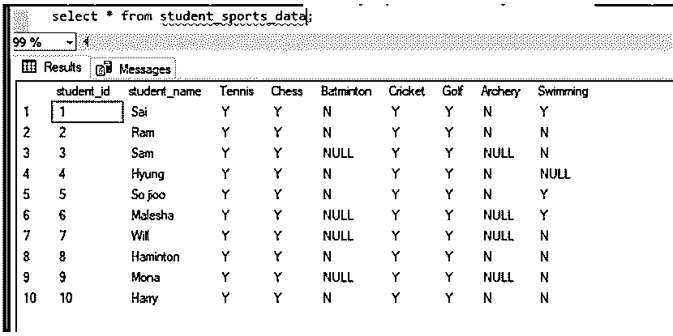
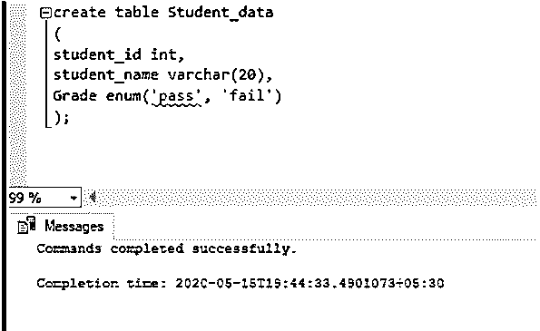
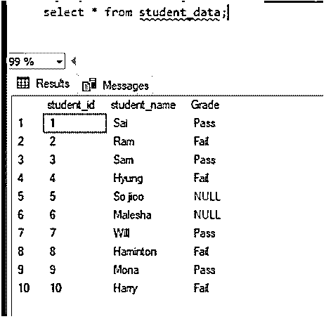

# MySQL 枚举

> 原文：<https://www.educba.com/mysql-enum/>

## MySQL ENUM 简介

枚举是 MySQL 中的一种数据类型。被称为 ENUM 数据类型的列是一个只能有一个值的 String 对象，该值是从提到的值列表中选择的。我们最多可以列出 65535 个值。如果插入列表中没有的值，将插入一个空值。

在本节中，我们将学习带有语法的枚举数据类型以及语法:–

<small>Hadoop、数据科学、统计学&其他</small>

**语法:**

让我们看看如何创建 ENUM 数据类型的列的语法:–

`create table<table_name>
(
Column_name1 ENUM(value1, value2,..),/ * - - -  ENUM Data type column - - - * /
Column_name2 ENUM(value1, value2,..),/ * - - -  ENUM Data type column - - - * /
.
.
.
);`

这里“列名 1”和“列名 2”的值是指定列表中的一个。

**优势:**

*   MySQL ENUM 使用数字索引(1，2，3，..)表示字符串值，因此它具有紧凑的数据存储。
*   它有可读的查询，这使它成为可读的查询和输出。

### MySQL ENUM 是如何工作的？

让我们看看 ENUM 通常定义在 MySQL 的什么地方。如果我们检查所有用户的列表，用户表中定义的列大多被定义为 ENUM 数据类型。下面是几个相同的栏目。

| **字段** | **类型** | **NULL** | **键** | **默认** |
| 选择特权 | 枚举(' N '，' Y ') | 不 |  | 英语字母表中第十四个字母 |
| 插入 _ 权限 | 枚举(' N '，' Y ') | 不 |  | 英语字母表中第十四个字母 |
| 更新 _ 权限 | 枚举(' N '，' Y ') | 不 |  | 英语字母表中第十四个字母 |
| 删除 _ 权限 | 枚举(' N '，' Y ') | 不 |  | 英语字母表中第十四个字母 |
| 创建权限 | 枚举(' N '，' Y ') | 不 |  | 英语字母表中第十四个字母 |
| 丢弃特权 | 枚举(' N '，' Y ') | 不 |  | 英语字母表中第十四个字母 |
| 重载 _ 权限 | 枚举(' N '，' Y ') | 不 |  | 英语字母表中第十四个字母 |
| 关机 _ 权限 | 枚举(' N '，' Y ') | 不 |  | 英语字母表中第十四个字母 |
| 进程 _ 权限 | 枚举(' N '，' Y ') | 不 |  | 英语字母表中第十四个字母 |
| 文件 _ 权限 | 枚举(' N '，' Y ') | 不 |  | 英语字母表中第十四个字母 |
| 授予特权 | 枚举(' N '，' Y ') | 不 |  | 英语字母表中第十四个字母 |
| 引用 _ 权限 | 枚举(' N '，' Y ') | 不 |  | 英语字母表中第十四个字母 |
| 索引 _ 权限 | 枚举(' N '，' Y ') | 不 |  | 英语字母表中第十四个字母 |
| Alter_priv | 枚举(' N '，' Y ') | 不 |  | 英语字母表中第十四个字母 |
| 显示数据库权限 | 枚举(' N '，' Y ') | 不 |  | 英语字母表中第十四个字母 |
| 超级特权 | 枚举(' N '，' Y ') | 不 |  | 英语字母表中第十四个字母 |
| 创建临时表权限 | 枚举(' N '，' Y ') | 不 |  | 英语字母表中第十四个字母 |
| 锁 _ 表 _ 权限 | 枚举(' N '，' Y ') | 不 |  | 英语字母表中第十四个字母 |
| 执行 _ 权限 | 枚举(' N '，' Y ') | 不 |  | 英语字母表中第十四个字母 |
| Repl_slave_priv | 枚举(' N '，' Y ') | 不 |  | 英语字母表中第十四个字母 |
| 回复客户端权限 | 枚举(' N '，' Y ') | 不 |  | 英语字母表中第十四个字母 |
| 创建视图权限 | 枚举(' N '，' Y ') | 不 |  | 英语字母表中第十四个字母 |
| 显示视图权限 | 枚举(' N '，' Y ') | 不 |  | 英语字母表中第十四个字母 |
| 创建例程特权 | 枚举(' N '，' Y ') | 不 |  | 英语字母表中第十四个字母 |
| 变更例行程序特权 | 枚举(' N '，' Y ') | 不 |  | 英语字母表中第十四个字母 |
| 创建用户权限 | 枚举(' N '，' Y ') | 不 |  | 英语字母表中第十四个字母 |
| 事件 _ 权限 | 枚举(' N '，' Y ') | 不 |  | 英语字母表中第十四个字母 |
| 触发器 _ 权限 | 枚举(' N '，' Y ') | 不 |  | 英语字母表中第十四个字母 |
| 创建表空间特权 | 枚举(' N '，' Y ') | 不 |  | 英语字母表中第十四个字母 |
| ssl_type | 枚举("，'任何'，' X509 '，'指定') | 不 |  |  |

让我们考虑一个简单的例子

表格创建:–

`create table Student_Sports_data
(
student_id int,
student_name varchar(20),
Tennis enum('Y','N'),/*---  ENUM Datatypecolumn---*/
Chess enum('Y','N'), /*---  ENUM Datatypecolumn---*/
Batminton enum('Y','N'),/*---  ENUM Datatypecolumn---*/
Cricket enum('Y','N'),/*---  ENUM Datatypecolumn---*/
Golf enum('Y','N'),/*---  ENUM Datatypecolumn---*/
Archery enum('Y','N'),/*---  ENUM Datatypecolumn---*/
Swimming enum('Y','N')/*---  ENUM Datatypecolumn---*/
);`

相同的截图:–

让我们将数据插入表中:–

`insert into student_sports_data values(1,'Sai','Y','Y','N','Y','Y','N','Y');
insert into student_sports_data values(2,'Ram','Y','Y','N','Y','Y','N','N');
insert into student_sports_data values(3,'Sam','Y','Y','NO','Y','Y','NO','N');
insert into student_sports_data values(4,'Hyung','Y','Y','N','Y','Y','N','NO');
insert into student_sports_data values(5,'So jioo','Y','Y','N','Y','Y','N','Y');
insert into student_sports_data values(6,'Malesha','Y','Y','No','Y','Y','NO','Y');
insert into student_sports_data values(7,'Will','Y','Y','NO','Y','Y','NO','N');
insert into student_sports_data values(8,'Haminton','Y','Y','N','Y','Y','N','N');
insert into student_sports_data values(9,'Mona','Y','Y','NO','Y','Y','YES','N');
insert into student_sports_data values(10,'Harry','Y','Y','N','Y','Y','N','N');`

从表中选择项目:–此处插入的除“Y”和“N”以外的值表示为空。

`select * from student_sports_data;`

**输出:**

### MySQL 枚举示例

让我们考虑下面的另一个例子，并检查 ENUM 的工作情况。

表格创建:

`create table Student_data
(
student_id int,
student_name varchar(20),
Grade enum('pass','fail') / * - - -  ENUM Data type column - - - * /
);`

相同的截图:–

让我们将数据插入表中:–

`insert into student_data values(1,'Sai','Pass');
insert into student_data values(2,'Ram','Fail');
insert into student_data values(3,'Sam','Pass');
insert into student_data values(4,'Hyung','Fail');
insert into student_data values(5,'So jioo','No');
insert into student_data values(6,'Malesha','No');
insert into student_data values(7,'Will','Pass');
insert into student_data values(8,'Haminton','Fail');
insert into student_data values(9,'Mona','Pass');
insert into student_data values(10,'Harry','Fail');`

在上面的插入中，我们可以看到，我们插入到表中的“等级”列中有两行值是除“通过”和“未通过”之外的值。因此该值将为空。

`select * from student_data;`

**Output:**

### 推荐文章

这是一个 MySQL ENUM 的指南。在这里，我们还将讨论 mysql enum 的简介和工作原理。以及一个示例及其代码实现。您也可以看看以下文章，了解更多信息–

1.  [MySQL 拥有](https://www.educba.com/mysql-having/)
2.  [MySQL BLOB](https://www.educba.com/mysql-blob/)
3.  [MySQL today()](https://www.educba.com/mysql-today/)
4.  [MySQL 插入忽略](https://www.educba.com/mysql-insert-ignore/)

