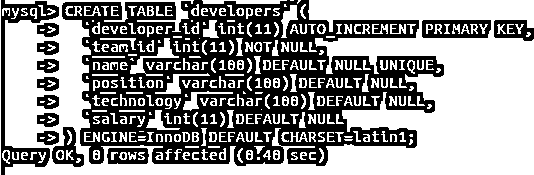
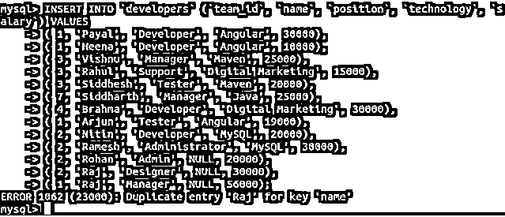
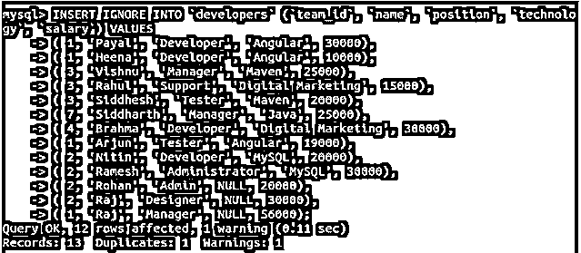
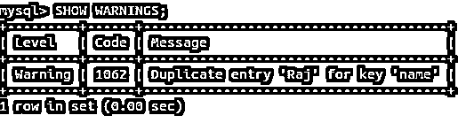
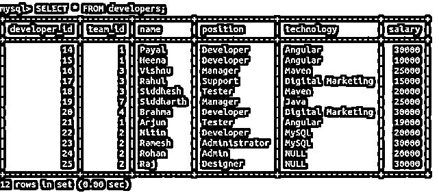
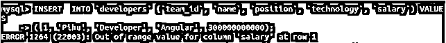
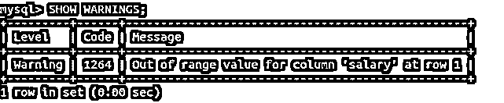
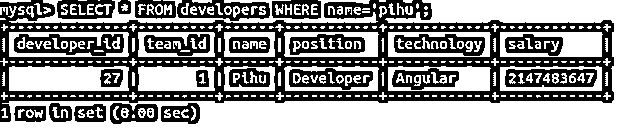

# MySQL 插入忽略

> 原文：<https://www.educba.com/mysql-insert-ignore/>

## MySQL 简介插入忽略

当我们想要将数据插入到 MySQL 数据库的表中时，我们使用 insert 语句来执行这个操作。Mysql 提供了在 INSERT 语句的语法中添加 IGNORE 关键字的功能。使用 INSERT IGNORE 语句始终被认为是优于 INSERT 语句的一种良好做法。这是因为 INSERT IGNORE 语句处理添加重复记录时出现的错误，并防止 Mysql 表中记录的不一致和冗余。

在本文中，我们将了解 INSERT IGNORE 语句的一般语法、工作原理、严格模式如何影响 INSERT IGNORE 语句的工作，并通过几个例子来学习用法，使概念更加清晰。

<small>Hadoop、数据科学、统计学&其他</small>

### 插入忽略在 MySQL 中是如何工作的？

当我们尝试使用 insert 语句在 MySQL 数据库的特定表中插入多条记录时，由于某种原因会出现错误，Mysql 将终止查询的执行并给出错误，而不会在我们尝试插入的表中插入任何行。但是当我们使用 INSERT IGNORE 而不是仅仅插入语句时，Mysql 会给出警告并插入所有正确的记录，留下并排除导致错误的行。

**语法**

INSERT IGNORE 语句的语法如下–

`INSERT IGNORE INTO table(list_of_columns)
VALUES(record1),
(record2),`

其中 list_of_columns 是要插入到记录中的列的逗号分隔名称，record1、record2、..您在 list_of_columns 中提到的列的值是否与它们在列表中的顺序相同。

### 实现 MySQL INSERT IGNORE 的示例

让我们创建一个名为 developers 的表，该表包含一个名为 id 的 auto_incremented 主键列、一个名为 name 的对其有唯一约束的列以及需要使用以下查询语句存储的其他相关字段

**代码:**

`CREATE TABLE `developers` (
`developer_id` int(11) AUTO_INCREMENT PRIMARY KEY,
`team_id` int(11) NOT NULL,
`name` varchar(100) DEFAULT NULL UNIQUE,
`position` varchar(100) DEFAULT NULL,
`technology` varchar(100) DEFAULT NULL,
`salary` int(11) DEFAULT NULL
) ENGINE=InnoDB DEFAULT CHARSET=latin1;`

**输出:**

现在，我们将尝试插入多个记录，这些记录具有针对 name 列重复的单个记录值，我们已经对该列定义了 unique 约束，以避免插入具有相同名称的记录。由于插入这样的记录是违反规则的，并且违反了约束，MySQL 将发出一个错误，指出不能插入具有 name 列的重复值的记录。在这种情况下，我们在插入查询中提到的所有其他列都是正确的，因为所有约束和限制都没有插入。我们可以尝试执行以下查询语句

**代码:**

`INSERT INTO `developers` (`team_id`, `name`, `position`, `technology`, `salary`) VALUES
( 1, 'Payal', 'Developer', 'Angular', 30000),
( 1, 'Heena', 'Developer', 'Angular', 10000),
( 3, 'Vishnu', 'Manager', 'Maven', 25000),
( 3, 'Rahul', 'Support', 'Digital Marketing', 15000),
( 3, 'Siddhesh', 'Tester', 'Maven', 20000),
( 7, 'Siddharth', 'Manager', 'Java', 25000),
( 4, 'Brahma', 'Developer', 'Digital Marketing', 30000),
( 1, 'Arjun', 'Tester', 'Angular', 19000),
( 2, 'Nitin', 'Developer', 'MySQL', 20000),
( 2, 'Ramesh', 'Administrator', 'MySQL', 30000),
( 2, 'Rohan', 'Admin', NULL, 20000),
( 2, 'Raj', 'Designer', NULL, 30000),
( 1, 'Raj', 'Manager', NULL, 56000);`

**输出:**

让我们使用下面的查询语句来检索开发人员表中的记录

**代码:**

`SELECT * FROM developers;`

**输出:**

我们可以看到，除了带有 Raj 名称的记录之外，没有任何记录被插入。现在让我们尝试使用 insert IGNORE 语句而不是 INSERT 语句来插入记录。我们的查询语句如下

**代码:**

`INSERT IGNORE INTO `developers` (`team_id`, `name`, `position`, `technology`, `salary`) VALUES
( 1, 'Payal', 'Developer', 'Angular', 30000),
( 1, 'Heena', 'Developer', 'Angular', 10000),
( 3, 'Vishnu', 'Manager', 'Maven', 25000),
( 3, 'Rahul', 'Support', 'Digital Marketing', 15000),
( 3, 'Siddhesh', 'Tester', 'Maven', 20000),
( 7, 'Siddharth', 'Manager', 'Java', 25000),
( 4, 'Brahma', 'Developer', 'Digital Marketing', 30000),
( 1, 'Arjun', 'Tester', 'Angular', 19000),
( 2, 'Nitin', 'Developer', 'MySQL', 20000),
( 2, 'Ramesh', 'Administrator', 'MySQL', 30000),
( 2, 'Rohan', 'Admin', NULL, 20000),
( 2, 'Raj', 'Designer', NULL, 30000),
( 1, 'Raj', 'Manager', NULL, 56000);`

**输出:**

我们可以看到有 12 行受到了影响，查询执行时出现了一个警告。要查看警告，我们可以执行以下命令

**代码:**

`SHOW WARNINGS;`

**输出:**

该警告显示，有一条名为 Raj 的记录在具有唯一约束的 name 列中有重复值。让我们检索 developers 表的记录，并使用以下查询检查插入了哪些记录

**代码:**

`SELECT * FROM developers;`

**输出:**

我们可以看到插入了 12 行，而实际上我们试图插入 13 行，但由于 Raj 记录被复制，所有剩余的行都成功插入。此外，请注意，developer id 的自动递增列从 14、15 等开始插入值，因为我们尝试仅使用 insert 查询插入的前 13 条记录导致了错误，然后所有正在插入的记录都被回滚，将与自动递增列关联的序列值更新为 14。

#### 超出列范围的值

当我们试图插入超过定义的列大小限制的值时，insert 语句会导致错误。但是，使用 INSERT IGNORE 会插入截断的值，并给出警告，指出超出了范围，因此插入的值已被截断。考虑下面的例子:

薪金列的长度为 11，我们尝试使用 INSERT 语句插入 12 位数字，得到以下输出

**代码:**

`INSERT INTO `developers` (`team_id`, `name`, `position`, `technology`, `salary`) VALUES
( 1, 'Pihu', 'Developer', 'Angular', 300000000000);`

**输出:**

让我们尝试使用 INSERT IGNORE 语句–

**代码:**

`INSERT IGNORE INTO `developers` (`team_id`, `name`, `position`, `technology`, `salary`) VALUES
( 1, 'Pihu', 'Developer', 'Angular', 300000000000);`

**输出:**

带警告–

**代码:**

`SHOW WARNINGS;`

**输出:**

让我们检索并检查插入的值–

**代码:**

`SELECT * FROM developers WHERE name='pihu';`

**输出:**

### 结论

使用 INSERT IGNORE 语句而不仅仅是插入语句始终是一个好的做法，因为 Mysql 会尝试调整值，以正确的格式排列它们，并插入正确的记录，排除可能导致错误的记录。

### 推荐文章

这是一个 MySQL 插入忽略指南。这里我们讨论一个 MySQL 插入忽略的介绍，语法，它是如何工作的例子。您也可以浏览我们的其他相关文章，了解更多信息——

1.  [MySQL count()](https://www.educba.com/mysql-count/)
2.  [在 MySQL 中选择](https://www.educba.com/select-in-mysql/)
3.  [MySQL 中的 ORDER BY](https://www.educba.com/order-by-in-mysql/)
4.  [MySQL 数据库修复](https://www.educba.com/mysql-database-repair/)

