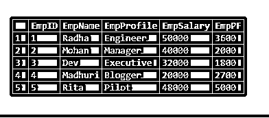
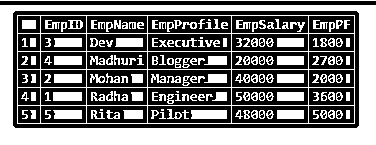

# MySQL 随机排序

> 原文：<https://www.educba.com/mysql-order-by-random/>

## MySQL 随机排序简介

MySQL ORDER BY Random 是一种 MySQL 技术，用于从特定 MySQL 数据库的表中随机查询数据记录。这个 MySQL 命令有助于用 ORDER BY 子句非系统地获取表行。例如，假设我们需要使用这个 MySQL ORDER BY Random 从表中选择以下记录:

*   博客中的一些随机帖子，并在特定的边栏中显示它们。
*   一个随机引用，用于呈现“当天的最新引用”，就像在小部件部分一样。
*   图库中的随机图像，并将它们实现为突出显示的图像。

基本上，在 MySQL 中，没有任何内置语句可以从数据库表中选择未计划的表行。因此，出于这个目的，我们将应用 MySQL RAND()函数。

<small>Hadoop、数据科学、统计学&其他</small>

**语法**

让我们来看看显示 ORDER BY RAND()函数的基本语法结构:

`SELECT * FROM TableName ORDER BY RAND() LIMIT1;`

以上语法查询的解释:

*   MySQL RAND()函数负责为每个表行产生一个随机值。
*   在这之后，ORDER BY 子句帮助按照 MySQL 中函数 RAND()产生的随机值或数字对所有表行进行排序。
*   接下来是 LIMIT 子句，它在一组随机排序的结果中选取初始的表行。

假设，如果您想从数据库的表中随机选择值为“n”的记录行，那么我们需要修改 LIMIT 子句的值，如下所示:

`SELECT * FROM TableName ORDER BY RAND() LIMIT N;`

### MySQL 中的 ORDER BY Random 是如何工作的？

*   MySQL 中的 ORDER BY RAND()技术从随机显示的数据库表中选择列值或记录。SELECT 语句用于查询这种技术。
*   我们将使用一个特定的函数 RAND()对 MySQL 中的查询获取的记录进行排序。特别是，我们可以在构建音乐播放器时使用这种方法来打乱歌曲列表，以便每个新的播放列表都是从数据库中的歌曲而不是以前的列表中生成的。
*   这种随机选择记录的过程对于拥有少量数据行的表非常有用。此外，对于查询执行和结果显示，它工作得很快。
*   但是，在大型表中使用时，这可能会降低 ORDER BY RAND()函数的执行速度。这是因为 MySQL 需要对整个表进行排序来找出随机值，这也很耗时。
*   因此，该命令查询的速度将取决于数据库表中可用的行数。因此，如果表包含更多的记录，那么在结果集中为每一行生成随机值就需要更多的时间。

### MySQL 随机排序的例子

我们将使用下面的例子来评估这个 MySQL 技术的演示:

#### 示例 1–使用 ORDER BY RAND()

让我们取一个名为 employee 的示例数据库表，它包含字段 EmpID、EmpName、EmpProfile、EmpSalary、EmpPF。

`select * from employees;`

假设我们将使用以下查询从该表中随机获取三个雇员行:

`SELECT EmpID, EmpName, EmpProfile FROM Employees ORDER BY RAND() LIMIT 3;`

**输出:**

我们可以看到，由于随机化的结果查询，提供的结果与一般的结果有些不同。

#### 示例 2–使用 ORDER BY RAND()和 INNER 子句

对于这个例子，我们需要演示表，它的字段有属性:主键和自动增量。此外，订单系列中不应有空白。

现在，在主键表列的基础上，我们编写了下面的查询来生成随机数行值:

`SELECT ROUND( RAND() * (SELECT MAX(Col_ID) FROM TableName)) AS Col_ID;`

使用上述查询提供的结果集，我们将如下连接该表:

`SELECT y.* FROM TableName AS y INNER JOIN
(SELECT ROUND( RAND() * (SELECT MAX(Col_ID) FROM TableName) ) AS Col_ID )
AS x WHERE y.Col_ID>= x.Col_ID LIMIT 1;`

应用这个过程，我们需要多次执行命令来随机获取多行。这是因为增加命令限制将只提供从随机选择的行开始的串行行。

`SELECT y.EmpID, y.EmpName FROM Employees AS y JOIN
(SELECT ROUND( RAND() * (SELECT MAX(EmpID) FROM Employees) ) AS EmpID)
AS x WHERE y.EmpID >= x.EmpID LIMIT 1;`

**输出:**

#### 示例 3–使用 ORDER BY RAND()使用子查询

使用前面的查询技术，我们可以应用子查询进行随机排序，并按升序或降序查看名称，如下所示:

`SELECT * FROM (SELECT * FROM Employees ORDER BY RAND() LIMIT 5)Empsub ORDER BY EmpName;`

**输出:**

#### 示例# 4–使用 ORDER BY RAND()使用变量

假设数据库表包括值落在范围 1 内的 id 列，..，n 并且不包含 gab。然后，我们需要遵循以下步骤:

首先，选择范围 1 内的随机数，..，n。

接下来，我们将根据随机数选择记录。为此，我们将使用下面的查询:

`SELECT TableName.* FROM (SELECT ROUND( RAND() * (SELECT MAX(Col_ID) FROM TableName) ) RandomVal, @val:=@val + 1 FROM (SELECT @val:=0)AS y , TableName LIMIT n )AS x, TableName AS a WHERE x.RandomVal = a.Col_ID;`

请记住，用户定义的变量是特定于连接的。这意味着前面的技术不能和连接池一起实现。为此，我们还必须确认指定表中具有主键的列字段的数据类型应该是整数。除此之外，表列值也应该在定义的系列中，没有任何 gab。

### 结论

MYSQL ORDER BY RAND()对于显示随机排序的结果至关重要。比如任何与文章、页面、链接等相关的信息。，我们希望按照从几个数据库中随机排序的顺序显示。

MySQL 中的这种技术非常重要，但是如果表中的表很大，那么应用于它的 ORDER BY RAND()生成结果将非常耗时。否则，对于记录较少的表，会给出更快的结果。

### 推荐文章

这是一个 MySQL 随机排序的指南。在这里，我们讨论如何在 MySQL 中通过随机作品和例子以及输出进行排序。您也可以看看以下文章，了解更多信息–

1.  [MySQL 唯一索引](https://www.educba.com/mysql-unique-index/)
2.  [MySQL REGEXP](https://www.educba.com/mysql-regexp/)
3.  [MySQL 中的自然连接](https://www.educba.com/natural-join-in-mysql/)
4.  [MySQL 索引](https://www.educba.com/mysql-index/)

