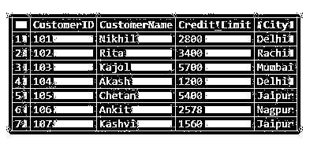
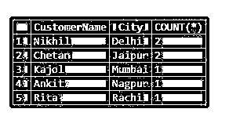
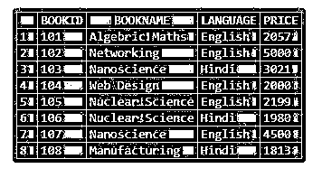
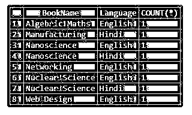

# MySQL 按计数分组

> 原文：<https://www.educba.com/mysql-group-by-count/>

## MySQL 分组计数简介

MySQL GROUP BY Count 是一个 MySQL 查询，它负责显示基于列值的行分组以及聚合函数计数。基本上，GROUP BY 子句使用表列值或任何表达式将行聚集成一种汇总表行。我们还用 MySQL 聚合函数实现了 GROUP BY 子句，以便用列中的一些计算值对行进行分组。这可能包括 MAX、MIN、COUNT、SUM 和 AVG，它与 SELECT 语句一起使用，提供有关结果集中每个组的信息。类似地，当我们将 COUNT()函数与这个 GROUP BY 子句一起应用时，它将显示表查询中每个指定分组行的计数。

### 句法

以下语法是在 MySQL 中使用 GROUP BY Count 子句进行查询的基本结构:

<small>Hadoop、数据科学、统计学&其他</small>

**代码:**

`SELECT Col_1, Col_2,…., Col_n,  AggregateFunction(Col_i) FROM TableName
WHERE Cond_Expr GROUP BY Col_1, Col_2,…, Col_n;`

**解释:**对于 SELECT 语句，GROUP BY 子句是一个选项，用于根据指定的列值提供分组的结果集。逗号分隔的列表:Col_1，Col_2，…，Col_n，表示要在结果集中提取的列值，其中一个将为聚合函数和 GROUP BY 子句定义，以编写适当的查询。这里，MySQL 将只在 SELECT、FROM 和 WHERE 子句之后计算 GROUP BY 子句，但是应该放在 ORDER BY、HAVING 和 LIMIT 子句之前。

### MySQL 中的 GROUP BY count 是如何工作的？

当我们需要一个结果集集合，其中包含具有相似值的行，并将其排列成子组类型时，GROUP BY 子句是必不可少的。它按查询中指定的列数据汇总行。在输出集中，MySQL GROUP BY 子句为每个已排列的组返回一行。这种方法有助于减少 MySQL 提供的结果集中的行数。通常，通过这个 GROUP BY 子句，我们添加了一些聚合函数，包括 COUNT、SUM、MIN、MAX 和 AVG，这些函数提供了通过在结果行中使用 GROUP BY 查询而形成的组的信息。

在 MySQL 中，聚合函数负责执行一组表行的计算并输出一个值。因此，这里的 COUNT()函数与 MySQL GROUP BY 子句一起使用来完成计算，然后它为形成的每个子组给出一个不同的值。如果希望显示带有 GROUP BY Count 子句中出现的唯一值的结果集，那么我们需要在查询中的 SELECT 子句之后和指定的列名之前使用 DISTINCT 运算符。举个例子，

`SELECT DISTINCT ColumnName FROM TableName;`

将 COUNT()函数与 GROUP BY 子句一起使用，则查询将生成值的数量，作为基于表列值或表达式创建的每个子组的计数。

### 通过计数实现 MySQL 分组的示例

让我们演示一些使用 MySQL 中的 GROUP BY 子句和 COUNT()函数的示例，以显示 GROUP BY Count 的工作方式:

#### 示例#1:对单个列使用 GROUP BY Count

**步骤 1:** 假设我们在数据库中有一个客户表，该表包含字段 CustomerID、CustomerName、Credit_Limit 和 City，其中有一些记录如下:

**代码:**

`SELECT * FROM Customer;`

**输出:**

**步骤 2:** 现在，我们将实现 MySQL GROUP BY COUNT，根据特定的列值查询形成组的数据，每个组都有自己的计数，用于在组中找到的相同值。使用以下命令在结果集行中执行此信息的 SQL 语句。

**代码:**

`SELECT CustomerName, City, COUNT(*) FROM Customer GROUP BY City;`

**输出:**

**解释:**您可以看到，结果行是按城市列分组的，每个分组的值都包含该值的计数，行是按该值排列的。因此，MySQL 为每个分组的城市名称返回了表中可用的客户数量。由于对列值进行了分组，对 Customer 表执行的 group 操作显示了简化形式的输出行。

#### 示例 2:在多个列上使用 GROUP BY Count

**步骤 1:** 让我们取 MySQL 数据库中另一个名为 Books 的表。该表包含 BookID、图书名称、语言和价格等字段。为了查看表的内容，我们将执行下面的查询

**代码:**

`SELECT * FROM Books;`

**输出:**

**步骤 2:** 在这里，我们有一个语言列，其值为“英语”或“印地语”,同样，我们也可以根据英语媒介和印地语版本找到图书名称。然后，我们将编写一个查询来对表中的列进行分组，并在其中实现 count 函数。SQL 语句如下所示:

**代码:**

`SELECT BookName, Language, COUNT(*) FROM Books GROUP BY BookName, Language;`

**输出:**

**解释:**如您所见，结果行使用 GROUP BY 操作基于多列、图书名称和语言进行分组，下一列是计数，表示表中每个组数据可用的图书值。

#### 示例#3:在 ORDER BY 子句中使用 GROUP BY Count

在这个示例中，我们将采用前面名为 Books 的表。在此查询中，除了 GROUP BY COUNT 子句，我们还将使用 ORDER BY 子句来更正确地评估语句。MySQL 中的 ORDER BY 子句负责按照查询部分中提到的升序或降序排列列值，而不管其数据类型是字符还是数字。我们将在 GROUP BY 子句后应用它。对此的查询语句如下:

**代码:**

`SELECT LANGUAGE, COUNT(*) FROM Books GROUP BY LANGUAGE ORDER BY 2 ASC;`

**输出:**

**说明:**在这里，每个组都有自己的计数，每个组的计数按升序查询，如上图所示。

### 结论

MySQL 查询中的 COUNT()函数将与子句 GROUP 结合使用，子句 GROUP 有助于根据几个分组来说明表记录。此 GROUP BY COUNT 查询为保存为单个组的相同列值的组合提供值的计数。

### 推荐文章

这是一个 MySQL 分组计数指南。这里我们讨论一个 MySQL GROUP BY Count 的介绍，它是如何与查询示例一起工作的。您也可以浏览我们的其他相关文章，了解更多信息——

1.  [MySQL count()](https://www.educba.com/mysql-count/)
2.  [MySQL 子查询](https://www.educba.com/mysql-subquery/)
3.  [MySQL avg()](https://www.educba.com/mysql-avg/)
4.  [MySQL 中的汇总](https://www.educba.com/rollup-in-mysql/)

