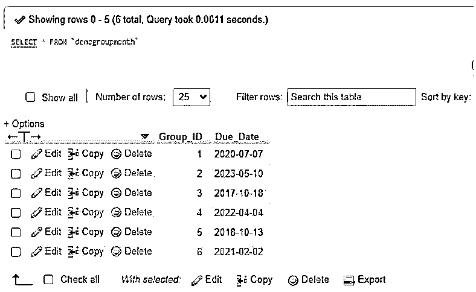
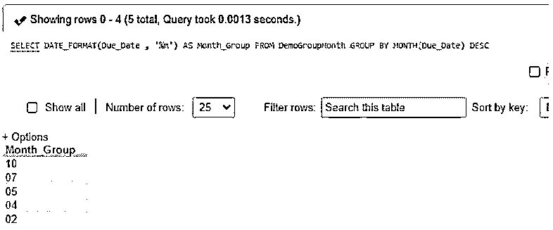
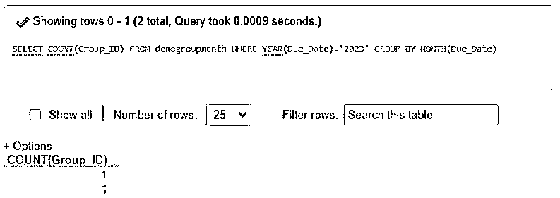
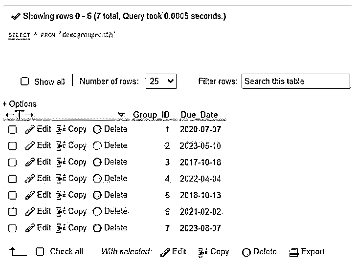
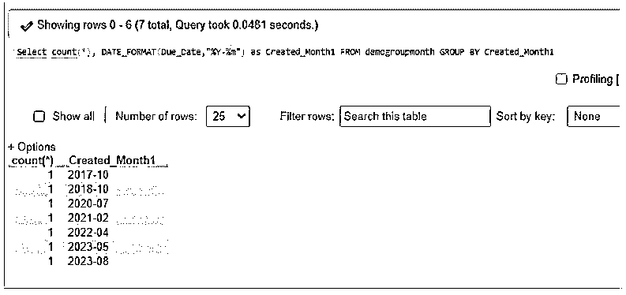
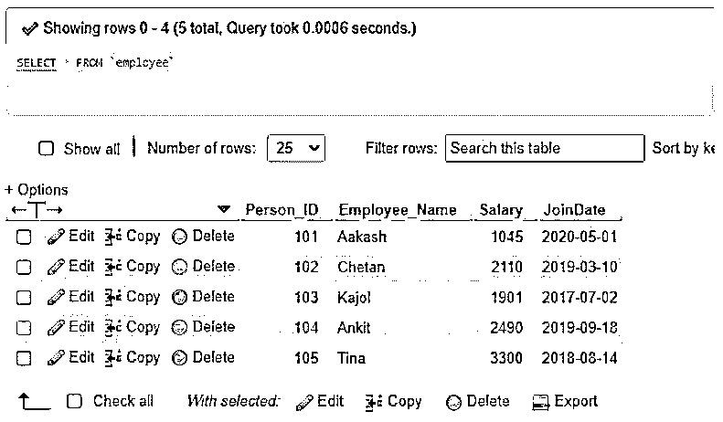
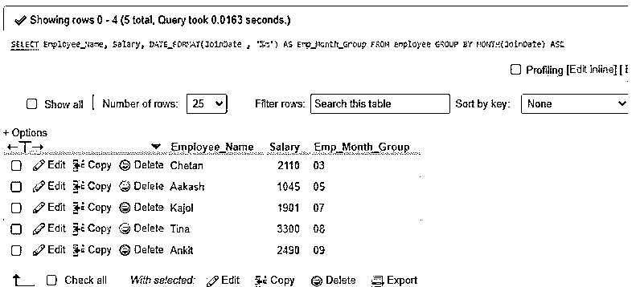

# MySQL 按月分组

> 原文：<https://www.educba.com/mysql-group-by-month/>

## 按月介绍 MySQL 组

MySQL GROUP BY 是一个 MySQL 子句，用于根据表达式或列的值将一组表行分组为子组。因此，GROUP BY 子句减少了输出集中的表行数，该子句为查询中指定的每个组返回一行。GROUP BY 子句是 MySQL 中 SELECT 语句的非强制子句，在查询中一起使用。除此之外，GROUP BY 子句可以通过应用某些函数来定义，如聚合函数或日期函数。有了这个实现，我们可以通过在 MySQL 中应用 DATE_FORMAT()并添加到 GROUP BY 子句来显示根据日期函数的月份部分进行分组的结果集，从而使用月份或年份对表行进行分组。

**语法:**

<small>Hadoop、数据科学、统计学&其他</small>

在 MySQL 中使用 GROUP BY Month 子句的语法结构:

`SELECT DATE_FORMAT(ColumnName, ‘%m-%Y’) FROM TableName
GROUP BY MONTH (ColumnName) , YEAR (ColumnName) DESC;`

为了显示带有 GROUP BY Month 子句的结果集，我们将使用如下语法:

*   这里使用了 MySQL 操作符 DATE_FORMAT()，这样就可以很容易地对时间戳、日期或日期时间表列进行分组，实现查询部分中显示的结果所需的任何格式。
*   TableName 表示 GROUP BY Month 子句中涉及的特定数据库表。
*   ColumnName 定义要使用月或年格式分组的表格列。列数据类型应该为 DATETIME、TIMESTAMP 或 DATE，以便在使用 GROUP BY Month 子句时，可以根据列从数据库的表数据中正确提取月份部分。
*   我们甚至可以使用 ASC 或 DESC 选项对结果集或日期列值进行排序。

### 按月分组在 MySQL 中是如何工作的？

*   在 MySQL 中，经常使用 SELECT 语句根据查询语句中使用的几个子句从数据库表中获取所有相互匹配的记录。
*   它有助于提供我们希望从基于任何表字段或列值的表中检索的数据类型的摘要，或者它可以是使用的任何聚合函数，如 AVG、求和、最小、最大等。在 MySQL 中。还使用了其他函数，如日期函数及其各自的格式。
*   GROUP BY 子句和 SELECT 查询一起用于借助 MySQL 中的列和数据类型按分组顺序显示结果行。一般来说，在 MySQL 查询中，GROUP BY 子句应该出现在 FROM 和 WHERE 这两个子句之后，以指定分组列 with function。
*   通常，MONTH()函数被定义为标识每个月，聚合函数有助于显示总和、平均值、最小值、最大值等计算值。
*   因此，我们将使用 GROUP BY Month 来获取输出集中的表记录，方法是将 DATE_FORMAT()结构中提供的 Date 函数的 Month 部分的列进行分组。

### 按月分组的 MySQL 示例

下面是提到的例子:

#### 示例#1

使用 GROUP BY Month 和 DATE_FORMAT()的简单示例。

为了理解上面的 GROUP BY Month 子句的概念，让我们构建一个表来显示表中的行的结果，该表是由 DATE_FORMAT()的月份部分分组的。

假设，我们有下面的查询代码来创建一个表。

**代码:**

`CREATE TABLE DemoGroupMonth(Group_ID INT PRIMARY KEY, Due_Date DATE);`

同样，我们将使用下面的语句在表中输入样本记录。

**代码:**

`INSERT INTO DemoGroupMonth VALUES(1,NOW());
INSERT INTO DemoGroupMonth VALUES(2,DATE_ADD(NOW(), INTERVAL 3 year));
INSERT INTO DemoGroupMonth VALUES(3,DATE_ADD(NOW(), INTERVAL -3 year));
INSERT INTO DemoGroupMonth VALUES(4,DATE_ADD(NOW(), INTERVAL 2 year));
INSERT INTO DemoGroupMonth VALUES(5,DATE_ADD(NOW(), INTERVAL -2 year));
INSERT INTO DemoGroupMonth VALUES(6,DATE_ADD(NOW(), INTERVAL 1 year));`

现在，我们将通过应用 SELECT 语句来查看表 DemoGroupMonth 中的所有记录，如下所示。

**代码:**

`SELECT * FROM DemoGroupMonth;`

**输出:**

**<u>

</u>** 

在此之后，我们将编写代码来检索按月分组的结果集。

**代码:**

`SELECT DATE_FORMAT(Due_Date , '%m') AS Month_Group FROM DemoGroupMonth GROUP BY MONTH(Due_Date) DESC;`

生成的后续输出显示按实现 GROUP BY 分组的月份。

**输出:**

如您所见，结果集中的日期列值是按月分组并按降序显示的。

假设，我们希望使用特定时间段(如日期函数的日、月或年部分，其中列将具有日期时间、日期或时间戳字段数据类型)来计算要确定或计算的表的记录数，那么简单的查询如下所示。

**代码:**

`SELECT COUNT(Group_ID) FROM demogroupmonth WHERE YEAR(Due_Date)='2023' GROUP BY MONTH(Due_Date);`

**输出:**

<u>

</u> 

为此，我们再次在表中插入了一些年份等于 2023 的行，以使结果正确地运行为。

**代码:**

`select * from demogroupmonth;`

**输出:**

#### 实施例 2

使用具有相同日期的按月分组的示例。

如果我们想要在相同的日期或日子添加分组表行，那么我们将按如下方式用 GROUP BY Month 查询这种分组行的计数。

**代码:**

`Select COUNT(*), DATE_FORMAT(Due_Date,'%m') as Month_Created_At FROM demogroupmonth GROUP BY Month_Created_At;`

**输出:**

#### 实施例 3

雇员逐月数据按月分组示例。

假设我们的数据库中有一个 Employee 表，其中包含 Person_ID、Employee_Name、Salary、JoinDate 等字段。

**代码:**

`select * from employee`

**输出:**

这里，表的 JoinDate 列包含日期数据类型值，用于按月对行进行分组。

**代码:**

`SELECT Employee_Name, Salary, DATE_FORMAT(JoinDate , '%m') AS Emp_Month_Group FROM employee GROUP BY MONTH(JoinDate) ASC;`

**输出:**

就像这样，我们可以查询任何雇员数据，从实现 MySQL GROUP BY month 子句的数据库中的 Employees 表中按月查找记录。

### 结论

MySQL GROUP BY month 子句负责分组以提供一组由 EXTRACT 函数分组的行，该函数允许提取日期值的一部分，如月、年、日或时间。MySQL GROUP BY month 子句有助于在销售数据库表中查找月报表，以生成雇员的系统数据。

### 推荐文章

这是一个按月 MySQL 组的指南。这里我们讨论 MySQL GROUP BY month 的介绍，它是如何工作的以及查询示例。您也可以看看以下文章，了解更多信息–

1.  [MySQL 自动增量](https://www.educba.com/mysql-auto_increment/)
2.  [MySQL 重新索引](https://www.educba.com/mysql-reindex/)
3.  [MySQL 管理工具](https://www.educba.com/mysql-admin-tool/)
4.  [MySQL CTE](https://www.educba.com/mysql-cte/)

