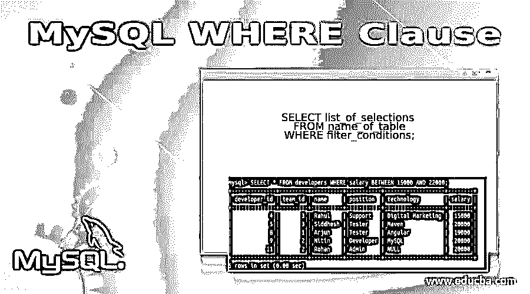
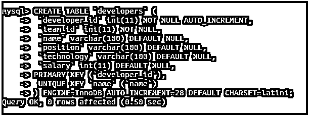
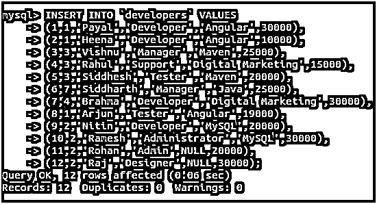
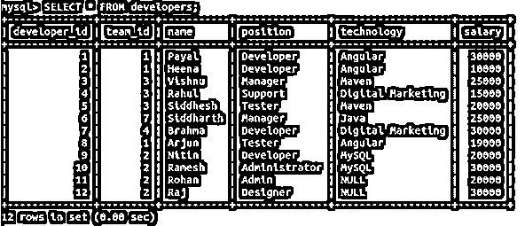
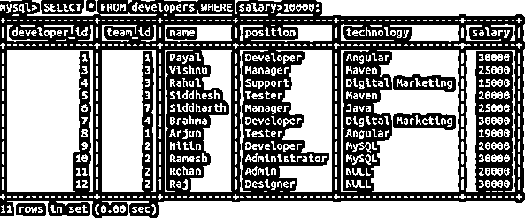
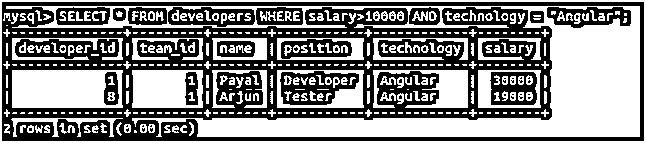
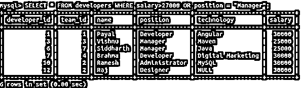
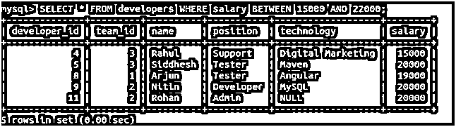

# MySQL WHERE 子句

> 原文：<https://www.educba.com/mysql-where-clause/>

## MySQL WHERE 子句介绍

当使用数据库时，我们使用各种命令与数据库通信并执行所需的操作。在 MySQL 中，我们使用结构化查询语言 SQL，帮助我们以 MySQL 服务器可以理解的特定格式编写查询语句。编写语句时，通常需要对表的某些列应用某些条件和限制，以检索特定的预期结果集。MySQL 中的 Where 子句有助于指定这样的条件，这些条件可以过滤掉表的结果，或者通过连接过滤掉多个表组合的结果集。

在本文中，我们将了解如何在 MySQL 查询语句中使用 where 子句来过滤出结果集，此外，我们将借助某些示例来了解它的语法、工作和实现。

<small>Hadoop、数据科学、统计学&其他</small>

**语法:**

where 子句的语法定义如下:

`SELECT list_of_selections FROM name_of_table WHERE filter_conditions;`

语法中使用的一些术语解释如下:

*   **List_of_selections:** 这是要在结果集中检索的列名、表达式、列上的聚合函数、文字、常量或几乎任何值的列表。
*   **Name_of_table:** 这是您要从中检索结果集的表的名称，并且您要通过指定某些限制来过滤掉其内容。
*   **Filter_conditions:** 这些是您在表的列上提到的限制或条件，以获得包含满足您提到的那些条件的记录或行的结果集。您可以借助逻辑运算符(如 AND、or 和 NOT)指定一个或多个条件。

### MySQL WHERE 子句的工作原理

这个条件也称为谓词，在 MySQL 谓词中将返回一个布尔值，该值可以是真、假或未知。仅当 where 子句中提到的条件评估为 true 时，该行将被添加到最终结果集中。

我们可以在 SELECT、DELETE 和 UPDATE 语句中使用 WHERE 子句。MySQL 查询语句中 WHERE 子句的求值顺序是在语句中使用的 SELECT、UPDATE 或 DELETE 子句之前，在 FROM 子句之后。

### 实现 MySQL WHERE 子句的示例

让我们看一些使用 WHERE 子句的例子来学习它的实现。为此，我们将考虑在名为 educba 的数据库中创建一个名为 developers 的表，并在其中插入一些记录。

#### 示例#1

让我们在数据库 educba 中创建开发人员的命名表，它将保存所有上述数据。

**查询:**

`CREATE TABLE `developers` (
`developer_id` int(11) NOT NULL AUTO_INCREMENT,
`team_id` int(11) NOT NULL,
`name` varchar(100) DEFAULT NULL,
`position` varchar(100) DEFAULT NULL,
`technology` varchar(100) DEFAULT NULL,
`salary` int(11) DEFAULT NULL,
PRIMARY KEY (`developer_id`),
UNIQUE KEY `name` (`name`)
) ENGINE=InnoDB AUTO_INCREMENT=28 DEFAULT CHARSET=latin1;`

**输出:**

#### 实施例 2

现在，我们将使用以下查询语句在其中插入一些记录。

**查询:**

`INSERT INTO `developers` VALUES
(1,1,'Payal','Developer','Angular',30000),
(2,1,'Heena','Developer','Angular',10000),
(3,3,'Vishnu','Manager','Maven',25000),
(4,3,'Rahul','Support','Digital Marketing',15000),
(5,3,'Siddhesh','Tester','Maven',20000),
(6,7,'Siddharth','Manager','Java',25000),
(7,4,'Brahma','Developer','Digital Marketing',30000),
(8,1,'Arjun','Tester','Angular',19000),
(9,2,'Nitin','Developer','MySQL',20000),
(10,2,'Ramesh','Administrator','MySQL',30000),
(11,2,'Rohan','Admin',NULL,20000),
(12,2,'Raj','Designer',NULL,30000);`

**输出:**

#### 实施例 3

让我们首先使用一个简单的 select 查询语句检索表中的记录。

**查询:**

`SELECT * FROM developers;`

**输出:**

#### 实施例 4

现在，假设我们只想从 developers 表中检索那些薪水高于 10000 英镑的记录。为此，我们必须在上面的 SELECT 查询语句的 WHERE 子句中提到一个谓词/条件。我们的查询语句如下:

**查询:**

`SELECT * FROM developers WHERE salary>10000;`

**输出:**

#### 实施例 5

现在，考虑这样一种情况，您希望对查询语句中的多个列应用多个条件，以便当所有指定的条件都满足时，只有该行应该被添加到查询的最终结果集中。在这种情况下，我们可以在 WHERE 子句中使用 AND 运算符。比如，假设我们想找出所有技术有棱角，工资大于 10000 的开发人员的名字。那么我们的查询语句将如下所示

**查询:**

`SELECT * FROM developers WHERE salary>10000 AND technology = "Angular";`

上述查询语句的执行将给出以下输出，包括薪水大于一万并且使用 angular 技术的记录。

**输出:**

#### 实施例 6

当您必须以这样的方式应用条件时，如果满足其中任何一个条件，那么您希望在最终集中检索该行，那么您可以使用 OR 运算符在 WHERE 子句中指定条件。考虑一个例子，我们想检索工资超过 27000 英镑或担任经理职务的表开发人员的记录，那么我们的查询语句如下

**查询:**

`SELECT * FROM developers WHERE salary>27000 OR position = "Manager";`

上述查询语句的执行将给出以下输出，包括工资高于 27000 的记录，以及担任经理职务的记录，该职务的工资可能高于也可能不高于 25000

**输出:**

#### 实施例 7

当您想要指定某一列允许的值的范围时，您可以使用 between 关键字在 WHERE 子句中指定。考虑到我们必须找出工资在 15000 到 22000 之间的开发人员，我们的查询语句如下

**查询:**

`SELECT * FROM developers WHERE salary BETWEEN 15000 AND 22000;`

**输出:**

上面的查询语句在对工资在 15000 到 22000 之间的所有开发人员执行后给出了以下输出。

除了上面提到的所有操作符，我们还可以在 WHERE 子句中使用所有类型的比较操作符，如、<=,> =，以及 IS NULL 和 IS NOT NULL 和布尔值，如 TRUE 和 FALSE。它的功能与 with SELECT 语句的功能相同

### 结论

我们可以在 MySQL 查询语句中使用 WHERE 子句来指定与表的列相关的条件和谓词，如果该谓词的值为 true，那么只有该行被添加到最终的结果集中。WHERE 子句可以与 SELECT、DELETE 和 UPDATE 语句一起使用。我们可以在 WHERE 子句中使用不同的逻辑运算符、比较运算符和布尔值。IS NULL 和 IS NOT NULL 约束，也可以为 WHERE 子句中的某些列指定。

### 推荐文章

这是一个 MySQL WHERE 子句的指南。这里我们讨论 MySQL WHERE 子句的介绍以及实际例子和不同的子查询表达式。您也可以浏览我们推荐的文章，了解更多信息——

1.  [MySQL 操作符介绍](https://www.educba.com/mysql-operators/)
2.  [前 23 个 MySQL 字符串函数](https://www.educba.com/mysql-string-functions/)
3.  [MySQL 与 SQLite | 14 大对比](https://www.educba.com/mysql-vs-sqlite/)
4.  [MySQL 时间戳指南](https://www.educba.com/mysql-timestamp/)

