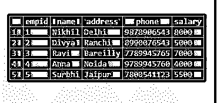
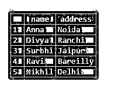

# MySQL 获取

> 原文：<https://www.educba.com/mysql-fetch/>

## MySQL FETCH 简介

MySQL Fetch 子句语句用于获取一组行，以检索 MySQL 中的某种操作数据。我们还需要知道在通过 SQL 查询从表中获取行数时，如何使用 SQL OFFSET FETCH 子句来允许限制。FETCH 本身不能操作；它用于带偏移的聚合。通常，这两个子句 OFFSET 和 FETCH 是 ORDER 子句的可能性，ORDER 子句允许为查询添加一个限制，以便从 MySQL 的一个表中返回记录的数量。我们需要在从表中提取行时同时使用这些方法，以便在 MySQL 中正确执行查询。如果 OFFSET 和 FETCH 子句没有与 ORDER BY 子句一起使用，则会产生错误。因此，最好使用它们来实现查询。

### 句法

FETCH 和 OFFSET 子句组合在一起，与 SELECT 和 ORDER BY 子句一起使用，从结果集中获取一系列记录。下面的语法定义了 OFFSET 和 FETCH 子句的查询代码:

<small>Hadoop、数据科学、统计学&其他</small>

`SELECT ColumnNames FROM TableName ORDER BY ColumnName OFFSET rows_to_be_skipped FETCH NEXT n ROWS ONLY; // Where n is a number of rows`

**查询中需要了解的几点:**

`ORDER BY ColumnNames[DESC/ASC] OFFSET offset_rows_count
FETCH {either First or Next} fetch_rows_count ONLY`

**解释:**MySQL 中的 OFFSET 参数标识了查询返回的行的起始点。OFFSET 查询负责在开始从 SQL 查询中提取行之前跳过行数。Offset_rows_count 可以由常量、任何标量、变量、任何大于或等于零的参数指定。FETCH 子句用于在执行 OFFSET 子句后返回记录数。

Fetch_rows_count 可以由常量、任何标量、变量、任何大于或等于零的参数指定。在 SQL 查询中，有必要使用 OFFSET 子句，但是 FETCH 子句可以是可选的。第一个和下一个术语分别是同义词，可以互换，ASC 和 DESC 关键字也是如此，可以在提取时对行进行排序。

### MySQL 中的 FETCH 子句是如何工作的？

我们可以看看使用 MySQL FETCH with OFFSET 返回除第一行之外的行数并从表中获取下一行的完整语法。这是排除前 m 行的基本查询语法。

`SELECT ColumnNames FROM TableName ORDER BY ColumnNames OFFSET m ROWS FETCH NEXT p ROWS ONLY;`

现在，您可以再次使用下面的代码来排除 m 行，并从表中获取接下来的 p 行。这将只获取从(m+1)到(m+1+p)的行。

`SELECT ColumnNames FROM TableName ORDER BY ColumnNames OFFSET m ROWS FETCH NEXT p ROWS ONLY;`

### 实现 MySQL FETCH 的示例

下面是提到的例子:

#### 示例#1

让我们考虑为一个示例创建一个名为 Employees 的表，用下面的查询解释带有 EmpID、姓名、电话、地址和薪水的示例。

**代码:**

`CREATE TABLE Employees ( EmpID int NOT NULL PRIMARY KEY, Name varchar(255) NOT NULL,    Address  varchar(255),Phone varchar(255),  Salary varchar(255));`

此外，输入如下值:

**代码:**

`INSERT INTO Employees (EmpID, Name, Address, Phone, Salary)VALUES
('1', 'Nikhil', 'Delhi', '9878906543', '8000'),
('2', 'Divya', 'Ranchi', '8990076543', '5000'),
('3', 'Ravi', 'Bareilly', '7789945765', '7000'),
('4', 'Anna', 'Noida', '9789945760', '4000'),
('5', 'Surbhi', 'Jaipur', '7800541123', '5500');`

**输出:**

#### 实施例 2

例如，下面的查询将从带有姓名和地址列的表中返回所有雇员，并按薪金排序。

**代码:**

`SELECT Name, Address FROM Employees ORDER BY Salary;`

**输出:**

#### 实施例 3

现在，如果我们想跳过 2 行记录并返回剩余的记录，请使用 OFFSET 子句，如下所示:

**代码:**

`SELECT Name, Address FROM Employees ORDER BY Salary OFFSET 2 ROWS;`

**输出:**

#### 实施例 4

这将通过跳过前 2 行并从表 Employees 返回其余行来提供结果集。同样，为了排除前 2 行并获得后面两行的结果集，我们必须在 MYSQL 中使用带有 SELECT 和 ORDER BY 子句的 FETCH 和 OFFSET。该查询限制了要从表中提取的行的范围:

**代码:**

`SELECT Name, Address FROM Employees ORDER BY Salary OFFSET 2 ROWS
FETCH NEXT 2 ROWS ONLY;`

**输出:**

**说明:**这将打印出雇员表中第 3 第到第 5 第字段的姓名和地址列，这些字段是根据薪水排序的。在这里，结果表中的行在提取后进行排序。

#### 实施例 5

现在，如果我们想在按薪水对行列表排序后从 Employees 表中获取行，然后排除这些行，最后提供获取的行，我们需要在查询中使用语法。

`OFFSET (SELECT COUNT (*) FROM Employees)`

下面是查询，当按薪金排序时，我们将从中提取底部的 2 行。假设，当按薪水排序时，我们不会从查询列表的结果集中的列名和地址中获得支付给雇员的最低或最高薪水，那么我们可以在 MySQL 中使用 ASC 或 DESC 运算符。

以下查询处理包含某个雇员的最高工资和最低工资的结果集，其中 OFFSET 和 FETCH 一起从 Employees 表中提取所需的行:

**代码:**

`SELECT Name, Address FROM Employees ORDER BY Salary DESC OFFSET 2 ROWS
FETCH NEXT 2 ROWS ONLY;`

**输出:**

同样，对于 ASC:

**代码:**

`SELECT Name, Address FROM Employees ORDER BY Salary ASC OFFSET 2 ROWS
FETCH NEXT 2 ROWS ONLY;`

**输出:**

### 在 MySQL 中使用 FETCH 的优势

以下是优点:

*   它有助于从表中获取所需数量的记录。
*   MySQL 中的 OFFSET with FETCH 查询会跳过第一组行。
*   让我们按照升序或降序对行数进行排序。
*   FETCH NEXT 与 OFFSET 一起返回表格中指定窗口的行。
*   带偏移量的 FETCH NEXT 有效地支持构造分页条款。
*   它支持解释 SQL 查询和维护数据库完整性。

### 结论

FETCH 与 OFFSET 结合使用，以限制表中的行数。MySQL FETCH with OFFSET 有助于 MySQL 管理大量数据库及其记录，以快速获取有限范围内的行。FETCH 在 SQL 执行后返回结果集，以获得行数并跳过偏移行数。

### 推荐文章

这是一个 MySQL 获取指南。这里我们讨论 MySQL FETCH 的介绍、语法、工作原理、例子和优点。您也可以浏览我们的其他相关文章，了解更多信息——

1.  [MySQL 索引](https://www.educba.com/mysql-index/)
2.  [MySQL DECODE()](https://www.educba.com/mysql-decode/)
3.  [MySQL INSTR()](https://www.educba.com/mysql-instr/)
4.  [MySQL BIN()](https://www.educba.com/mysql-bin/)

