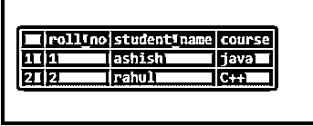
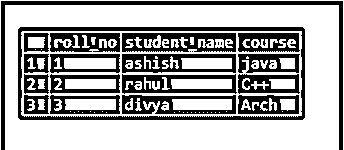
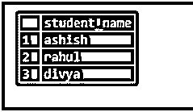
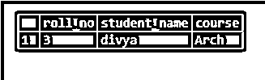
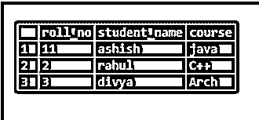
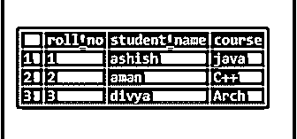
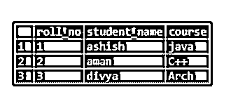
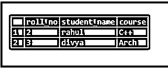
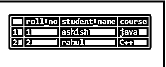
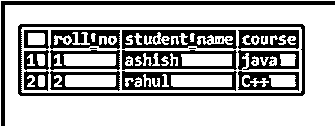

# MySQL DML

> 原文：<https://www.educba.com/mysql-dml/>

## MySQL DML 简介

DML 代表数据操作语言，主要处理数据库中数据的修改。DML 语句包括结构化查询语句，如 select、insert、update、delete 等。数据操作包括以下操作，如存储、修改、检索、删除和更新数据库中的数据。

它主要管理和修改数据库中的数据。

<small>Hadoop、数据科学、统计学&其他</small>

*   **select:**MySQL 中的 select 关键字用于从表中检索数据。
*   **插入:**将数据插入或添加到表格中。
*   **更新:更新表格中的**现有数据。
*   **删除:**删除数据库表中的所有记录。
*   **合并:**是一种插入或更新操作。
*   **调用:** call 语句用于调用 PL/SQL 或任何子程序。
*   **解释计划:**对数据访问路径的解释。
*   **锁表:**并发控制。

### 演示 DML 语句的示例

下面是一些例子:

#### 1.插入

它用于在现有表中插入或添加新的行或记录。

**语法:**

`Insert into <table_name>values(<value1>,<value2>,<value3>…….,<valuen>);`

在哪里，

*   **表格名称:**需要插入数据的表格的名称。
*   **值:**表格中每一列的值。

要在表中插入值，我们首先需要创建一个 DDL(数据定义语言)语句表。这里，在下面所有的例子中我们已经创建了一个名为 students 的表。我们将在此表中仅展示 DML 语句的演示。因此，让我们从创建学生表开始。

下面是创建语句的查询:

`create table students (roll_no int,student_name varchar(150),course varchar(150));`

一旦创建了表，我们现在可以向其中插入值。

下面是 insert 语句的查询:

`insert into students values(1,'ashish','java');
Insert into students values(2,’rahul’,’C++’);
select * from students;`

**输出:**

我们在表中插入了 2 行。为了查看包含记录的整个表，我们再次使用带星号(*)的 select 语句，在表中添加了第三行

`insert into students values(3,'divya','Arch');
select * from students;`

**输出:**

在 select 语句的帮助下，我们还可以使用另一个表来填充一个表。唯一的条件是表必须有相同的属性集。

填充表格的语法:

`Insert into table_no_first [(column1, column 2…column n)] select column1, column 2…column n from table_no_two [where condition];`

#### 2.挑选

它用来显示表格的内容。它还用于从数据库中选择数据。下面是从表中选择指定列和记录的语法。

`Select column1,column2,…..column n from table_table;`

其中，第 1 列，第 2 列…列 n 是表格的属性

**示例演示上述语法:**

`select student_name from students;`

**输出:**

下面是从表中选择所有记录和列的查询:

带有 where 子句的 Select 语句:

**语法:**

`select column 1,column 2,….column n from table_name where [condition]`

其中条件是提取数据所基于的指定条件。在条件中，我们可以指定逻辑运算符，如>、

演示带有 where 子句的 select 语句的示例

`select roll_no, student_name, course from students where roll_no=3;`

**输出:**

#### 3.更新

它用于更改该列的现有值，即更改学生的姓名或更改任何学生的课程。

update 语句的语法:

`Update<table_name> set <column_name>=value where <condition>;`

*   **Table_name:** 要更改其值的表格的名称。
*   **条件:**获取指定行的条件

下面是 update 语句的查询:

`update students set roll_no=roll_no+10 where student_name='ashish';`

**输出:**

`update students12 set student_name='aman' where roll_no=2;
select * from students;`

**输出:**

#### 4.删除

Delete 语句用于根据指定的条件删除表中的行。

**语法:**

`delete from <table_name> where <condition>;`

*   **table_name** :需要删除数据的表格的名称。
*   **条件:**删除数据的条件。

`select * from students;`

**输出:**

`delete from students where roll_no=11;
select * from students;`

**输出:**

`delete from students where student_name= 'divya';`

**输出:**

`delete from students12 where course='Arch';`

**输出:**

上面的例子告诉我们，当对表 students 执行 delete 命令并希望删除 students_name='aman '时，它会删除' aman '的全部细节，并给出表中剩余学生的输出。在这里，我们一个接一个地删除了表中的所有行。最后，表只剩下列名和它的模式。要删除模式，我们必须使用 DROP 语句，这是一个 DDL 语句。

### 结论–MySQL DML

在本文中，我们学习了 mysql 数据操作语言(DML)。我们还了解了 DML 下的所有语句及其用途。我们已经解释了查询中的每一个 DML 语句。为了让读者更好地理解，整个查询通过示例和输出控制台的屏幕截图进行了解释。文章中还提供了所有语句的正确语法。

### 推荐文章

这是一个 MySQL DML 的指南。在这里，我们还将讨论介绍和语法，以及一个演示 DML 语句的示例。您也可以看看以下文章，了解更多信息–

1.  [MySQL TRUNCATE()](https://www.educba.com/mysql-truncate/)
2.  [MySQL REGEXP_REPLACE()](https://www.educba.com/mysql-regexp_replace/)
3.  [MySQL Root 密码](https://www.educba.com/mysql-root-password/)
4.  [MySQL 根目录](https://www.educba.com/mysql-root/)

