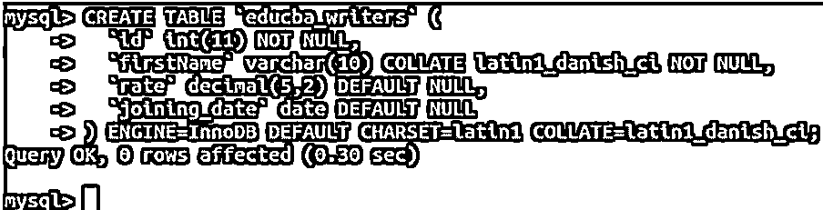
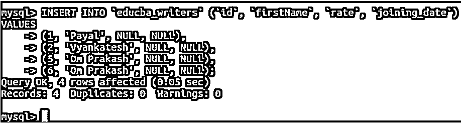
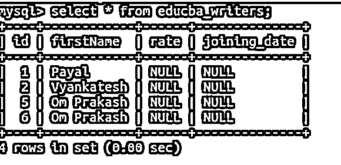
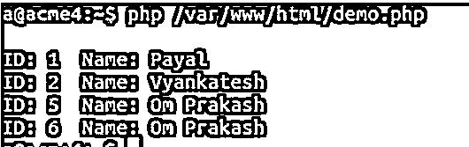
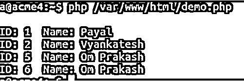

# MySQL 获取数组

> 原文：<https://www.educba.com/mysql-fetch-array/>

## MySQL Fetch 数组简介

我们可以通过使用 mysql_fetch_array()函数、mysqli_fetch_array()函数或数组形式的 PDO_MYSQL 驱动程序，用 PHP 语言检索 MySQL 数据库的表的行。这些数组可以是数值数组，也可以是关联数组。mysql_fetch_array()函数在 PHP 5.5.0 版本中已被弃用，在 PHP 7.0.0 版本中被完全删除。在 PHP 5.5.0 版本之后，应该使用 mysqli _ fetch _ array()函数来获取 MySQL 查询的结果集中的行数组。或者，PDO_MYSQL 驱动程序允许从 PHP 访问 MYSQL 的数据库，并可用于实现 PHP 数据对象接口。在本文中，我们将学习 mysqli_fetch_array()函数的语法，以及如何在一个例子的帮助下使用它在 PHP 中检索数组形式的结果。

### MySQL 获取数组的语法

当我们想以面向对象的方式使用这个函数时，我们必须遵循下面的语法。

<small>Hadoop、数据科学、统计学&其他</small>

`resultOutput mysqli_result::fetch_array(int resulttype= =MYSQLI_BOTH);`

在过程方式的情况下，我们将不得不使用下面的语法来获取包含 MySQL 查询的结果集的行的数组

`resultOutput mysqli_fetch_array(mysqli_result result,
int resulttype= =MYSQLI_BOTH);`

*   **resultOutput:** 这两个方法都将返回包含表格行的数组。如果返回的结果集中没有任何一行，那么该函数将返回一个空值。另外，要注意查询中使用的字段名，因为返回的结果集将以区分大小写的方式考虑字段名。除了分配给取出的数组的数字索引，我们还可以使用字段名作为索引，这被称为关联索引。
*   **Result:** 在过程语法的情况下，Result 参数代表从 mysqli_store_result、mysqli_query 或 mysqli_use_result 方法中检索的结果集。
*   **结果类型:**我们可以通过使用 Result type 字段指定索引类型，来指定应该在该函数返回的结果集中使用的索引类型。该字段可以包含 MYSQLI_BOTH、MYSQLI_NUM 或 MYSQLI_ASSOC。函数中 resulttype 的指定是可选的。当我们通过指定 MYSQLI_ASSOC resulttype 来使用关联索引时，mysqli_fetch_array()的行为方式与 mysqli_fetch_assoc()相同。而如果我们通过指定 MYSQLI_NUM resulttype 来使用数字索引，那么 mysqli_fetch_array()的行为方式将与 mysqli_fetch_row()相同。实际上，mysqli_fetch_array()函数被认为是 mysqli_fetch_row()函数的扩展版本。

### MySQL 获取数组示例

让我们考虑一个例子，首先我们将登录 MySQL 并在名为 educba 的数据库中创建一个名为 educba_writers 的表，然后我们将在 educba_writers 表中插入一些记录。从 MySQL 表中检索结果集后，我们将编写 PHP 程序，在该程序中，我们将获取 educba_writers 表中的行数组。

使用以下查询语句选择并使用我们希望用于创建表的 educba 数据库-
use educba；

上述查询的执行给出了以下输出

`use educba;`

现在，我们将使用以下查询中的 CREATE TABLE 语句创建 educba_writers 表，该表将包含四列，即 id、firstName、rate 和 joining_date

`CREATE TABLE `educba_writers` (
`id` int(11) NOT NULL,
`firstName` varchar(10) COLLATE latin1_danish_ci NOT NULL,
`rate` decimal(5,2) DEFAULT NULL,
`joining_date` date DEFAULT NULL
) ENGINE=InnoDB DEFAULT CHARSET=latin1 COLLATE=latin1_danish_ci;`

执行上述查询会得到以下输出–

让我们在下面的查询中使用 Mysql 的 INSERT INTO 语句在 educba_writers 表中插入一些记录

`INSERT INTO `educba_writers` (`id`, `firstName`, `rate`, `joining_date`) VALUES
(1, 'Payal', NULL, NULL),
(2, 'Vyankatesh', NULL, NULL),
(5, 'Om Prakash', NULL, NULL),
(6, 'Om Prakash', NULL, NULL);`

执行上述查询会产生以下输出:

现在，我们将使用以下查询语句从 educba_writers 表中选择数据

`select * from educba_writers;`

执行上述查询会产生以下输出:

它检索名为 payal，vyankatesh 的 4 行。编号为 1、2、5 和 6 的 Om Prakash 和 Om Prakash。注意，当我们在 PHP 中使用 mysqli_fetch_array()函数时，同样的数据将以数组格式检索。

让我们在/var/www/html/ path 中准备一个名为 demo.php 的 PHP 文件，并在用户名和密码的帮助下编写代码来建立与 educba 数据库的连接。然后，我们将编写 SQL 查询来选择 educba_writers 表的内容，最后使用 mysqli_fetch_array()函数以数组格式从查询中检索结果集，并使用数组元素的索引将它们循环到 while 循环中，并在不同的行上打印每一行的记录。这方面的 PHP 代码如下所示

`<?php
$con=mysqli_connect("127.0.0.1", "username", "password") or
die("Could not connect: " . mysqli_error());
mysqli_select_db($con,"educba");
$result = mysqli_query($con,"SELECT id, firstName FROM educba_writers");
while ($row = mysqli_fetch_array($result, MYSQLI_BOTH)) {
printf("\nID: %s Name: %s", $row[0], $row[1]);
}
printf("\n");
mysqli_free_result($result);
?>`

将该文件以 demo.php 的名字保存在先前指定的文件夹中。现在，我们将在终端上运行 PHP 并检查输出。为此，在终端上执行以下命令

`php /var/www/html/demo.php`

执行上述查询会产生以下输出:

我们可以看到，同样的四行是以数组格式检索的，我们打印了数组变量$row 中存储每一行的内容，然后打印第 0 个和第 1 个位置的元素，分别是 id 和 firstName 列值，直到结果出现在使用 while 循环从 mysqli_fetch_array()函数返回的 resultset 数组中。注意，在我们的例子中，mysqli_fetch_array()函数的返回值是数组的数组。这样，我们可以在使用 PHP 时以数组格式检索查询的内容。

我们甚至可以在 demo.php 文件中指定字段名，而不是关联数组索引，如下所示

`<?php
$con=mysqli_connect("127.0.0.1", "username", "password") or
die("Could not connect: " . mysqli_error());
mysqli_select_db($con,"educba");
$result = mysqli_query($con,"SELECT id, firstName FROM educba_writers");
while ($row = mysqli_fetch_array($result, MYSQLI_BOTH)) {
printf("\nID: %s Name: %s", $row['id'], $row['firstName']);
}
printf("\n");
mysqli_free_result($result);
?>
It returns the same output after executing the following query -
php /var/www/html/demo.php`

### 结论

我们可以在 PHP 5.5.0 及更高版本中使用 mysqli_fetch_array()函数，在 PHP 7.0.0 之前的版本中使用 mysql_fetch_array()函数。mysql_fetch_array()函数在 PHP 5.5 版本中已被弃用，并在 PHP 7 及更高版本中被完全删除。这两个函数都有助于在 PHP 语言中以数组的形式检索结果集，我们可以对检索到的数组使用数值、关联两种类型的索引。

### 推荐文章

这是一个 MySQL 获取数组的指南。这里我们还讨论了 mysql fetch 数组的介绍和语法，以及不同的例子和代码实现。您也可以看看以下文章，了解更多信息–

1.  [MySQL 工作台](https://www.educba.com/mysql-workbench/)
2.  [MySQL 分区](https://www.educba.com/mysql-partition/)
3.  [MySQL 转储](https://www.educba.com/mysql-dump/)
4.  [MySQL DISTINCT](https://www.educba.com/mysql-distinct/)

