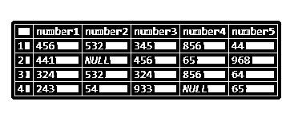
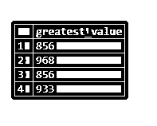

# MySQL 最棒

> 原文：<https://www.educba.com/mysql-greatest/>

## MySQL 最棒的介绍

当我们必须找出 MySQL 中多个值中的最大值时，我们可以利用 MySQL greatest()函数，它是 MySQL 中可用的函数之一，可以帮助我们操作数据和检索所需的值。MySQL greatest()函数是在 MySQL 4.0 中引入的，适用于 MySQL 4.0 及以上的所有版本。当使用带有多个实参的函数时，这些实参以列表格式作为不同的参数传递给函数，我们需要事先考虑和了解我们指定的值的类型，以及函数如何处理不同的数据类型值。

在本文中，我们将了解 MySQL greatest()函数的语法，并通过查看规则和在一些示例中实现该函数来阐明我们的概念，从而了解该函数如何在内部处理不同的数据类型。

<small>Hadoop、数据科学、统计学&其他</small>

**语法**

使用 MySQL greatest()函数的一般语法如下

`GREATEST(expression1, expression2, ...);`

我们可以观察到，greatest()函数可以接受我们希望给出的任意多的参数。所有的值或表达式都应该以逗号分隔的格式指定，并用函数括号()括起来。

返回值–从函数返回的值是所有列出的参数值中最大的值。返回值的类型取决于所提供的参数值的类型。

### 评估最大价值时遵循的规则

当只传递一个参数时，该函数只是返回错误，指出参数计数对于要执行的 greatest()函数是不正确的。但是，当我们将多个字段作为参数传递给函数时，greatest()函数遵循某些规则来计算所有指定字段中的最大值，如下所示

*   如果传递的参数只包含一个值或表达式，或者值为 NULL，那么 greatest()函数将返回 NULL 值，而不进行任何比较。
*   当所有指定的值都是整数值数据类型时，进行比较时会将它们都视为整数。
*   只要指定的参数列表至少包含一个双精度值，就会将所有值视为双精度值进行比较。除此之外，如果列表中至少包含一个具有十进制值的参数，那么所有的值都被认为是十进制的，并对十进制值进行比较。
*   如果参数列表包含一些整数类型的值和一些混合的字符串数据类型的值，则通过考虑所有字符串类型的值来进行比较。
*   如果参数列表包含至少一个具有非二进制字符或字符串的参数，则进行比较时会将所有指定的参数视为非二进制字符串值。
*   除了上述情况之外，进行比较时将所有参数都视为二进制字符串。

### 例子

让我们首先考虑当我们使用不带任何参数的函数时会发生什么

`SELECT GREATEST();`

这将给出以下输出，其中包含一个错误，指出传递的参数数量对于要执行的函数来说是不正确的，如下所示

传递带有 null、任何整数值、字符串值或布尔值、十进制值的单个值会返回带有错误的相同输出。考虑以下查询语句的执行

`SELECT GREATEST(null);`

`SELECT GREATEST(1);`

`SELECT GREATEST("1");`

`SELECT GREATEST(1.00);`

执行上述语句的输出如下，对空白参数列表抛出相同的错误，表示参数计数不正确——

现在让我们考虑一个列表，它包含所有整数值，除了一个包含空值的列表，并观察输出。考虑以下查询语句–

`SELECT GREATEST(441, 532, 933, NULL, 968, 87, 564);`

执行上述语句的输出如下，将 NULL 值作为最大值

当列表可能包含空值时，我们可以通过使用 IFNULL()或 COALESCE()函数来处理空值，从而克服忽略比较值的问题。

现在，我们将考虑所有整数值，并使用 greatest()函数从所有整数值中找出最大值。考虑以下查询语句–

`SELECT GREATEST(441, 532, 933, 856, 968, 87, 564) AS greatest_value;`

让我们考虑一个双精度值和整数值的组合列表，如下面的查询语句所示。

`SELECT GREATEST(441.02, 532, 933.58, 856, 968, 87.63, 564) AS greatest_double_value;`

执行上述语句的输出如下

我们可以从输出中观察到，即使指定参数中的最大值是 968，也是一个整数，因为该列表包含至少一个双精度值的参数，该整数值也被视为双精度值，因此检索到的最大值是双精度值的格式。

考虑以下由字符组成的查询语句作为其中的参数，我们试图使用 GREATEST()函数找出其中的最大值，如下所示

`SELECT GREATEST('A','Z','P','J','G') AS greatest_string_value;`

执行上述语句的输出如下

注意，在 MySQL GREATEST()函数中比较字符和字符串时会考虑 ASCII 值。

现在，我们将使用以下语句创建一个名为 comparison_values 的表

`CREATE TABLE `comparison_values` (
`number1` int(11),
`number2` int(11),
`number3` int(11),
`number4` int(11),
`number5` int(11)
) ENGINE=InnoDB DEFAULT CHARSET=latin1;`

让我们插入一些值——

`INSERT INTO `comparison_values` VALUES
(456, 532, 345, 856, 44),
(441, NULL, 456, 65, 968),
(324, 532, 324, 856, 64),
(243, 54, 933, NULL, 65);
select * from `comparison_values`;`

在执行查询后，它会给出以下输出–

让我们使用以下查询从 comparison_values 表的记录中选择最大值

`SELECT GREATEST(number1,number2,number3,number4,number5) AS greatest_value FROM comparison_values;`

在执行查询后，它会给出以下输出–

为了避免空值比较，让我们按如下方式使用 IFNULL

`SELECT GREATEST(IFNULL(number1,0),IFNULL(number2,0),IFNULL(number3,0),IFNULL(number4,0),IFNULL(number5,0)) AS greatest_value FROM comparison_values;`

在执行查询后，它会给出以下输出–

### 结论——MySQL 最棒

我们可以使用 GREATEST()函数找出 MySQL 中指定值中的最大值。

### 推荐文章

这是一个 MySQL 最伟大的指南。在这里，我们将讨论评估最大价值时遵循的规则以及示例。您也可以看看以下文章，了解更多信息–

1.  [MySQL 删除触发器](https://www.educba.com/mysql-delete-trigger/)
2.  [MySQL CEIL](https://www.educba.com/mysql-ceil/)
3.  [MySQL 刷新日志](https://www.educba.com/mysql-flush-log/)
4.  [MySQL WEEKDAY](https://www.educba.com/mysql-weekday/)

