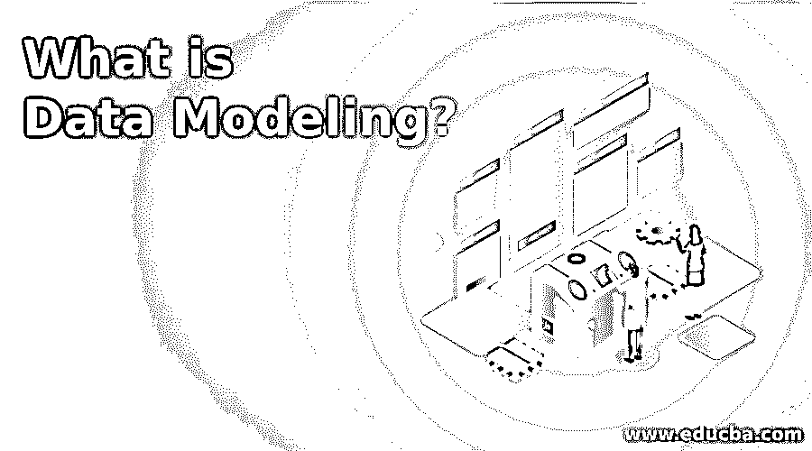
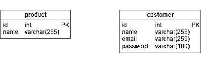
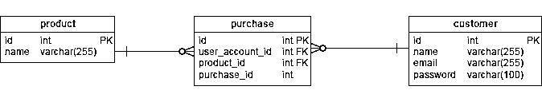
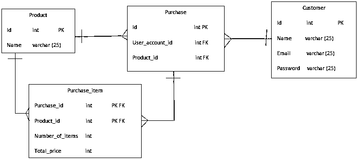

# 什么是数据建模？

> 原文：<https://www.educba.com/what-is-data-modeling/>

## 什么是数据建模？

以下文章概述了什么是数据建模？创建数据存储模型的方法称为数据库中的[数据处理](https://www.educba.com/what-is-data-processing/)。这介绍了理论上的数据对象和不同数据对象之间的联系。数据建模是信息系统中标准化格式的数据公式化过程。它有助于快速分析数据，这有助于满足业务需求。[数据建模](https://www.educba.com/what-is-data-modeling/)流程要求数据建模师与利益相关者和潜在的 IT 用户正确合作。数据建模以支持业务信息系统基础设施的数据模型的开发结束。

### 了解数据建模/范围

它发生在三个不同的层面:

<small>Hadoop、数据科学、统计学&其他</small>

*   **物理模型:**它是一种模式，说明数据在数据库中的物理存储方式。
*   **概念模型:**是用户对数据的看法，即用户看到的高层。
*   逻辑模型:它位于物理模型和概念模型之间，它从逻辑上表示数据，与物理存储区分开。

**分层数据建模:**这些模型用于取代基于文件的系统。数据被保存在一个太多的树状结构中。

**关系数据建模:**分层模型确实帮助我们摆脱了基于文件的系统，这降低了复杂性，但人们仍然知道所采用的具体物理数据存储。关系数据库遵循关系模型，数据存储在表中，而分层数据库则存储在树状结构中。简而言之，与层次模型相比，它降低了复杂性。

### 数据建模如何让工作变得如此简单/我们为什么要使用它？

*   它帮助我们直观地呈现数据，并强制执行业务逻辑、法规、政策等。，在数据上。
*   它是科学家和分析师在设计和实现数据库时使用的指南。
*   因此，如果没有数据建模，分析师和科学家在数据库上实现业务需求的工作就会变得困难。

### 为什么我们需要数据建模？你能用它做什么？

使用它的主要目的是:

*   为了确保所有的数据对象都被正确地表示，就好像没有正确地表示一样，我们会得到不正确的结果。
*   如前所述，它有助于在概念、物理和逻辑层面上设计数据库。
*   它有助于设计关系表、主键、外键等。
*   数据库开发人员可以用一个好的模型创建一个更好的物理数据库，因为它成为了他们的指导工具。
*   它有助于识别缺失和冗余的数据。
*   它有助于我们拥有更好的 It 基础设施，并在长期需要时进行简单而廉价的维护，尽管最初这很耗时。

### 工作

现在让我们创建一个样本数据模型来理解如何使用模型。

为此，我们必须遵循某些步骤:

*   首先，我们必须了解需求。在这种情况下，我们将创建一个在线商店的模型。因此，记住这一点，我们需要两个表 a)客户 b)产品。
*   下一步是获取表或实体的属性。

**答:客户表可以有如下属性:**

*   身份
*   名字
*   电子邮件
*   地址

**b .产品表可以有如下属性:**

*   身份
*   名字

在客户表中，我们可以将 Id 作为主键，同样，产品表中的产品 Id 也将作为主键，如下图所示。

现在，我们将设计这两个表之间的关系。因此，为了连接客户和产品表，我们将创建一个名为 purchase 的表，它类似于一个订单表(即哪个客户订购了哪个产品)。

如果您查看上图，customer-purchase 引用是可以的，因为每一次购买都有一个客户，而一个客户有多次购买。所以，这个参考没问题。还有一点，我们将 user_account_id 作为外键(customer key 中对 id 的引用)。类似地，产品 id。产品购买参考仍然存在一个问题，因为在一次购买中可以购买几个产品，也可以多次购买同一产品。

为了克服这个问题，我们将设计一个名为 purchase_item 的中间表，它将与 purchase 和 product 相连接。在下图中，我们可以看到问题得到了解决。

### 优势

有如下各种优点:

*   它帮助企业在整个组织内进行沟通和规划。
*   它有助于识别可用于填充模型的正确数据源。
*   这可以用来定义不同表之间的关系，如主键、外键等。

### 谁是学习这项技术的合适受众？

*   这是非常必要的。学习建模技术的合适受众是数据架构师和数据分析师。
*   大多数[人从数据分析师](https://www.educba.com/what-is-data-analyst/)做起，然后往上爬。

### 这项技术将如何帮助你的职业发展？

*   根据 Glassdoor 的数据，市场上建模师的平均工资预计约为 78，601 美元。
*   所以你可以看到这是一份高薪的工作。
*   大多数大公司投资建模师，因为他们对于保持数据的完整性非常重要。

### 结论

总之，我们可以说建模者创建的模型确保了命名约定的一致性、数据的完整性和安全性，因为好的数据将使企业能够正确、有效地利用他们的数据。

### 推荐文章

这是什么是数据建模的指南。在这里，我们讨论数据建模的介绍、范围、工作、技能以及优势和职业发展。您也可以浏览我们推荐的其他文章，了解更多信息——

1.  什么是敏捷项目管理？
2.  [数据仓库面试问题](https://www.educba.com/data-warehousing-interview-questions/)
3.  [什么是 SAS？](https://www.educba.com/what-is-sas/)
4.  [什么是大数据技术？](https://www.educba.com/what-is-big-data-technology/)

