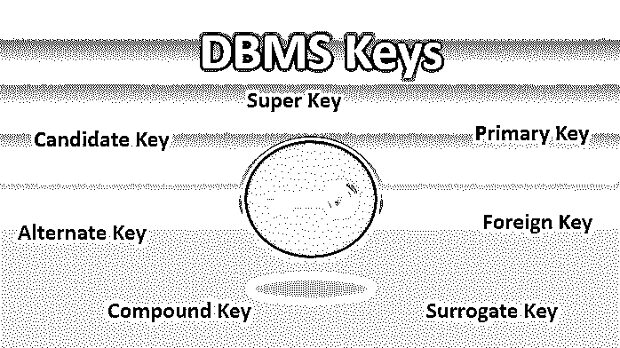
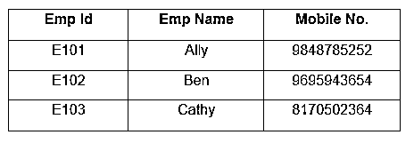
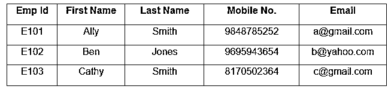
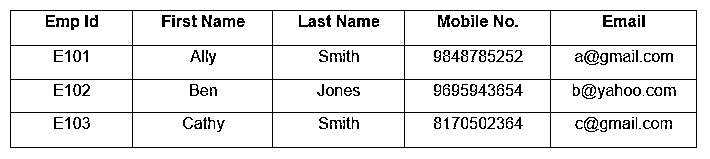
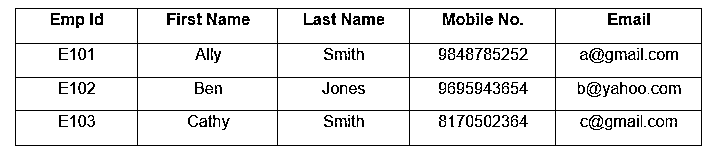
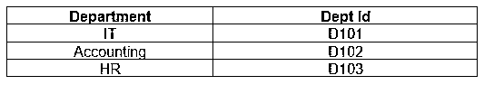
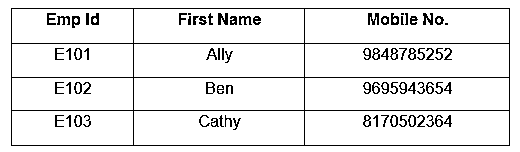
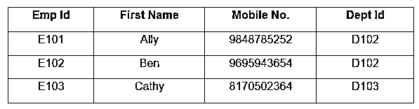
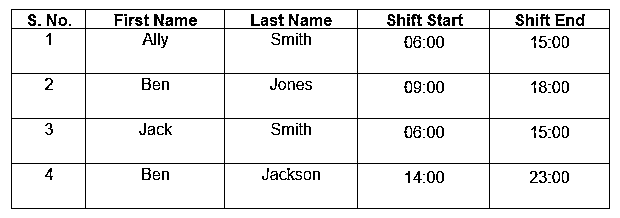

# DBMS 键

> 原文：<https://www.educba.com/dbms-keys/>

## DBMS 键介绍

DBMS 关键字或数据库管理系统关键字表示来自数据库系统中任何表的一个或多个属性(取决于所使用的 DBMS 关键字的类型),这导致对行和/或多于一列的组合进行区别性分类，以识别表中元组(行)之间的关系，或者确定两个表之间的关系，这适用于为分析或报告目的而识别和查询的表

### 数据库管理系统中不同类型的键

DBMS 中有很多键。让我们来看看重要的键及其功能。

<small>Hadoop、数据科学、统计学&其他</small>

1.  超级键
2.  候选关键字
3.  主关键字
4.  备用关键字
5.  外键
6.  复合键
7.  代理键

#### 1)超级键

超级键可以是单个键，也可以是一组键，帮助识别特定表中不同的行。超级键可以有额外的属性，这些属性对于不同的标识来说是多余的。

让我们看一个例子，其中 EmpId 和移动电话号码可以被认为是超级键。

#### 2)候选键

如果一个超级键没有任何重复的属性，它就是候选键。在考虑之后，从给定的候选键中仔细选择主键。要求所有表至少有一个候选键。关于候选键的选择，我们需要遵循一些规则。它们是:

*   候选关键字应该由不同的值组成。
*   候选关键字可以有各种属性。
*   候选关键字不能包含空值。
*   候选键必须唯一标识表中的每一行。

让我们看一个表的例子，其中 Emp Id、移动电话号码和电子邮件是候选键。这些键帮助我们清楚地识别表中的任何雇员行。

#### 3)主键

主键是关系中的一列或列的组合，它帮助我们唯一地标识特定表中的一行。主键中不能有重复项，这意味着表中不能有两个相同的值。我们有一些选择主键的规则。它们是:

*   主键字段不能为空，主键列必须包含一个值。
*   对于该列，表中的任何两行都不能有相同的值。
*   如果外键引用主键，则主键列中的任何值都不能更改或修改。

让我们看一个表的例子，其中 Emp Id 是主键。

#### 4)备用键

对于被选为主键的键，一个表可能有多个选项。任何能够成为主密钥，但此时不是主密钥的密钥都被称为备用密钥。它是尚未被选为主键的候选键。

让我们看一个例子，其中 EmpId、电子邮件和移动电话号码是候选键，并且能够成为主键。但是因为 Emp Id 是主键，所以 Email 和手机号成为备用键。

#### 5)外键

外键帮助我们建立与其他表的关系。它也被称为参照完整性。可以向表中添加外键列来建立这种关系。它们帮助我们维护数据完整性，并允许在两个实体的任何实例之间轻松导航。

让我们看一个包含两个表的例子，Employee 和 Department 表。

**表:部门**

**表:员工**

目前，我们不知道这些员工在哪个部门工作。通过将 DeptId 添加到 Employee 表中，我们可以在 Employee 表和 Department 表之间建立关系。这里，Employee 表的 DeptId 成为外键，Department 表的 DeptId 成为该表的主键。

**表:以 DeptId 为外键的雇员**

#### 6)复合键

复合键是一个主键，它不是由单个列组成，而是由两个或更多的列组成，这使我们能够清楚地识别特定的行。对于一个复合键，我们没有任何列本身是唯一的；因此，我们需要将两列或更多列组合起来，使它们具有唯一性。

让我们看一个由产品和产品细节组成的表的例子。在该表中，我们可以看到一个产品可以被多个客户订购，并且订单中可以有多个产品。因此，我们需要将 OrderId 和 ProductId 结合起来，以创建标识行的唯一方式。

**T2】**

 **#### 7)代理键

可能会出现特定表没有主键的情况。在这种情况下，我们使用代理键，它是一个人工键，可以清楚地标识表中的每一行。代理键专门用于我们没有自然主键的时候。它们不提供与表数据的任何关系，通常是顺序排列的整数。

在这个例子中，我们有雇员的数据和他们的轮班时间。因此，我们使用代理键来唯一标识每一行。

在本文中，我们已经看到了几个最重要的 DBMS 键，它们有什么不同以及何时使用。

### 推荐文章

这是一个 DBMS 键的指南。这里我们讨论数据库管理系统的键，包括超级键、主键、外键等，并给出例子。您也可以看看以下文章，了解更多信息–

1.  [数据库管理系统中的数据模型](https://www.educba.com/data-models-in-dbms/)
2.  [RDBMS 面试问题](https://www.educba.com/rdbms-interview-questions/)
3.  [数据集成工具](https://www.educba.com/data-integration-tool/)
4.  数据库管理系统专业化指南
5.  [DBMS 中聚合的完整指南](https://www.educba.com/aggregation-in-dbms/)

**