# MySQL 数据库修复

> 原文：<https://www.educba.com/mysql-database-repair/>

## MySQL 数据库修复简介

*   MySQL 数据库修复是当我们的数据库由于任何软件或硬件问题而被破坏或损坏时所遵循或使用的程序。
*   当出现这种缺陷时，我们可以使用 phpMyAdmin 修复数据库。
*   MySQL 数据库被称为关系数据库管理系统(RDBMS ),它是一种快速、可靠和安全的开源数据库。MySQL 基于 SQL(结构化查询语言)进行数据操作。
*   SQL 允许管理数据库中的记录，并与 MySQL 数据库中的其他数据库相关联。SQL 查询语言具有可靠、处理速度快、易于使用和易处理的特点来完成这种类型的结构。
*   MySQL 数据库软件是根据 GNU(通用公共许可证)条款和其他专有许可证提供的。
*   让我们来描述一下数据库，它被定义为一种数据组织，用于在服务器上存储大量的数据和信息。数据库由表和以列和行的形式插入这些表中的字段组成，这有助于以一种简单的方式组织数据。

### 如何修复 MySQL 数据库？

当我们第一次使用 phpMyAdmin 修复数据库时，我们需要访问 phpMyAdmin 工具并转到右侧窗格的 Databases 选项卡。您可以登录到您的 Cpanel 并打开 phpMyAdmin 选项，或者在 WAMP 上，您可以使用相同的 phpMyAdmin 工具。然后单击您想要使用的数据库的名称。您将在右侧窗格中看到这些表，选择要修复的表，并选中表左侧的复选框。在这之后，用选中的下拉菜单，你可以选择修复表选项。现在，表将被自动修复，您可以看到一个页面，其中显示了修复操作后的结果。

有时数据库可能会崩溃，所以我们需要不时地优化它。在本教程中，您将学习如何使用 phpMyAdmin 修复和优化数据库表。phpMyAdmin 是一个基于 PHP 的数据库工具，它为 MySQL 和 MariaDB 数据库的管理操作提供了易于使用的解决方案，这是当今一个非常成熟的软件替代方案。

<small>Hadoop、数据科学、统计学&其他</small>

#### 语法和示例

我们在 MySQL 数据库服务器中使用以下 SQL 语法来应用修复命令:

`REPAIR [NO_WRITE_TO_BINLOG | LOCAL] TABLE table_name [, table_name]…[QUICK] [EXTENDED] [USE_FRM]`

在这里，上面的查询将修复一个可能损坏的表，但对于某些存储引擎。

为此，我们需要为表选择和插入特权。

phpMyAdmin 提供了最强大的功能设计来管理数据，如浏览表、表结构、添加信息、搜索功能、删除数据等。

请注意，您应该拥有创建、修复、选择、插入或删除数据库的管理员权限。

**1。**如果你使用的是 WAMP 服务器，那么你也可以尝试用 SQL 命令执行编辑器。你可以下载 WAMP 或 XAMPP，这是免费的，并安装在您的系统上。在这之后，您已经运行了 localhost 来打开 WAMP 的主页。

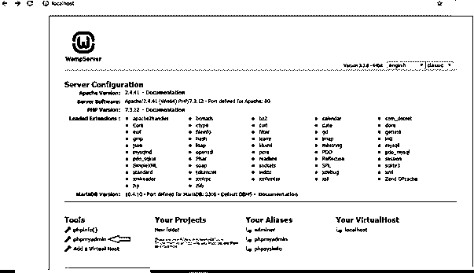

**2。**您将在 MySQL 服务器的 localhost 主页上找到 PHPmyadmin 选项，使用 root 作为用户名和密码(如果未设置，则为空),访问数据库并运行 SQL 查询语句。

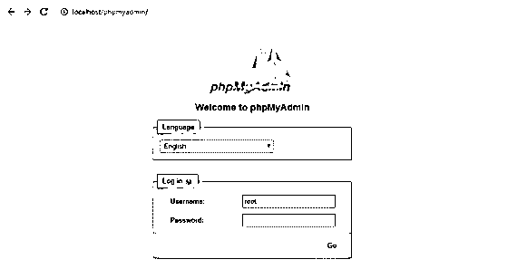

**3。**您可以管理数据库和表格，以访问任何字段的数据。

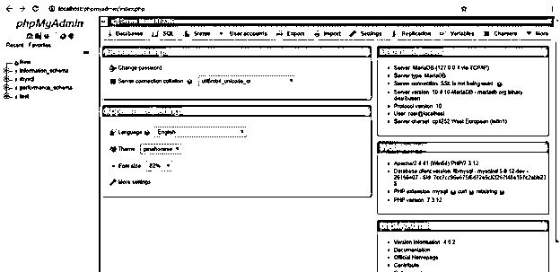

**4。**例如，在 WAMP 服务器上创建了数据库“PersonDb ”,如下所示:

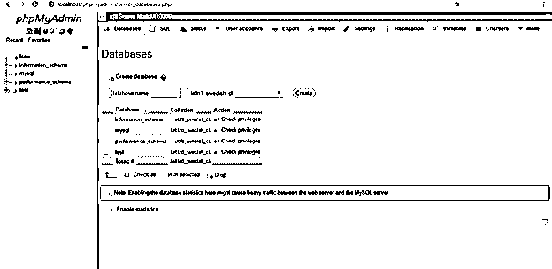

**5。**让我们首先使用以下查询创建一个名为“Customer_Data”的表:

**命令:**

`CREATE TABLE Customer_Data (ID int NOT NULL PRIMARY KEY, Name varchar(255) NOT NULL, Age int , Address varchar(255), Salary int );`

现在，让我们再次考虑通过以下 SQL 命令将一些演示数据插入到数据库“PersonDb”下创建的表“Customer_Data”中:

**命令:**

`INSERT INTO Customer_Data (ID, Name, Age,Address, Salary)
VALUES ('1', 'Erica Smith', '21', 'Norway',’20000’);`

我们可以使用 SELECT 语句查看表中的数据，如下所示:

**命令:**

`SELECT * FROM `customer_data`;`

**输出:**

**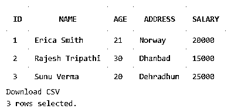

** 

**6。**假设我们需要修理这张桌子:

**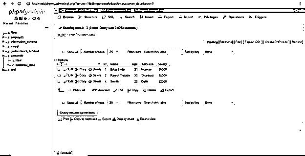

** 

**7。**然后，我们可以直接转到“数据库”选项卡，您可以看到数据库“PersonDb ”,单击该数据库，或者从左侧菜单中选择。可以查看表格结构列表:

**<u>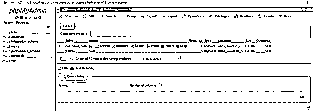

</u>** 

**8。**现在，选中表名旁边的框，在数据库 PersonDb 中选择要修复的表，如下所示:

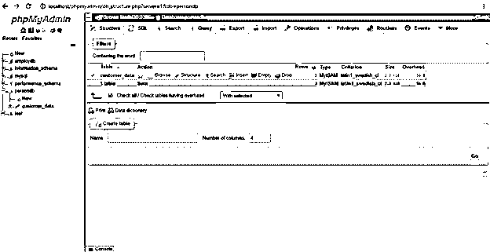

**9。**你可以在检查表上看到带有选中的下拉菜单，转到菜单选择修复表选项:

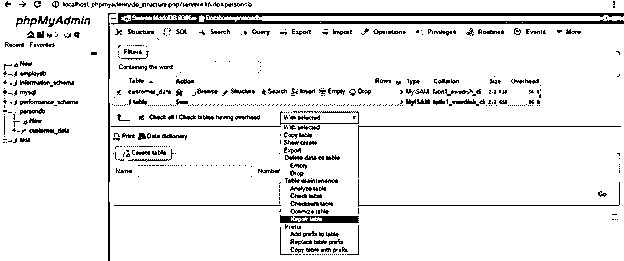

10。在此之后，您将被重定向到显示结果状态的页面，该页面显示表格已成功修复并且正常:

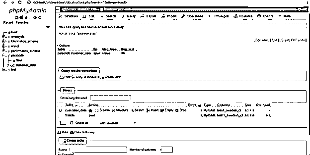

**11。**这就是我们如何修复或数据库。此外，您可以使用以下命令对数据库使用 SQL 查询语句来修复表，如下所示:

**命令:**

`REPAIR TABLE customer_data;`

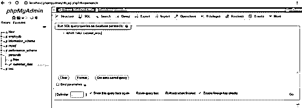

这是我们在编辑器中编写 SQL 查询并单击 Go 按钮运行命令的输出:

**输出:**

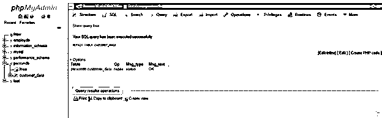

您可以看到，带有 customer_data 表的数据库 PersonDb 被修复，消息状态为 OK，后跟一条成功消息，表明 SQL 查询已成功执行。这就是修复数据库的过程。

**Note:** It is important to take a backup of your database before you proceed to repair it. In some circumstances, you may get data loss.

### 结论

*   MySQL 数据库应用程序用于许多决策，如电子商务、数据仓库和保存和存储记录的日志应用程序。但是 MySQL 数据库最重要的用途是 Web 数据库。
*   phpMyAdmin 今天在管理工作中变得如此受欢迎是因为各种各样的原因，比如用户友好的界面，允许我们管理 MySQL 和 MariaDB，可以选择导入 SQL 或 CSV 格式的数据，也可以导出 SQL、PDF、CSV、XML 和其他格式的数据。
*   phpMyAdmin 与许多操作系统兼容，还允许查看实时活动图表，并通过 CPU/RAM、物理内存使用和其他服务器进程监控 MySQL 服务器。

### 推荐文章

这是一个 MySQL 数据库修复指南。这里我们讨论 MySQL 数据库修复的介绍和实际例子以及不同的子查询表达式。您也可以浏览我们推荐的文章，了解更多信息——

1.  [MySQL 操作符介绍](https://www.educba.com/mysql-operators/)
2.  [最大差异——吉拉 vs Github](https://www.educba.com/jira-vs-github/)
3.  [前 23 个 MySQL 字符串函数](https://www.educba.com/mysql-string-functions/)
4.  [MySQL 与 SQLite | 14 大对比](https://www.educba.com/mysql-vs-sqlite/)
5.  [MySQL 时间戳指南](https://www.educba.com/mysql-timestamp/)
6.  MySQL 中的 IF 语句

