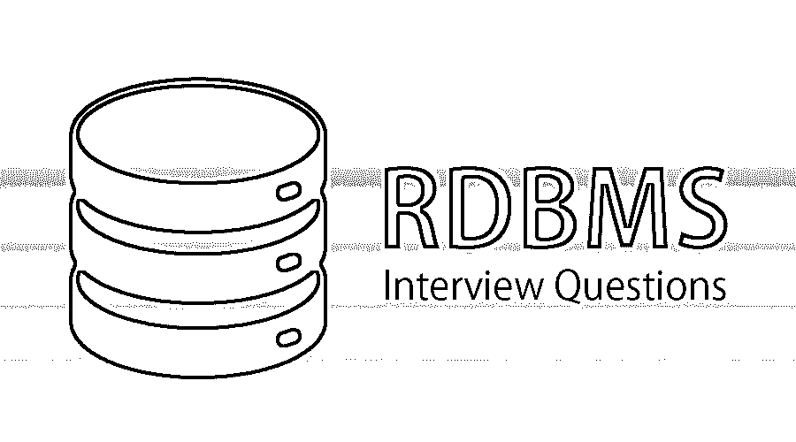
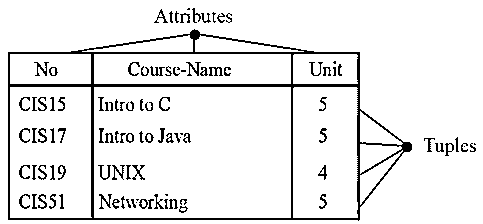
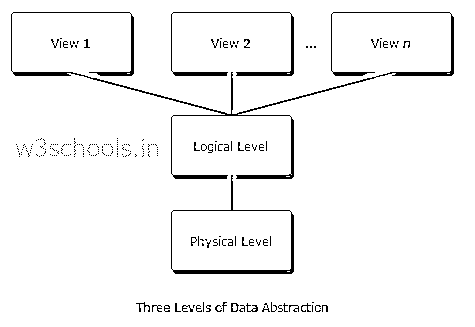

# RDBMS 面试问题

> 原文：<https://www.educba.com/rdbms-interview-questions/>

## RDBMS 面试问答介绍

所以如果你在准备 RDBMS 的工作面试。我相信你想知道最常见的 2022 RDBMS 面试问题和答案，这些问题和答案将帮助你轻松应对 RDBMS 面试。以下是 RDBMS 面试中常见问题和答案的列表。

因此，我们倾向于添加 2022 年 RDBMS 面试中最常被问到的问题

<small>Hadoop、数据科学、统计学&其他</small>

#### 1.RDBMS 有哪些不同的特性？

**答案:**
姓名。关系数据库中的每个关系都应该有一个在所有其他关系中唯一的名称。
属性。关系中的每一列称为一个属性。
元组。关系中的每一行都称为一个元组。元组定义属性值的集合。

#### 2.解释一下 E-R 模型？

**答案:**
E-R 模型是一种实体-关系模型。E-R 模型基于由实体和相关对象组成的真实世界。实体在数据库中由一组属性来表示。

#### 3.定义面向对象模型？

**答案:**
面向对象的模型是基于对象的集合。对象容纳存储在对象内部的实例变量中的值。具有相同类型的值和完全相同的方法的对象被组合成类。

#### 4.解释数据抽象的三个层次？

**答案:**
1。**物理层:**这是最低的抽象层，它描述了数据是如何存储的。
2。**逻辑层:**下一个抽象层是逻辑层，它描述了数据库中存储的是什么类型的数据以及这些数据之间的关系。
3。视图级别:最高的抽象级别，它描述了唯一的整个数据库。

https://www.w3schools.in/dbms/data-schemas/

#### 5.关系数据库有哪些不同的 Codd 的 12 条规则？

**答案:**
Codd 的 12 条规则是由 Edgar F. Codd 提出的一组十三条规则(编号从零到十二)。
Codd 的规则:–
**规则 0:** 系统必须符合关系、数据库以及管理系统的标准。
**规则 1:** **信息规则:**数据库中的每一条信息都要唯一表示，主要是表中不同行内列位置的名称值。
**规则二:** **保证访问规则:**所有数据必须是访问的。它说数据库中的每个标量值必须是正确的/逻辑上可寻址的。
**规则三:****null 值的系统化处理:**DBMS 必须允许每个元组保持 null。
**规则四:** **基于关系模型的主动在线目录(数据库的结构):**系统必须支持在线、关系等。结构，该结构通过允许的用户的常规查询来访问他们。
**规则五:** **综合数据子语言:**系统至少要辅助一种关系语言，即:
1。具有线性语法
2。它既可以交互使用，也可以在应用程序中使用。它支持数据定义操作(DDL)、数据操作操作(DML)、安全性和完整性约束以及事务管理操作(开始、提交和回滚)。
**规则六:** **视图更新规则:**所有理论上改进的视图都必须是系统可升级的。
**规则七:** **高层插入、更新、删除:**系统必须支持插入、更新、删除操作符。
**规则 8:** **物理数据独立性:**修改物理层(数据如何存储，使用数组还是链表等。)必须不需要对应用程序进行修改。
**规则 9:** **逻辑数据独立性:**修改逻辑层次(表格、列、行等。)必须不需要对应用程序进行修改。
**规则 10:** **完整性独立性:**完整性约束必须从应用程序中单独识别，并存储在目录中。
**规则 11:** **分发独立性:**数据库各部分向不同位置的分发不应该对数据库的用户可见。
**规则 12:** **不可颠覆规则:**如果系统提供了一个底层(即记录)接口，那么这个接口就不能用来颠覆系统。

#### 6.什么是正常化？又是什么解释了不同的规范化形式？

**答案:**
数据库规范化是一个组织数据以尽量减少数据冗余的过程。这反过来又确保了数据的一致性。存在许多与数据冗余相关的问题，例如磁盘空间浪费、数据不一致、DML(数据操作语言)查询变慢。有不同的规格化形式:–1NF，2NF，3NF， [BCNF](https://www.educba.com/bcnf/) ，4NF，5NF，ONF，DKNF。
1。**1NF:–**每一列中的数据应该是用逗号分隔的原子序数多值。该表格不包含任何重复的列组。使用主键唯一标识每个记录。
2。**2NF:–**该表应该匹配 1NF 的所有条件，并将冗余数据移动到单独的表中。此外，它使用外键在这些表之间创建了一个关系。
3。**3NF:–**一个 3NF 表应该满足 1NF 和 2NF 的所有条件。3NF 不包含部分依赖于主键的属性。

#### 7.定义主键，外键，候选键，超级键？

**答案:**
**主键:**主键是不允许重复值和空值的键。主键可以在列级或表级定义。每个表只允许有一个主键。
**外键:**外键只允许引用列中存在的值。它允许重复值或空值。它可以被定义为列级或表级。它可以引用唯一/主键的列。
**候选键:**候选键是最小超键，没有合适的候选键属性子组可以成为超键。
**超级键:**超级键是关系模式的一组属性，模式的所有属性都部分依赖于它。任何两行都不能有相同的超级键属性值。

#### 8.什么是不同类型的索引？

**答案:**
索引是:–
**聚簇索引:–**是数据在磁盘中物理存储的索引。因此，只能为数据库表创建一个聚集索引。
**非聚集索引:–**它不定义物理数据，但定义了逻辑顺序。通常，B 树或 B+树就是为此目的而创建的。

#### 9.RDBMS 的优势是什么？

**答案:**
【控制冗余度。
·可以强制执行完整性。
不一致是可以避免的。
·数据可以共享。
可以强制执行标准。

#### 10.说出 RDBMS 的一些子系统？

**答案:**
输入输出、安全、语言处理、存储管理、日志记录和恢复、分配控制、事务控制、内存管理。

#### 11.什么是缓冲区管理器？

**答:**
缓冲区管理器负责将数据从磁盘存储器收集到主存储器中，并决定将哪些数据放在高速缓冲存储器中以进行更快的处理。

### 推荐文章

这是 RDBMS 面试问题列表的指南。这里我们列出了最有用的 10 组面试问题，这样求职者就能轻松应对面试。您也可以阅读以下文章，了解更多信息——

1.  [最重要的数据分析面试问题](https://www.educba.com/data-analytics-interview-questions/)
2.  [13 个惊人的数据库测试面试问题](https://www.educba.com/database-testing-interview-questions/)
3.  [十大设计模式面试问题](https://www.educba.com/design-pattern-interview-questions/)
4.  [5 个有用的 SSIS 面试问题及答案](https://www.educba.com/ssis-interview-questions/)

