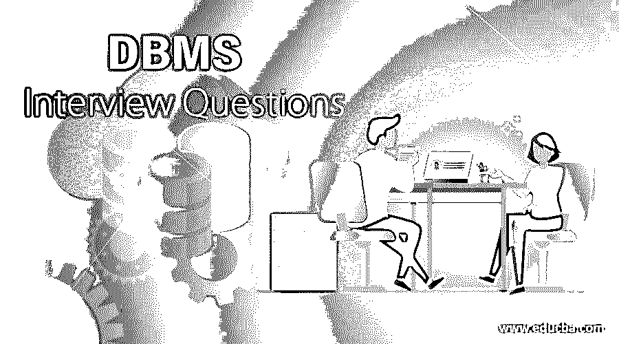

# DBMS 面试问题

> 原文：<https://www.educba.com/dbms-interview-questions/>

## DBMS 面试问答介绍

数据库管理系统(DBMS)是 IT 行业中用于管理或创建系统中任何数据库的关键软件之一。DBMS 主要为程序员或特定用户提供了一个很大的工具，通过使用一些系统的方法来创建、更新、删除或存储数据。

如果是找 DBMS 相关的工作，需要准备 2022 DBMS 面试题。的确，每个面试都因不同的职位而不同。在这里，我们准备了重要的 DBMS 面试问题和答案，将帮助您在面试中取得成功。

<small>Hadoop、数据科学、统计学&其他</small>

在这篇 2022 年 DBMS 面试问题的文章中，我们将介绍 10 个最重要和最常见的 DBMS 面试问题。这些面试问题分为以下两部分:

### 第 1 部分 DBMS 面试问题(基础)

这第一部分包括基本的面试问题和答案。

#### Q1。DBMS 是各种数据库的流行管理系统之一，请详细说明数据库管理系统(DBMS)可以在哪里使用以及如何使用？

**答案:**
DBMS 被称为数据库管理系统。使用应用系统的主要目的之一是围绕行业中可用的各种数据。这是一个关键系统，帮助用户系统地存储多种数据，定义数据的特征，并在需要时顺利检索，以正确更新相应数据库中的特定数据。

#### Q2。我们通常会说我们需要数据库来存储和处理数据。定义是什么，或者数据库的确切含义是什么？

**答案:**
数据库可以用多种方式定义。简而言之，我们可以说数据库主要处理多种类型数据的收集，以一种明确的组织方式存储这些数据，为用户顺利检索这些数据提供关键的便利。它还可以管理特定用户对数据的适当访问，并确保正确上传关键数据。

#### Q3。就 DBMS 的利用而言，有许多用途。解释在数据库管理系统中推荐使用什么，或者具体解释正确使用数据库管理系统的主要优点？

**答:**
下面给出了使用 DBMS 的一些关键优势:

*   **冗余管理:** DBMS 主要用于支持一种关键机制，通过将数据库集成到一个特定的单个数据库中来控制其中一个数据库内的数据冗余。由于数据已经存储在一个单一的数据库中，所以没有重复的机会。
*   **数据共享**:在 DBMS 的情况下，可以与属于不同角色的多个用户共享全部数据，这些用户被定义为数据库管理员。此外，多个用户可以共享同一个数据库。
*   数据的备份和恢复功能。
*   确保维持适当的完整性约束。
*   保持多个数据的完全独立性。

#### Q4。DBMS 遵循数据规范化的共同特征之一。使用规范化的目的是什么，尤其是在 DBMS 推荐的情况下？

**回答:**
在当前的 IT 行业中，一个 DBMS 测试人员通常需要遵循的几个职责。规范化是关系数据库管理系统(RDBMS)的关键特性之一。这是分析多个关系模式的重要过程之一，在这些关系模式中，基于它们不同的功能观点，它们具有一些依赖性，并且必须维护一个主键来定义一些键属性。

属性如下所示:

*   集中精力尽可能减少数据冗余。
*   确保最大限度地减少删除、更新或插入数据异常。

#### Q5。详细解释一下数据库管理系统(DBMS)中可用的语言？

**答案:**
DBMS 中有几种语言可用:

*   **DDL:** DDL 被定义为一种数据定义语言。这用于正确定义数据库和模式，通过创建、截断、修改、重命名和删除来正确维护一些模式结构。
*   DCL: DCL 代表数据控制语言。它通过使用一些关键的 SQL 查询(如 REVOKE 或 GRANT)来控制多个用户对其中一个数据库的访问。
*   **DML:** DML 代表数据操作语言；它已经被用于通过使用一些关键的 SQL 查询 INSERT 或 DELETE 来操作单个数据库中的可用数据。其他 SQL 查询集也可以被视为 DML，如 SELECT、DELETE、INSERT 或 UPDATE。

### 第 2 部分 DBMS 面试问题(高级)

现在让我们来看看高级面试的问题和答案。

#### Q6。SQL 是执行各种数据操作的主要功能之一，尤其是在 DBMS 中。解释一下在 DBMS 中使用 SQL 的具体目的？

**答案:**
SQL 基本上被称为结构化查询语言。使用它们的主要目的之一是以某种形式与特定定义的关系数据库之一交互，以便从已定义的数据库中插入、删除或更新数据。

#### Q7。详细解释一下对于任何数据库，DBMS 中主键和外键的常见概念？

**答案:**
主键和外键主要用于任何一种关系数据库管理系统。主键基本上是确保一个特定表的完整性和整个数据的安全性，确保该数据库表中特定记录的唯一标识。而外键主要维护该表的一个特定列与另一个特定于表的列的关系，其中另一个特定于表的列将是该表的主键。

#### Q8。详细解释数据库管理系统环境的主键和唯一键之间的区别？

**答:**
主键和唯一键的一些关键区别定义如下:

*   主键和唯一键之间的主要区别之一是，主键永远不会接受表中特定列的任何类型的空值，而唯一键可以接受特定列的空值。
*   一个表应该有一个主键，而一个唯一键在一个表中可以有多个。

#### Q9。子查询是其中的一个大概念。详细解释一下子查询，特别是在 SQL 查询方面？

**答案:**
这是 DBMS 面试中问得最多的面试问题。当前 IT 行业流行的一些测试案例。子查询是在其他查询中编写查询的概念之一。它还有一个流行的名字叫做内部查询，实际上属于外部查询。

#### Q10。请更详细地说明 DROP、DELETE 和 TRUNCATE 命令之间的区别。

**答案:**
DROP、Delete、Truncate 是一些非常常用的 SQL 查询。

*   **DROP:** 删除数据库中包含整个结构的表。
*   **删除:**删除表格的某个特定行，而不是数据库的结构。
*   **TRUNCATE:** 截断数据库中可用的全部数据，但不删除表的结构。

### 推荐文章

这是一个 DBMS 面试问题和答案的指南，以便候选人可以轻松地解决这些面试问题。在本帖中，我们研究了面试中经常被问到的顶级 DBMS 面试问题。您也可以阅读以下文章，了解更多信息——

1.  [IT 面试问题](https://www.educba.com/it-interview-questions/)
2.  [计算机架构面试问题](https://www.educba.com/computer-architecture-interview-questions/)
3.  [SAP ABAP 面试问题](https://www.educba.com/sap-abap-interview-questions/)
4.  [区块链面试问题](https://www.educba.com/blockchain-interview-questions/)

