# MySQL 聚合函数

> 原文：<https://www.educba.com/mysql-aggregate-function/>

## MySQL 聚合函数简介

在数据查询语言中，我们通常将这些聚合函数与 SELECT 语句一起使用。聚合函数对多个值执行计算，并返回单个值，如所有值的总和、特定值组中的最大值和最小值。

**示例:**如果我们必须计算一个产品在一个月内的总销售额，那么我们必须使用“SUM”函数将所有销售额相加。同样，使用“MAX”和“MIN”函数，我们可以得到该月的最高和最低销售额。除“计数”函数外，聚合函数忽略空值。Count 函数返回观察值的总数。HAVING 子句与 GROUP BY 一起使用，用于使用聚合值筛选查询。

<small>Hadoop、数据科学、统计学&其他</small>

### 前 11 个聚合函数

以下是一些 MySQL 集合函数，解释如下:

1.  AVG()函数
2.  COUNT()函数
3.  Sum()函数
4.  Max()函数
5.  MIN()函数
6.  独特()函数
7.  GROUP_CONCAT()函数
8.  VAR()函数
9.  STDEV()函数
10.  BIT_AND()函数
11.  BIT_OR()函数

| **节** | **名称** | **标记** |
| Sec-A | 斯图亚特王室的 | Ninety |
| Sec-B | 文斯 | Eighty-six |
| Sec-C | 约翰 | Ninety-four |
| Sec-A | 米歇尔 | Seventy-eight |
| Sec-C | 知更鸟 | Sixty |
| Sec-A | 萨拉 | Eighty-six |
| Sec-B | 彼得（男子名） | Ninety-two |
| Sec-C | 伊恩 | Eighty-nine |
| Sec-A | 大卫 | Seventy-six |

#### 1.AVG()函数

这是一个平均函数。该函数计算一组值的平均值。它在计算中忽略空值。

因为得到了所有学生的平均分。

**查询:**

`SELECT AVG(marks) AS avg_marks FROM student;`

**输出:**

如果我们想要学生在每个部分的平均分数，那么我们可以使用 AVG()和 GROUP BY 函数。

**查询:**

`SELECT section, AVG(marks) AS avg_marks FROM student GROUP BY section;`

**输出:**

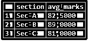

#### 2.COUNT()函数

COUNT()函数返回一组值中观察值的总数/值的总数。

如果我们在上面获取学生人数的例子中执行这个函数，

**查询:**

`SELECT COUNT(name) AS total_students FROM student;`

**输出:**

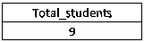

为了获得每个部分的学生人数，

**查询:**

`SELECT section, COUNT(name) AS total_students FROM student GROUP BY section;`

**输出:**

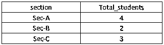

#### 3.Sum()函数

SUM()函数返回集合中所有值的总和。为了得到所有学生的分数总和，

**查询:**

`SELECT SUM(marks) AS total_marks FROM student;`

**输出:**

所有学生的分数总和，

**查询:**

`SELECT section, SUM(marks) AS total_marks FROM student GROUP BY section;`

**输出:**

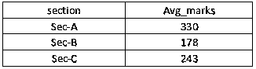

#### 4.Max()函数

max()函数返回一组值中的最大值。要从学生数据库中找到考试中的最高分，下面的查询可以给出我们想要的输出:

**查询:**

`SELECT name, MAX(mark) AS highest_mark FROM student;`

**输出:**

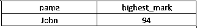

在同样的过程中，我们可以找出每个部分的最大分数。

**查询:**

`SELECT section, name, MAX(mark) AS highest_mark FROM student GROUP BY section;`

#### 5.MIN()函数

MIN()函数返回一组值中的最小值。这不考虑空值。学生中得分最低的，

**查询:**

`SELECT name, MIN(mark) AS lowest_mark FROM student;`

**输出:**
T3】

这也可以与 GROUP BY 函数一起使用。

#### 6.独特()函数

此函数通常与 COUNT 函数一起使用，以获得值集中唯一值的数量。我们也可以简单地使用这个独特的函数来获得唯一的值。

**查询:**

`SELECT DISTINCT (section) FROM student;`

**输出:**

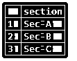

使用 DISTINCT 和 COUNT()函数进行查询。

**查询:**

`SELECT COUNT(DISTINCT(section)) FROM student;`

**输出:**

#### 7.GROUP_CONCAT()函数

这用于连接一个属性的所有字符串值，合并到一个索引中。

**查询:**

`SELECT GROUP_CONCAT(name SEPARATOR ‘;’) FROM student;`

**输出:**

像这个 GROUP_CONCAT()一样，我们也使用另一个函数 CONCAT()，它将两组字符串值合并到一个新列中。

**举例:**

如果在这个名称数据库中我们使用函数 CONCAT()，

**查询:**

`SELECT first_name, last_name, CONCAT(first_name,’ ‘,last_name) as full_name FROM name;`

**输出:**

#### 8.VAR()函数

此方差函数返回指定列的总体标准方差。

方差是对数据集中数字之间分布的度量。它是通过每个数字离平均值的距离来计算的，因此也就是离集合中的每个数字的距离。

**差异:**

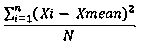

**查询:**

`SELECT VAR(mark) AS variance FROM student;`

**输出:**

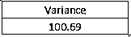

#### 9.STDEV()函数

标准差是对一组值的变化量或离差的度量。这表示一个组的成员与该组的平均值相差多少。这是通过计算方差的平方根来计算的。

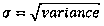

该函数返回指定列的总体标准差。

**查询:**

`SELECT STDEV(mark) AS std_deviation FROM student;`

**输出:**

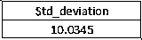

#### 10.BIT_AND()函数

此函数返回指定行的逐位 AND。这将返回通过参数传递的相同数据类型。

如果每行的位都是 1，那么只有它返回 1，否则返回 0。

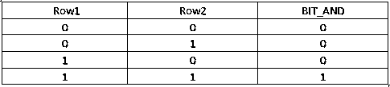

**查询:**

`SELECT BIT_AND( CAST(row_value VariableBIT) ) FROM student.list('0001,0111,0100,0011');`

**输出:**

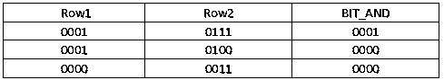

#### 11.BIT_OR()函数

返回每组行的指定表达式的按位 OR 值。

**查询:**

`SELECT BIT_OR( CAST(row_value AS VariableBIT) )
FROM student.list('0001,0111,0100,0011');`

0111 的结果确定如下:

*   在第 1 行(0001)和第 2 行(0111)之间执行按位“或”运算，得到 0111。
*   对前一次比较的结果(0111)和第 3 行(0100)进行按位“或”运算，得到 0111。
*   对前一次比较的结果(0111)和第 4 行(0011)进行按位“或”运算，得到 0111。

### 结论

从分析角度和提取过程来看，这些聚合函数非常重要。具体来说，当我们在查询中给定一个条件或使用 windows 函数时，聚合函数起主要作用。一些函数，如极限、秩等。GROUP BY 子句总是带有聚合函数。

### 推荐文章

这是一个 MySQL 聚合函数的指南。这里我们讨论 11 种不同类型的 MySQL 聚合函数及其实现。您也可以阅读以下文章，了解更多信息——

1.  [MySQL vs SQLite](https://www.educba.com/mysql-vs-sqlite/)
2.  [在 MySQL 中插入命令](https://www.educba.com/insert-in-mysql/)
3.  [在 MySQL 中选择](https://www.educba.com/select-in-mysql/)
4.  [MySQL 间](https://www.educba.com/mysql-between/)

