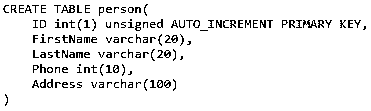
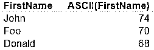
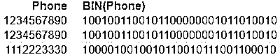
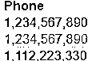
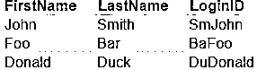
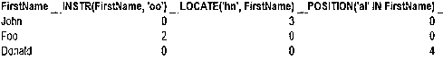
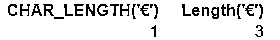
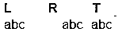
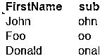
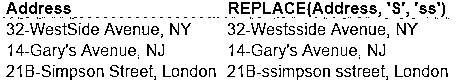

# MySQL 字符串函数

> 原文：<https://www.educba.com/mysql-string-functions/>

## MySQL 字符串函数简介

MySQL 有许多预定义的字符串函数集，可以应用于字符串字符，以便在 SQL 编程场景中执行一些操作。一些常用的操作用于获取字符串最右边部分的字符数，CONCAT 用于字符串连接，SPACE 用于获取字符串中空格字符数的返回值，INSERT 用于在另一个字符串中插入一个新字符串，该字符串特定于要插入的字符数的位置，等等。

为了说明各种 MySQL 字符串函数，我们首先需要创建一个数据库。以下数据库将在所有示例中引用:

<small>Hadoop、数据科学、统计学&其他</small>

### MySQL 字符串函数

字符串函数很好用。这里我们将借助例子讨论如何在 MySQL 编程中使用字符串函数

#### 1.ASCII(字符串)

返回字符串 *str* 最左边字符的 ASCII 值。

`Select FirstName, ASCII(FirstName) from Person`

#### 2.BIN(N)

返回 N 的二进制等效值，其中 N 是 Int/BigInt。

`Select Phone, BIN(Phone) from Person`

#### 3.比特长度

以位为单位返回字符串 *str* 的长度。

`Select FirstName, BIT_LENGTH(FirstName) from Person`

#### 4.字符长度(字符串)

以字符为单位返回字符串 *str* 的长度。

`Select FirstName, CHAR_LENGTH(FirstName) from Person`

#### 5.CONCAT(str1，str2，…，strn)

返回由 str1 和 strn 连接而成的字符串。如果任何子字符串为空，则结果为空。

`Select FirstName, LastName, CONCAT(FirstName, LastName) as DisplayName from Person`

#### 6.CONCAT_WS(分隔符，str1，…，strn)

返回由分隔符分隔的串联字符串。

`Select FirstName, LastName, CONCAT_WS(' ', FirstName, LastName) as DisplayName from Person`

`Select FirstName, LastName, CONCAT_WS(', ', LastName, FirstName) as DisplayName from Person`

#### 7.字段(str，str1，str2，…，strn)

返回 str1 到 strn *中字符串 str 的索引位置。如果没有找到，返回 0。*

`Select FirstName, LastName, FIELD('John', FirstName, LastName) as IsJohn from Person`

#### 8.格式(x，D)

将数字 X 格式化为' #，###，###。## '显示。d 是小数位数。默认情况下，格式为 en-US。

`Select FORMAT(Phone, 0) as Phone from Person`

#### 9.十六进制(字符串)/非十六进制(十六进制字符串)

返回字符串 str 的十六进制等效形式。UNHEX 返回实际的字符串。

`Select FirstName, HEX(FirstName) from Person`

#### 10.INSERT(str，pos，len，newstr)

用 newstr 替换字符串 str 中从位置 pos 开始且长度为 len 的子字符串。

`Select FirstName, LastName, INSERT(LastName, 3, 20, FirstName) as LoginID from Person`

#### 11.INSTR(str，substr) / LOCATE(substr，str)/POSITION(str 中的 substr)

返回 str 中 substr 第一次出现的位置。

`Select FirstName, INSTR(FirstName, 'oo'), LOCATE('hn', FirstName), POSITION('al' IN FirstName) from Person`

#### 12.LCASE() / LOWER()和 UCASE() / UPPER()

将字符串转换为小写和大写。

`Select FirstName, LOWER(FirstName) as Lower, UPPER(FirstName) as Upper from Person`

#### 13.左(字符串，长度)/右(字符串，长度)

从字符串 str 中返回最左边和最右边的 len 字符。

`Select FirstName, LastName, CONCAT(LEFT(LastName, 3), RIGHT(FirstName, 2)) as LoginID from Person`

#### 14.长度(字符串)/八位字节长度(字符串)

以字节为单位返回字符串 str 的长度。这很像 CHAR_LENGTH 函数。当字符串中有多字节字符时，就会有所不同。

`Select CHAR_LENGTH('€'), Length('€')`

这是因为欧元符号占用了 3 个字节的内存。

#### 15.LPAD(str，len，padstr) / RPAD(str，len，padstr)

从字符串 padstr 的位置 0 开始，在字符串 str 的开头和结尾插入子字符串，直到结果字符串为 len 个字符。

`Select FirstName, LastName, LPAD(CONCAT_WS(' ', FirstName, LastName), Char_Length(CONCAT_WS(' ', FirstName, LastName))+Char_Length('Mr. '), 'Mr. ') as DisplayName from Person`

#### 16.LTRIM(str) / RTRIM(str) / TRIM(str)

从左、右或两端修剪空格后返回字符串 str。

`Select LTRIM('    abc    ') as L, RTRIM('    abc    ') as R, TRIM('    abc    ') as T`

#### 17.MID(str，pos，len) / SUBSTRING(str，pos，len)

从长度为 len 的位置 pos 开始，返回字符串 str 中的子字符串。

`Select FirstName, SUBSTRING(FirstName, 2, 4) as a sub from Person`

#### 18.报价(字符串)

该查询对字符串 str 加引号和不加引号。特殊字符被转义。

`Select Address, QUOTE(Address) from Person`

#### 19.REPLACE(str，from_str，to_str)

在字符串 str *中，用子字符串 to_str 替换所有出现的子字符串 from_str。*区分大小写。

`Select Address, REPLACE(Address, 'S', 'ss') from Person`

#### 20.反向(字符串)

反转字符串 str。

`Select FirstName, REVERSE(FirstName) from Person`

#### 21.空间(N)

这个挺搞笑的。它只是返回一串 N 个空格。现在我在想是什么让他们创造了这个功能！反正你自己试试。

#### 22.SUBSTR(str，pos)/substrin(str，pos)/SUBSTR(str，pos，len)/substrin(str，pos，len)

从位置 pos 开始返回字符串 str 中的子字符串，如果没有指定 len，则返回到末尾；否则返回 len 字符。记住，在 MySQL 中 Index 是从 1 开始的。

`Select FirstName, LastName, SUBSTR(FirstName, 2), SUBSTRING(LastName, 2, 2) from Person`

#### 23.SUBSTRING_INDEX(字符串，分隔符，计数)

从字符串 str 中返回出现次数在 delim 字符之前或之后的子字符串。如果计数为正，则返回该事件之前的子字符串。如果计数为负，则返回该事件之后的子字符串。

`Select Address, SUBSTRING_INDEX(Address, '-', 1) as House, SUBSTRING_INDEX(Address, ',', 1) as Street, SUBSTRING_INDEX(Address, ',', -1) as City from Person`

### 结论

那么，发现这些功能有帮助吗？这些对您解决您的使用案例有帮助吗？我相信他们会的。不仅仅是字符串函数，MySQL 内置函数也是在最少的查询中获得结果的好方法，从而重用现有代码并充分利用框架的能力。

### 推荐文章

这是 MySQL 字符串函数的指南。在这里，我们讨论了基本的介绍以及如何使用字符串函数在 MySQL 编程的帮助下的例子和代码实现。您也可以阅读以下文章，了解更多信息——

1.  [不同类型的 MySQL 操作符](https://www.educba.com/mysql-operators/)
2.  [如何安装 MySQL？](https://www.educba.com/install-mysql/)
3.  [MySQL 的基本高级命令。](https://www.educba.com/mysql-commands/)
4.  [备忘单 MySQL](https://www.educba.com/cheat-sheet-mysql/)
5.  [如何在 MySQL 中实现 Insert 命令？](https://www.educba.com/insert-in-mysql/)

