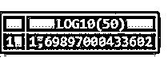
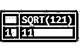

# MySQL 数学函数

> 原文：<https://www.educba.com/mysql-math-functions/>

## MySQL 数学函数简介

在 MySQL 中，我们可以找到几个内置的命令函数，包括字符串、日期、数字以及其他高级类型的 MySQL 函数。MySQL 数学函数是 MySQL 内置函数，它引用数值型函数和命令来操作数学逻辑。MySQL 中的数学函数是在 SQL 查询命令中使用的数值函数，主要用于数学计算，并产生数值文本作为结果。这些数学函数执行数值处理，但是如果在查询实现期间接收到错误事件，那么它将返回空值作为输出。对于各种 MySQL 数学函数，我们使用参数来执行不同的逻辑运算，并在 MySQL 服务器中显示数值。

### 各种 MySQL 数学函数及示例

下面给出了各种数学函数及其各自的详细参考信息，并描述了它们在数学运算中的效用和函数作用:

<small>Hadoop、数据科学、统计学&其他</small>

#### 1.ABS()函数

此数学函数对于返回作为参数提供的数值表达式的通用值或固定值非常有用。

**代码:**

`SELECT ABS(4);`

**输出:**

#### 2.ACOS()函数

它返回一个数值的反余弦值，但如果该值不在-1 到 1 的范围内，则返回 NULL。

**代码:**

`SELECT ACOS(2);`

**输出:**

#### 3.ASIN()函数

它给出一个数值的反正弦，但是如果该值不在-1 到 1 的范围内，则返回 NULL。

**代码:**

`SELECT ASIN(-1);`

**输出:**

#### 4.ATAN()函数

它给出数值的反正切。

**代码:**

`SELECT ATAN(2);`

**输出:**

#### 5.ATAN2()函数

它给出给定两个变量的反正切。

**代码:**

`SELECT ATAN2(2,4);`

**输出:**

#### 6.BIT_AND()函数

它输出给定表达式中的位和所有位。

**代码:**

`SELECT BookName, BIT_AND(Price) BITS FROM Books GROUP BY BookName;`

#### 7.BIT_COUNT 函数

它显示指定二进制值的字符串说明。

**代码:**

`SELECT BIT_COUNT(3) AS Three, BIT_COUNT(5) AS FIVE;`

**输出:**

#### 8.BIT_OR()函数

它对传递的表达式中提供的每个位进行按位“或”运算。

**代码:**

`SELECT BookName, BIT_OR(Price) BITS FROM Books GROUP BY BookName;`

#### 9.CEIL()函数

它会产生不小于所提供数值参数的最小整数值。

**代码:**

`SELECT CEIL(-2.56);`

**输出:**

#### 10.CEILING()函数

它会产生不小于所提供数值参数的最小整数值。

**代码:**

`SELECT CEILING(4.37);`

**输出:**

#### 11.CONV()函数

将数值从一个基数改变到另一个基数是有帮助的。

**代码:**

`SELECT CONV(4,12,3);`

**输出:**

#### 12.COS()函数

它提供需要以弧度表示的指定数值的余弦值。

**代码:**

`SELECT COS(65);`

**输出:**

#### 13.COT()函数

它提供指定数值的余切。

**代码:**

`SELECT COT(180);`

**输出:**

#### 14.度数()函数

它返回从弧度转换为角度的值。

**代码:**

`SELECT DEGREES(PI());`

**输出:**

#### 15.EXP()函数

它提供自然对数的底数(即“e”)，乘以给定参数的幂。

**代码:**

`SELECT EXP(5);`

**输出:**

#### 16.FLOOR()函数

该函数给出最大的整数值，该值不大于传递给它的数值。

**代码:**

`SELECT FLOOR(9.23);`

**输出:**

#### 17.FORMAT()函数

该函数返回一个四舍五入到小数点后某一位数的数值。

**代码:**

`SELECT FORMAT(582345.654324,2);`

**输出:**

#### 18.最大()函数

它有助于找出作为输入提供的参数中的最大值。

**代码:**

`SELECT GREATEST(6,12,34,56,82,100);`

**输出:**

#### 19.区间()函数

在这个函数中，如果我们传递多个参数如 Expr1、Expr2、Expr3 等。然后，当 Expr1 小于 Expr2 时，该函数提供 0 作为输出。类似地，如果 Expr1 小于 Expr3，则输出将为 1，依此类推。

**代码:**

`SELECT INTERVAL(5,2,5,7,8,10);`

**输出:**

#### 20.LEAST()函数

LEAST()函数负责从函数中传递的两个或多个参数中给出最低值的输入表达式。

**代码:**

`SELECT LEAST(7,13,54,16,89,57);`

**输出:**

#### 21.LOG()函数

该函数提供实现的数值的自然对数。

**代码:**

`SELECT LOG(54);`

**输出:**

#### 22.LOG10()函数

该函数提供已实现数值的以 10 为底的对数。

**代码:**

`SELECT LOG10(50);`

**输出:**

#### 23.MOD()函数

MOD()函数将结果值表示为一个参数值除以查询命令中提供的另一个参数值的余数。

**代码:**

`SELECT MOD(25,2);`

**输出:**

#### 24.OCT()函数

MySQL 中的 OCT()函数对于返回已实现的数值表达式的给定八进制值的字符串说明非常有用。但是如果我们指定 NULL 值，那么它将返回 NULL 作为输出。

**代码:**

`SELECT OCT(21);`

**输出:**

#### 25.PI()函数

这是数学函数，有助于提供圆周率表达式的值。

**代码:**

`SELECT PI();`

**输出:**

#### 26.POW()函数

这个 POW()函数提供了一个传递的参数的值，当在服务器中执行时，该值被提升到具有指定数值的其他参数的幂。

**代码:**

`SELECT POW(2,5);`

**输出:**

#### 27.POWER()函数

假设，这个 POWER()通过两个参数 Expr1 和 Expr2 传递，然后，在实现时，它输出 Expr1 的值，该值被提升到 Expr2 参数的幂。

**代码:**

`SELECT POWER(3,4);`

**输出:**

#### 28.弧度()函数

这个数学函数有助于生成从度数转换为弧度形式的已实现表达式的结果值。

**代码:**

`SELECT RADIANS(45);`

**输出:**

#### 29.ROUND()函数

这个 ROUND()函数提供了一个舍入到整数的数值，或者也可以应用于将任何数值表达式舍入到小数点的某一位。

**代码:**

`SELECT ROUND(88.604);`

**输出:**

#### 30.SIN()函数

SIN()函数是 MySQL 中的一个数学函数，它返回以弧度形式表示的给定数值的正弦值。

**代码:**

`SELECT SIN(45);`

**输出:**

#### 31.SQRT()函数

为了获取一个数值的非负或正平方根，我们在 MySQL 中使用这个 SQRT()数学函数。

**代码:**

`SELECT SQRT(121);`

**输出:**

#### 32.STD()函数

此数学函数提供任何特定数值表达式的标准偏差值。

**代码:**

`SELECT STD(Price)Std_Deviation FROM Books;`

**输出:**

#### 33.STDDEV()函数

这是一个数学术语的标准差函数，如果向它传递一个数值参数并执行，它将返回相同的标准差类型值。

**代码:**

`SELECT STDDEV(Price) Std_DeviationFROM Books;`

**输出:**

#### 34.TAN()函数

TAN()函数负责在 MySQL 中执行时产生给定数值或以弧度表示的表达式的正切值。

**代码:**

`SELECT  TAN(60);`

**输出:**

#### 35.TRUNCATE()函数

假设 TRUNCATE Math 函数接受两个参数 Expr1 和 Expr2，那么在实现时，该函数将返回缩短为 Expr2 小数位数的数字 Expr1。但是当自变量 Expr2 的值为 0 时，那么，结果中将没有小数点。

**代码:**

`SELECT TRUNCATE(4.129065,3);`

**输出:**

### 结论

数学函数负责为执行数字查询操作的给定变量参数返回非相对值。对于这些数字内置函数，我们需要考虑参数，例如整数和浮点类型的值，或者说十进制值，以进行查询并执行数学函数结果。

### 推荐文章

这是一个 MySQL 数学函数的指南。这里我们讨论 MySQL 数学函数和各种数学函数的介绍，以及各自的查询示例。您也可以看看以下文章，了解更多信息–

1.  [MySQL 中的自然连接](https://www.educba.com/natural-join-in-mysql/)
2.  [MySQL 索引](https://www.educba.com/mysql-index/)
3.  [MySQL ROW_NUMBER()](https://www.educba.com/mysql-row_number/)
4.  [MySQL Root 密码](https://www.educba.com/mysql-root-password/)

