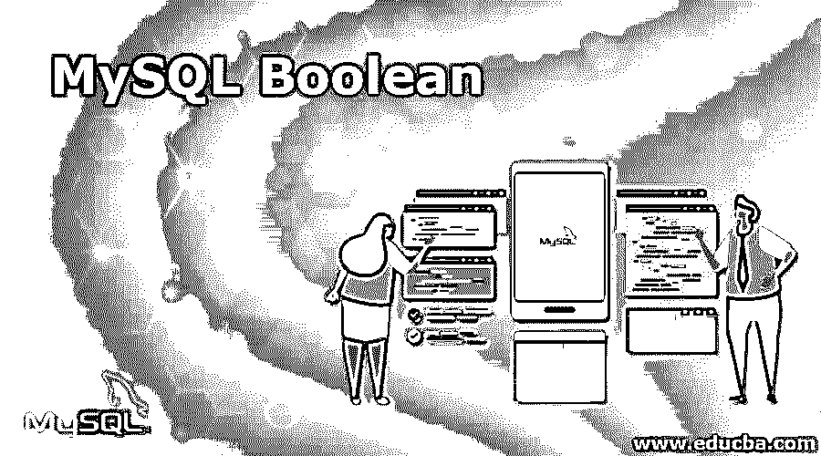

# MySQL Boolean

> 原文：<https://www.educba.com/mysql-boolean/>

## MySQL 布尔型简介

MySQL 中没有用于布尔值的内置数据类型。但是 MySQL 为我们提供了 TINYINT 数据类型，可以存储小数值的整数值。我们可以用 TINYINT(1)数据类型声明行为类似布尔的列的数据类型。其功能与布尔运算相同。在 MySQL 中，0(零)被视为假值，而所有其他非零值被视为 1。MySQL 中存在像 BOOLEAN 或 BOOL 这样的关键字，它们的内部处理方式与 TINYINT(1)相同。在本文中，我们将了解 MySQL 中可用于存储布尔值的数据类型，并通过示例进一步了解如何在表中使用布尔值。

### 如何在 MySQL 中声明&存储布尔值？

我们可以将存储布尔值的列的数据类型指定为 boolean、BOOL 或 TINYINT(1)。所有这些都以相同的方式表现，并且是彼此的同义词。FALSE 值被评估为 0，并存储在用上述三个数据库中任何一个的数据类型声明的列中。对于该记录，所有其他值(如 TRUE 或任何其他非零值)将被视为并存储为该列中的 1。让我们在 MySQL 中运行一个简单的命令。

<small>Hadoop、数据科学、统计学&其他</small>

**命令:**

`SELECT TRUE, FALSE;`

**输出:**

上述查询语句的输出如下

因此，我们可以得出结论，MySQL 认为 true 为 1，false 为 0。请注意，true 和 false 的处理是相同的，与它们的大小写无关。

#### MySQL 布尔的实现示例

**1。**让我们创建一个名为 marathon_players 的表，该表将存储参加马拉松的人的详细信息，并具有存储布尔值的列，如 healthChecked 和 runCompleted。我们将把 healthChecked 列的数据类型声明为 BOOLEAN，将 runCompleted 声明为 BOOL，并检查创建的表的结果。对于表的创建，我们将使用下面的 CREATE TABLE 查询。

**查询:**

`CREATE TABLE marathon_players(
player_id INT NOT NULL AUTO_INCREMENT,
Name VARCHAR(100),
Age INT,
healthChecked VARCHAR(100),
runCompleted VARCHAR(100),
completionTime TIME,
PRIMARY KEY (player_id)
);`

现在，让我们使用下面的查询语句来简单描述创建的表:

`DESC marathon_players;`

**输出:**

执行上述查询会产生以下输出

**2。**我们可以得出结论，即使我们将 healthChecked 列的数据类型指定为 BOOL，并将 runCompleted 指定为 BOOL，Mysql 也会自动将它们转换并在内部处理为 TINYINT(1)数据类型。

现在让我们使用以下插入查询在 marathon_players 表中插入一些值:

**查询:**

`INSERT INTO marathon_players (player_id, Name, Age, healthChecked, runCompleted, completionTime) VALUES('1','Ramesh','25','true','false','02:50:56');`
T1】

**3。**现在，让我们启动下面的选择查询，看看检索到了什么结果

**查询:**

`SELECT * FROM marathon_players;`

**输出:**

**4。**我们可以看到，我们用 Ramesh name、healthChecked 和 runCompleted 列插入的第一条记录在插入时被指定为 true 和 false，分别存储为 1 和 0。而在我们插入的第二条记录中，healthChecked 和 runCompleted 列中的 12 和 25 个值以我们声明的相同格式存储，并且具有相同的值，即使我们将这些列声明为 BOOLEAN 和 BOOL，因为它们在内部被视为 TINYINT 数据类型，并且扩展了它的列长度以存储该值。

**5。**是真、是假、不是真、不是假的从句。

为了知道特定列是否包含评估为 true 或 false 的值，MySQL 为我们提供了四个子句，即 TRUE、FALSE、NOT TRUE、NOT FALSE 子句。在它们之中，真与非假以同样的方式表现，而非真与非假同样地起作用并导致同样的结果。让我们试着找出我们的表 marathon_players 中 healthChecked 列值为 true 或相当于 true 的记录。为此，我将首先使用子句 TRUE，并且我的查询语句将如下所示

**代码:**

`SELECT * FROM marathon_players WHERE healthChecked IS TRUE;`

**输出:**

**6。**从结果中我们可以看到，1 和 12 值都被赋值为 true。任何非零值，无论是正的还是负的，都被认为是真的。现在，让我们使用 IS NOT FALSE 子句，看看我们是否检索到相同的结果。我们的查询语句如下

**查询:**

`SELECT * FROM marathon_players WHERE healthChecked IS NOT FALSE;`

**输出:**

因此，我们可以得出结论，这两个条款的工作方式相同。

**7。**现在，我们将通过检查 runCompleted 列的值来检查所有那些运行未完成的人的结果，从而检查剩余两个子句的工作情况。让我们准备将使用 IS FALSE 子句的查询。查询将如下所示:

**查询:**

`SELECT * FROM marathon_players WHERE runCompleted IS FALSE;`

**输出:**

**8。**现在，让我们在查询中使用 IS NOT TRUE 子句并检索结果。我们的查询语句如下

**查询:**

`SELECT * FROM marathon_players WHERE runCompleted IS NOT TRUE;`

**输出:**

我们可以得出结论，不为真和为假给出相同的输出。

### 结论

MySQL 不提供任何存储布尔值的特定数据类型。但是，BOOLEAN 和 BOOL 是可用于声明列的数据类型的关键字，该列在内部被视为 TINYINT(1)数据类型。因此，我们可以说 BOOLEAN 和 BOOL 是 TINYINT(1)数据类型的同义词。任何真值，无论指定的大小写如何，都被视为并存储为 1。在 MYSQL 中，当使用任何 TRUE、FALSE、NOT TRUE、NOT FALSE 子句时，任何非零值和 1 都被视为 TRUE。反之适用于 MySQL 中的 0 和 FALSE。

### 推荐文章

这是一个 MySQL 布尔的指南。在这里，我们讨论 MySQL 布尔的介绍和实际的例子和不同的子查询表达式。您也可以浏览我们推荐的文章，了解更多信息——

1.  [MySQL 操作符](https://www.educba.com/mysql-operators/)
2.  [吉拉 vs Github](https://www.educba.com/jira-vs-github/)
3.  [MySQL 字符串函数](https://www.educba.com/mysql-string-functions/)
4.  [MySQL vs SQLite](https://www.educba.com/mysql-vs-sqlite/)

