# MySQL 中的条件

> 原文：<https://www.educba.com/condition-in-mysql/>

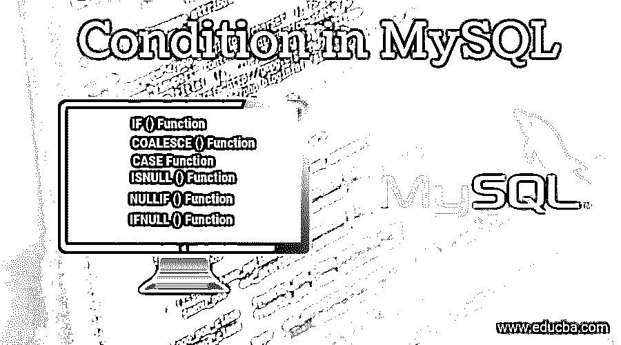


## MySQL 中的条件介绍

MySQL 中的 Condition 可以定义为一个开源的 RDBMS ( [关系数据库管理系统](https://www.educba.com/what-is-rdbms/))，它使用标准语言[SQL——结构化查询语言](https://www.educba.com/what-is-sql/)来操作、存储和检索数据库中的记录。简而言之，[我们可以说 MYSQL](https://www.educba.com/what-is-mysql/) 是一款快速、安全且易于使用的数据库服务器，适用于许多小型和大型企业以及不同的用途——Web 数据库、数据仓库、电子商务、日志应用等。

数据库包含一个或多个具有行和列的表。每个表由一个名称表示，SQL 语句用于对数据库执行任何操作。这里，我们将讨论 MYSQL 中基于一些条件表达式的条件语句。表达式可以是 MySQL 文字的任意排列，如变量、运算符和函数，如果满足条件，则在执行时返回逻辑值。

<small>Hadoop、数据科学、统计学&其他</small>

### MySQL 中的条件运算符

让我们先来看看一些重要的 SQL 语句的语法:

**1。选择**–从数据库中提取/选择记录。* '表示“全部”。

```
SELECT column1, column2,......  FROM table_name;
SELECT * FROM table_name;
```

**2。更新**–更新数据库中的现有字段

```
UPDATE tablename SET col1 = value1, col2 = value2, ... WHERE condition;
```

**3。删除**–从数据库中删除记录

```
DELETE FROM table_name WHERE condition;
```

**4。删除数据库**–删除数据库

```
DROP DATABASE database_name;
```

**5。插入到**–将新记录添加到数据库中

```
INSERT INTO name_of_table (col1,col2,   ...) VALUES (val1, val2, ...);
```

**6。创建数据库**–生成新的数据库

```
CREATE DATABASE databasename;
```

**7。创建表格**–生成一个新表格

```
CREATE TABLE tablename ( col1 datatype, col2 datatype, col3 datatype, .... );
```

**8。更改表格**–对表格进行更改

```
ALTER TABLE table_name ADD column_name datatype;
```

**9。删除表格**–删除表格

```
DROP TABLE table_name;
```

10。创建索引–生成一个索引(搜索关键字)

```
CREATE INDEX index_name ON table_name (column1, column2, ...);
```

**11。删除索引**–删除一个索引

```
DROP INDEX index_name ON table_name;
```

**Note:  **SQL keywords are case insensitive. For example, select can also be written as SELECT. The semicolon is used to distinguish each SQL statement in database systems.

### SQL 运算符的类型

不同类型的 SQL 操作符如下所示:

#### 1.SQL 算术运算符

| **操作员** | **描述** |
| **+** | 增加 |
| **–** | 减去 |
| ***** | 多样地 |
| **/** | 划分 |
| **%** | 以…为模 |

#### 2.SQL 按位运算符

| **操作员** | **描述** |
| “&”号 | 按位 AND |
| &#124; | 按位或 |
| ^ | 按位异或 |

#### 3.SQL 比较运算符

| **操作员** | **描述** |
| **=** | 等于 |
| **>T1】** | 大于 |
| **<T1】** | 不到 |
| **> =** | 大于或等于 |
| **< =** | 小于或等于 |
| **<>T1】** | 不等于 |

#### 4.SQL 逻辑运算符

| **操作员** | **描述** |
| **全部** | 如果所有子查询值都满足条件，则为 TRUE。 |
| **和** | 如果由 AND 分隔的所有条件表达式都为 TRUE，则为 TRUE。 |
| **任何** | 如果任何子查询值满足条件，则为 TRUE。 |
| **之间** | 如果操作数在比较序列内，则为 TRUE。 |
| **存在** | 如果子查询产生一个或多个字段，则为 TRUE。 |
| 中的 | 如果操作数与表达式列表中的一个匹配，则为 TRUE。 |
| **喜欢** | 如果操作数等于模式，则为 TRUE。 |
| **不是** | 如果条件为假，则显示记录。 |
| **或** | 如果由 OR 分隔的任何条件有效，则为 TRUE。 |
| **有的** | 如果任何子查询值满足条件，则为 TRUE。 |

#### 5.条件运算符

你可以通过一种非常简单易懂的方式学习和练习 educba.com 的 SQL 查询。

##### 1.IF()函数

如果条件为真，则结果为“是”，如果条件为假，则结果为“否”。

**语法:**

```
IF(condition, value_if_true, value_if_false)
```

**SQL 语句:**

```
SELECT IF(400<2000, "YES", "NO");
```

**输出:**

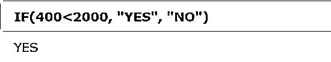


##### 2.COALESCE()函数

产生列表中的第一个非空值。

**语法:**

```
COALESCE (val1, val2, ...., val_n)
```

**SQL 语句**T2:

```
SELECT COALESCE (NULL, 1, 5, 'example.com');
```

**输出:**

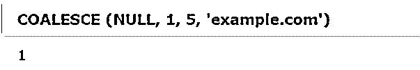


##### 3.案例功能

检查所有条件，如果满足第一个条件，则返回值，并且不会进一步读取。如果不满足任何条件，那么将在 ELSE 子句中返回该值。但是同样，如果没有 ELSE 部分和条件表达式为真，它将返回 NULL。

**语法:**

```
CASE
WHEN condition1 THEN result1
WHEN condition2 THEN result2
WHEN conditionN THEN resultN
ELSE result
END;
```

**假设一个表客户:**

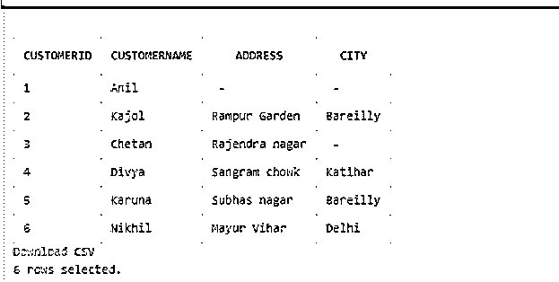


**SQL 语句**T2:

```
SELECT CustomerID, CustomerName, Address FROM Customers
ORDER BY (CASE
WHEN Address IS NULL THEN  City
ELSE Address
END);
```

**输出:**

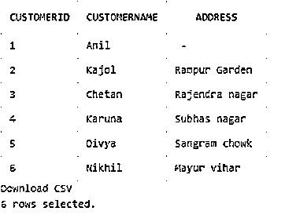


##### 4.ISNULL()函数

如果表达式为空，则结果为 1，否则返回 0。

**语法**:

```
SELECT ISNULL (expr)
```

**SQL 语句**T2:

```
SELECT ISNULL (NULL);
```

**输出:**

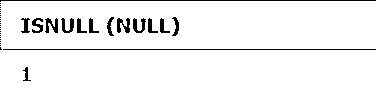


**SQL 语句:**

```
SELECT ISNULL ("Hello!");
```

**输出:**


##### 5.NULLIF()函数

如果两个表达式比较时相等，则返回 NULL。否则，第一个表达式就是结果。

**语法:**

```
SELECT NULLIF (expr1, expr2)
```

**SQL 语句:**

```
SELECT NULLIF (30, 30);
```

**输出:****T3】**


**SQL 语句:**

```
SELECT NULLIF (50, "Test");
```

**输出:**

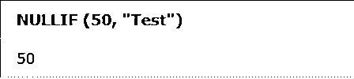


##### 6.IFNULL()函数

如果表达式为空，则返回特定值，如果不为空，则返回表达式。**语法:**

```
SELECT IFNULL (expr, alt_value)
```

**SQL 语句**T2:

```
SELECT IFNULL (NULL, "Learning SQL");
```

**输出:**

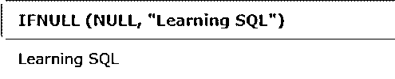


**SQL 语句:**

```
SELECT IFNULL ("100", "Database SQL");
Output: 
```


##### 7.最伟大的

它从两个或多个术语的列表中产生最大值。如果列表中的任何条件表达式为 NULL，则返回 NULL。

**语法:**

```
SELECT GREATEST (expr1, expr2 [...])
```

**SQL 语句**T2:

```
SELECT GREATEST(10, 35, 88, 55);
```

**输出:**

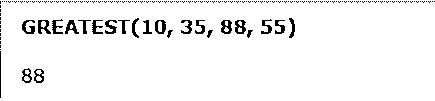


##### 8.在…里

检查一个值是否在一组给定或列出的值内。我们可以使用它来检查、定位和创建视图。

**语法**:

```
WHERE column IN (y1, y2, y3 [...])
```

**SQL 语句:**

```
SELECT * FROM Customers WHERE city IN ('Bareilly', 'Katihar',’Delhi’);
```

**输出:**

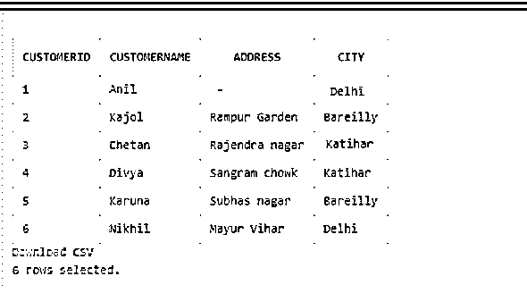


##### 9.最小

它提供两个或多个表达式列表中的最小值，如果列表中有空值表达式，结果将为空。

**语法**:

```
SELECT LEAST (expr1, expr2 [, ...])
```

**SQL 语句****:****T5】**

```
SELECT LEAST (10, 35, 88, 55);
Output:
```

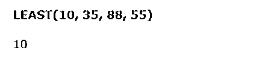


### 结论 MySQL 中的条件

如果我们想创建一个显示数据库数据的网站，我们需要知道:

*   RDBMS 数据库平台，如 MS Access、SQL Server、MySQL。
*   PHP，ASP，Python，Java，Node.js，类似 JavaScript 的服务器端脚本语言。
*   查询语言 SQL 来访问数据库中我们想要在网页上显示的记录。
*   HTML 和 CSS 的知识来优雅的网页。

通常，IFandCASE 是 MYSQL 中使用的标准条件语句。这些条件运算符减少了 SELECT、UPDATE、INSERT 或 DELETE SQL 语句中多个 OR 条件的使用。因此，MYSQL 中的条件运算符可能有助于过滤数据并根据特定条件提供准确的结果，从而节省我们从数据库中获取信息的时间和精力。

### 推荐文章

这是 MySQL 中的条件指南。在这里，我们将讨论简介、MySQL 中的条件操作符、SQL 操作符的类型以及它们的语法和输出。您也可以浏览我们的其他相关文章，了解更多信息——

1.  [MySQL 中的光标](https://www.educba.com/cursor-in-mysql/)
2.  [Matlab 逻辑运算符的类型和例子](https://www.educba.com/matlab-logical-operators/)
3.  [PHP 中 basename 的不同例子](https://www.educba.com/basename-in-php/)
4.  [JavaScript 文字类型指南](https://www.educba.com/javascript-literals/)
5.  [MySQL 中的光标|示例](https://www.educba.com/cursor-in-mysql/)
6.  [c#中条件运算符的完整指南](https://www.educba.com/conditional-operators-in-c-sharp/)
7.  [SQL 算术运算符指南](https://www.educba.com/sql-arithmetic-operators/)


