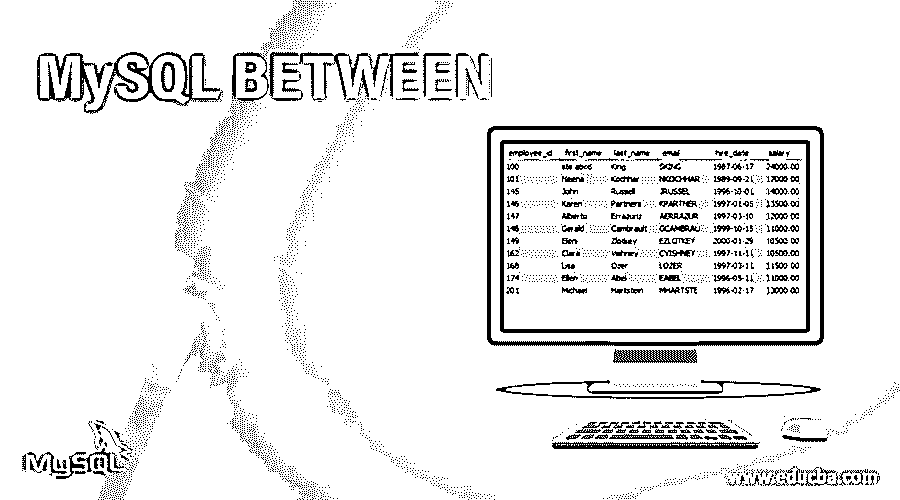
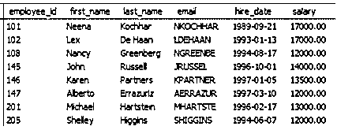
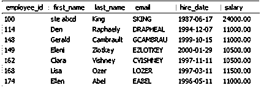
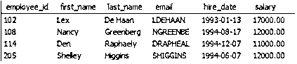
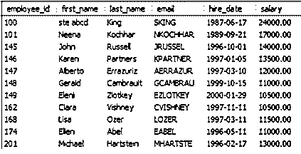
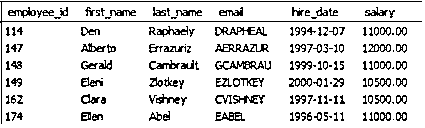
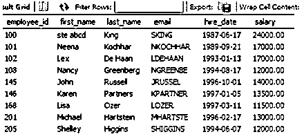

# MySQL 介于

> 原文：<https://www.educba.com/mysql-between/>




## MySQL 简介介于

在 SQL 中，我们使用不同类型的语言来实现不同的功能，携带不同的命令。因此，在使用数据查询语言获取记录时，我们通常使用 SELECT 命令。当我们需要记录/选择值范围内的记录时，BETWEEN 运算符会出现。这些值可以是数字、日期或字符串格式。Between 运算符是包含性的，即开始值和结束值都包含在结果中。同样，我们也可以使用 NOT BETWEEN，它将获取给定值范围之外的记录。在本主题中，我们将学习 MySQL

**语法:**

<small>Hadoop、数据科学、统计学&其他</small>

```
SELECT column_name FROM table_name
WHERE column_name BETWEEN value1 AND value2;
```

或者

```
SELECT column_name FROM table_name
WHERE column_name NOT BETWEEN value1 AND value2;
```

*   **选择&FROM-**命令将从表格中提取记录
*   **WHERE–**命令获取满足条件的记录
*   **BETWEEN–**指定值的范围
*   **NOT BETWEEN—**`这将获取不在指定值范围内的记录
*   **和–**该操作符确保记录应该与两个条件匹配

### MySQL 中的“BETWEEN”条件是如何工作的？

让我们讨论一个非常小的例子，看看这个条件在实时场景中是如何工作的

**例如:**创建一个包含产品详细信息和价格的产品表

| **产品名称** | **价格** |
| **苹果** | Twenty |
| **橙色** | Twenty-five |
| **葡萄** | Thirty |
| **香蕉** | Twenty-two |
| **石榴** | Twenty-eight |

如果我们必须选择那些价格在 20 到 25 之间的商品名称，下面的查询可以帮助我们获取这些记录。

```
SELECT product_name FROM product
WHERE price BETWEEN 20 AND 25;
```

它将在表中查找那些价格在 20 到 25 英镑之间的特定记录。如前所述，运营商之间的这种差异是一种包容性差异，它将包括 20 和 25

**输出:**

| **产品名称** | **价格** |
| **苹果** | Twenty |
| **橙色** | Twenty-five |
| **香蕉** | Twenty-two |

```
SELECT product_name FROM product
WHERE price NOT BETWEEN 20 AND 25;
```

它将在表中查找那些价格不在 20 到 25 之间的特定记录。如前所述，这是运营商之间的一个包容性的，它不会同时包括 20 和 25

**输出:**

| **产品名称** | **价格** |
| **葡萄** | Thirty |
| **石榴** | Twenty-eight |

```
SELECT product_name FROM product
WHERE price BETWEEN 25 AND 30;
```

它将在表中查找那些价格在 25 到 30 之间的特定记录。如前所述，运营商之间的这种差异是一种包容性差异，它将包括 25 和 30

**输出:**

| **产品名称** | **价格** |
| **橙色** | Twenty-five |
| **葡萄** | Thirty |
| **石榴** | Twenty-eight |

### 条件间实现 MySQL 的例子:

在这里，我们将创建另一个具有以下属性的表“employee”。

| 员工 id | 名字 | 姓氏 | 电子邮件 | 雇佣日期 | 薪水 |
| One hundred | seabcd | 国王 | 滑雪 | 1987-06-17 | Twenty-four thousand |
| One hundred and one | 妮娜 | 科赫哈尔 | 恩科奇哈尔 | 1989-09-21 | Seventeen thousand |
| One hundred and two | 法律 | 德哈恩 | 德哈安 | 1993-01-13 | Seventeen thousand |
| One hundred and eight | 南茜 | 格林伯格 | 绿色床 | 1994-08-17 | Twelve thousand |
| One hundred and fourteen | 那个人 | 拉斐尔 | 德拉菲尔 | 1994-12-07 | Eleven thousand |
| One hundred and forty-five | 约翰 | 罗素 | 布鲁塞尔 | 1996-10-01 | Fourteen thousand |
| One hundred and forty-six | 克伦人 | 伙伴 | 合作伙伴 | 1997-01-05 | Thirteen thousand five hundred |
| One hundred and forty-seven | 【男性名字】阿尔佩托 | 埃拉苏里兹 | 阿尔拉祖尔 | 1997-03-10 | Twelve thousand |
| One hundred and forty-eight | 杰拉尔德(男子名ˌ义为勇敢的战士) | 坎布劳 | GCAMBRAU | 1999-10-15 | Eleven thousand |
| One hundred and forty-nine | 埃莱妮 | 兹洛特基 | EZLOTKEY | 2000-01-29 | Ten thousand five hundred |
| One hundred and sixty-two | [人名]克莱拉 | 维什尼 | CVISHNEY | 1997-11-11 | Ten thousand five hundred |
| One hundred and sixty-eight | elizabeth 的昵称 | 奥兹国 | 失败者 | 1997-03-11 | Eleven thousand five hundred |
| One hundred and seventy-four | 埃伦 | 亚伯 | 标签 | 1996-05-11 | Eleven thousand |
| Two hundred and one | 迈克尔 | 哈蒂斯廷 | 艺术家 | 1996-02-17 | Thirteen thousand |
| Two hundred and five | 雪莱 | [人名]希金斯 | 希金斯 | 1994-06-07 | Twelve thousand |

#### 示例#1

在这里，我们将找出工资在 12000 到 20000 之间的雇员。

```
SELECT * FROM employee
WHERE salary BETWEEN 12000 AND 20000;
```

**输出**:




在这里，我们将取出那些工资在 12000 到 20000 之间的雇员。

```
SELECT * FROM employee
WHERE salary NOT BETWEEN 12000 AND 20000;
```

**输出**:




#### 实施例 2

我们将获取雇用日期在 1990 年 1 月 1 日到 1995 年 1 月 1 日之间的员工

```
SELECT * FROM employee
WHERE salary BETWEEN ‘1990-1-1’ AND **‘**1995-1-1’ ;
```

**输出**:




我们将获取雇用日期不在 1990 年 1 月 1 日到 1995 年 1 月 1 日之间的员工

```
SELECT * FROM employee
WHERE salary NOT BETWEEN ‘1990-1-1’ AND ‘1995-1-1’ ;
```

**输出**:




#### 实施例 3

将再次获取那些名字以字母 A 到 h 开头的记录。

```
SELECT * FROM employee
WHERE SUBSTR(first_name,1,1) BETWEEN ‘a’ AND **‘**h**’** ;
```

SUBSTR(column_name，start_index，end_index)通过指定起始和结束索引在另一个字符串中查找子字符串。如果在名称'萨尔曼'中我们给 substr(名称，1，1)，它将获取字母' S '。

**输出:**




同样会找出谁的名字不是从字母 A 到 H 开始的

```
SELECT * FROM employee
WHERE SUBSTR(first_name,1,1) NOT BETWEEN ‘a’ AND ‘h’ ;
```

**输出:**




### 结论

在许多情况下，当我们需要获取/提取特定范围内的值以进行分析或可视化时，Between 运算符非常有用。上面解释的例子也来自现实生活中的场景。如果我们想找出我们收入最高的员工或那些在特定时间段加入的员工，我们需要了解运营商之间的意义。

### 推荐文章

这是一个 MySQL 之间的指南。这里我们讨论 MySQL 中的“BETWEEN”条件是如何工作的，以及相应的查询示例和输出。您也可以阅读以下文章，了解更多信息——

1.  [MySQL 查询](https://www.educba.com/mysql-queries/)
2.  [MySQL 中的通配符](https://www.educba.com/wildcards-in-mysql/)
3.  [MySQL 服务器](https://www.educba.com/mysql-server/)
4.  [不在 MySQL 中](https://www.educba.com/not-in-mysql/)


