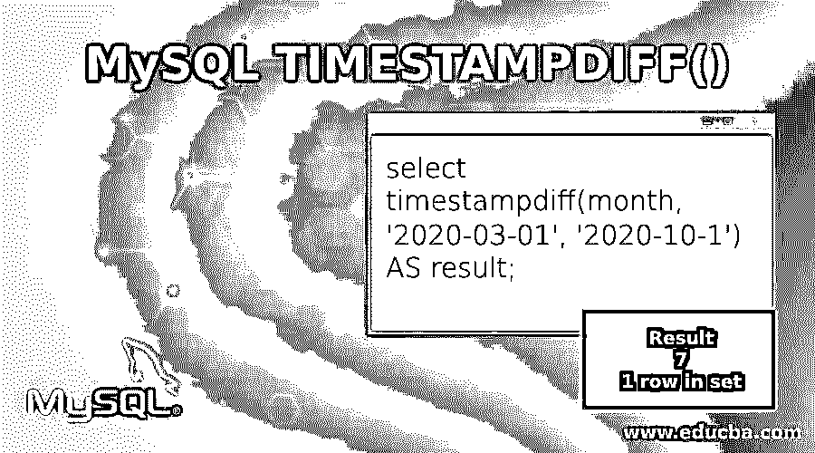
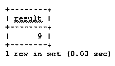
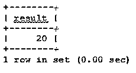
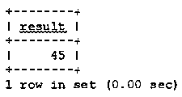
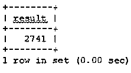
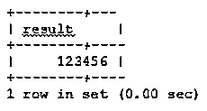
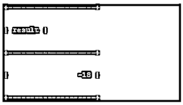
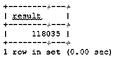
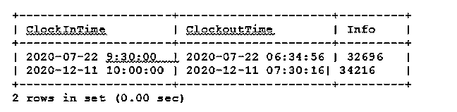

# MySQL TIMESTAMPDIFF()

> 原文：<https://www.educba.com/mysql-timestampdiff/>

## MySQL TIMESTAMPDIFF()简介

Mysql timestampdiff()是一种日期函数，用于计算两个日期的差或差，这两个日期可能是相同的类型，也可能是不同的类型。

数学上，它也可以写成下面的表达式:

<small>Hadoop、数据科学、统计学&其他</small>

`Timestampdiff = difference(datetime expression1-datetime expression2)`

其中，两个日期时间表达式可以是不同的数据类型。一个表达式可能是日期时间类型的，而第二个表达式可能是日期类型的，或者两个表达式都是日期或日期时间类型的。

两个日期时间表达式并不总是必须具有相同的单位类型。一个可能是日期，另一个可能是日期时间。日期类型主要计算为 datetime，默认时间写为“00:00:00”。

### MySQL TIMESTAMPDIFF()函数的语法

下面是 mysql timestampdiff()函数的语法:

`TIMESTAMPDIFF (unit type, datetime expression1, datetime expression2);`

单位用于表示日期时间或日期的差异，可以是日、月等。Timestampdiff()函数有三个参数。它们是:

单位类型、日期时间表达式 1 和日期时间表达式 2。它返回一个整数作为结果。

TIMESTAMPDIFF 函数以第一个日期时间表达式 1-第二个日期时间表达式 2 的形式返回输出，其中日期时间表达式 1 和日期时间表达式 2 是日期或日期时间表达式。

unit 参数定义(datetime expression 1-datetime expression 2)的结果单位，以整数表示

下面是 timestampdiff()的单位:

*   微秒
*   第二
*   分钟
*   小时
*   一天
*   周
*   月
*   季度和
*   年

我们可以计算 timestampdiff 函数的最小单位是秒，最大单位是年。

### MySQL TIMESTAMPDIFF 函数示例

MySQL timestampdiff 函数及示例如下:

#### 1 天

下面的示例返回两个日期值 2020-03-01 和 2020-03-10 的天数差:

**查询:**

`select
timestampdiff(day,'2020-03-01', '2020-03-10')
AS result;`

**输出:**

这里，AS 表示别名，这意味着它将为显示查询计算结果的列提供一个名称结果。

#### 2.月份

下面的示例返回两个日期值 2020-03-01 和 2020-10-1 的月份差异:

**查询:**

`select
timestampdiff(month, '2020-03-01', '2020-10-1')
AS result;`

**输出:**

#### 3.分钟

下面的示例以分钟为单位返回两个日期时间值的差值:

**查询:**

`select
timestampdiff(minute, '2020-01-03 10:10:00', '2020-01-03 10:30:00')
AS result;`

**输出:**

**注意:** TIMESTAMPDIFF 只反映时间部分。

**查询:**

`select
timestampdiff(minute, '2020-05-18 10:00:00', '2020-05-18 7:45:41')
AS result;`

**输出:**

因为我们已经将分钟作为单位参数，所以查询结果只计算分钟并返回 45 作为输出。但实际输出应该是 45 分 41 秒。如果我们希望输出是秒，我们必须在单位参数中传递秒。

**查询:**

`select
timestampdiff(second, '2020-05-18 10:00:00', '2020-05-18 7:45:41')
AS result;`

**输出:**

45 分 59 秒= 45 x 60 + 41(秒)= 2741 秒

#### 4.微秒

下面的示例以微秒为单位返回两个日期时间值的差值:

**查询:**

`select
timsetampdiff(microsecond, '2020-02-01 10:30:27.00000', '2020-02-01 10:30:27.123456')
AS result;`

**输出:**

### MySQL 时间戳函数的用例及示例

mysql 时间戳函数的用例如下所示:

#### **如何用 Timestampdiff()函数计算孩子的年龄？**

首先，为了便于说明，让我们创建一个名为 child 的表:

`create table child( Roll_no. INT auto_increment PRIMARY KEY,name varchar(100) NOT NULL, dob DATE NOT NULL);`

创建完表后，现在该向其中插入一些记录了。

`Insert into child(name,dob) values(('aman', '1990-01-01'),( 'rahul', '1989-06-06'),( 'ashish', '1985-03-02'),( 'divya', '1992-05-05'),( 'kunal', '1995-12-01'));`

我们可以知道计算子表中每个孩子的年龄:

在计算每个孩子出生日期的时间戳差异后，使用 child select 语句从表中获取记录。

`select
Roll_no,
name,
dob,
timestamp(year,dob, '2020-01-01') age
from
child;`

在上面的查询中，我们计算了孩子在 2020 年 1 月 1 日的年龄。同样，如果我们想计算每个孩子的当前年龄，我们可以使用 now()函数作为 timestampdiff 函数的第三个参数。

`select
id,
name,
dob,
timestamp(year,dob,NOW()) age
from
child;`

**查询的否定输出:**

如果第一个 datetime 参数大于第二个 date-time 参数，则查询的输出将是负数。

`select
timestampdiff(day, '2020-04-22', '2020-04-4')
AS result;`

**输出:**

在下面的例子中，我们采用了两种不同类型的参数

`select
timestampdiff(minute, '2019-12-31', '2020-03-22 23:15:59')
AS result;`

**输出:**

#### 以秒为单位计算每个员工的工作时间

为此，我们首先将创建一个名为 EmployeeEntry 的表:

`create table EmployeeEntry(
ClockInTime datetime,
ClockOutTime datetime,
Info INT(11) AS (ABS(TIMESTAMPDIFF(second,ClockInTime,ClockOutTime)))
)ENGINE=MyISAM;`

我们现在将在 EmployeeEntry 表中插入一些记录:

`insert into EmployeeEntry (ClockInTime, ClockOutTime) values('2020-07-22 9:30:00','2020-07-22 06:34:56');
insert into EmployeeEntry (ClockInTime, ClockOutTime) values('2020-12-11 10:00:00','2020-12-11 07:30:16');`

为了获取表中的所有记录，我们将使用 select 语句

`select * from EmployeeEntry;`

**输出:**

### 结论

在本文中，我们学习了 MySQL TIMESTAMPDIFF 函数，如何使用它来解决我们的日常问题，它的不同用例。我们还了解了 timestampdiff 函数的不同单元。我们可以根据需要使用不同的功能单元。我们已经解释了两个真实的例子，比如年龄计算和员工工作时间计算。

### 推荐文章

这是 MySQL TIMESTAMPDIFF()的指南。在这里，我们还将讨论 mysql timestampdiff()函数的介绍和语法，以及不同的示例和代码实现。您也可以看看以下文章，了解更多信息–

1.  MySQL 中的 IF 语句
2.  [MySQL 数据库修复](https://www.educba.com/mysql-database-repair/)
3.  [MySQL 时间戳](https://www.educba.com/mysql-timestamp/)
4.  [MySQL 中的唯一键](https://www.educba.com/unique-key-in-mysql/)

