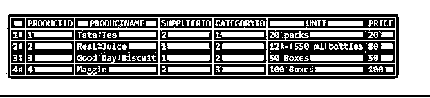

# MySQL 计数()

> 原文：<https://www.educba.com/mysql-count/>

## MySQL 计数介绍()

当执行 SQL SELECT 语句时，MySQL COUNT()函数从表中提供结果集中的许多记录。该函数不计算空值。count 函数给出一个 BIGINT 值。此聚合函数返回所有行或只返回与指定条件匹配的行，如果没有匹配的行，则返回 0。在这里，聚合函数是一个计算一些值并且只返回单个值的函数。我们可以在许多方面使用 COUNT()，但有必要理解它是如何工作的。根据我们如何使用它，我们可以得到不同的结果值。

### 句法

count 函数的基本语法是:

<small>Hadoop、数据科学、统计学&其他</small>

`COUNT(*)
COUNT(expression)
COUNT( [DISTINCT] expression )`

**说明:**该函数有三种形式，说明如下:

*   COUNT(*)函数:它返回 SELECT 查询返回的表中的所有行数，包括表中的非空行、空行和重复行。

**Note:** * denotes ‘all’.

*   COUNT(expression)函数:它提供表达式对没有空值的行数进行计数的结果。
*   COUNT(DISTINCT expression):它得出 SELECT 语句返回的结果集中包含非空非重复值的行数。

### MySQL 中的 COUNT()函数是如何工作的？

Count 是一个聚合函数，它对表中的整组行返回一个简明的结果。

数据库中存储了不同的表，具有不同的大小和行数。我们可以在像事务表这样的表中找到数百万条甚至更多的记录。因此，在开发和操作过程中，监视表的进度并获得记录的计数成为一个非常重要的因素。

### 实现 MySQL Count()的示例

假设我们有一个名为 Customers 的表作为示例:

**Note:** In SQL, all the queries are case insensitive.

#### 示例#1

如果我们使用 MySQL COUNT(expression)函数从使用不包含空值的表达式值的表中获取所有记录。SQL 查询是:

**代码:**

`SELECT COUNT(City) FROM Customers;`

**输出:**

#### 实施例 2

对于同一个表，让我们使用 MySQLCOUNT(*)函数。假设我们执行了以下语句:

**代码:**

`SELECT COUNT(*) FROM Customers;`

**输出:**

**解释:**这个 count 函数将从结果集中返回行数，结果集可能包含也可能不包含空值。

#### 实施例 3

现在我们将讨论 onMySQLCOUNT(DISTINCT expression):

**代码:**

`SELECT COUNT(DISTINCT City) FROM Customers;`

**输出:**

**解释:**然后，这个函数 DISTINCT 关键字将显示唯一的、不重复的记录的计数，以及不为空的值。

#### 实施例 4

现在，我们也可以使用计数函数，比如这个 MySQL COUNT()和 GROUP BY。通过 count()，我们可以使用 GROUP BY SQL 子句，以便它提供组内的记录数:

**代码:**

`SELECT City, COUNT(*) FROM Customers GROUP BY City;`

**输出:**

**解释:**在上面的例子中，count()用 GROUP BY 关键字对所有不同的城市进行分组，并返回每个城市的计数。

#### 实施例 5

我们还可以在 MySQL 语句中使用 MySQL Count()和 HAVINGClause。在上面的示例中，我们可以添加 Having 子句来进一步过滤上述查询的结果:

**代码:**

`SELECT City, COUNT(*) FROM Customers GROUP BY City HAVING COUNT(*) >1;`

**输出:**

**解释:**这里，我们在 HAVING 子句中添加了 count()，该子句对表 Customers GROUP BY City 中 count 大于 1 的记录进行计数。空值字段也计算在内。

#### 实施例 6

Count()函数可以与流控制函数结合使用。您可以将 Count()函数与流控制函数相关联，以实现更好的功能。

例如，流控制函数 IF()可以与 SQL 语句中用于 Count()函数的表达式一起使用。这将非常有助于提供数据库内部数据的快速分析。让我们考虑一个名为 Products 的表中的数据，该表有三个字段 ProductID、ProductName、Price 等:

这里，表中有一个名为 Price 的字段，每种产品都有不同的价格记录在该行中。因此，我们可以使用这个 Price 字段来执行以下查询，并在 SQL 语句中使用 count()和 IF()函数来返回结果 COUNT:

**代码:**

`SELECT
COUNT(IF(Price <=10,1,NULL)) 'Low',
COUNT(IF(Price BETWEEN 10 AND 30,1,NULL)) 'Medium',
COUNT(IF(Price > 30,1,NULL)) 'High'
FROM Products;`

**输出:**

**解释:**从上面的陈述中，我们可以看到，根据产品表中的价格，我们将它们分为三组，分别命名为低、中、高。这里我们使用了 IF()函数与 count()函数的组合，将产品的不同价格与给定的条件进行比较，当条件匹配时，返回如上结果，其中计数为 3 组；满足表达需求的低、中、高三档。如果没有匹配的条件，那么它将返回一个空值，表示 0。

#### 实施例 7

我们甚至可以使用 UNION 操作符和 COUNT 函数来获得两个或更多表的 MySQL 行数。使用 UNION，我们可以将从每个 SELECT 语句获得的结果集联合起来，并应用 count 来获得数据库中多个表的行数。

例如，我们执行了下面的一个 SQL 查询，从示例数据库中返回两个表 Customers 和 Products 的行数:

**代码:**

`SELECT     'Customers' tablename,   COUNT(*) rows FROM   Customers
UNION
SELECT     'Products' tablename,   COUNT(*) rows FROM  Products;`

**输出:**

`SELECT   COUNT(*) FROM   Customers
UNION
SELECT COUNT(*) FROM  Products;`

#### 实施例 8

如果我们想对表中的一些行进行计数，可以在 SELECT 语句查询中结合使用 COUNT()和 WHERE 子句。这里，count 函数中定义的表达式的数量将根据 SELECT 查询中 WHERE 子句的特定标准从表中返回。让我们看看以前的产品表:

**代码:**

`SELECT COUNT(ProductName) FROM Products WHERE SupplierID = 1;`

**输出:**

### 结论

MySQL COUNT 函数可以说是最简单的函数，对于用 SELECT 语句执行来统计满足一定条件的表中的行数非常有益。在本文中，我们还学习了使用各种 MySQL 子句和运算符以及语法和示例，从 MySQL 数据库的一个或多个表中返回非空的行数。

### 推荐文章

这是一个 MySQL count()的指南。这里我们讨论 MySQL count()的介绍，包括适当的语法、工作原理和相应的例子，以便更好地理解。您也可以浏览我们的其他相关文章，了解更多信息——

1.  [MySQL avg()](https://www.educba.com/mysql-avg/)
2.  [MySQL 命令](https://www.educba.com/mysql-commands/)
3.  [MySQL 聚合函数](https://www.educba.com/mysql-aggregate-function/)
4.  [MySQL 子查询](https://www.educba.com/mysql-subquery/)

