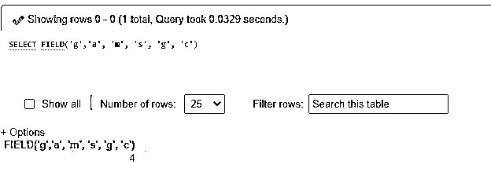
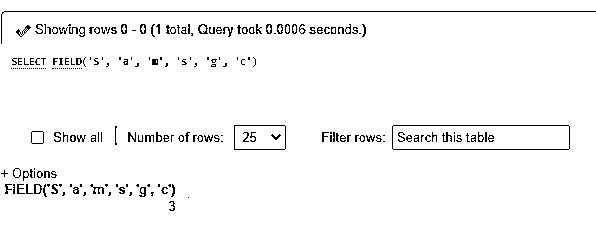
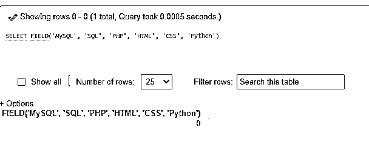
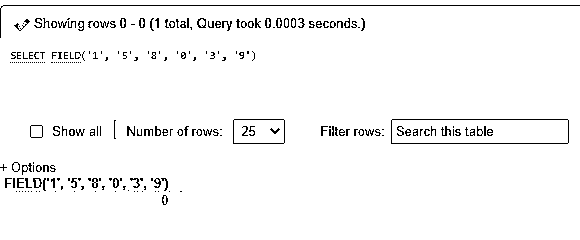
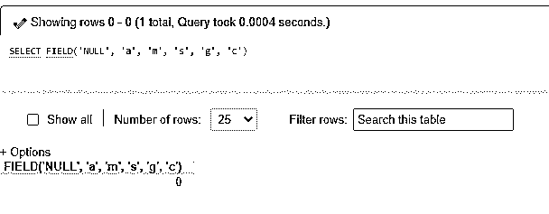
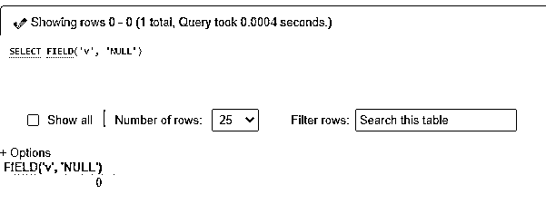
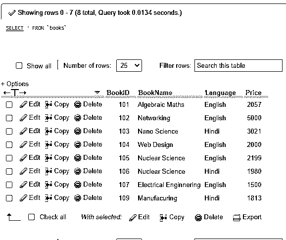
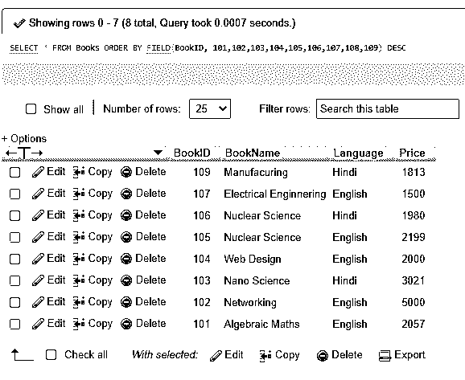

# MySQL 字段()

> 原文：<https://www.educba.com/mysql-field/>

## MySQL 字段介绍()

MySQL Field()函数是一个不区分大小写的搜索函数，用来获取字符串或数值在字符串或数值列表中的索引位置。这个 Field()函数被认为是服务器中 ELT()的补码类型函数。

该函数接受字符串和数字作为用户给定的参数。如果参数是字段()的字符串，则根据字符串进行比较，如果提供的参数是数字，则根据数字进行搜索。如果值的类型是 default，则比较结果为 double，否则为。

<small>Hadoop、数据科学、统计学&其他</small>

如果使用 Field()函数执行查询以查找特定值的索引位置，并且如果没有找到该值，则该函数的结果为零(0)。此外，如果要搜索的值为 NULL，则带有 NULL 参数的函数将无法与任何值进行相等比较，0 将成为返回值。

**语法**

让我们看看 MySQL 服务器中使用的 MySQL Field()函数的语法结构，如下所示:

`FIELD(String/Number Value, value1,value2,value3,…………)`

在这里，我们将这些术语描述为:

*   **字符串/数值:**该参数表示在指定列表中需要查找的数值，可以是任意字符串或任意整数(数值)。
*   **值 1、值 2、值 3、………………:**所需参数的序列被定义为 Field()函数将在其中搜索第一个参数的值。

同样，让我们讨论如下结果案例:

*   如果该函数在值列表( *value1，value2，value3，... ...)，*中没有找到所需的值，则返回 0。
*   如果参数为 NULL，那么 Field()函数将再次输出 0。
*   如果函数将所有参数值都保存为字符串，则比较将作为字符串执行，以返回字符串索引位置。
*   如果函数将所有参数值都保存为数字，则搜索将作为数字执行，以得出数字值的索引位置。

### field()函数在 MySQL 中是如何工作的？

MySQL 数据库管理和存储不同类型的数据值，并提供获取有关记录的特定信息的操作。这个查询执行和知道结果的过程有助于维护数据库记录和相关表的更新和安全，以便检索任何表记录，例如索引、列值或总计、平均值、最大值、最小值、位置、关系等。此外，MySQL 支持许多内置函数，有利于从数据库表中进行更改和查询数据信息。

这样，其中一个字符串函数可以是 MySQL Field()函数，它有助于分别从数字或字符串值列表中获取特定值(数字或字符串)的索引位置。通过用于实现该函数的查询来展示 Field()函数的过程和工作原理，解释如下:

假设我们将从子字符串列表中找到子字符串的索引位置，如下所示:

`SELECT FIELD(‘g’, ’a’, ’m’, ’s’, ’g’, ’c’);`

这个使用 Field()函数的查询将输出 4 作为索引位置。此外，我们使用 SELECT 关键字和函数来显示搜索后的结果。

此外，由于 Field()函数执行不区分大小写的搜索，因此让我们看看下面的示例:

`SELECT FIELD(‘G’, ’a’, ’m’, ’s’, ’g’, ’c’);`

因为字符是大写或小写，所以输出也是 4，所以搜索不受影响。

### MySQL 字段()的示例

让我们演示一些使用 MySQL Field()函数的例子来探究它的用法，具体如下:

#### 示例 1–使用 MySQL Field()函数

假设字符串列表中的值很少，我们正在查找值列表中存在或不存在的值的索引位置，如下所示:

`SELECT FIELD('g','a', 'm', 's', 'g', 'c');`

**输出:**

`SELECT FIELD('S', 'a', 'm', 's', 'g', 'c');`

**输出:**

`SELECT FIELD('MySQL', 'SQL', 'PHP', 'HTML', 'CSS', 'Python');`

**输出:**

`SELECT FIELD('1', '5', '8', '0', '3', '9')`

**输出:**

`SELECT FIELD('NULL', 'a', 'm', 's', 'g', 'c');`

**输出:**

`SELECT FIELD('v', 'NULL');`

**输出:**

通过上面的示例，我们可以分析出，如果在值列表中找到了所提供的参数，那么函数将给出它的索引位置，如果没有找到，那么它将返回零(0)作为输出值，并且如果函数中的任何参数为 NULL，也是如此。

#### 示例 2–使用数据库表& ORDER BY 子句

为此，我们将使用如下提供的后续语法代码:

`SELECT * FROM TableName [ORDER BY] FIELD(ColumnName, Value1, Value2, Value3, …….,  ValueN) DESC;`

这里，TableName 是用于这个查询搜索函数的示例表，ColumnName 是从包含表中值的项目列表中搜索的第一个参数。

为了理解在数据库表中要使用的 Field()函数，让我们首先查询下面的创建表:

`CREATE TABLE Books(BookID INT PRIMARY KEY, BookName VARCHAR(255) NOT NULL, Language VARCHAR(255) NOT NULL, Price INT NOT NULL);`

同样，让我们使用 INSERT 查询在上面创建的表 Books 中添加一些记录:

`INSERT INTO Books(BookID, BookName, Language, Price) VALUES(‘101’,’Algebraic Maths’,’English’,’2057’);`

依此类推，其他书籍行也被插入。

现在，让我们用 SELECT 查询显示表 Books 的内容，如下所示:

`SELECT * FROM Books;`

**输出:**

接下来，我们将使用 MySQL Field()函数在表 Books 中进行查询，从与第一个参数相关的值序列中搜索列的特定索引位置。

我们还可以使用 MySQL ORDER BY 子句和上面的 Field()函数命令对结果集中的值进行排序，或者使用 ASC 关键字进行升序排序，或者使用 DESC 关键字进行降序排序:

`SELECT * FROM Books ORDER BY FIELD(BookID, 101,102,103,104,105,106,107,108,109) DESC;`

**输出:**

因此，我们还可以使用 ORDER BY 子句和 Field()函数对值进行排序。

### 结论

MySQL Field()函数也是一种 MySQL 字符串函数，它通过搜索或匹配第二个参数中以逗号分隔的值列表形式陈述的剩余值表达式，来检索函数的第一个参数所指示的数据值的索引位置。

该函数对于找出现有的索引位置和结果(如果没有的话)很有用。

### 推荐文章

这是 MySQL 领域的指南()。这里我们讨论 field()函数在 MySQL 中是如何工作的，以及输出的例子。您也可以看看以下文章，了解更多信息–

1.  [MySQL 位](https://www.educba.com/mysql-bit/)
2.  [MySQL DDL](https://www.educba.com/mysql-ddl/)
3.  [MySQL 字符集](https://www.educba.com/mysql-character-set/)
4.  [授予 MySQL 特权](https://www.educba.com/grant-privileges-mysql/)

